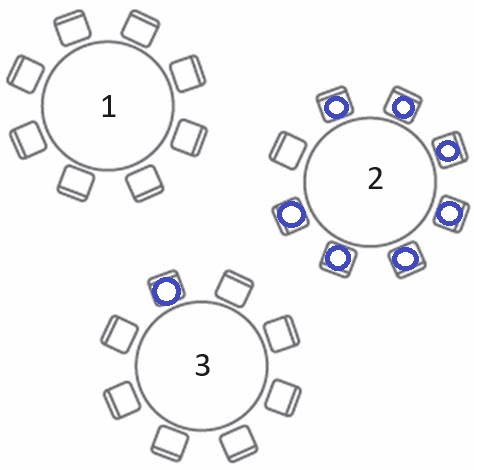
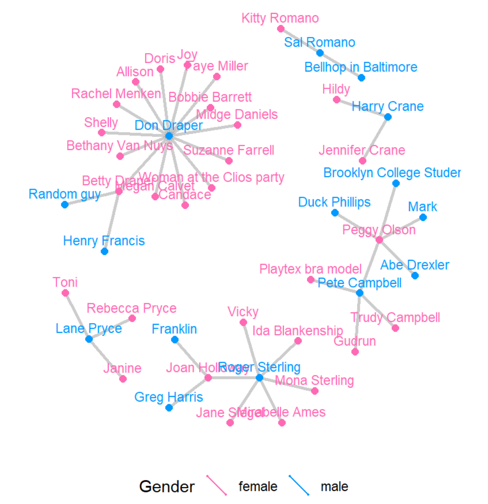
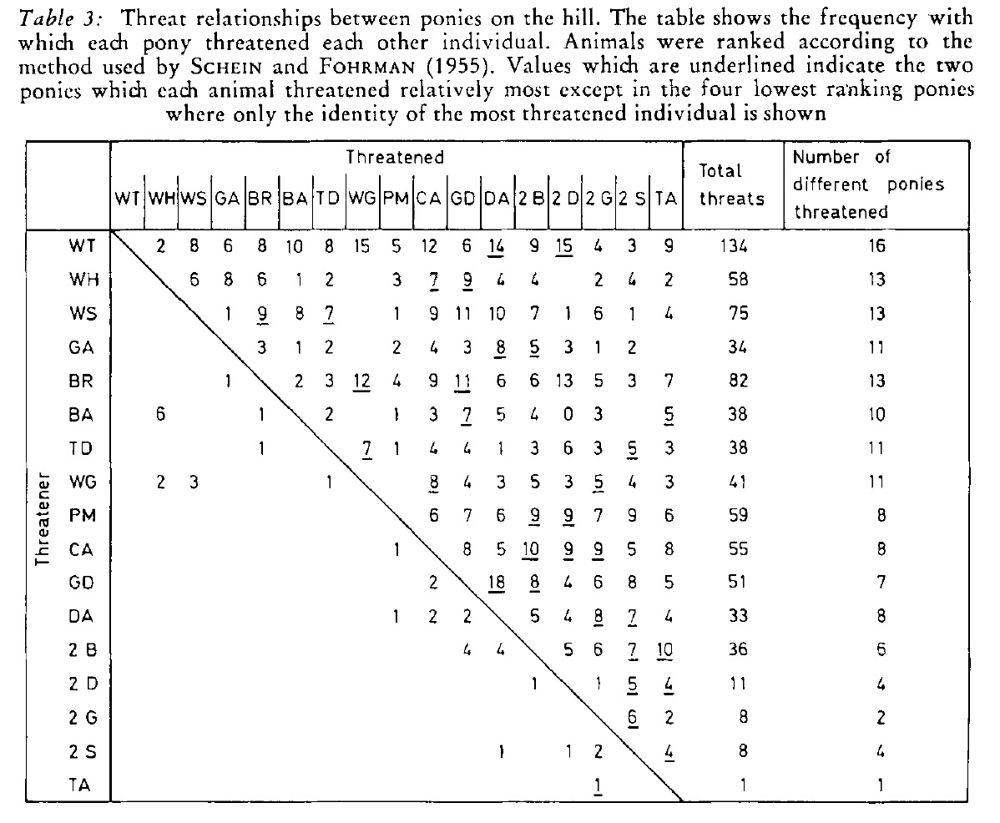
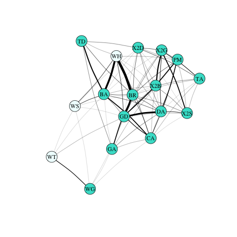
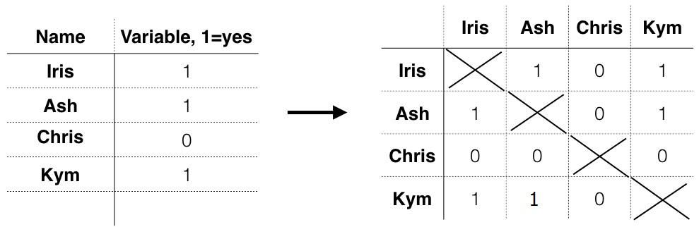

```{r  setup, message=FALSE, warning=FALSE, include=FALSE}
options(
  htmltools.dir.version = FALSE, # for blogdown
  width = 80,
  tibble.width = 80
)

knitr::opts_chunk$set(package.startup.message = FALSE,
  fig.align = "center",  warning=FALSE,  echo=FALSE, message=FALSE
)

```


```{r, include=FALSE}
library(tidyr)
library(magrittr)
library(reshape2)
library(gridExtra)
library(ergm)
library(sna)
library(devtools)
library(networkdata)
```

## Why Do We Need Network Analysis?
Suppose you walked into a dining room that hosts a luncheon at a conference you are currently attending. What table would you sit at?

```{r, out.width= "400px",fig.align="center"}

```
---

## Today's Class
 **Network Analysis: Getting Started with the super basics**

 1. Definitions. What is network analysis?
 2. Network Science: Origins
 3. Network features and measurements
 4. Collecting network data
 5. What does this all mean for Political Science?
 6. Processing network data in R

---
class: inverse, middle, center
# Definitions. What Is Network Analysis?

---

## What is a network (i.e., a graph)?

A set of **nodes** and **relation(s)** defined on them

```{r, out.width= "400px",fig.align="center"}

```
---

## Defining Network Features & Measurements: What's a node?

- A <span style="color:DarkCyan">**node**</span> can be defined as an entity that can form relations with other entities.

**Synonyms**:

- actor: from sociometry, common terminology in sociology and psychology
- vertex: from graph theory (i.e., math), common terminology in mathematics and physics

Term node is common in statistics and applied sciences outside of soc and psych.
---

## Examples of Nodes

- Individuals (Mad Men characters, legislators)
- Families (Padgett and Ansell's reading)
- Human Rights NGOs
- Countries

---

## Defining Network Features & Measurements: What's a relation?

- A <span style="color:DarkCyan">**relation/tie**</span> defines the existence of an attribute relating nodes.

**Synonyms**:

- link: common in computer science (e.g., huge lit on “Link Prediction”) and social sciences
- edge: graph theoretic terminology common in physics and math, but also elsewhere

**Ties can have characteristics**:

- Weight
- Qualitative attributes
- Direction
---

## Let's brainstorm ties to go with our nodes

- Romantic relationship, marriage, friendship
- Business relationship
- Cooperation/conflict

---
class: inverse, middle, center
# Network Science: Origins

---
## Origins and History of Network Analysis
Early Puzzles

- Sociologists began using the term as early as 1887 and early 1990s
- Emile Durkheim, Jacob Moreno, and later Harrison White (among others) were interested in understanding social patterns and the relations between members of a system.
	+ How do people feel towards one another? Why might this matter?

---
## Early study of network analysis

Early Puzzles: Individuals inside social groups

- Example: In 1932 there was a pandemic of runaways at Brooklyn public and private schools: within two weeks 14 girls ran away, which was 30 times more than the average number
 - Moreno's finding: position in network predicted whether the girl would run away

```{r, out.width= "400px",fig.align="center"}
knitr::include_graphics("images/moreno.png")
```
---

## Early study of network analysis

Kathleen Carley, Another Early Puzzle (1980-90s): Group Stability and Organization

---

## Early study of network analysis
Kathleen Carley, Another Early Puzzle (1980-90s): Group Stability and Organization

- Example: What makes a group stable? Application: founders/leaders of businesses

---
## Early study of network analysis
Kathleen Carley, Another Early Puzzle (1980-90s): Group Stability and Organization

- Example: What makes a group stable? Application: founders/leaders of businesses
- Shared knowledge between actors matters as much, if not more, than context for group stability

---
## Early study of network analysis
Kathleen Carley, Another Early Puzzle (1980-90s): Group Stability and Organization

- Example: What makes a group stable? Application: founders/leaders of businesses
- Shared knowledge between actors matters as much, if not more, than context for group stability
- i.e., characteristics outside the group versus inside of the group

---

## Defining Network Features & Measurements
How can we capture these relationships? <span style="color:MediumAquamarine"> *The Sociomatrix*. </span>
example: <span style="color:Purple"> *PONIES* </span>

```{r, out.width= "600px",fig.align="center"}
knitr::include_graphics("images/horserank1.jpg")
```

*Ranks and Relationships in Highland Ponies and Highland Cows* by **Brock et. al 1976**


---
## Sociomatrix: Pony threats
<span style="color:DarkCyan"> Directed, targeted behavior </span>

```{r, out.width= "600px",fig.align="center"}

```

---
## Sociomatrix: Pony grooming
<span style="color:DarkCyan"> Undirected, mutual behavior </span>

```{r, out.width= "500px",fig.align="center"}
knitr::include_graphics("images/ponies2.png")
```
---
## How might we look at this in R?

- Our class has an R package that will contain all the datasets.

- To load our class package (you have to do this each time you need to access the data):
```{r, echo=TRUE, eval=FALSE, warning=FALSE,message=FALSE}
library(devtools)
install_github("ochyzh/networkdata")
library(networkdata)
```

- Now, load the specific dataset:
```{r,  message=F, echo=TRUE}
data(highlandPonies)
ponies<-as.matrix(highlandPonies[1:17, 2:18])
```

Create a graph object:

```{r, echo=TRUE, results = FALSE, message=FALSE}
library(igraph)
pGraph <- graph_from_adjacency_matrix(ponies, weighted=TRUE, mode="undirected",
                                      diag=FALSE)
```

---
## Plot using the *igraph* package:

```{r, echo=TRUE, results = FALSE,fig.show = 'hide', message=FALSE, warning=FALSE}
V(pGraph)$color <- ifelse(V(pGraph)$name %in% c("WT", "WH", "WS"), "azure1", "turquoise")
ponyPlot<- plot(pGraph,
     edge.arrow.size=.2,
     edge.color="black",
     vertex.frame.color="black",
     vertex.label=V(pGraph)$names,
     vertex.label.color="black", layout=layout_with_fr,
     edge.width=E(pGraph)$weight/5, edge.curved=.08)
```

---

## Mutually supportive behavior between ponies

```{r, out.width= "500px",fig.align="center"}

```

---
## Other Examples of Neworks

- Survey data (Mexico violence)
- Text (co-occurrence matrices)
- Event data (conflict between actors, shared behavior between actors)
- Membership data (subcommittees)
---
class: inverse, middle, center
# Collecting network data

---
## Activity 1: Build your own sociomatrix of shared experience
Break-out groups interview

1. Brainstorm a question you can ask each member of the group.
2. Keep the question simple yet specific enough to get variation in this small sample, i.e. "have you ever visited Texas" or "have you ever graphed a social network before?"
3. Record this observational data where in each observation (person) is a row in the data and their response (the variable you measured) is a column.
4. Now transform this data, with pen and pencil, into a sociomatrix.

---
## Activity 1: Undirected sociomatrix of Shared Interests
Step 1: A simple Data set

Step 2: A simple, undirected, sociomatrix

```{r, out.width= "800px",fig.align="center"}

```

---
## Summary: data processing

```{r, out.width= "800px",fig.align="center"}
knitr::include_graphics("images/df_adj_net3.png")
```

---
## Networks in Political Science
**Dyads**

- Introduced by the use of dyads, largely in International Relations literature

---
## Networks in Political Science
**Dyads**

- Introduced by the use of dyads, largely in International Relations literature
- Early work in IR focused on the behavior and policies of individual states (for example, Morgenthau 1948).


---
## Networks in Political Science
**Dyads**

- Introduced by the use of dyads, largely in International Relations literature
- Early work in IR focused on the behavior and policies of individual states (for example, Morgenthau 1948).
- Analysis of pairs of countries (trade, war, democracy, political ties).

---
## Networks in Political Science
**Dyads**

- Introduced by the use of dyads, largely in International Relations literature
- Early work in IR focused on the behavior and policies of individual states (for example, Morgenthau 1948).
- Analysis of pairs of countries (trade, war, democracy, political ties).
	+ Example:
		* US-Iraq 2003: War
		* US-Iran 2003: No War
		* Iran-Iraq 2003: No War

---
## Networks in Political Science
**Dyads**

- Introduced by the use of dyads, largely in International Relations literature
- Early work in IR focused on the behavior and policies of individual states (for example, Morgenthau 1948).
- Analysis of pairs of countries (trade, war, democracy, political ties).
	+ Example:
		* US-<span style="color:MediumAquamarine">Iraq</span> 2003: War
		* US-Iran 2003: No War
		* Iran-<span style="color:MediumAquamarine">Iraq</span> 2003: No War

---
## This image again (or why logits are not who you think they are)
```{r, out.width= "800px",fig.align="center"}
knitr::include_graphics("images/df_adj_net3.png")
```

---
## Networks in Political Science
Today: Systems (Dyads --> Networks)

- Researchers recognize that dyads cannot be studied independently
- Network analysis is seen in a wide variety of applications both within and beyond Political Science:
	+ geography
	+ spatial analysis
	+ conflict studies
	+ peer-networks
	+ congressional voting
---

## Network graphs can reveal important structures


```{r, echo=FALSE,out.width="49%",out.height="10%",fig.cap=" ",fig.show='hold',fig.align='center'}
knitr::include_graphics(c("images/p1.png","images/p2.png"))
```
---
## Adolescent romantic and sexual networks

```{r, out.width= "600px",fig.align="center"}
knitr::include_graphics("images/jefferson.jpg")
```
**Bearman, Moody and Stovel**
---
## Adolescent Social Structure by **Jim Moody**
```{r, out.width= "600px",fig.align="center"}
knitr::include_graphics("images/schoolGrade.png")
```

---
## Adolescent Social Structure by **Jim Moody**
```{r, out.width= "600px",fig.align="center"}
knitr::include_graphics("images/schoolRace.png")
```
---

## Networks of Violence in Nigeria

```{r, out.width= "700px",fig.align="center"}
knitr::include_graphics("images/nigeria_postBK.png")
```

*Networks of Violence: Predicting Conflict in Nigeria* by **Dorff, Gallop, & Minhas**
---

## Structures do hide in hairballs ...

```{r, out.width= "700px",fig.align="center"}
knitr::include_graphics("images/icews_matlconf.png")
```

*International Conflict Event Warning System (ICEWS): Material Conflict* by **Minhas, Hoff, & Ward**
---
class: inverse, middle, center
# Processing Network Data:

---
## Dealing with Data
You might begin with either a matrix or information stored separately about edges and nodes. This depends on your data collection strategy.

Useful terminology for working in *R*:

  + Matrices: the adjacency matrix
  + Edges: linkages between actors or nodes
  + Vertices: nodes (or actors) in your system

---
## How can we go beyond dyads?

How do we restructure a dyadic data frame such as alliances from COW into a matrix format?

```{r, echo=TRUE}
data(defAlly)
head(defAlly)

```

---
## Your Turn (5 min)

Can you transform `defAlly` into a matrix form as shown below?


```{r, echo=FALSE, eval=TRUE}
defMat<-readRDS("./data/defMat.rds")
defMat[1:20,1:20]
```


```{r, echo=FALSE, eval=FALSE}
library(tidyverse)
cntries = unique(defAlly$ccode1)
defMat = defAlly |>
  dplyr::filter(year==2012) |>
  dplyr::select(ccode1, ccode2, defAlly) |>
  pivot_wider(names_from="ccode2", values_from="defAlly") |>
  dplyr::select(ccode1, "2", everything()) |>
  as.matrix()

rownames(defMat) = cntries
defMat = defMat[,-1]
defMat[is.na(defMat)] = 0
diag(defMat) = NA


#with a loop:
defMat1<- as.data.frame(matrix(0, length(cntries),length(cntries)))
names(defMat1)<- row.names(defMat1) <- cntries

for (i in 1:nrow(defAlly)){
  ccode1<- as.character(defAlly$ccode1[i])
  ccode2<- as.character(defAlly$ccode2[i])
  val<- defAlly$defAlly[i]
  defMat1[ccode1,ccode2]<-val
}

```
---
## What We've Learned So Far

- Network analysis has applications to many fields, from animal science to economics and political science.
- Network data are most often stored as a sociomatrix.
- Networks may contain important structures that are missed if treated as dyadic data.
- Network data are easily visualized using `igraph`.
- Convert long-form (dyadic) data into a matrix in $R$.
