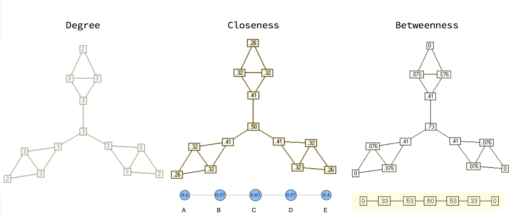
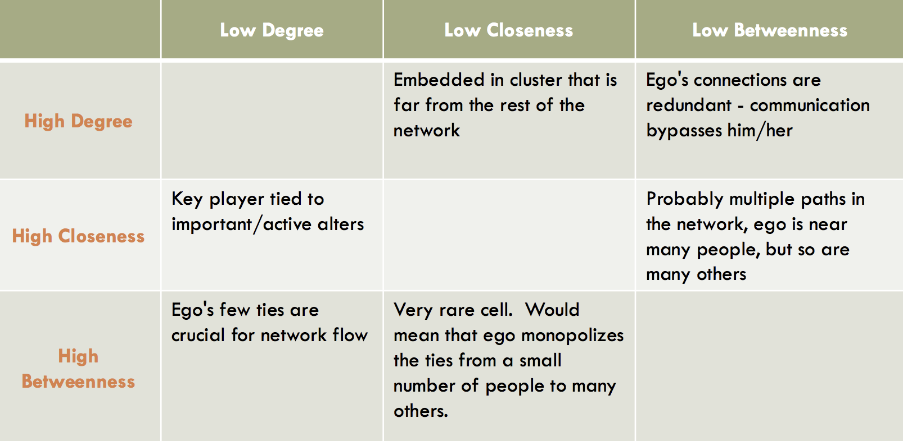

```{r  setup, message=FALSE, warning=FALSE, include=FALSE}
options(
  htmltools.dir.version = FALSE, # for blogdown
  width = 80,
  tibble.width = 80
)

knitr::opts_chunk$set(package.startup.message = FALSE,
  fig.align = "center",  warning=FALSE,  echo=FALSE, message=FALSE
)

```


```{r, include=FALSE}

library(tidyr)
library(reshape2)
library(gridExtra)
library(dplyr)
library(igraph)
library(network)
library(magrittr)
library(ggplot2)
```


## Would You Win $1,000,000?

Suppose you are playing the following game:

If you can get all your friends to meet you at the entrance to the ROM in exactly 1 hour, you will win $1,000,000. The catch is that you can only contact one friend, and not all your friends know each other. The picture below is a visualization of your friendship network. Which friend would you call and why?

```{r, echo=FALSE, eval=TRUE, message=FALSE, out.width='400px', fig.align='center'}
library(igraph)
library(sna)
el <- matrix( c("1", "2",
                "1", "3",
                "2","3",
                "3","5",
                "2","4",
                "2","5",
                "3","4",
                "4","5",
                "4","7",
                "6","5",
                "5","7",
                "6","7",
                "6","8",
                "8","9",
                "9","10",
                "8","12",
                "11","12",
                "12","13",
                "12","14",
                "12","15",
                "12","16"), nc = 2, byrow = TRUE)
g<-graph_from_edgelist(el, directed=F)
set.seed(1598)
plot(g,  edge.arrow.size=1, edge.color="black", vertex.color="white")

```
 

---
## Discussion

- What criterion helps spread the message in the fewest possible steps?

- What are social science applications of this game?

---
## Network Measures: Centrality

- Centrality measures help understand which node is the most important or central in this network?

  + What do you mean by "important"? "center"?
  
  + Definition of "center" varies by context/purpose
    
    + The power a person holds in an organization may be inversely proportional to the number of keys on their keyring 
      
      + A janitor has keys to every office, and no power
      
      + The CEO does not need a key: people always open the door for her
      
  + No unanimity on exactly what centrality is or how to measure it. 
---

## Florentine Families

Who looks central? 

```{r, echo=FALSE, eval=TRUE, out.width='500px', fig.align='center'}
library(igraph)
library(network)
data(flo)
g = graph_from_adjacency_matrix(flo, mode='undirected', diag=FALSE)
set.seed(6886)
plot(g, vertex.size=15,vertex.color="turquoise")
```
---

## Popular Measures of Centrality

Well ... let's define centrality:

- Degree
- Closeness 
- Betweenness
- Eigenvector

---

## Degree centrality

- **Idea**: The nodes with more connections to others are more central

- How to  measure: 
  + Undirected degree centrality: $\sum_{j:j \neq i} y_{i,j}$
  + Directed outdegree centrality: $\sum_{j:j \neq i} y_{j,i}$
  + Directed indegree centrality: $\sum_{j:j \neq i} y_{i,j}$


- Though simple, degree is often a highly effective measure of the influence or importance of a node
  + In many situations, people with more connections tend to have more power

---

## Florentine Families: an Adjacency Matrix

How would you calculate Albizzi's degree centrality?
```{r, echo=F}
as.matrix(flo)[1:16,1:6]
```


---
## Closeness centrality

- **Idea**: If a node is far away from all other nodes, then it should be less central ... or to put it another way, the more central a node, the lower its total distance to all other nodes
- How to measure: 
  + (geodesic) distance: $d_{i,j}$ is the minimal path length from $i$ to $j$
  + closeness centrality: $\frac{1}{\sum_{j:j \neq i} d_{i,j}}$
- Closeness can also be regarded as a measure of how long it will take to spread information from a node to all other nodes sequentially
- This measure won't be useful for disconnected graphs ... why?

---

## Betweenness

- **Idea**: A node is central if it acts as a bridge to other nodes

- How to measure in words: 
  + For each pair of nodes, compute the geodesic distance (shortest path between them)
  + Then for each node, determine the fraction of shortest paths that go through the actor in question
  + End by summing this fraction over all pairs of nodes
---

## Betweenness

- How to measure a bit more formally:
  + Say $g_{j,k}$ equals the number of geodesics between nodes $j$ and $k$
  + Say $g_{j,k}(i)$ equals the number of geodesics between nodes $j$ and $k$ going through $i$
  + Then betweenness centrality for actor $i$: $\sum_{j<k} \frac{g_{j,k}(i)}{g_{j,k}}$

---

## Betweenness

- Simple way to think of $\frac{g_{j,k}(i)}{g_{j,k}}$ is the probability that a "message" from $j$ to $k$ goes through $i$
  + $j$ and $k$ have $g_{j,k}$ routes of communication
  + $i$ is on $g_{j,k}(i)$ of these routes
  + a randomly selected path contains $i$ with probability $\frac{g_{j,k}(i)}{g_{j,k}}$ 

- Examples where this might be useful?

---

## Comparison of these measures (Thanks to Arifuzzaman & Bhuiyan)

```{r, out.width='1000px', fig.align='center',echo=FALSE}

```

---

## Comparison of these measures (Thanks to Arifuzzaman & Bhuiyan)

```{r, out.width='1000px', fig.align='center',echo=FALSE}

```
---

## One more ... Eigenvector

- **Idea**: An actor is more central if it is connected to other more central actors


- Eigenvector centrality: centrality of each node is proportional to the sum of the centralities of its neighbors (let $c_{i}^{e}$ denote the eigenvector centrality of actor $i$):
  + $c_{i}^{e} = \frac{1}{\lambda} \sum_{j:j\neq i} y_{ij} c_{j}^{e}$


- Based on some matrix algebra: 
  + $Y c^{e} = \lambda c^{e}$
  + Vector $c^{e}$ satisfying the above equation is an **eigenvector** of Y

 
- Generally, there are multiple eigenvectors, centrality is taken to be the one corresponding to the largest value of $\lambda$


- Examples of where this might be useful?

---

## Trillion dollar application

 `Google Describing PageRank`: PageRank relies on the uniquely democratic nature of the web by using its vast link structure as an indicator of an individual page’s value. In essence, Google interprets a link from page A to page B as a vote, by page A, for page B. But, Google looks at more than the sheer volume of votes, or links a page receives; it also analyzes the page that casts the vote. Votes cast by pages that are themselves “important” weigh more heavily and help to make other pages “important.”


---

## Your Turn

For each of the following networks, think of the best measure of centrality to measure the amount of influence in different contexts.

- countries connected by trade relations
- a network of student friendships on a university campus
- a network of legislators connected by co-sponsorships of bills
- a network of CEOs connected based on their undergraduate institutions

---
class: inverse, middle, center
# Lab: Calculate Centrality

---

## Working example

[Florentine marriages (Padgett & Ansell 1993)](http://home.uchicago.edu/~jpadgett/papers/published/robust.pdf)

```{r,echo=TRUE, eval=TRUE}
# load datasets
data(flo) #this dataset is available from the -network- package
flo[1:5,1:5]
```

---

## Florentine families

```{r, echo=TRUE, eval=FALSE}
# convert to igraph object
library(igraph)
g = graph_from_adjacency_matrix(flo, mode='undirected', diag=FALSE)
plot(g)
```


---
## Degree centrality

Lets calculate each centrality measure in R (using the `igraph` package)

```{r, echo=TRUE, eval=degree}
sort(igraph::degree(g), decreasing=TRUE)[1:6]
sort(igraph::closeness(g), decreasing=TRUE)[1:6]
sort(igraph::betweenness(g), decreasing=TRUE)[1:6]
sort(igraph::eigen_centrality(g)$vector, decreasing=TRUE)[1:6]

```

---
## Your Turn

- Plot the Florentine network, such that node size is proportionate to each centrality measure. How do they compare?


```{r, echo=FALSE, eval=FALSE,message=FALSE, warning=FALSE, fig.show = 'hide'}
LO = layout_with_fr(g) #Layout
EigenCent<-eigen_centrality(g)

par(mfrow=c(2,2)) # plot four figures - 2 row, 2 columns
plot(g, vertex.size=30*EigenCent$vector, layout=LO, main="Eigenvalue")
plot(g, vertex.size=BetwCent, layout=LO, main="Betweenness")
plot(g, vertex.size=1000*CloseCent, layout=LO, main="Closeness")
plot(g, vertex.size=5*cDegree, layout=LO, main="Degree")
```


