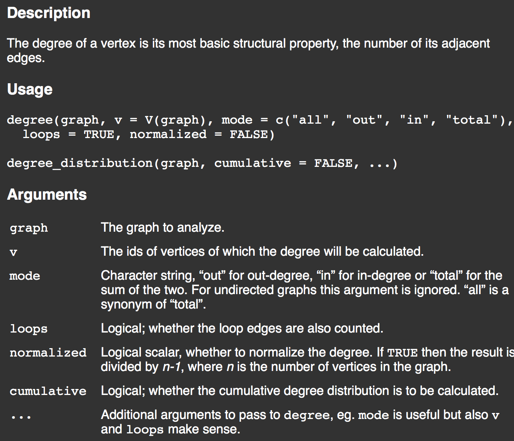
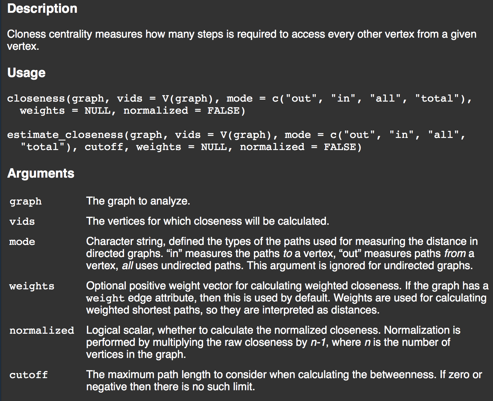
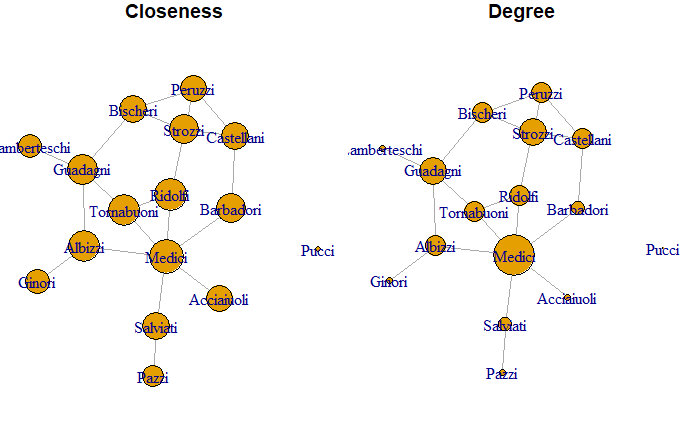
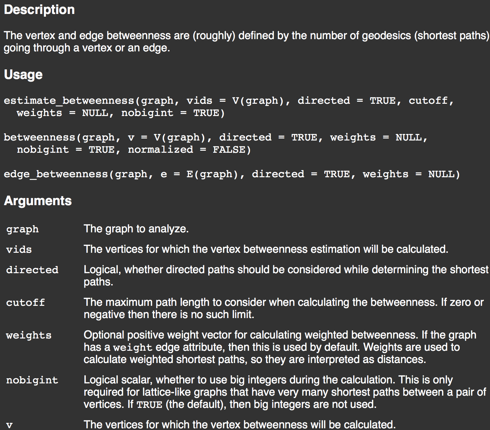
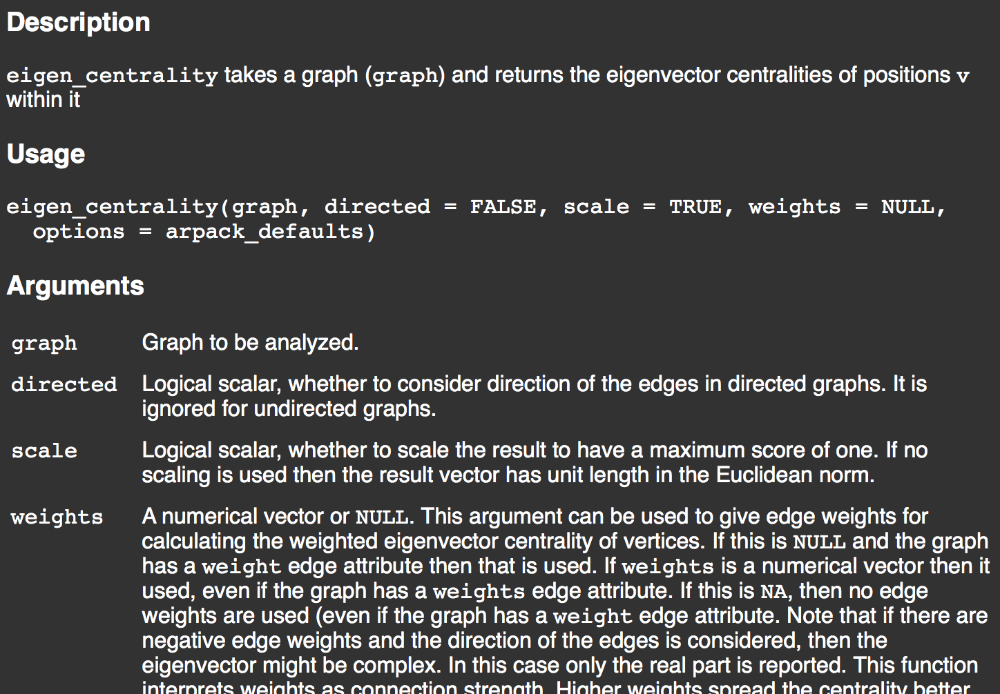
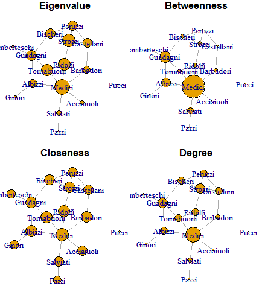
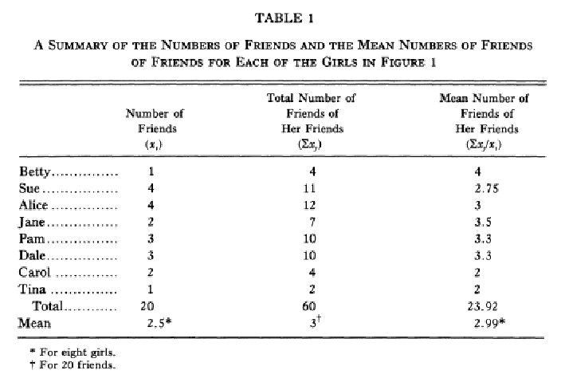

```{r  setup, message=FALSE, warning=FALSE, include=FALSE}
options(
  htmltools.dir.version = FALSE, # for blogdown
  width = 80,
  tibble.width = 80
)

knitr::opts_chunk$set(package.startup.message = FALSE,
  fig.align = "center",  warning=FALSE,  echo=FALSE, message=FALSE
)

```


```{r, include=FALSE}

library(tidyr)
library(reshape2)
library(gridExtra)
library(dplyr)
library(igraph)
library(network)
library(magrittr)
library(ggplot2)
```


## Centrality

- Centrality measures help understand: 
  + **"Which node is the most important or central in this network?"**
  + What do you mean by "important"?
  + What do you mean by "center"?
  + Definition of "center" varies by context/purpose
    + The power a person holds in an organization may be inversely proportional to the number of keys on their keyring 
      + A janitor has keys to every office, and no power
      + The CEO does not need a key: people always open the door for her

---

## Centrality

Freeman (1979):

"There is certainly no unanimity on exactly what centrality is or on its conceptual foundations, and there is little agreement on the proper procedure for its measurement."

---
## Working example

[Florentine marriages (Padgett & Ansell 1993)](http://home.uchicago.edu/~jpadgett/papers/published/robust.pdf)

```{r,echo=TRUE, eval=TRUE}
# load datasets
data(flo) #this dataset is available from the -network- package
# view
dim(flo)
rownames(flo)
flo[1:5,1:5]
```

---

## Florentine families

```{r, echo=TRUE, eval=FALSE}
# convert to igraph object
library(igraph)
g = graph_from_adjacency_matrix(flo, mode='undirected', diag=FALSE)
plot(g)
```

---

## Florentine families

Who looks central? 

```{r, echo=FALSE, eval=TRUE, out.width='400px', fig.align='center'}
# convert to igraph object
library(igraph)
g = graph_from_adjacency_matrix(flo, mode='undirected', diag=FALSE)
set.seed(6886)
plot(g)
```
---

## Florentine families

Does simply plotting with different layouts help?

```{r, echo=FALSE, eval=TRUE, out.width='400px', fig.align='center'}

par(mfrow=c(2, 3), mar=c(0,0,1,0))
plot(g, layout=layout_randomly, main="Random")
plot(g, layout=layout_in_circle, main="Circle")
plot(g, layout=layout_as_star, main="Star")
plot(g, layout=layout_as_tree, main="Tree")
plot(g, layout=layout_on_grid, main="Grid")
plot(g, layout=layout_with_fr, main="Force-directed")
```

---
## Popular Measures of Centrality

Well ... let's define centrality:

- Degree
- Closeness 
- Betweenness
- Eigenvector

---

## Degree centrality

- **Idea**: The nodes with more connections to others are more central


- How to  measure: 
  + Undirected degree centrality: $\sum_{j:j \neq i} y_{i,j}$
  + Directed outdegree centrality: $\sum_{j:j \neq i} y_{j,i}$
  + Directed indegree centrality: $\sum_{j:j \neq i} y_{i,j}$


- Though simple, degree is often a highly effective measure of the influence or importance of a node
  + In many situations, people with more connections tend to have more power


- Examples where this might be useful? 

---

## Degree centrality

Lets calculate degree centrality in R (using the `igraph` package)

```{r}
cDegree = apply(g[], 1, sum)
sort(cDegree, decreasing=TRUE)[1:6]
```

---

## Degree centrality

Lets calculate degree centrality in R using `igraph`

```{r, echo=TRUE, eval=FALSE}
?degree
```

```{r, out.width='500px', fig.align='center',echo=FALSE}

```
---

## Degree centrality

Lets calculate degree centrality in R using `igraph`

```{r, echo=TRUE, eval=degree}
cDegree = degree(g, mode='in', loops=FALSE)
sort(cDegree, decreasing=TRUE)[1:6]
```

---
## Now ...

Adjust the size of nodes in the Florentine graph by degree

```{r, echo=FALSE, eval=TRUE, out.width='450px', fig.align='center'}
# convert to igraph object
g = graph_from_adjacency_matrix(flo, mode='undirected', diag=FALSE)
set.seed(6886)
plot(g, vertex.size=5*cDegree)
```

---

```{r, echo=TRUE, eval=TRUE, out.width='500px', fig.align='center'}
# convert to igraph object
g = graph_from_adjacency_matrix(flo, mode='undirected', diag=FALSE)
set.seed(6886)
plot(g, vertex.size=5*cDegree)
```

---
## Closeness centrality

- **Idea**: If a node is far away from all other nodes, then it should be less central ... or to put it another way, the more central a node, the lower its total distance to all other nodes
- How to measure: 
  + (geodesic) distance: $d_{i,j}$ is the minimal path length from $i$ to $j$
  + closeness centrality: $\frac{1}{\sum_{j:j \neq i} d_{i,j}}$
- Closeness can also be regarded as a measure of how long it will take to spread information from a node to all other nodes sequentially
- This measure won't be useful for disconnected graphs ... why?
- Examples where this might be useful?


---
## Closeness centrality

Lets think about how to calculate this ...

- Start with getting distances between nodes

```{r, echo=TRUE, eval=TRUE}
d = distances(g)
d[1:5,1:5]
```

---

## Closeness centrality

Why? is this

```{r,echo=TRUE, eval=TRUE}
d['Pucci',1:5]
```

Lets fix. 

```{r,echo=TRUE, eval=TRUE}
d[d==Inf] = NA
```

---

## Now lets get a pseudo-measure of closeness

```{r, echo=TRUE, eval=TRUE}
avgPathDistance = sort(apply(d, 1, mean, na.rm=TRUE), decreasing=FALSE)

#dump pucci
avgPathDistance = avgPathDistance[-1]

# top 6
avgPathDistance[1:6]
```

---

## Closeness centrality

Lets calculate this in `igraph`

```{r, echo=TRUE, eval=FALSE}
?closeness
```

```{r, out.width='500px', fig.align='center',echo=FALSE}

```

---

## Closeness centrality

Lets calculate this in `igraph`

```{r, echo=TRUE, eval=TRUE , message=FALSE, warning=FALSE}
sort(closeness(g), decreasing=TRUE)[1:6]
```

Compare with our hack-y calculation:

```{r, echo=TRUE, eval=TRUE , message=FALSE, warning=FALSE}
avgPathDistance[1:6]
```
---

## Degree vs Closeness

```{r, echo=TRUE, eval=TRUE, message=FALSE,warning=FALSE}
sort(degree(g), decreasing=TRUE)[1:6]
sort(closeness(g), decreasing=TRUE)[1:6]
```
---
## Two-way Visualization Comparison

Now plot adjusting node sizes by closeness centrality, and position the previous plot using node size as a function of degree to the left


```{r, out.width='500px', fig.align='center',echo=FALSE}

```

---
## Two-way Visualization Comparison

```{r, echo=TRUE, eval=T,results='hide',message=FALSE, warning=FALSE, fig.align="center",out.width='500px'}
CloseCent<-closeness(g)
g = graph_from_adjacency_matrix(flo, mode='undirected', diag=FALSE)
set.seed(5574)
LO = layout_with_fr(g) #Layout

par(mfrow=c(1,2)) # plot four figures - 1 rows, 2 columns
plot(g, vertex.size=1000*CloseCent, layout=LO, main="Closeness")
plot(g, vertex.size=5*cDegree, layout=LO, main="Degree")
```


```{r, out.width='400px', fig.align='center',echo=FALSE}

```
---

## Betweenness

- **Idea**: A node is central if it acts as a bridge to other nodes

- How to measure in words: 
  + For each pair of nodes, compute the geodesic distance (shortest path between them)
  + Then for each node, determine the fraction of shortest paths that go through the actor in question
  + End by summing this fraction over all pairs of nodes
---

## Betweenness

- How to measure a bit more formally:
  + Say $g_{j,k}$ equals the number of geodesics between nodes $j$ and $k$
  + Say $g_{j,k}(i)$ equals the number of geodesics between nodes $j$ and $k$ going through $i$
  + Then betweenness centrality for actor $i$: $\sum_{j<k} \frac{g_{j,k}(i)}{g_{j,k}}$

---

## Betweenness

- Simple way to think of $\frac{g_{j,k}(i)}{g_{j,k}}$ is the probability that a "message" from $j$ to $k$ goes through $i$
  + $j$ and $k$ have $g_{j,k}$ routes of communication
  + $i$ is on $g_{j,k}(i)$ of these routes
  + a randomly selected path contains $i$ with probability $\frac{g_{j,k}(i)}{g_{j,k}}$ 

- Examples where this might be useful?

---

## Betweenness

Lets calculate this in `igraph`

```{r, echo=TRUE, eval=FALSE}
?betweenness
```

```{r, out.width='450px', fig.align='center',echo=FALSE}

```

---

## Betweenness

Lets calculate this in `igraph`

```{r, echo=TRUE, eval=TRUE}
sort(betweenness(g), decreasing=TRUE)[1:6]
```

---

## Degree vs Closeness vs Betweenness

```{r, echo=TRUE, eval=TRUE, warning=FALSE}
sort(degree(g), decreasing=TRUE)[1:6]
sort(closeness(g), decreasing=TRUE)[1:6]
sort(betweenness(g), decreasing=TRUE)[1:6]
```


---
## Three-Way Visualization Comparison

Now plot adjusting node sizes by closeness centrality, and position the previous plot using node size as a function of degree to the left


```{r, out.width='700px', fig.align='center',echo=FALSE}
knitr::include_graphics('images/threeway.png')
```

---
## Three-Way Visualization Comparison
```{r, echo=TRUE, eval=TRUE, include=FALSE,message=FALSE, warning=FALSE, fig.align="center",out.width='700px'}
BetwCent<-betweenness(g)
g = graph_from_adjacency_matrix(flo, mode='undirected', diag=FALSE)
set.seed(5574)


par(mfrow=c(1,3)) # plot four figures - 1 row, 3 columns
plot(g, vertex.size=BetwCent, layout=LO, main="Betweenness")
plot(g, vertex.size=1000*CloseCent, layout=LO, main="Closeness")
plot(g, vertex.size=5*cDegree, layout=LO, main="Degree")
```


```{r, out.width='400px', fig.align='center',echo=FALSE}
knitr::include_graphics('images/threeway.png')
```

---

## Comparison of these measures (Thanks to Arifuzzaman & Bhuiyan)

```{r, out.width='1000px', fig.align='center',echo=FALSE}
knitr::include_graphics('images/comparisonCentrality.png')
```

---

## Comparison of these measures (Thanks to Arifuzzaman & Bhuiyan)

```{r, out.width='1000px', fig.align='center',echo=FALSE}
knitr::include_graphics('images/comparisonCentralityTable.png')
```
---

## One more ... Eigenvector

- **Idea**: An actor is more central if it is connected to other more central actors


- Eigenvector centrality: centrality of each node is proportional to the sum of the centralities of its neighbors (let $c_{i}^{e}$ denote the eigenvector centrality of actor $i$):
  + $c_{i}^{e} = \frac{1}{\lambda} \sum_{j:j\neq i} y_{ij} c_{j}^{e}$


- Based on some matrix algebra: 
  + $Y c^{e} = \lambda c^{e}$
  + Vector $c^{e}$ satisfying the above equation is an **eigenvector** of Y

 
- Generally, there are multiple eigenvectors, centrality is taken to be the one corresponding to the largest value of $\lambda$


- Examples of where this might be useful?

---

## Trillion dollar application

 `Google Describing PageRank`: PageRank relies on the uniquely democratic nature of the web by using its vast link structure as an indicator of an individual page’s value. In essence, Google interprets a link from page A to page B as a vote, by page A, for page B. But, Google looks at more than the sheer volume of votes, or links a page receives; it also analyzes the page that casts the vote. Votes cast by pages that are themselves “important” weigh more heavily and help to make other pages “important.”


---
## Eigenvector centrality

Lets calculate this in `igraph`

```{r, echo=TRUE, eval=FALSE}
?eigen_centrality
```

```{r, out.width='700px', fig.align='center',echo=FALSE}

```

---

## Eigenvector centrality

Lets calculate this in `igraph`

```{r, echo=TRUE, eval=TRUE}
sort(eigen_centrality(g)$vector, decreasing=TRUE)[1:6]
```

---
## Degree vs Closeness vs Betweenness vs Eigenvector

```{r, echo=TRUE, eval=FALSE}
sort(degree(g), decreasing=TRUE)[1:6]
sort(closeness(g), decreasing=TRUE)[1:6]
sort(betweenness(g), decreasing=TRUE)[1:6]
sort(eigen_centrality(g)$vector, decreasing=TRUE)[1:6]
```

```{r, echo=FALSE, eval=TRUE}
sort(degree(g), decreasing=TRUE)[1:6]
suppressWarnings(sort(closeness(g), decreasing=TRUE)[1:6])
sort(betweenness(g), decreasing=TRUE)[1:6]
sort(eigen_centrality(g)$vector, decreasing=TRUE)[1:6]
```

---

## Four-Way Visualization Comparison

- Now plot adjusting node sizes by eigenvalue centrality, and position the previous plot using node size as a function of degree to the left

```{r, echo=FALSE, eval=TRUE,message=FALSE, warning=FALSE, fig.align="center",out.width='40%'}


```

---

```{r, echo=TRUE, eval=TRUE,message=FALSE, warning=FALSE, fig.show = 'hide'}
LO = layout_with_fr(g) #Layout
EigenCent<-eigen_centrality(g)

par(mfrow=c(2,2)) # plot four figures - 2 row, 2 columns
plot(g, vertex.size=30*EigenCent$vector, layout=LO, main="Eigenvalue")
plot(g, vertex.size=BetwCent, layout=LO, main="Betweenness")
plot(g, vertex.size=1000*CloseCent, layout=LO, main="Closeness")
plot(g, vertex.size=5*cDegree, layout=LO, main="Degree")
```

---
## Break-Out Groups
For each of the following networks, think of the best measure of centrality to measure the amount of influence in different contexts.

- countries connected by trade relations
- a network of student friendships on a university campus
- a network of legislators connected by co-sponsorships of bills
- a network of CEOs connected based on their undergraduate institutions
---
## A word from Wasserman & Faust

"..., we do not expect that the most fruitful development in descriptive techniques will be the continued addition of yet another definition of centrality measure or yet another subgroup definition or yet another definition of equivalence. Rather, we expect that careful assessment of the usefulness of current methods in substantive and theoretical applications will be helpful in determining when, and under what conditions, each method is useful (perhaps in conjunction with statistical assumptions). Considerable work also needs to be done on measurement properties (such as sampling variability) of the current measures."
---
## Application: Feld (1991)

Goals: 

- Learn to calculate various measures of centrality
- Continue familiarizing yourself with managing network data
- Replicate the analysis by Feld (1991)


---

## Feld (1991) Summary

- Most people have fewer friends than their friends. Why?

- The distribution of the number of friends' friends is pulled to the right by a small number of people with a lot of friends.

- Other examples of the same phenomenon?
---

## Plan

- Step 1: Load the data.  We'll be using a dataset named *coleman* from the `sna` package.

  + Notice that these are not the same data as in Feld (1991)
  
```{r, echo=TRUE, eval=TRUE, message=FALSE}
library(sna)
data(coleman)
#?coleman 


```
---


## Plan
- Step 2: Plot the network in the fall. Notice that our data is a 2x73x73 array.
 
```{r, echo=TRUE, eval=TRUE, message=FALSE,fig.align="center", out.width= "45%"}
#coleman[1,,] #Fall
#dim(coleman[1,,])
library(igraph)
pGraph<-graph_from_adjacency_matrix(coleman[1,,])
V(pGraph)$label<- NA
plot(pGraph, vertex.size=10, edge.arrow.size=.2,vertex.color="blue" )

```
---

## Now Let's Replicate Feld's Analysis

Table 1 on p. 1466

```{r, out.width= "75%",fig.align="center"}

```
---
## Your Turn

Calculate number of friends (degree centrality) for each person.

```{r, echo = F, eval = TRUE , message=FALSE, warning=FALSE}
deg<-readRDS("data/deg.rds")
deg[1:5,]
```

---
## Table 1 Replication Cont'd

1. Calculate individual's degree for Coleman data using dplyr:

  
```{r, echo = T, eval = T , message=FALSE, warning=FALSE}

deg<-as_tibble(coleman[1,,]) %>% 
  mutate(from_id=row.names(coleman[1,,])) %>% 
  pivot_longer(cols=`1`:`73`,names_to="to_id",values_to="friend") %>%
  group_by(from_id) %>% 
  summarise(degree=sum(friend)) %>% 
  ungroup()
```

---
## Table 1 Replication Cont'd

2. Calculate total number of friends of friends of each person.
3. Calculate average number of friends of friends.

```{r, echo = F, eval = T , message=FALSE, warning=FALSE}
fdeg<-as_tibble(coleman[1,,]) %>% 
  mutate(from_id=row.names(coleman[1,,])) %>% 
  pivot_longer(cols=`1`:`73`,names_to="to_id",values_to="friend") %>%
  filter(friend==1) %>%
  group_by(from_id)%>%
  mutate(idegree=sum(friend), to_id=to_id) %>%
  left_join(deg, by=c("to_id"="from_id")) %>%
  rename(fdegree=degree)  %>%
  mutate(tot_fdeg=sum(fdegree),ave_fdeg=mean(fdegree)) %>%
  ungroup() 

fdeg %>% group_by(from_id) %>% summarise(ideg=first(idegree),tot_fdeg=first(tot_fdeg), ave_deg=first(ave_fdeg))
```
---
## Table 1 Replication Cont'd

2. Calculate total number of friends of friends of each person.
3. Calculate average number of friends of friends.

```{r, echo = T, eval = F , message=FALSE, warning=FALSE}
fdeg<-as_tibble(coleman[1,,]) %>% 
  mutate(from_id=row.names(coleman[1,,])) %>% 
  pivot_longer(cols=`1`:`73`,names_to="to_id",values_to="friend") %>%
  filter(friend==1) %>%
  group_by(from_id)%>%
  mutate(idegree=sum(friend), to_id=to_id) %>%
  left_join(deg, by=c("to_id"="from_id")) %>%
  rename(fdegree=degree)  %>%
  mutate(tot_fdeg=sum(fdegree),ave_fdeg=mean(fdegree)) %>%
  ungroup() 

fdeg %>% group_by(from_id) %>% summarise(ideg=first(idegree),tot_fdeg=first(tot_fdeg), ave_fdeg=first(ave_fdeg))
```


---
## Figure 3 Replication

1. Plot individual's degree distribution for Coleman data:
```{r, echo = T, eval = T , message=FALSE, warning=FALSE}
p<-deg %>% 
  ggplot() +
  geom_bar(aes(x=degree))+
  xlab("Individual's Degree")+
  theme_classic()
```
---
## Figure 3 Replication Cont'd

2. Plot friend's degree distribution:
```{r, echo = T, eval = T , message=FALSE, warning=FALSE}
p1<-fdeg %>%  ggplot() +geom_bar(aes(x=fdegree))+
  xlab("Friend's Degree")+
  theme_classic()


```

---
## Figure 3 Replication Cont'd
3. Combine the plots

```{r,out.width= "50%",fig.align="center"}
library(gridExtra)
grid.arrange(p,p1)
```


---

## Feld (1991) Figure 3


```{r, out.width= "60%", fig.align="center"}
knitr::include_graphics("images/Feld_F3.png")
```


