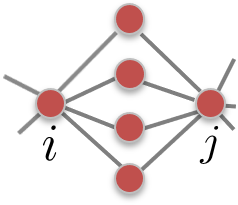

```{r setup, include=FALSE}
knitr::opts_chunk$set(echo = TRUE, fig.align = 'center', message = FALSE, warning = FALSE)
```


class: inverse, middle, center
# Network Community Detection
---
## Reading Materials

- [Barabasi, Albert-Laszlo. (2016). Network Science. Cambridge University Press. Chapter 9.](http://networksciencebook.com/chapter/9)
- Zachary, Wayne W. (1977). An information flow model for conflict and fission in small groups. Journal of Anthropological Research 33(4) : 452-473.
- Renshon, Jonathan. (2016). Status deficits and war. International Organization 70(3): 513-550.
- Gould, Roger V. (1991). Multiple Networks and Mobilization in the Paris Commune, 1971. Americal Sociological Review 56(6): 716-729. 

---
## Introduction: Belgium
```{r, out.width='700px', fig.align='center', echo=FALSE}
knitr::include_graphics('images/belgium.png')
```
---
## Introduction: Belgium
- Population: 11.5 mil
- Bilingual: 59% Flemish (speak Dutch), 40% Waloons (French)
- Is the society so densely knitted together that nobody notices who is of what ethnic group?
- Or do the two groups minimize the interactions?
---
## Blondel et al. (2008)

- Applied a community finding algorithm to the call patterns of a big mobile phone operator.
- Goal: identify individuals who regularly talk to one another.
---
## Blondel et al. (2008)
```{r, out.width='500px', fig.align='center', echo=FALSE}
knitr::include_graphics('images/belgium_communities.png')
```

---
class: inverse, middle, center
#  Communities: the Basics
---
## Network Levels of Analysis

```{r, out.width='900px', fig.align='center', echo=FALSE}
knitr::include_graphics('images/levels_of_analysis.png')
```

---
## What Is A Community?

- A community is a locally dense connected subgraph. (Barabasi, 2016, 325)
  + All members of a community must be reached through other members of the same community (connectedness).
  + Nodes that belong to the same community have a higher probability of linking than nodes outside of the community (density).
  + Examples: communities among the karate club members, communities of international states, communities of legislators, neighborhood communities.
- Note that these features do not uniquly define a community, just offer some guidelines.
  
---
## Cliques as Communities

A clique is a complete subgraph of *k*-nodes.
```{r, out.width='900px', fig.align='center', echo=FALSE}
knitr::include_graphics('images/cliques.png')
```

- May be too restrictive.
---
## Strong and Weak Communities
Consider a connected subgraph $C$ of $N_c$ nodes.

*Internal degree, $k_i^{int}$* is the set of links of node *i* that connectes to the other nodes in the same community.

*External degree, $k_i^{ext}$* is the set of links of node *i* that connects to the rest of the network.

If $k_i^{ext}=0$, all neighbors of $i$ belong to $C$, and $C$ is a good community for $i$.

If $k_i^{int}=0$, all neighbors of $i$ belong to other communities, then $i$ should be assigned to a different community.


---
## Example

$k_i^{ext}=1$, $k_i^{int}=3$

```{r, out.width='300px', fig.align='center', echo=FALSE}
knitr::include_graphics('images/communities.png')
```
---
## Strong and Weak Communities

In a *strong community* each node of $C$ has more links within the community than with the rest of the graph, $k_i^{int}(C)>k_i^{ext}(C)$. In a *weak community,* the total internal degree of $C$ exceeds its total external degree, $k_i^{in}(C)>k_i^{out}(C)$.  

```{r, out.width='700px', fig.align='center', echo=FALSE}
knitr::include_graphics('images/communities1.png')
```
---
## Number of Partitions

How many ways can we partition a network into 2 communities? 

Divide a network into two equal non-overlapping subgraphs, such that the number of links between the nodes in the two groups is minimized.

Two subgroups of size n1 and n2. Total number of combinations: $\frac{N!}{n_1!n_2!}$

- $N=10 \implies 256$ partitions
- $N=100 \implies 10^{26}$ partitions

If the number and size of the communities are unknown at the beginning, the number of possible partitions is a Bell Number. 

Brute force approach is unfeasible, need an algorithm.
---
## Ravasz Algorithm

Step 1: Define the Similarity Matrix 

High for node pairs that likely belong to the same community, low for those that likely belong to different communities. 
Nodes that connect directly to each other and/or share multiple neighbors are more likely to belong to the same dense local neighborhood, hence their similarity should be large.

Topological overlap matrix: $x_{ij}=\frac{J_N(i,j)}{min(k_i,k_j)}$, where $J_N(i,j)$ is the number of common neighbors of nodes $i$ and $j$, $+1$ if there is a direct link between $i$ and $j$, and $min(k_i,k_j)$ is the smaller of the degrees $k_i$ and $k_j$.

```{r, out.width='200px', fig.align='center', echo=FALSE}

```
 


```{r, echo=F, eval=TRUE, message=FALSE }
library(tidyr)
library(tidyverse)
library(magrittr)
library(dplyr)
library(network)
library(igraph)

#In this example, we'll use data on Florentile marriages
data(flo) #from the -network- package
flo<-flo[-12,-12] #remove Pucci who has no links
```


```{r, echo=F, eval=TRUE}
simmat<-function(mymat) {
J_ij<-matrix(NA,nrow(mymat),ncol(mymat)) #J_ij is the number of edges in common.
x_ij<-matrix(NA,nrow(mymat),ncol(mymat))
for (i in 1:nrow(mymat)) {
  for (j in 1:nrow(mymat)) {
    if (i!=j) {
    J_ij[i,j]=sum(as.numeric(mymat[i,]==1 & mymat[j,]==1))
    min_ki<-min(sum(mymat[i,]),sum(mymat[j,]))+1
    if (mymat[i,j]==1 & mymat[j,i]==1) {
    J_ij[i,j]<-J_ij[i,j]+1 
    }
    else {
      J_ij[i,j]<-J_ij[i,j]
    }
    x_ij<-J_ij/min_ki
   }}}
return(x_ij)
}
mysim<-simmat(flo)
```


```{r, echo=F, eval=TRUE}
myALC<-function(comm_ind, mysim) {
ids <- combn(unique(comm_ind), 2)
ALC<-NULL
comms <- unique(comm_ind)
for (id in 1:ncol(ids)) {
  comm_mat<- mysim %>% subset(comm_ind==ids[1,id])
  comm_mat1<-subset(comm_mat, select=comm_ind==ids[2,id])
  ALC<-c(ALC,mean(comm_mat1))
  }
simmat_new<-data.frame(comm1=ids[1,], comm2=ids[2,],ALC=ALC)
return(simmat_new)
}
```
---
## Ravasz Algorithm
Step 2: Define Group Similarity

Nodes are merged into groups based on their mutual similarity, e.g. average cluster linkage. 

Step 3: Apply Hierarchical Clustering 

- Assign each node to a community of its own and evaluate the similarity for all node pairs. The initial similarities between these “communities” are simply the node similarities.
- Find the community pair with the highest similarity and merge them to form a single community.
- Calculate the similarity between the new community and all other communities.
- Repeat from Step 2 until all nodes are merged into a single community.


```{r, echo=F, eval=TRUE}
myHCA<-function(mysim){
nodes<-1:nrow(mysim) #assign each node to a community of its own
mytree<-nodes
comm_ind<-nodes #starting values for comm_ind
mysim1<-expand.grid(comm1=1:nrow(mysim),comm2=1:nrow(mysim)) %>% 
  data.frame(sim=as.vector(mysim)) %>%na.omit() #starting matrix of community similarities
 n=1
repeat {
  #cat("step",n,fill=TRUE)
  high_sim<-mysim1[mysim1[,3]==max(mysim1[,3], na.rm = TRUE),] #find the community pair with the highest similarity 
  high_sim<-unique(c(high_sim[,1],high_sim[,2]))
  comm_ind[comm_ind %in% high_sim]<-min(high_sim) # merge them into a single community
  mytree<-cbind(mytree,comm_ind) #add a new level to the dendogram
  mysim1<-myALC(comm_ind=comm_ind, mysim=mysim)
  n=n+1
 if (length(unique(comm_ind))==2) {
   break
 }
}
 return(mytree)
} 

mytree<-myHCA(mysim)
```


```{r, echo=F, eval=TRUE, fig.show = 'hide' }

mytree<-myHCA(mysim)

flo<-graph_from_adjacency_matrix(flo, mode="undirected", diag=FALSE)
par(mfrow=c(2, 2), mar=c(0,0,1,0))
LO = layout_with_fr(flo) #Layout
V(flo)$color<-  mytree[,2]
plot(flo, layout=LO,main="Div 1")

V(flo)$color<-  mytree[,3]
plot(flo, layout=LO, main="Div 2")

V(flo)$color<-  mytree[,4]
plot(flo, layout=LO, main="Div 3")

V(flo)$color<-  mytree[,ncol(mytree)]
plot(flo, layout=LO, main="Div 4")
```
---
## Different Splits of the Florentine Network

```{r, echo=FALSE, eval=TRUE, fig.align = 'center' }

mytree<-myHCA(mysim)

#flo<-graph_from_adjacency_matrix(flo, mode="undirected", diag=FALSE)
par(mfrow=c(2, 2), mar=c(0,0,1,0))
LO = layout_with_fr(flo) #Layout
V(flo)$color<-  mytree[,2]
plot(flo, layout=LO,main="Div 1")

V(flo)$color<-  mytree[,3]
plot(flo, layout=LO, main="Div 2")

V(flo)$color<-  mytree[,4]
plot(flo, layout=LO, main="Div 3")

V(flo)$color<-  mytree[,ncol(mytree)]
plot(flo, layout=LO, main="Div 4")
```


```{r, echo=F, eval=TRUE, message=FALSE}
#Before you start convert the karate club graph to an adjacency matrix dataframe object:
karate <- make_graph("Zachary")
d<-  igraph::as_data_frame(karate) %>% as_tibble() %>% mutate(friend=1)
#Transform into a wide format:
karateMat<-expand.grid(from=1:34,to=1:34) %>% 
    left_join(d) %>% 
    as_tibble() %>% 
    mutate(friend = recode(friend, .missing=0)) %>%
    spread(to, friend) %>% dplyr::select(-1) %>%
    data.matrix()

karateMat[lower.tri(karateMat)] <- t(karateMat)[lower.tri(karateMat)]
rownames(karateMat) <- colnames(karateMat)
#isSymmetric(karateMat)
#karateMat

```

---
## The Ravasz Algorithm Splits of Zachary's Data
```{r, echo=FALSE, eval=TRUE, fig.align = 'center'}
#Step 1:
mysim<-simmat(karateMat)
#Step 3:
mytree<-myHCA(mysim)

#Karate club network:
par(mfrow=c(2, 2), mar=c(0,0,1,0))
LO = layout_with_fr(karate) #Layout
V(karate)$color<-  mytree[,10]
plot(karate, layout=LO,main="Div 1")

V(karate)$color<-  mytree[,11]
plot(karate,layout=LO, main="Div 2")

V(karate)$color<-  mytree[,12]
plot(karate,layout=LO, main="Div 3")

V(karate)$color<-  mytree[,13]
plot(karate, layout=LO, main="Div 4")

```
---
## Zachary (1977)

- Karate club of 34 members; 

- 78 pairwise links between members who regularly interacted outside the club;

- A conflict between the club’s president and the instructor split the club into two.

- Today community finding algorithms are often tested based on their ability to infer these two communities from the structure of the network before the split.


---
## Zachary (1977)

- Maximum Flow Minimum Cut Procedure: divides network nodes into two subsets, one containing the source and the other, the sink. The edges connecting the two subsets, called `the cut.` The cut with the minimum sum of the capacities of all of its edges represents a bottleneck in the network. (464) 
---
## Zachary (1977)

```{r, out.width='500px', fig.align='center', echo=FALSE}
knitr::include_graphics('images/zachary.png')
```
 
---
## Can We Replicate the Result?

```{r, echo=TRUE, eval=TRUE, fig.align='center', out.width='350px'}
library(igraph) #Zachary's karate club dataset is built into the igraph package.
karate <- make_graph("Zachary") 
mf<-max_flow(karate, source=V(karate)[1], target=V(karate)[34])
V(karate)$color<- ifelse(V(karate) %in%  mf$partition1, "red","pink")
plot(karate, edge.color="black", vertex.frame.color="black")
```
---
## Can We Find the Same Result?

```{r}
mf$partition1
mf$partition2
```
---
## Other Ways to Partition Networks

- Modularity: a measure of the extent to which like is connected to like in a network.
  + A *greedy algorithm* iteratively joins nodes if the move increases the new partition's modularity.

```{r, out.width='600px', fig.align='center', echo=FALSE}
knitr::include_graphics('images/modularity.png')
```

---

```{r, echo=TRUE, eval=TRUE, fig.align='center', message=FALSE}
library(sna)
data(coleman)
#make into an igraph object
friends<-graph_from_adjacency_matrix(coleman[2,,], mode="undirected", diag=FALSE)
friends <- igraph::delete.vertices(friends , which(igraph::degree(friends)==0))
LO = layout_with_fr(friends) #Layout
cfg<-cluster_fast_greedy(friends)
modularity(cfg)
cfg$membership
```
---
## Communities in the Friendship Network
```{r, echo=TRUE, eval=TRUE, fig.align='center', message=FALSE}
plot(cfg, friends, layout=LO, main="Greedy")

```
---
## Other Examples:

```{r, echo=TRUE, eval=TRUE, fig.align='center', message=FALSE}
wc <- cluster_walktrap(friends) #community structure via short random walks
modularity(wc)
membership(wc)
```
---
## Fast Greedy Algorithm

```{r, echo=TRUE, eval=TRUE, fig.align='center', message=FALSE}
fg <- cluster_fast_greedy(friends) #Used in Renshon (2016)
modularity(fg)
fg$membership
```

---
## Egde Betweenness

```{r, echo=TRUE, eval=TRUE, fig.align='center', message=FALSE}
ceb<-cluster_edge_betweenness(friends)
modularity(ceb)
ceb$membership
```

---
## Comparing Clustering Algorithms

```{r, echo=TRUE, eval=TRUE, fig.align='center',out.width='300px', message=FALSE}
par(mfrow=c(2, 2), mar=c(0,0,1,0))
plot(cfg, friends, layout=LO, main="Greedy")
plot(wc, friends, layout=LO, main="Short Random Walks")
plot(fg, friends, layout=LO,main= "Fast Greedy")
plot(ceb, friends, layout=LO, main="Betweenness")
```

