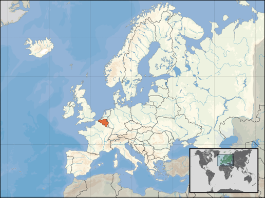
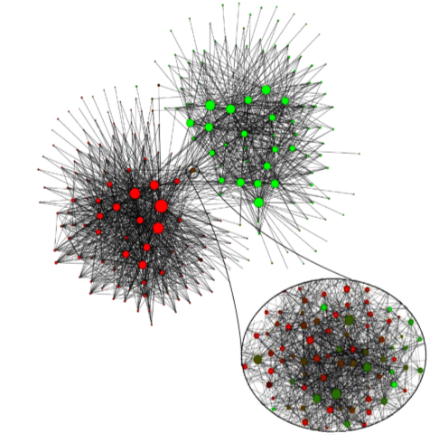
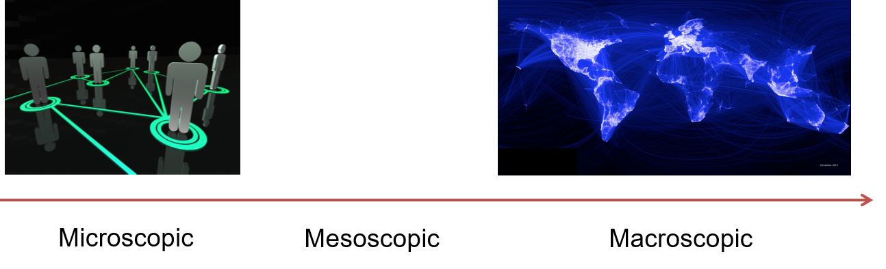
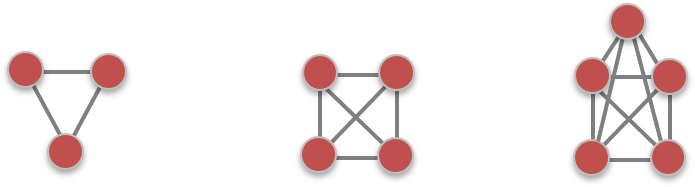
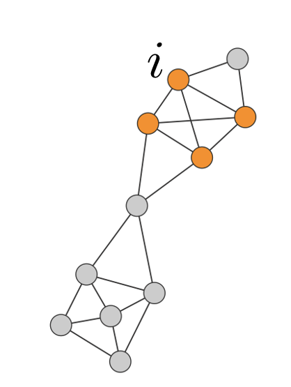
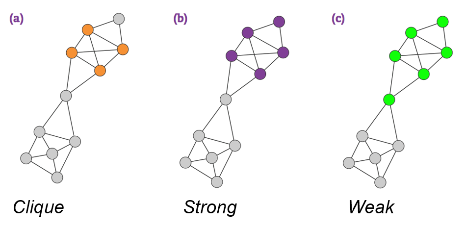
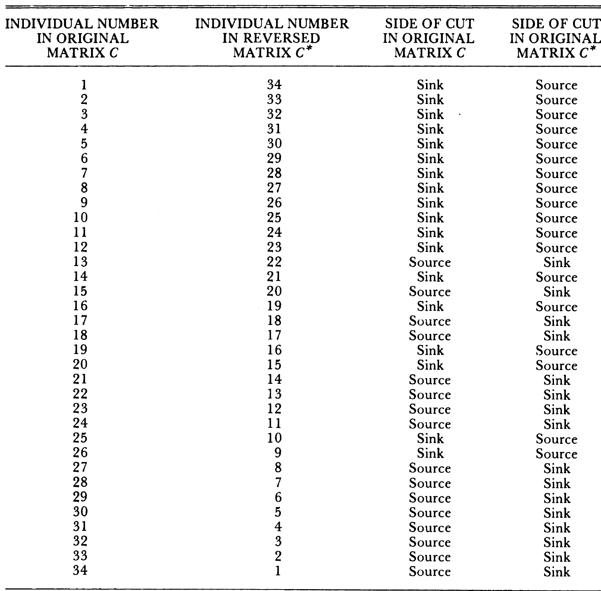
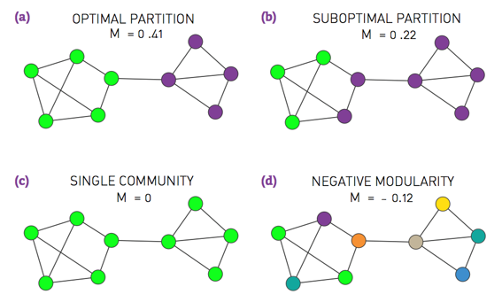
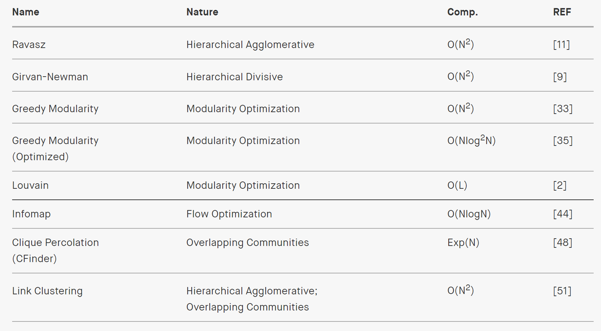

```{r setup, include=FALSE}
knitr::opts_chunk$set(echo = TRUE, fig.align = 'center', message = FALSE, warning = FALSE)
```


class: inverse, middle, center
# Network Community Detection
---
## Reading Materials

- [Barabasi, Albert-Laszlo. (2016). Network Science. Cambridge University Press. Chapter 9.](http://networksciencebook.com/chapter/9)

- Zachary, Wayne W. (1977). An information flow model for conflict and fission in small groups. *Journal of Anthropological Research* 33(4) : 452-473.

- Renshon, Jonathan. (2016). Status deficits and war. *International Organization* 70(3): 513-550.

- Gould, Roger V. (1991). Multiple Networks and Mobilization in the Paris Commune, 1971. *Americal Sociological Review* 56(6): 716-729. 

- Cruz, Cesi, Julien Labonne, and Pablo Querubin. (2020). Social network structures and the politics of public goods provision: evidence from the Philippines. *American Political Science Review* 114(2): 486–501

---
## Introduction: Belgium
```{r, out.width='700px', fig.align='center', echo=FALSE}

```
---
## Introduction: Belgium
- Population: 11.5 mil

- Bilingual: 59% Flemish (speak Dutch), 40% Waloons (French)

- Is the society so densely knitted together that nobody notices who is of what ethnic group?

- Or do the two groups minimize the interactions?
---
## Blondel et al. (2008)

- Applied a community finding algorithm to the call patterns of a big mobile phone operator.

- Goal: identify individuals who regularly talk to one another.
---
## Blondel et al. (2008)
```{r, out.width='500px', fig.align='center', echo=FALSE}

```

---
class: inverse, middle, center
#  Communities: the Basics
---
## Network Levels of Analysis

```{r, out.width='900px', fig.align='center', echo=FALSE}

```

---
## What Is A Community?

- A community is a locally dense connected subgraph. (Barabasi, 2016, 325)

  + All members of a community must be reached through other members of the same community (connectedness).
  
  + Nodes that belong to the same community have a higher probability of linking than nodes outside of the community
(density).

  + Examples: communities among the karate club members, communities of international states, communities of legislators, neighborhood communities.
  
- Note that these features do not uniquly define a community, just offer some guidelines.
  
---
## Cliques as Communities

A clique is a complete subgraph of *k*-nodes.
```{r, out.width='900px', fig.align='center', echo=FALSE}

```

- May be too restrictive.
---
## Strong and Weak Communities
Consider a connected subgraph $C$ of $N_c$ nodes.

*Internal degree, $k_i^{int}$* is the set of links of node *i* that connectes to the other nodes in the same community.

*External degree, $k_i^{ext}$* is the set of links of node *i* that connects to the rest of the network.

If $k_i^{ext}=0$, all neighbors of $i$ belong to $C$, and $C$ is a good community for $i$.

If $k_i^{int}=0$, all neighbors of $i$ belong to other communities, then $i$ should be assigned to a different community.


---
## Example

$k_i^{ext}=1$, $k_i^{int}=3$

```{r, out.width='300px', fig.align='center', echo=FALSE}

```
---
## Strong and Weak Communities

In a *strong community* each node of $C$ has more links within the community than with the rest of the graph, $k_i^{int}(C)>k_i^{ext}(C)$. In a *weak community,* the total internal degree of $C$ exceeds its total external degree, $k^{in}(C)>k^{out}(C)$.  

```{r, out.width='700px', fig.align='center', echo=FALSE}

```
---
## Number of Partitions

How many ways can we partition a network into 2 communities? 

Divide a network into two equal non-overlapping subgraphs, such that the number of links between the nodes in the two groups is minimized.

Two subgroups of size n1 and n2. Total number of combinations: $\frac{N!}{n_1!n_2!}$

- $N=10 \implies 256$ partitions
- $N=100 \implies 10^{26}$ partitions

If the number and size of the communities are unknown at the beginning, the number of possible partitions is a Bell Number. 

Brute force approach is unfeasible, need an algorithm.

---
## Zachary (1977)

- Karate club of 34 members; 

- 78 pairwise links between members who regularly interacted outside the club;

- A conflict between the club’s president and the instructor split the club into two.

- Today community finding algorithms are often tested based on their ability to infer these two communities from the structure of the network before the split.


---
## Zachary (1977)

- Maximum Flow Minimum Cut Procedure: divides network nodes into two subsets, one containing the source and the other, the sink. The edges connecting the two subsets, called *the cut.* The cut with the minimum sum of the capacities of all of its edges represents a bottleneck in the network. (464) 
---
## Zachary (1977)

```{r, out.width='500px', fig.align='center', echo=FALSE}

```
 
---
## Zachary (1977)

```{r, echo=FALSE, eval=TRUE, fig.align='center', out.width='350px'}
library(igraph) #Zachary's karate club dataset is built into the igraph package.
data(zachary)
karate <- make_graph("Zachary") 
mf<-max_flow(karate, source=V(karate)[1], target=V(karate)[34])
V(karate)$color<- ifelse(V(karate) %in%  mf$partition1, "red","pink")
plot(karate, edge.color="black", vertex.frame.color="black")
```
---
## Zachary (1977)

```{r}
mf$partition1
mf$partition2
```
---
## Other Ways to Partition Networks

- Modularity: a measure of the extent to which like is connected to like in a network.
  + A *greedy algorithm* iteratively joins nodes if the move increases the new partition's modularity.

```{r, out.width='600px', fig.align='center', echo=FALSE}

```
---
## The Girvan–Newman algorithm

Used in Cruz et al 2020

1. Calculate betweenness for all edges in the network

2. Remove the edge with the highest betweenness 

3. Recalculate betweenness for all edges affected by the removal

4. Repeat from step 2 until no edges remain

5. From the resulting dendrogram (the hierarchical mapping produced by gradually removing these edges), select the partition that maximizes network modularity
---
## Walktrap algorithm

- Relies on the idea that random walks on a graph tend to get “trapped” into densely connected parts corresponding to communities. 

- The algorithm a large number of random walks and groups together nodes that are tied together through those walks 

- See Pons and Latapy (2005) 

---
## Comparing Clustering Algorithms

```{r, out.width='900px', fig.align='center', echo=FALSE}

```
---
class: inverse, middle, center
# Lab

---

## Zachary (1977)

```{r, echo=TRUE, eval=FALSE, fig.align='center', out.width='350px'}
library(igraph) #Zachary's karate club dataset is built into the igraph package.
karate <- make_graph("Zachary") #loads the data from the igraph package
mf<-max_flow(karate, source=V(karate)[1], target=V(karate)[34])
V(karate)$color<- ifelse(V(karate) %in%  mf$partition1, "red","pink")
plot(karate, edge.color="black", vertex.frame.color="black")
mf$partition1
mf$partition2
```

---

```{r, echo=TRUE, eval=TRUE, fig.align='center', message=FALSE}
library(sna)
data(coleman)
#make into an igraph object
friends<-graph_from_adjacency_matrix(coleman[2,,], mode="undirected", diag=FALSE)
friends <- igraph::delete.vertices(friends , which(igraph::degree(friends)==0))
LO = layout_with_fr(friends) #Layout
cfg<-cluster_fast_greedy(friends)
modularity(cfg)
cfg$membership
```
---
## Communities in the Friendship Network
```{r, echo=TRUE, eval=TRUE, fig.align='center', message=FALSE}
plot(cfg, friends, layout=LO, main="Greedy")

```
---
## Other Examples:

```{r, echo=TRUE, eval=TRUE, fig.align='center', message=FALSE}
wc <- cluster_walktrap(friends) #community structure via short random walks
modularity(wc)
membership(wc)
```
---
## Fast Greedy Algorithm

```{r, echo=TRUE, eval=TRUE, fig.align='center', message=FALSE}
fg <- cluster_fast_greedy(friends) #Used in Renshon (2016)
modularity(fg)
fg$membership
```

---
## Egde Betweenness

```{r, echo=TRUE, eval=TRUE, fig.align='center', message=FALSE}
ceb<-cluster_edge_betweenness(friends)
modularity(ceb)
ceb$membership
```

---
## Comparing Clustering Algorithms

```{r, echo=TRUE, eval=TRUE, fig.align='center',out.width='300px', message=FALSE}
par(mfrow=c(2, 2), mar=c(0,0,1,0))
plot(cfg, friends, layout=LO, main="Greedy")
plot(wc, friends, layout=LO, main="Short Random Walks")
plot(fg, friends, layout=LO,main= "Fast Greedy")
plot(ceb, friends, layout=LO, main="Betweenness")
```

---
## Your Turn

- Apply these algorithms to find communities in the email data 
(Assignment 1)

```{r, eval=FALSE, echo=FALSE}
library(tidyverse)
email<-read.csv("../Homeworks/emailnet.csv")
employees<-read.csv("../Homeworks/EmployeeRecords.csv")
email_Jan6 <- email |> 
  filter(nrecipients < 54 & day == 6 & From != to) |> 
  mutate(reply=ifelse(str_detect(Subject, "RE:")==1,1,0),
         Subject = gsub("RE:", " ", Subject, ignore.case = TRUE)) %>%
  mutate(Subject = trimws(Subject),
         From=ifelse(From=="Sten.Sanjorge Jr.@gastech.com.tethys","Sten.Sanjorge Jr.@gastech.com.kronos",From), #CEOs email did not match
         to=ifelse(to=="Sten.Sanjorge Jr.@gastech.com.tethys","Sten.Sanjorge Jr.@gastech.com.kronos",to))
g = graph_from_data_frame(email_Jan6, directed=TRUE )

#Color vertices by employee type:
V(g)$Position<-NA
for (v in V(g)$name) {
    # Find the row in the data frame that corresponds to this vertex
    row <- employees[employees$EmailAddress == v, ]
    # Set attributes for the vertex
    # Replace 'attribute1', 'attribute2', etc. with your actual attribute names
    V(g)$Position[V(g)$name==v] <- row$CurrentEmploymentType
    # ... continue for other attributes ...
}

unique_pos<- sort(unique(V(g)$Position), decreasing = TRUE)
colors <- rainbow(6)
names(colors) <- unique_pos
vertex_colors <- colors[V(g)$Position]
par(mar=c(1, 1, 1,1))
plot(g, vertex.label=NA, vertex.size=10, edge.arrow.size=.2, edge.color=E(g)$color,vertex.color=vertex_colors)

legend("bottomleft", 
       legend = names(colors), 
       col = colors, 
       pch = 20, 
       cex = 0.8, 
       bty = "n",
       ncol=2)

```

---
## Challenge Yourself: Resume Data

As you were analyzing the email data, Tethys PD sent you the resume data that they were able to retrieve from GAStech servers. Scrape these resumes to identify each employee's education and previous employment. Use the `officer` packages to read each file and various `stringr` functions to extract the data you need. Then you can add the retrieved information to help identify additional connections among GAStech employees.

```{r, echo=TRUE, eval=FALSE}
library(officer)


myfiles<-list.files()
doc <- officer::read_docx(path = myfiles[1])
doc_text <- officer::docx_summary(doc)$text
doc_text <- paste(doc_text, collapse = " ")

```

---
## Helpful Functions from stringr

```{r, echo=TRUE, eval=FALSE}
library(stringr)

# Pattern to match everything after a specific word to a period.
pattern <- paste0("Education","\\s(.*?)\\.")
extracted_text <- str_extract(doc_text1,pattern)
extracted_text

# Pattern to match everything after a specific word
pattern <- paste0("Education", " .*")
extracted_text <- str_extract(doc_text1, pattern)

```
---
## Write a Loop to Extract Name and Educ


```{r, echo=TRUE, eval=FALSE}

Name<-NULL
Educ<-NULL
for (i in 1:length(myfiles)){
  doc <- officer::read_docx(path = myfiles[i])
  doc_text <- officer::docx_summary(doc)$text
  Name[i]<-myfiles[i] |> str_remove("Bio")|> str_remove("Resume")|> str_remove(".docx") |> 
    str_remove_all("[^A-Za-z0-9]") |> str_replace("(?<=\\p{Ll})(\\p{Lu})", " \\1")
  doc_text <- paste(doc_text, collapse = " ")
  if (str_detect(doc_text, "Education")==TRUE) {
  Educ[i]<-ifelse(str_detect(doc_text,"University of Tethys")==1,"University of Tethys",
  ifelse(str_detect(doc_text,"Tethys University")==1,"Tethys University",
  ifelse(str_detect(doc_text,"Abila Community College")==1,"Abila Community College",
  ifelse(str_detect(doc_text,"Barrington University")==1,"Barrington University",
  ifelse(str_detect(doc_text,"IT Tech University")==1,"IT Tech University",NA)))))
  }
 }

mydata<-cbind.data.frame("Name"=Name, "Educ"=Educ)


```
