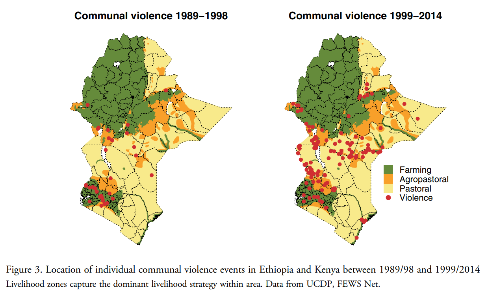
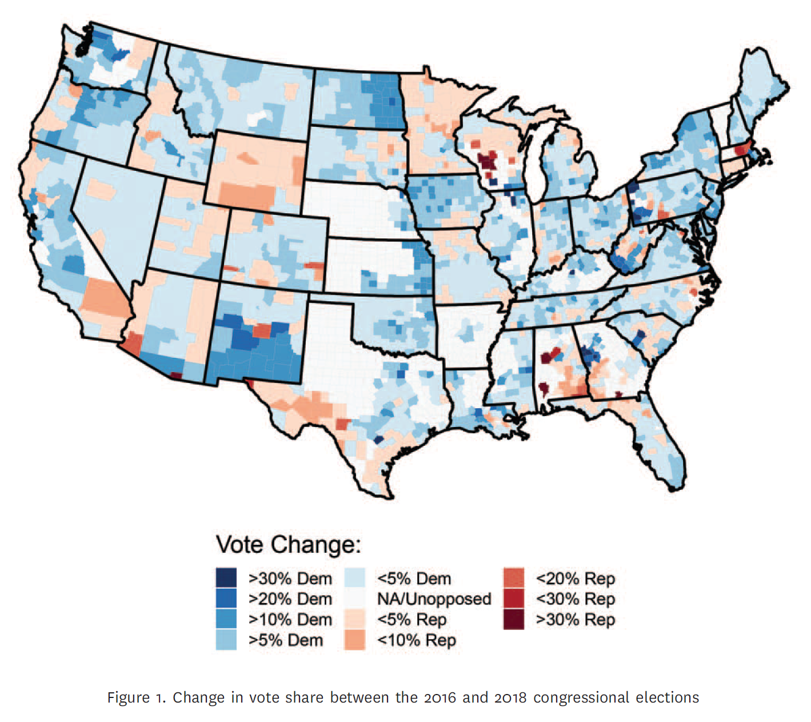
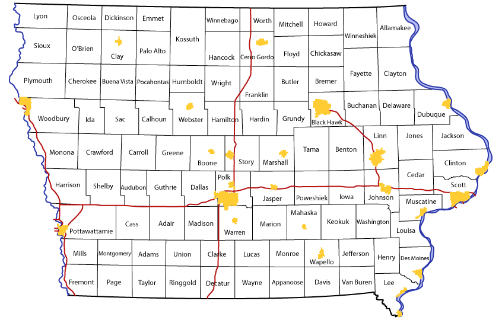
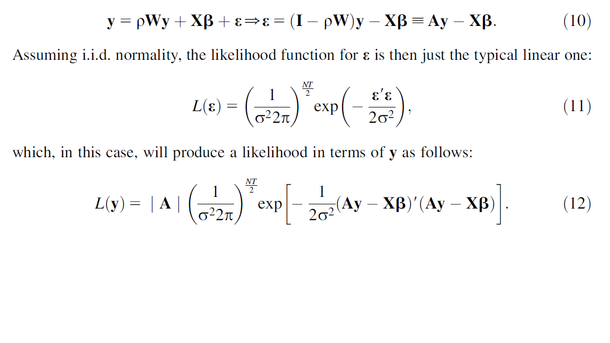

```{r  setup, message=FALSE, warning=FALSE, include=FALSE}
options(
  htmltools.dir.version = FALSE, # for blogdown
  width = 80,
  tibble.width = 80
)

knitr::opts_chunk$set(
  fig.align = "center",  warning=FALSE, message=FALSE
)

```


## Dependence in Observational Data

- Individuals are nested in social networks

    + Individual decisions are influenced by their friends.

- Provinces are surrounded by other provinces

    + Provinces mimic one another's policies

- Country-level outcomes are often a result of negotiations with other countries:
    
    + Economic or environmental policies
    
---
## Three Mechanisms for Spatial Dependence


- Common exposure---similarity in outcomes is driven by an exogenous factor that affects nearby units (the effect of earthquakes on housing prices)

- Homophily---similarity in outcomes is endogenous, units are similar because they self-select into the same outcome (e.g., partisan geo-sorting)

- Diffusion---nearby units affect each other through learning, imitation, etc (e.g., policy diffusion)

---


 

```{r, echo=F, out.width= "800px",fig.align="center"}

```

Source: van Weezel S. "On climate and conflict: Precipitation decline and communal conflict in Ethiopia and Kenya." *Journal of Peace Research*. 2019;56(4):514--528. 

---
## What Explains Clustering in Vote Change? 

```{r, echo=F, out.width= "600px",fig.align="center"}

```

Source: Chyzh, Olga V. and R. Urbatsch. 2021. "Bean Counters: The Effect of Soy Tariffs on Change in Republican Vote Share Between the 2016 and 2018 Elections."*Journal of Politics* 83 (1): 415--419.
  


---
## Common Exposure

Neighboring counties have similar vote shifts between elections because of their underlying similarities, e.g. demographics, political ideology,  etc.

$$Vote\_change= \beta_0+\beta_1Soy\_prod+\beta_2Urban_i+\beta_2Per16_i+\ldots +u_i,$$


---
## Homophily: Spatial X

Neighboring units tend to converge on outcomes because the causal variables (losses from China's soy tariffs) cluster by neighborhood locations (agricultural patterns).

$$Vote\_change_i= \beta_0+\beta_1Urban_i+\beta_2Soy\_prod_i+\\\beta_3medinc_i+\rho\sum\limits_{j\neq i}^{N}{w_{ij}\ Soy\_prod_j} +u_i,$$
where $\rho$ is the estimation parameter for spatial dependence, and $w_{ij}$ measures whether $i$ and $j$ are neighbors.

- This is a spatial-X regression. 

- $\sum\limits_{j\neq i}^{N}{w_{ij}\ Soy\_prod_j}$ is a spatially lagged independent variable measuring the average soy production in neighboring counties. 

- The coefficient $\rho$ is a measure of spatial homophily.

---

## Contiguity Matrix W

```{r, echo=F, out.width= "800px",fig.align="center"}

```


---
## Contiguity Matrix W

```{r, echo=F}
names<-c("Benton","Linn","Jones","Iowa","Johnson","Cedar")
mymat<-matrix(c(0,1,0,1,0,0,
                1,0,1,0,1,1,
                0,1,0,0,0,1,
                1,0,0,0,1,0,
                0,1,0,1,0,1,
                0,1,1,0,1,0),nrow=6,ncol=6)
dimnames(mymat)<-list(names,names)
mymat
```

---
## Row Standardized W

Divide by the row sum, so that each neighbor's influence decreases with the total number of neighbors.

```{r, echo=F}
round(mymat/apply(mymat,1,sum),2)
```

---


## Diffusion: Spatial Y

$$Vote\_change_i= \beta_0+\beta_1Urban_i+\beta_2Trump16_i+\\\beta_3medinc_i+\rho\sum\limits_{j\neq i}^{N}{w_{ij}\ Vote\_change_j} +u_i,$$
where $\rho$ is the estimation parameter for spatial dependence, and $w_{ij}$ measures whether $i$ and $j$ are neighbors.

- This is a spatial-Y regression. 

- $\sum\limits_{j\neq i}^{N}{w_{ij}\ Vote\_change_j}$ is a spatially lagged dependent variable measuring the average vote change in neighboring counties. 

- The coefficient $\rho$ is a measure of spatial dependence.


---

## Spatial Y Model

$$\textbf{y}= \rho\textbf{W}\textbf{y}+\textbf{X}\pmb{\beta}+\pmb{\epsilon},$$
- $\textbf{y}$ the dependent variable, is an N x 1 vector of cross sections stacked by period;

- $\rho$ is the spatial coefficient;

- $\textbf{W}$ is an N x N spatial-weighting matrix;

- $\textbf{X}$ contains N observations on k independent variables

- $\pmb{\beta}$ is a k x 1 vector of coefficients;

- $\pmb{\epsilon}$ is an N by 1 vector of stochastic components.

---
## Spatial Y Model

$$\begin{bmatrix}
y_{1} \\
y_{2} \\
y_{3} \\
\vdots \\
y_{N}
\end{bmatrix}
=
\rho
\begin{bmatrix}
0 & W_{12} &W_{13}& \cdots & W_{1N} \\
W_{21}& 0 &W_{23}& \cdots & W_{2N} \\
W_{31}& W_{32} &0 & \cdots & W_{3N} \\
\vdots & \ddots & \vdots & \ddots & \vdots \\
W_{N1} & W_{N2} & W_{N3} & \cdots & 0
\end{bmatrix}+\\
\begin{bmatrix}
x_{11} & x_{12} & \cdots & x_{1k} \\
x_{21} & x_{22} & \cdots & x_{2k} \\
\vdots & \vdots & \ddots & \vdots \\
x_{N1} & x_{N2} & \cdots & x_{Nk}
\end{bmatrix}
\begin{bmatrix}
\beta_1 \\
\beta_2 \\
\vdots \\
\beta_k
\end{bmatrix}+
\begin{bmatrix}
\epsilon_1 \\
\epsilon_2 \\
\vdots \\
\epsilon_{N}
\end{bmatrix}$$


---

## Spatial Lag Model

$$\textbf{y}= \rho\textbf{W}\textbf{y}+\textbf{X}\pmb{\beta}+\pmb{\epsilon},$$

By re-arranging, can isolate **y** on the left-hand side:

$$\textbf{y}= [\pmb{I_{N}}-\rho\textbf{W}_{N}]^{-1}\{\textbf{X}\pmb{\beta}+\pmb{\epsilon}\}$$
---
## Likelihood

```{r, echo=F, fig.align="center"}

```

---
## Other Types of Space

- Ideology

- International trade

- Alliances

- Other examples?

---
class: inverse, middle, center
# Lab
---
## Example: Spatial X

```{r, eval=T}

mydata<-read.csv("./data/soydata_cr.csv", header=TRUE) 


contigmat<-read.table("data/contigmat.txt") |> as.matrix()

row_totals <- rowSums(contigmat) 
# Check for counties with no neighbors
 which(row_totals == 0) 
 contigmat_W <- contigmat 
 nonzero_rows <- row_totals > 0 
 contigmat_W[nonzero_rows, ] <- contigmat[nonzero_rows, , drop = FALSE] / row_totals[nonzero_rows] 
 # Rows should sum to 1, except units with no neighbors 
 head(rowSums(contigmat_W))
 


```

---
## Naive model
```{r, eval=T}
 
#contigmat1<-contigmat/apply(contigmat,1,sum) #row-standardize
spatX<-t(mydata$ln_prod_bush12_cr%*%as.matrix(contigmat_W))
mydata$spatX<-spatX[,1]

#Naive model
summary(m1_naive<-lm( votech ~ ln_prod_bush12_cr + ln_gdpc_cr+ln_gdpc_sq_cr+perc_unemploy1317_cr+perc_HS_GED_cr+perc_BA_cr+urb2010_cr+ln_perc_black1317_cr+ln_perc_other_cr+ln_perc_latino1317_cr+ln_perc_foreign1317_cr+Rep16perc_cr  ,data = mydata, REML = FALSE))


```
---
## Example: Spatial X
```{r, eval=T}
#Spatial X model:
#M1
summary(m1_spX<-lm( votech ~ ln_prod_bush12_cr + ln_gdpc_cr+ln_gdpc_sq_cr+perc_unemploy1317_cr+perc_HS_GED_cr+perc_BA_cr+urb2010_cr+ln_perc_black1317_cr+ln_perc_other_cr+ln_perc_latino1317_cr+ln_perc_foreign1317_cr+Rep16perc_cr  +spatX,data = mydata, REML = FALSE))
```


---


## Spatial Regression

```{r, eval=F}
library(spdep)
library(spatialreg)

contigmat<-read.table("./data/contigmat.txt") 
contigmat<-as.matrix(contigmat)
W1<-mat2listw(contigmat, row.names = NULL, style="W", zero.policy = TRUE)
summary(W1$neighbours)

W2<-nb2listw(W1$neighbours, glist=NULL, style="W", zero.policy=TRUE)

#M1:
spY1<-lagsarlm(votech ~ ln_prod_bush12_cr + ln_gdpc_cr+ln_gdpc_sq_cr+perc_unemploy1317_cr+perc_HS_GED_cr+perc_BA_cr+urb2010_cr+ln_perc_black1317_cr+ln_perc_other_cr+ln_perc_latino1317_cr+ln_perc_foreign1317_cr+Rep16perc_cr  , data=mydata, W2, zero.policy=TRUE)
summary(spY1)

saveRDS(spY1,"m3.RDS")
```

---
## Interpretation

Set up a hypothetical scenario:

- Expected change in vote change that would result from increasing urbanization in Johnson county, IA

```{r, eval=T}
names<-c("benton county","cedar county","iowa county","johnson county","jones county","linn county")
mymat<-matrix(c(0,0,1,0,0,1,
                0,0,0,1,1,1,
                1,0,0,1,0,0,
                0,1,1,0,0,1,
                0,1,0,0,0,1,
                1,1,0,1,1,0),nrow=6,ncol=6)
dimnames(mymat)<-list(names,names)
mymat<-round(mymat/apply(mymat,1,sum),2)
d<-dplyr::filter(mydata, state=="IA" & county %in% names) 

```

---
## Set up A Comparison by Shocking One of the Units on X 

```{r, eval=T, echo=T}
m3<- readRDS("m3.RDS")

I<- diag(6)
X0<-as.matrix(cbind(1,d$ln_prod_bush12_cr,d$ln_gdpc_cr, d$ln_gdpc_sq_cr, d$perc_unemploy1317_cr, d$perc_HS_GED_cr, d$perc_BA_cr, d$urb2010_cr, d$ln_perc_black1317_cr, d$ln_perc_other_cr, d$ln_perc_latino1317_cr, d$ln_perc_foreign1317_cr, d$Rep16perc_cr))

urb<-d$urb2010_cr
urb[4]<-1
X1<-as.matrix(cbind(1,d$ln_prod_bush12_cr,d$ln_gdpc_cr, d$ln_gdpc_sq_cr, d$perc_unemploy1317_cr, d$perc_HS_GED_cr, d$perc_BA_cr, urb, d$ln_perc_black1317_cr, d$ln_perc_other_cr, d$ln_perc_latino1317_cr, d$ln_perc_foreign1317_cr, d$Rep16perc_cr))
A<-solve(I-coef(m3)[1]*mymat)

mycoef<-as.matrix(coef(m3))

Yhat0<- A%*%(X0%*%mycoef) #may need to remove first element of mycoeff[-1]; keep this for knitting (RDS works different)
Yhat1<- A%*%(X1%*%mycoef) #may need to remove first element of mycoeff[-1]

Y_ch<-Yhat1-Yhat0
sim<- cbind.data.frame(names,Y_ch)

```
---
## Visualize the Effect

```{r, eval=TRUE, echo=FALSE}
library(tidyverse)
library(mapdata)
library(maps)
#Set theme options:
theme_set(theme_grey() + theme(axis.text=element_blank(),
                               axis.ticks=element_blank(),
                               axis.title.x=element_blank(),
                               axis.title.y=element_blank(),
                               panel.grid.major = element_blank(),
                               panel.grid.minor = element_blank(),
                               panel.border = element_blank(),
                               panel.background = element_blank(),
                               legend.position="none"))

sim <- sim|> mutate(names=str_remove(names, " county"))
states <- map_data("county") |> dplyr::filter(region=="iowa") |>
  left_join(sim, by=c("subregion"="names")) 

brks <- quantile(states$Y_ch,
                 probs = seq(0, 1, 0.2),
                 na.rm = TRUE)

ggplot() +
  geom_polygon(
    data = states,
    aes(long, lat, group = group, fill = Y_ch),
    color = "black",
    linewidth = 0.5
  ) +
  coord_map() +
  scale_fill_stepsn(
    colors = hcl.colors(5, "Reds"),
    breaks = brks,
    na.value = "grey90"
  )

```


---
## Making Maps

```{r}
library(tidyverse)
library(mapproj)
library(maps)
library(mapdata)
states <- map_data("state")

head(states)
```

---
## What You Need

- Latitude/longitude points for all map boundaries

- Need to know to which boundary/state lat/long points belong

- Need to know the order to connect points within each group

---
## A Basic (Rather Hideous) Map

```{r}
library(ggplot2)
ggplot() +  geom_path(data=states, aes(x=long, y=lat, group=group),color="black", size=.5)

```

---
## A Bit Nicer of a Map

```{r, eval=FALSE}
#Set theme options:
theme_set(theme_grey() + theme(axis.text=element_blank(),
                               axis.ticks=element_blank(),
                               axis.title.x=element_blank(),
                               axis.title.y=element_blank(),
                               panel.grid.major = element_blank(),
                               panel.grid.minor = element_blank(),
                               panel.border = element_blank(),
                               panel.background = element_blank(),
                               legend.position="none"))
ggplot() +  geom_path(data=states, aes(x=long, y=lat, group=group),color="black", size=.5)+ coord_map()
```

---
## Polygon instead of Path

```{r}
ggplot() +  geom_polygon(data=states, aes(x=long, y=lat, group=group),color="black", size=.5)+ coord_map()
```


---
## Incorporate Information About States

- Add other geographic information (e.g., counties) by adding geometric layers to the plot

- Add non-geographic information by altering the fill color for each state 

    - Use geom = "polygon" to treat states as solid shapes to add color
    
    - Incorporate numeric information using color shade or intensity
    
    - Incorporate categorical informaion using color hue
    
---
## Categorical Information Using Hue

If a categorical variable is assigned as the fill color then ggplot will assign different hues for each category. 

Let’s load in a state regions dataset:

```{r}
statereg<- read.csv("./data/statereg.csv")

head(statereg)

```

---
## Join the Data

```{r}
states.class.map <- left_join(states, statereg, by = c("region" = "State"))
head(states.class.map)
```

---
## Plot the Regions

```{r}
ggplot() +  geom_polygon(data=states.class.map, aes(x=long, y=lat, group=group, fill = StateGroups), colour = I("black"))+ coord_map()+theme(legend.position="bottom")
```


---
## Your Turn (Advanced)

1. Read in the animal.csv data:

```{r, eval=FALSE}
animal <- read.csv("./data/animal.csv")
```

2. Plot the location of animal sightings on a map of the region
3. On this plot, try to color points by class of animal and/or status of animal
4. **Advanced**: Could we indicate time somehow?


```{r, echo=F, eval=FALSE}
ggplot() +
    geom_path(data = states, aes(x = long, y = lat, group = group)) +   geom_point(data = animal, aes(x = Longitude, y = Latitude)) +   
    geom_point(aes(x, y), shape = "x", size = 5, data = rig) + 
    geom_text(aes(x, y), label = "BP Oil Rig", size = 5, data = rig, hjust = -0.1) + 
    xlim(c(-91, -80)) + 
    ylim(c(22, 32)) + coord_map()
```


