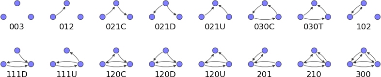
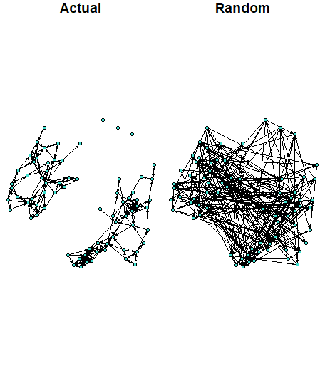
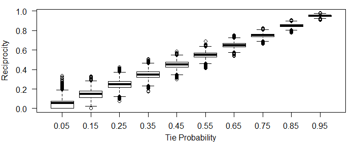

```{r setup, include=FALSE}
knitr::opts_chunk$set(echo = TRUE, fig.align = 'center', message = FALSE, warning = FALSE)
```

class: inverse, middle, center
# Why Do We Care About Transitivity?

---
## Granovetter (1973) Theory.
- Ties are not binary, but vary in strength (i.e. absent, weak, strong).
- The stronger the tie between A and B, the larger the overlap of individuals in A's and B's networks.
   + As individuals have limited time to spend with their contacts, some contacts are bound to be brought into interaction;
   + Homophily, i.e. the friends of A are more likely to know one another as they may have common interests.
- The forbidden triad: A and B are strongly linked, and A and C are strongly linked, yet C and B do not share a tie.
- No strong tie is a bridge (the only path between two points), i.e. all the bridges are weak ties.
- <span style="color: blue;"> **Removal of a weak tie does more "damage" to transmission of information within the network than removal of a strong tie.**</span>
---

## Implications for Diffusion Studies.
-  Information (e.g. rumors) traverses greater social distance when passed through weak ties. Long information paths, though, are less useful (information is distorted as it passes through additional links).
- Diffusion studies should focus on weak ties, i.e. when asking respondents for their contacts, not limit the number of choices allowed.
   + *What does this imply for tracing of disease spread?* (Is contagion likely to originate with strong or weak ties?)
- Many studies of diffusion of innovation tend attribute  adoption to *central* contacts, i.e. correlate the time of diffusion with network centrality. In actuality, what matters may be not the number of ties (centrality), but the number of *weak ties.*
---

## Empirical Evidence
- The "six degrees of separation" Milgram experiment (actually 2 to 10 links out of 12--33% of completed chains)

- Survey respondents who recently found a new job (through contacts) tended to do so through contacts who were only marginally included in their current network. In most cases through, the initial source (employer) was only one or two links removed (relatively short paths).
- It is more difficult to organize a cliquish community than one with multiple layers of cross-personal ties (Boston West End).

---
class: inverse, middle, center  
# Modeling Approaches

---
## Transitivity

A relation "$o$" is known as *transitive* if $a\ o\ b$ and $b\ o\ c$ together imply that $a\ o\ c$. 

Nodes $a$, $b$, and $c$ form a *transitive triad* or a *closed triangle* if all pairwise combinations of these nodes share an edge. 

An *intransitive triad* is a triple of nodes among which a two-path can be constructed and there is no edge from node 1 to node 3.

A *vacuously transitive* triad is a triple of nodes, such that one cannot construct a two-path among them.


```{r, out.width='500px', fig.align='center', echo=FALSE}

```
---
class: inverse, middle, center
# Measuring Transitivity

---
## Clustering Coefficient

A *clustering coefficient, C,* is the fraction of closed paths of length two out of total (realized) paths of length two.

$C=\frac{\text{number of closed paths of length two}}{\text{number of paths of length two}}=\frac{\text{(number of triangles)}\times6}{\text{number of paths of length two}}$

```{r, echo=TRUE, eval=TRUE, message=FALSE}
library(igraph)
library(sna)
data(coleman) #Use friendship data
coleman<-coleman[1,,]
#convert to an -igraph- object, we'll treat it as a directed graph for now:
coleman<-graph_from_adjacency_matrix(coleman, mode="directed", diag=FALSE) 
transitivity(coleman) #Note that -igraph- default is an undirected graph
sna::gtrans(as.matrix(get.adjacency(coleman))) #The directed equivalent

```
---
## Clustering Coefficient: Interpretation

Clustering coefficient, $C$ is $0$ if none of the neighbors of node $i$ link to each other. 
  
- That's what Granovetter (1979) refers to as the "forbidden triad".

$C=1$ if the neighbors of node $i$ form a complete graph, i.e. they all link to each other.

$C_i$ is the probability that two neighbors of node $i$ link to each other. Consequently, a $C=.5$ means that there is a $50\%$ chance that two neighbors of a node are linked.

Is the clustering coefficient of $0.46$ large or small?
---
## Break-Out Groups

Given the number of nodes and edges within the friendship network, is the value of 0.46 greater or smaller than you would expect at random? What does your intuition tell you? Why?

- Use `summary()`, `vcount()`, and `gsize()` to find the number of nodes and edges in the friendship network.

```{r}
summary(coleman)
vcount(coleman)
gsize(coleman)
```


---
## A Simulation to Test Your Intuition.
Steps:

1. Simulate 1000 random graphs with the same number of nodes and edges as the friendship network.
2. Calculate the clustering coefficient for each of the 1000 graphs.
3. Plot the distribution of clustering coefficients in these simulated networks to see what proportion is as large/small as 0.46.
  + Question: How many of the simulated networks would have to have a clustering coefficient of 0.46 or greater in order for us to reject the null that the friendship network we observe has no greater clustering than we would expect at random? What does this remind you of?

---
## Simulate 1000 random graphs 
Steps:

1. Simulate 1 random graph:
<ol type="i">
    <li>Start with N isolated nodes</li>
    <li>Select a node pair and generate a random number between 0 and 1. If the random number is less than $p$, connect the selected node pair with a link, otherwise leave them disconnected.</li>
    <li>Repeat step ii for each unique node pair.</li>
    </ol>
    - Note: Network generated this way are called *random graphs* or an *Erdos-Renyi* networks (after two mathematicians that studied their properties).
2. Repeat step 1 1000 times to obtain 1000 networks.
---

## Simulate One Random Graph:

Need: 

- number of nodes $N$ in the friendship network
- the probability that each two nodes are connected $p$

```{r}
vcount(coleman) #returns the number of vertices
gsize(coleman) #returns the number of edges

#or
summary(coleman)
```
---
## Simulate One Random Graph (Continued)

- Let $p$ denote the probability that any two vertices are connected by an edge.  Then, we can calculate the value of $p$ in the friendship network as the number of observated edges over the number of all possible edges.
  + With 73 vertices, we have $73*72/2=2628$ possible undirected edges or $73*72=5256$ directed edges, as each vertex can connect to each other vertex, but there are no self-loops. (Since the friendship network is directed, let's focus on simulating a directed network.)
  + Then $p=243/5256=0.046$. Does this value seem high or low? Note that $p$ is the clustering coefficient of a random network with a given number of nodes and edges.
---
## Simulate One Random Graph (Continued)
Now can implement Steps i-iii:

```{r, echo=TRUE, eval=TRUE, message=FALSE}
set.seed(45765) #since a simulation involves randomness, set the seed for 
#reproducibility.
#Step i--start with a matrix of 73 unconnected nodes.
N=73 #Set the number of nodes:
rnet<-matrix(0, nrow=N,ncol=N) 

#Step ii:
p<-243/5256
for (i in 1:N) {
  for (j in 1:N){
    if (i!=j) {
    rnet[i,j]=as.numeric(runif(1)<p)
    }}}

```
---
## Check Our Work

```{r, echo=TRUE, eval=TRUE, message=FALSE}
summary(g<-graph.adjacency(rnet, mode="directed", weighted=NULL))
sna::gtrans(as.matrix(get.adjacency(g))) #The directed clustering coefficient

```
---
## Your Turn

Plot the original and the random networks side by side:
```{r, out.width='500px', fig.align='center', echo=FALSE}

```
---

## Simulate 1000 random graphs

Repeat Step ii 1000 times. Rather than saving all 1000 of the simulated networks, let's calculate and save the clustering coefficient from each.

```{r, echo=TRUE, eval=TRUE, message=FALSE}

cc<-rep(NA,1000)

for (k in 1:1000){
rnet<-matrix(0, nrow=N,ncol=N) 
for (i in 1:N) {
  for (j in 1:N){
    if (i!=j) {
    rnet[i,j]=as.numeric(runif(1)<p)
    }}}
cc[k]<-sna::gtrans(as.matrix(get.adjacency(graph.adjacency(rnet, mode="directed", weighted=NULL)))) #The directed clustering coefficient
}

```
---
## Plot the Distribution of the Clustering Coefficients

```{r, echo=TRUE, eval=TRUE, message=FALSE, out.width='200px', fig.align='center'}

library(ggplot2)
#Set theme options:
theme_set(theme_grey() + theme(panel.background = element_rect(fill = NA, 
        color = 'black'))+ theme(axis.text=element_text(size=10),
					axis.title=element_text(size=12,face="bold")))

qplot(x=cc, geom="density")+geom_vline(aes(xintercept=.46),
    linetype=2)+scale_x_continuous("Transitivity", limits=c(0,.5))

```
---
## Make Inferences:

What proportion of the 1000 networks simulated under the null have the clustering coefficient as extreme as the one in the friendship network?

Can we reject the null that any clustering in the friendship network is random?

Congratulations! You just ran your first ERGM!

---
class: inverse, middle, center
# Reciprocity
---
## Reciprocity

In a *directed* network, we may observe loops of length two --- a pair of vertices between which there are directed edges running in both directions.

```{r, echo=FALSE, eval=TRUE, message=FALSE, out.width='500px', fig.align='center'}
set.seed(11112)
el <- matrix( c("1", "2", "2", "3","2","4","2","5","5","2","5","6","7","5"), nc = 2, byrow = TRUE)
g<-graph_from_edgelist(el)
V(g)$color <- ifelse(V(g)$name %in% c("5", "2"), "turquoise", "azure1")
plot(g, edge.curved=.2, edge.arrow.size=1, edge.color="black", ,vertex.label=NA)
```
---
## Reciprocity

The frequency of loops of length two is measured by the *reciprocity,* and tells you how likely it is that a vertex that you point to also points back to you.

If there is a directed edge from vertex $i$ to vertex $j$ in a directed network, and there is also an edge from $j$ to $i$, then we say that the edge from $i$ to $j$ is *reciprocated*.

*Reciprocity*, $r$, is defined as the fraction of edges that are reciprocated.
---
## Reciprocity


$$
\begin{equation}
\text{Reciprocated Ties}  = \sum_{i=1}^n \sum_{j=1}^n g_{ij}g_{ji}
\end{equation}
$$
$$
\begin{equation}
\text{Total Ties} = \sum_{i=1}^n \sum_{j=1}^n g_{ij}
\end{equation}
$$ 
$$
\begin{equation}
r = \frac{\text{Reciprocated Ties}}{\text{Total Ties}}
\end{equation}
$$
Where $n$ is the number of nodes, and $g_{ij}$ is a tie indicator.
---
## Example

There are seven directed edges in this network, and four of them are reciprocated, so the reciprocity is $r=\frac{4}{7}=0.57$.

```{r, echo=FALSE, eval=TRUE, message=FALSE, out.width='500px', fig.align='center'}
set.seed(11712)
el <- matrix( c("1", "2", "1", "4","2","3","3","2","3","1","4","1","4","3"), nc = 2, byrow = TRUE)
g<-graph_from_edgelist(el)

plot(g, edge.curved=.2, edge.arrow.size=1, edge.color="black", vertex.color="turquoise")

```

---
## Calculating Reciprocity

```{r, echo=TRUE, eval=TRUE, message=FALSE}
library(igraph)
library(sna)
data(coleman) #Use friendship data
coleman<-coleman[1,,]
#convert to an -igraph- object, we'll treat it as a directed graph for now:
coleman<-graph_from_adjacency_matrix(coleman, mode="directed", diag=FALSE) 
reciprocity(coleman) #Note that -igraph- default is an undirected graph

```

---
## Reciprocity in Random Networks
Just like transitivity (remember our simulation above), reciprocity in a network depends, in part, on the network's density.  As the network grows denser (each pair of nodes has a greater probability of being connected), the probability that any two nodes will share a reciprocated tie also increases.


```{r, echo=FALSE, eval=TRUE, message=FALSE, out.width= "600px",fig.align="center"}

```

---
## Your Turn
Follow the steps from the transitivity example to test whether the level of reciprocity in the friendship network ($r=0.51$) is greater than what you would expect it to be if the network was random. Generate 1000 random networks with the same number of nodes, $N$, and the same probability of any two nodes forming a link, $p$, as those in the observed friendship network. Plot the distribution of the values of reciprocity for these 1000 networks and compare it with the value of $r=0.51$.

---
## Distribution of Reciprocity in Random Networks
```{r, echo=FALSE, eval=TRUE, message=FALSE, out.width= "500px",fig.align="center"}
rec<-readRDS("data/rec.rds")
#Set theme options:
theme_set(theme_grey() + theme(panel.background = element_rect(fill = NA, 
        color = 'black'))+ theme(axis.text=element_text(size=10),
					axis.title=element_text(size=12,face="bold")))
qplot(x=rec, geom="density", )+geom_vline(aes(xintercept=.51),
      linetype=2)+scale_x_continuous("Reciprocity", limits=c(-.1,.55))
```
---
## Are Real Social Network Random?

No! We have shown that the friendship network differs from a random network both in terms of transitivity and reciprocity (and likely in many other ways).

Inferential network analysis---covered in the remainder of this class---consists of identifying important features of real networks by comparing observed real networks to random networks.

