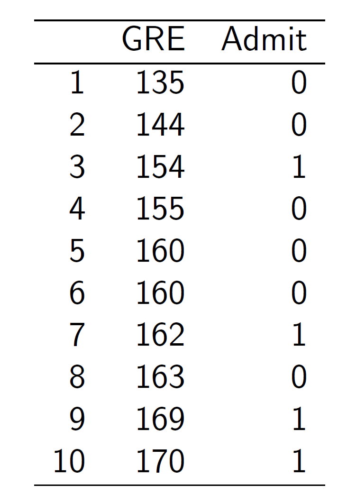
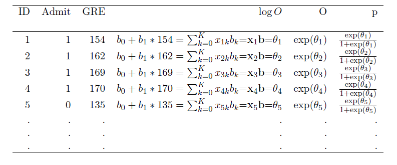
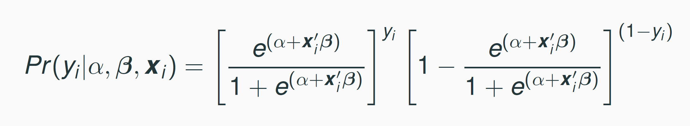
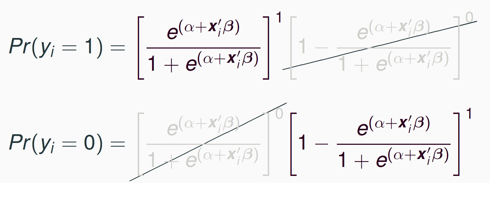
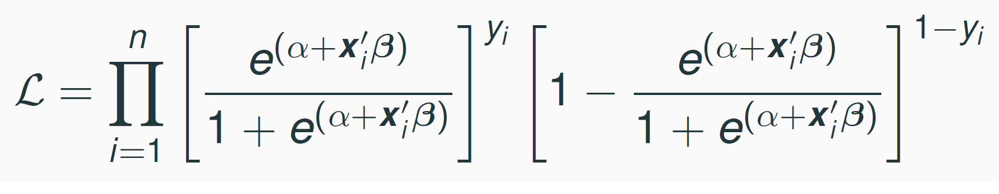
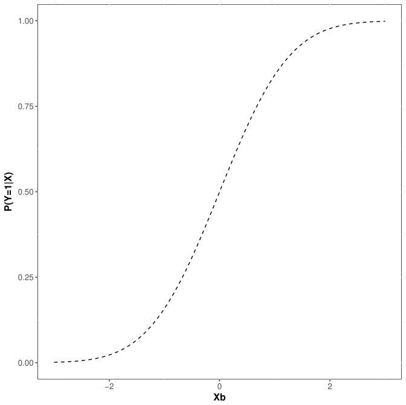
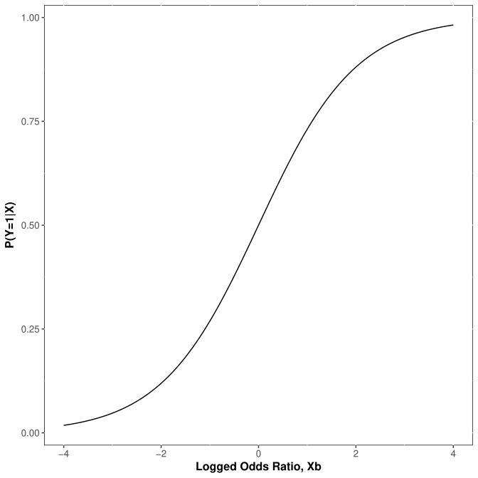
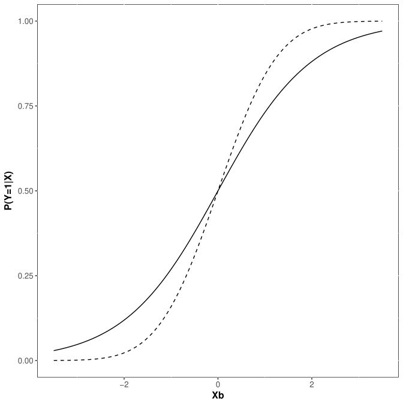
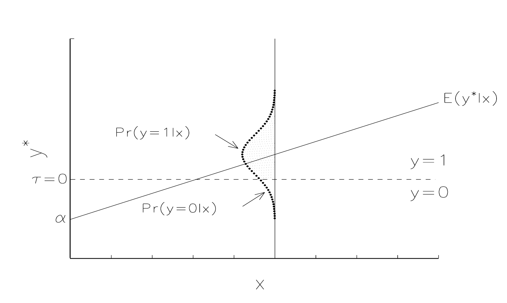
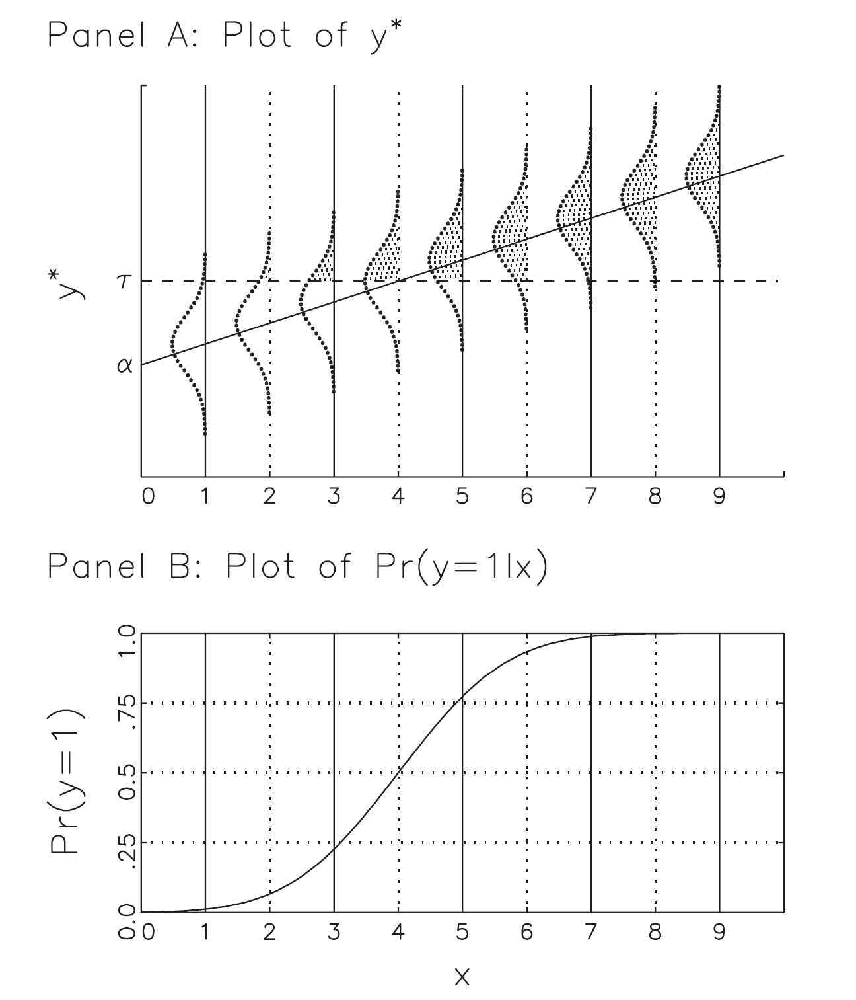

```{r  setup, message=FALSE, warning=FALSE, include=FALSE}
options(
  htmltools.dir.version = FALSE, # for blogdown
  width = 80,
  tibble.width = 80
)

knitr::opts_chunk$set(
  fig.align = "center",  warning=FALSE, message=FALSE
)

library(kableExtra)
library(ggplot2)
library(tidyverse)
library(conflicted)

```

## Agenda

- Logistic Regression

- Odds vs. Probabilities

- Maximum Likelihood Estimation

- Probit


---
## Why Logit?

- An alternative to the linear probability model

- Constraints the range of $\hat{y}$ to plausible values (between 0 and 1).

- Accounts for error heteroskedasticity in estimating standard errors.
---

## Binary Dependent Variable

Consider the following model:

$$
Heart Attack = \beta_0+ \beta_1 Aspirin+u
$$

- Problem: *Heart Attack* takes on binary values of 0 (no heart attack) and 1 (heart attack)

- Goal: rather than fitting a line, fit a curve such that the possible values are contrained between 0 and 1.

---
## Goal

```{r, echo=FALSE, eval=TRUE, out.width= "500px"}
set.seed(78856)
x<-rnorm(50,0,2)
epsilon<- rnorm(50,0,1)
xb<-.5+2*x+epsilon
y_star<-(exp(xb))/(1+exp(xb))
y<-as.numeric(y_star>.5)

binomial_smooth <- function(...) {
  geom_smooth(method = "glm", method.args = list(family = "binomial"), ...)
}

ggplot(data=cbind.data.frame(x,y),aes(x=x, y=y))+geom_point(size=2) + scale_y_continuous(breaks=c(0,1))+geom_smooth(method = "lm", se = FALSE, color="gray", linetype=2, alpha=.9)+
  binomial_smooth(se = FALSE, linetype=2)+
  scale_x_continuous(limits=c(-3,3))+theme_bw()

```
---
## Need to Transform Y

- While *Heart Attack* is binary, the *odds of having a heart attack*, $O$,  are continuous and take on values between 0 and $+\infty$, $0<O<+\infty$

---

## Calculating Odds

```{r, echo=F}
mytable<-rbind(c(104, 10933,11037),c(189, 10845,11034),c(293, 21778, 22071))
row.names(mytable)<-c("Aspirin","Placebo","Total")

kable(mytable, col.names =c("Heart Attk", "No Heart Attk", "Total"))
```


$$O(HA|Aspirin)=\frac{104}{10933}=0.0095$$
$$O(HA|\neg Aspirin)=\frac{189}{10845}=0.0174$$


---
## Need to Transform Y

- Even better, the *log(odds of heart attack)* are also continuous and take on values between $-\infty$ and $+\infty$.

- If we transform our DV from *Heart Attack* to *log(Odds of Heart Attack)*, we can use OLS to estimate it, then apply a reverse transformation to interpret the results:

$$
log(Odds\; of\; HA) = \beta_0+ \beta_1 Aspirin
$$


---
## Calculating Odds

Can also calculate odds from probabilities:
$$P(HA|Aspirin)=\frac{104}{11037}=0.0094$$
$$P(HA|\neg Aspirin)=\frac{189}{11034}=0.0171$$

$$
\begin{align}
O(HA|Aspirin)&=\frac{P(HA|Aspirin)}{P(\neg HA| Aspirin)}=\frac{P(HA|Aspirin)}{1-P(HA|Aspirin)}\\&=\frac{0.0094}{1-0.0094}=0.0095
\end{align}
$$


And probabilities from odds:

$$
P(HA|Aspirin)=\frac{O(HA|Aspirin)}{1+O(HA|Aspirin)}=\frac{0.0095}{1+0.0095}=0.0094
$$

- This is the formula to convert the results of the $logged(odds)$ regression to probabilities.

---
## Logistic Regression


$$\begin{align}
&\log(O(HA|Asp)) =\log\left(\frac{P(HA|Asp)}{1-P(HA|Asp)}\right)= \beta_0+ \beta_1 Aspirin\\
&O(HA|Asp) = \frac{P(HA|Asp)}{1-P(HA|Asp)}=e^{(\beta_0+ \beta_1 Aspirin)}\\
&P(HA|Asp)=\frac{e^{(\beta_0+ \beta_1 Aspirin)}}{1+e^{(\beta_0+ \beta_1 Aspirin)}}\\
&P(\neg HA|Asp)=1-\frac{e^{(\beta_0+ \beta_1 Aspirin)}}{1+e^{(\beta_0+ \beta_1 Aspirin)}}
\end{align}$$
Or, in general terms:

$$
\begin{align}
&P(Y=1|X)=\frac{e^{(\beta_0+ \beta_1 X)}}{1+e^{(\beta_0+ \beta_1 X)}}\\
&P(Y=0|X)=1-\frac{e^{(\beta_0+ \beta_1 X)}}{1+e^{(\beta_0+ \beta_1 X)}}
\end{align}
$$
---
## Example 2: Effect of GRE Scores on Admission


```{r, echo=F, out.width= "300px",fig.align="center"}

```

---
## Effect of GRE Scores on Admission

Suppose we want to estimate the following model:

$$
\text{P(Admit=1|GRE)}=logit(\alpha+\beta_1\text{GRE})
$$
Problem: how can we find $\alpha$ and $\beta_1$?

---
## Maximum Likelihood Estimation

[1] Write out the probability for each observation (called "likelihood"):
```{r, echo=F, out.width= "700px",fig.align="center"}

```


[2] The joint probability (called "the joint likelihood") of all the probabilities (assuming independent observations) is the product of these probabilities:

$$
\prod{p_i^{y_i}(1-p_i)^{(1-y_i)}}
$$
---
## Likelihood

```{r, echo=F, out.width= "500px",fig.align="center"}





```

---
## Maximum Likelihood Estimation

$$
\prod{p_i^{y_i}(1-p_i)^{(1-y_i)}},
$$
where $p_i=\frac{e^{(\beta_0+ \beta_1 x_i)}}{1+e^{(\beta_0+ \beta_1 x_i)}},$

- Unlike with OLS, where we calculated $\beta_k$ using the formulae we derived, we find $\beta_k$ using numerical optimization (essentially by guessing).

- To help computer optimizers (the product of $p_i$ can become very small), we take advantage of the fact that the maximum of the product and the logged product are the same, and take the log of the joint likelihood:


$$
log(\prod{p_i^{y_i}(1-p_i)^{(1-y_i)}})=\sum{y_ilog(p_i)}+\sum{(1-y_i)log(1-p_i)},
$$
---
class: inverse, middle, center
# A Latent Variable Model for Binary Variables
---
## Your Turn

Using R, the z-table, or Google, find the p-values that correspond to the following
z-scores: -3,-2.5, -2, -1.5, -1, -0.5, 0, 0.5, 1, 1.5, 2, 2.5, 3. What do
these values tell you? Use these values to sketch (yes, on paper with a pencil!) the cumulative density function for the normal distribution.
---
## Normal CDF
```{r, echo=F, out.width= "500px",fig.align="center"}

```

---
## Logistic CDF
```{r, echo=F, out.width= "500px",fig.align="center"}

```
---
## Both
```{r, echo=F, out.width= "500px",fig.align="center"}

```


---
## Another Way to Think of BRMs

- Suppose there is an unobserved or *latent* variable $y^*$ ranging from $-\infty$ to $+\infty$ that generates the observed $y$. 

- Observations with larger values of $y^*$ are observed as $y=1$, while those with smaller values of $y^*$ are observed as $y=0$.

    - E. g., consider college admissions decisions or civil wars
    
- Assume that the latent $y^*$ is linearly related to the observed $x$s through the structural model:

$$
y^*_i=\pmb{x}_i\pmb{\beta}+\epsilon_i
$$
---
## A Latent Variable Model

The latent $y^*$ is linked to the observed binary variable $y$ by the measurement equation:

$$\begin{equation}
y_i=\begin{cases}{1 \; \text{  if } y^*_i>\tau\\ 
0 \; \text{  if } y^*_i\leq \tau}
\end{cases}
\end{equation}$$

where $\tau$ is the threshold or cutpoint. Assume $\tau=0$.

- Since $y^*$ is unobserved, we use ML estimation.

- Assume $E(\epsilon| \textbf{x})=0$ and that the error is normally distributed with variance $Var(\epsilon| \textbf{x})=1$. 

    - This assumption is arbitrary, but it is necessary only for estimation. The final results do not depend on it.

---

## A Latent Variable Model

```{r, echo=F, out.width= "800px",fig.align="center"}

```

---
## A Latent Variable Model

- On average, we observe $y=1$ when $E(y^*| x)> 0$ and $y=0$ otherwise.

      - Even when $E(y^*| x)> 0$, it is possible to observe $y=0$, especially is the error is large and negative. 

- Since $y=1$ when $y^*>0$:

$$\begin{align}
P(y=1| \textbf{x})&= P(y^*>0| \textbf{x})\\&=P(\textbf{x}\pmb{\beta}+\epsilon>0 \;|\;\textbf{x})\\
&=P(\epsilon>-\textbf{x}\pmb{\beta}\;|\;\textbf{x})\\
&=P(\epsilon\leq \textbf{x}\pmb{\beta}\;|\;\textbf{x})\\
&=\Phi(\textbf{x}\pmb{\beta})
\end{align}$$
- Note that we must change the direction of the inequality in step 4, because the normal cdf expresses the probability of a variable being less than some value.

- Note that $\Phi(\textbf{x}\pmb{\beta})$ stands for the normal cdf.

- Congratulations, we just derived a probit regression.

---

## Plot of $y^*$ and P(y=1| x) in the BRM

```{r, echo=F, out.width= "400px",fig.align="center"}

```
    
---
## Probit Likelihood

Define $p_i$ as the probability of observing whatever value of $y$ was actually observed for a given observation:

$$\begin{equation}
p_i=\begin{cases}{P(y=1\;|\;\textbf{x}_i) \; \text{  if } y_i=1 \text{ is observed}\\ 
1-P(y=1\;|\;\textbf{x}_i) \; \text{  if } y_i=0 \text{ is observed}}
\end{cases}
\end{equation}$$

Then, as before, the likelihood is the product of these probabilities:

$$\begin{align}
L(\pmb{\beta}| \pmb{y, X})&=\prod\limits_{i=1}^N{p_i} \\
&=\prod\limits_{y=1}{P(y=1\;|\;\textbf{x}_i)}\prod\limits_{y=0}{1-P(y=1\;|\;\textbf{x}_i)}\\
&=\prod\limits_{y=1}\Phi(\pmb{x}_i\pmb{\beta})\prod\limits_{y=0}[1-\Phi(\pmb{x}_i\pmb{\beta})]
\end{align}$$
---

## Log-Likelihood

Taking a log of the likelihood gives:

$$\ln{L}(\pmb{\beta| y, X})=\sum\limits_{y=1}ln\Phi(\pmb{x}_i\pmb{\beta})+\sum\limits_{y=}ln[1-\Phi(\pmb{x}_i\pmb{\beta})]$$
- Amemiya (1985, 273-4) proves that under plausible conditions, the likelihood function is globally concave which ensures the uniqueness of ML estimates. 

- These estimates are consistent, asymptotically normal, and asymptotically efficient.


---
class: inverse, middle, center

# Lab: Maximum Likelihood Estimation
---
## Effect of GRE Scores on Admission

Suppose we want to estimate the following model:

$$\begin{equation}
\text{Admit}=logit(\alpha+\beta_1\text{GRE}+\beta_2\text{GPA}+\beta_3\text{Rank2}\\
+\beta_4\text{Rank3}+\beta_5\text{Rank4})
\end{equation}$$

- Why did we omit Rank1?

- The data are available at "https://stats.idre.ucla.edu/stat/data/binary.csv"

---
## Maximum Likelihood Estimation (by hand)

```{r}
mydata <- read.csv("https://stats.idre.ucla.edu/stat/data/binary.csv")
all<- NULL

y<- mydata$admit
x<-mydata$gre
alpha<- 0 #we don't know so we'll try different guesses
beta<- 0

log_odds<- alpha +beta*x
odds<- exp(log_odds)
prob<-odds/(1+odds)

log_like<- y*log(prob)+(1-y)*log(1-prob)

sum_ll<- sum(log_like)

results<- cbind.data.frame("alpha"=alpha, "beta"=beta, "sum_ll"=sum_ll)

all<- rbind(all, results)


```

---
## Maximum Likelihood Estimation 

```{r, eval=F}
library(tidyverse)
library(magrittr)
mydata <- read.csv("https://stats.idre.ucla.edu/stat/data/binary.csv")

#Program the likelihood:
MyLogLike<-function(Y,X,par){
xbeta<-X%*%par
p<-exp(xbeta)/(1+exp(xbeta))
loglike<-Y*log(p)+(1-Y)*(log(1-p))
sum_ll= -sum(loglike)
return(sum_ll)
}

```

---
## Use -optim- to Find $\beta_j$

```{r, eval=F}
X<- mydata %>% mutate(cons=1, rank2=as.numeric(rank==2), 
                      rank3=as.numeric(rank==3), 
                      rank4=as.numeric(rank==4)) %>% 
  select(cons, gre, gpa, rank2, rank3, rank4) %>% as.matrix()
Y<-mydata$admit

par=rep(0,6)
myres <- optim(par,            # starting value for prob
   MyLogLike,      # the log-likelihood function
   method="BFGS",               # optimization method
   hessian=TRUE,                # return numerical Hessian
   control=list(reltol=1e-10),    # maximize instead of minimize
   X=X,Y=Y)                 # the data

myres$par

#Check 
summary(m1<-glm(admit~gre+ gpa+ factor(rank), data=mydata, 
                family=binomial))
```

---
## OLS Using Numerical Optimization

- Though OLS coefficients can be found using an analytical solution $\beta=(X'X)^{-1}X'Y$, they may also be found using numerical optimization.

- To demonstrate, consider the following model:

$$\log{\text{(wage)}}=\alpha+\beta_1\text{jc}+\beta_2\text{univ}+\beta_3\text{exper}+\epsilon$$

- These data can be accessed from the package "wooldridge" using -data("twoyear")-.
---
## OLS Using Numerical Optimization

```{r, eval=F}
library(wooldridge)
data("twoyear")
m2<-lm(lwage~jc+univ+exper, data=twoyear)
summary(m1)

#Program the likelihood:
myOLS<-function(pars,X,Y) {
 xbeta<-X%*%pars
 SSE<-sum((Y-xbeta)^2)
 return(SSE)
}

X<-twoyear  %>% mutate(cons=1) %>% select(cons,jc,univ,exper) %>% 
  as.matrix()
Y<-twoyear$lwage

pars=rep(0,4)
myres <- optim(pars,            # starting value for prob
              myOLS,      # the function to optimize
              method="BFGS",               # optimization method
              Y=Y, X=X)                 # the data

myres$par

```


---
## Interpreting Logit Results

- Logit coefficients tell the direction of the effects, but not their magnitude.

- In fact, the values of the logit  (and probit) coefficients are artificially induced by the model assumptions about the mean and variance of $\epsilon$.

    - If we change these assumptions, the coefficient estimates will change too.

- However, the estimates of probability of $Y=1$ and $Y=0$ are invariant to the model assumptions. Hence, always interpret coefficient effects in logit (and probit) by calculating predicted probabilities or related quantities (example to follow). 

- As with OLS, can perform a significance hypothesis test by dividing the coefficient by it's standard error.

---
## Interpreting Logit Results

```{r}
mydata <- read.csv("https://stats.idre.ucla.edu/stat/data/binary.csv")
summary(m1<-glm(admit~gre+ gpa+ factor(rank), data=mydata, 
                family=binomial))
```


---
## Interpreting Logit Results

Calculate and plot predicted probabilities of admission (first example), varying GPA and school rank. Hold GRE at its mean of 500.

```{r, eval=F}
mycoeff<-m1$coeff
gpa<-seq(from=min(mydata$gpa),to=max(mydata$gpa),by=.1)

#Calculate the probability of an admission for a student with average GRE (500) from a tier 1 school:
p1<-(exp(mycoeff[1]+500*mycoeff[2]+gpa*mycoeff[3]))/(1+exp(mycoeff[1]+500*mycoeff[2]+gpa*mycoeff[3]))

#Calculate the probability of an admission for a student with average GRE (500) from a tier 2 school:
p2<-(exp(mycoeff[1]+500*mycoeff[2]+gpa*mycoeff[3]+mycoeff[4]))/(1+exp(mycoeff[1]+500*mycoeff[2]+gpa*mycoeff[3]+mycoeff[4]))

#Calculate the probability of an admission for a student with average GRE (500) from a tier 3 school:
p3<-(exp(mycoeff[1]+500*mycoeff[2]+gpa*mycoeff[3]+mycoeff[5]))/(1+exp(mycoeff[1]+500*mycoeff[2]+gpa*mycoeff[3]+mycoeff[5]))

#Calculate the probability of an admission for a student with average GRE (500) from a tier 4 school:
p4<-(exp(mycoeff[1]+500*mycoeff[2]+gpa*mycoeff[3]+mycoeff[6]))/(1+exp(mycoeff[1]+500*mycoeff[2]+gpa*mycoeff[3]+mycoeff[6]))


#Plot these predicted probabilities:
ggplot() + geom_line(aes(x=gpa, y=p1), ) + geom_line(aes(x=gpa,y=p2)) +geom_line(aes(x=gpa,y=p3))+geom_line(aes(x=gpa,y=p4))+
				   labs(y = "P(Admissions)") +theme_bw()

```

---

## Effect of GPA on Admissions by Rank
```{r, eval=T, echo=F}
library(ggplot2)
mydata <- read.csv("https://stats.idre.ucla.edu/stat/data/binary.csv")
m1<-glm(admit~gre+ gpa+ factor(rank), data=mydata, 
                family=binomial)
mycoeff<-m1$coeff
gpa<-seq(from=min(mydata$gpa),to=max(mydata$gpa),by=.1)

#Calculate the probability of an admission for a student with average GRE (500) from a tier 1 school:
p1<-(exp(mycoeff[1]+500*mycoeff[2]+gpa*mycoeff[3]))/(1+exp(mycoeff[1]+500*mycoeff[2]+gpa*mycoeff[3]))

#Calculate the probability of an admission for a student with average GRE (500) from a tier 2 school:
p2<-(exp(mycoeff[1]+500*mycoeff[2]+gpa*mycoeff[3]+mycoeff[4]))/(1+exp(mycoeff[1]+500*mycoeff[2]+gpa*mycoeff[3]+mycoeff[4]))

#Calculate the probability of an admission for a student with average GRE (500) from a tier 3 school:
p3<-(exp(mycoeff[1]+500*mycoeff[2]+gpa*mycoeff[3]+mycoeff[5]))/(1+exp(mycoeff[1]+500*mycoeff[2]+gpa*mycoeff[3]+mycoeff[5]))

#Calculate the probability of an admission for a student with average GRE (500) from a tier 4 school:
p4<-(exp(mycoeff[1]+500*mycoeff[2]+gpa*mycoeff[3]+mycoeff[6]))/(1+exp(mycoeff[1]+500*mycoeff[2]+gpa*mycoeff[3]+mycoeff[6]))


#Plot these predicted probabilities:
ggplot() + geom_line(aes(x=gpa, y=p1)) + geom_line(aes(x=gpa,y=p2)) +geom_line(aes(x=gpa,y=p3))+geom_line(aes(x=gpa,y=p4))+
				   labs(y = "P(Admissions)") +theme_bw()

```

---

## Example 2

- On January 28, 1986, the NASA shuttle orbiter mission STS-51-L and the tenth flight of Space Shuttle Challenger
(OV-99) broke apart 73 seconds into its flight, killing all seven crew members, which consisted of five NASA astronauts and
two payload specialists.

- The spacecraft disintegrated over the Atlantic Ocean, off the coast of Cape Canaveral, Florida, at 11:39 EST (16:39 UTC).

- Disintegration of the vehicle began after an O-ring seal in its right solid rocket booster (SRB) failed at liftoff.

- Due to McAuliffe’s (first teacher in space) presence on the mission, NASA arranged for many US public schools to view the
launch live on NASA TV.

- Source: Wikipedia

---
```{r, echo=F, out.width= "800px",fig.align="center"}

```

---

## Why Did the O-ring Fail?

- What causes O-ring failures during space shuttle launches?

- Research Hypothesis: Temperature at launch affects the probability
of o-ring failures.

---

## Data on Space Shuttle Launches

```{r, echo=F}
#library(tidyverse)
library(lubridate)

d<- read.table("./data/space_shuttles.txt")
d$flight_date<-ymd(d$flight_date)
d[order(d$flight_date),]

```

---

## Your Turn

- Estimate a logistic regression of failures on temperature.

- In order to interpret the result, calculate and plot the expected probability of an o-ring failure by temperature. Overlay your plot with a scatterplot of the data.

- What is your conclusion? What would you say if I told you that the Challenger was launched at 31 degrees F?

---
## Your Turn 1

- Open the data from the social pressure experiment.

- Estimate a linear probability model and a logistic regression. Calculate the effect of social pressure on the probability of voting from the logistic regression. How does this quantity compare to the coefficient on the same variable from the libear probability model.

- Which model do you prefer and why?

---
## Your Turn 2

- Write a maximum likelihood function to estimate a probit.

- Calculate and plot predicted probabilities of admission (first example), varying GPA and school rank. Hold GRE at its mean of 500. Do this "by hand", do not use the -predict- function.


```{r, eval=TRUE, echo=F,  out.width= "300px",fig.align="center"}
mydata <- read.csv("https://stats.idre.ucla.edu/stat/data/binary.csv")
X<- mydata %>% mutate(cons=1, rank2=as.numeric(rank==2), 
                      rank3=as.numeric(rank==3), 
                      rank4=as.numeric(rank==4)) %>% 
  select(cons, gre, gpa, rank2, rank3, rank4) %>% as.matrix()
Y<-mydata$admit
par=rep(0,6)

#Logit likelihood:
MyLogLike<-function(Y,X,par){
xbeta<-X%*%par
p<-exp(xbeta)/(1+exp(xbeta))
loglike<-Y*log(p)+(1-Y)*(log(1-p))
sum_ll= -sum(loglike)
return(sum_ll)
}

ProbitLike<-function(Y,X,par){
xbeta<-X%*%par
p<-pnorm(xbeta)
loglike<-Y*log(p)+(1-Y)*(log(1-p))
sum_ll= -sum(loglike)
return(sum_ll)
}


myres_logit <- optim(par,            # starting value for prob
   MyLogLike,      # the log-likelihood function
   method="BFGS",               # optimization method
   hessian=TRUE,                # return numerical Hessian
   control=list(reltol=1e-10),    # maximize instead of minimize
   X=X,Y=Y)                 # the data
myres_probit <- optim(par,            # starting value for prob
   ProbitLike,      # the log-likelihood function
   method="BFGS",               # optimization method
   hessian=TRUE,                # return numerical Hessian
   control=list(reltol=1e-10),    # maximize instead of minimize
   X=X,Y=Y)                 # the data

#myres_logit$par
#myres_probit$par

#myres_logit$par/myres_probit$par

#Plot prob of admission

mycoeff<-myres_probit$par
gpa<-seq(from=min(mydata$gpa),to=max(mydata$gpa),by=.1)

#Calculate the probability of an admission for a student with average GRE (500) from a tier 1 school:

xs<-expand.grid(1, gre=500, gpa=gpa, rank=c(1:4))
xs <- xs |> mutate(rank2=ifelse(rank==2,1,0),rank3=ifelse(rank==3,1,0),rank4=ifelse(rank==4,1,0)) |> select(-rank)

xbeta<-as.matrix(xs)%*%mycoeff
phat<-pnorm(xbeta)

pred<-cbind.data.frame(xs,phat) |> mutate(rank=ifelse(rank2==1,2,0), rank=ifelse(rank3==1,3,rank), rank=ifelse(rank4==1,4,rank), rank=ifelse(rank2==0 & rank3==0 & rank4==0,1,rank))

#Plot these predicted probabilities:
ggplot(data=pred) + geom_line(aes(x=gpa, y=phat, group=factor(rank), color=factor(rank))) + 
				   labs(y = "P(Admissions)") + scale_color_discrete("School Rank:")+
  theme_bw()+theme(legend.position = "bottom")

```
---
## Your Turn 2: Michelin Star Restaurants

- The data "MichelinNY.csv" contains information on the price, food, decor, and service ratings on 164 NY restaurants, and whether the restaurant received a Michelin star. Open the data and estimate the following model (can use the -glm- function):

$$\begin{equation}
\text{Michelin Star}=\text{Probit}(\alpha+\beta_1\text{Price}+\beta_2\text{Food}+\\
\beta_3\text{Service}+\beta_4\text{Decor}+\epsilon)
\end{equation}$$

- Looking only at the regression table, what factors affect the probability of getting a Michelin star?

- Plot the predicted probabilities of getting a Michelin star by food rating for three price points (Mean, Mean-1sd, Mean+1sd). Hold Service and Decor at their median values.

---

```{r, eval=TRUE, echo=FALSE,  out.width= "600px",fig.align="center"}
michelin<- read.csv("./data/MichelinNY.csv")

m1<-glm(InMichelin~ Price+Food+Service+Decor, 
                data=michelin, family = binomial(link="probit"))
Food<-seq(from=min(michelin$Food),to=max(michelin$Food), by=1)
Price<-c(mean(michelin$Price),mean(michelin$Price)-sd(michelin$Price),
         mean(michelin$Price)+sd(michelin$Price))

newdata<-expand.grid(Price=Price, Food=Food, Service=median(michelin$Service), Decor=median(michelin$Decor))
pred<-predict(m1, newdata=newdata, type="response",se.fit=TRUE)
pred<-cbind(newdata, "fit"=pred$fit, "se"=pred$se.fit)

ggplot()+geom_line(data=pred,aes(x=Food,y=fit, group=factor(Price), color=factor(Price)))+
  geom_ribbon(data=pred, aes(x=Food, ymin=fit-se,ymax=fit+se, group=factor(Price), fill=factor(Price)), alpha=.1 )+geom_jitter(data=michelin, aes(x=Food, y=InMichelin), width=.05, height=.01)+
  theme_bw()+scale_fill_discrete("Price:", labels=c("Mean-1SD","Mean","Mean+1SD"))+
  scale_color_discrete("Price:", labels=c("Mean-1SD","Mean","Mean+1SD"))+scale_y_continuous("P(Michelin=1)")

```
---
## Your Turn 3

- Open the data on space shuttle launches.

- Estimate the effect of temperature at launch on the probability of at least one o-ring failure using a probit. Estimate the same probability using a logit.

- Plot the predicted probability of a failure by temperature from both models (overlay them on the same graph). How do they compare?

- Use the -predict- function to add confidence bands.


