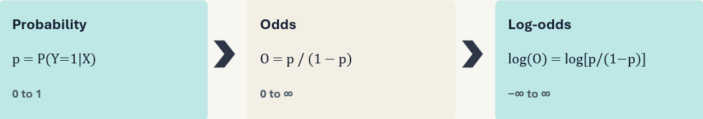
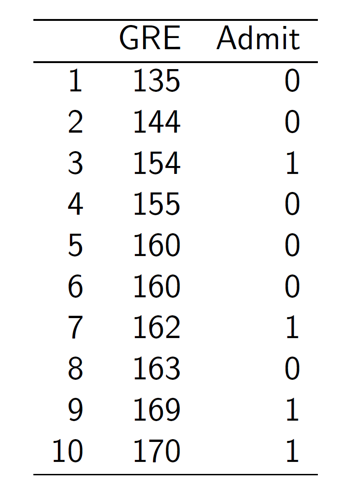
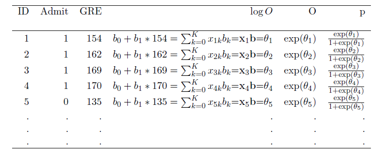
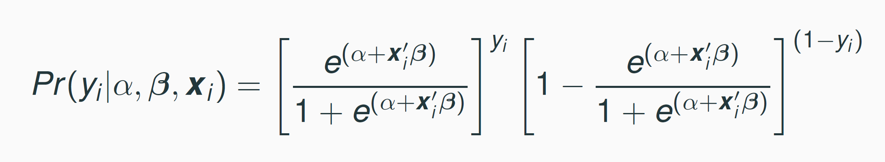
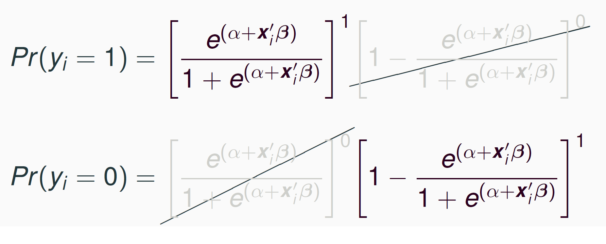
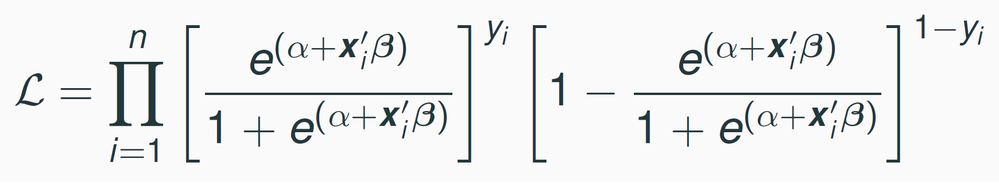
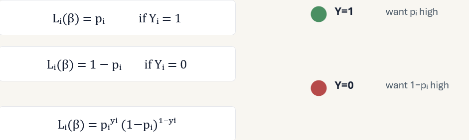
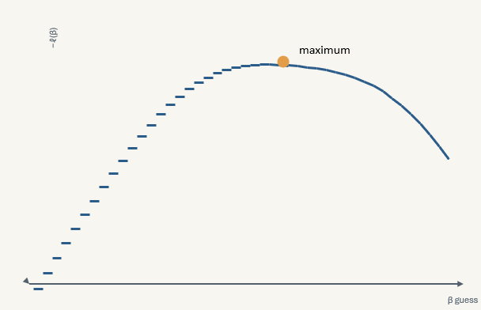

```{r  setup, message=FALSE, warning=FALSE, include=FALSE}
options(
  htmltools.dir.version = FALSE, # for blogdown
  width = 80,
  tibble.width = 80
)

knitr::opts_chunk$set(
  fig.align = "center",  warning=FALSE, message=FALSE
)

library(kableExtra)
library(ggplot2)
library(tidyverse)
library(conflicted)

```

## Agenda

- Why logit?

    - Binary outcomes need probabilities, not fitted lines.

- How is logit estimated?

    - Likelihood turns guesses in fitted coefficients

- How do we interpret it?

    - Translate log-odds back into probabilities.

---
class: inverse, middle, center

# Logistic Regression


---
## Why Logit?

- An alternative to the linear probability model

- Constraints the range of $\hat{y}$ to plausible values (between 0 and 1).

- Accounts for error heteroskedasticity in estimating standard errors.
---
## Why not just use OLS?

- The linear probability model is simple, but it asks a line to do a curve's job.

```{r, echo=FALSE, eval=TRUE, out.height= "400px"}
set.seed(78856)
x<-rnorm(50,0,2)
epsilon<- rnorm(50,0,1)
xb<-.5+2*x+epsilon
y_star<-(exp(xb))/(1+exp(xb))
y<-as.numeric(y_star>.5)

binomial_smooth <- function(...) {
  geom_smooth(method = "glm", method.args = list(family = "binomial"), ...)
}

ggplot(data=cbind.data.frame(x,y),aes(x=x, y=y))+geom_point(size=2) + scale_y_continuous(breaks=c(0,1))+geom_smooth(method = "lm", se = FALSE, color="gray", linetype=2, alpha=.9)+
  binomial_smooth(se = FALSE, linetype=2)+
  scale_x_continuous(limits=c(-3,3))+
  labs(y = expression(P(Y == 1 ~ "|" ~ x)))+
  theme_bw()

```
---
## Example: Aspirin and heart attacks

$$
Heart Attack = \beta_0+ \beta_1 Aspirin+u
$$

- Problem: *Heart Attack* takes on binary values of 0 (no heart attack) and 1 (heart attack)

- Goal: rather than fitting a line, model the probability of a heart attacks (contsrained between 0 and 1).

    - How often does $Y=1$ occur under different values of $X$?


---
## Need to Transform Y

- While *Heart Attack* is binary, the *odds of having a heart attack*, $O$,  are continuous and take on values between 0 and $+\infty$, $0<O<+\infty$

---

## Calculating Odds

```{r, echo=F}
mytable<-rbind(c(104, 10933,11037),c(189, 10845,11034),c(293, 21778, 22071))
row.names(mytable)<-c("Aspirin","Placebo","Total")

kable(mytable, col.names =c("Heart Attk", "No Heart Attk", "Total"))
```


$$O(HA|Aspirin)=\frac{104}{10933}=0.0095$$
$$O(HA|\neg Aspirin)=\frac{189}{10845}=0.0174$$


---
## Need to Transform Y

- Even better, the *log(odds of heart attack)* are also continuous and take on values between $-\infty$ and $+\infty$.

- If we transform our DV from *Heart Attack* to *log(Odds of Heart Attack)*, we can use a linear model to estimate it, then apply a reverse transformation to interpret the results:

$$
log(Odds\; of\; HA) = \beta_0+ \beta_1 Aspirin
$$


---
## Calculating Odds

Can also calculate odds from probabilities:
$$P(HA|Aspirin)=\frac{104}{11037}=0.0094$$
$$P(HA|\neg Aspirin)=\frac{189}{11034}=0.0171$$

$$
\begin{align}
O(HA|Aspirin)&=\frac{P(HA|Aspirin)}{P(\neg HA| Aspirin)}=\frac{P(HA|Aspirin)}{1-P(HA|Aspirin)}\\&=\frac{0.0094}{1-0.0094}=0.0095
\end{align}
$$


And probabilities from odds:

$$
P(HA|Aspirin)=\frac{O(HA|Aspirin)}{1+O(HA|Aspirin)}=\frac{0.0095}{1+0.0095}=0.0094
$$

- This is the formula to convert the results of the $logged(odds)$ regression to probabilities.

---
## Logistic Regression


$$\begin{align}
&\log(O(HA|Asp)) =\log\left(\frac{P(HA|Asp)}{1-P(HA|Asp)}\right)= \beta_0+ \beta_1 Aspirin\\
&O(HA|Asp) = \frac{P(HA|Asp)}{1-P(HA|Asp)}=e^{(\beta_0+ \beta_1 Aspirin)}\\
&P(HA|Asp)=\frac{e^{(\beta_0+ \beta_1 Aspirin)}}{1+e^{(\beta_0+ \beta_1 Aspirin)}}\\
&P(\neg HA|Asp)=1-\frac{e^{(\beta_0+ \beta_1 Aspirin)}}{1+e^{(\beta_0+ \beta_1 Aspirin)}}
\end{align}$$
Or, in general terms:

$$
\begin{align}
&\text{logit}(p_i)=\log[p_i/(1-p_i)]=\beta_0+\beta_1X_{1i}+\ldots+\beta_kX_{ki}\\
&P(Y_i=1|X_i)=p_i=\frac{e^{(\beta_0+\beta_1X_{1i}+\ldots+\beta_kX_{ki})}}{1+e^{(\beta_0+\beta_1X_{1i}+\ldots+\beta_kX_{ki})}}\\
&P(Y_i=0|X)=1-p_i
\end{align}
$$
---
## Probabilities, odds, and log-odds

- Logit works by mapping probabilities onto the whole real line.


```{r, echo=F, out.width= "800px",fig.align="center"}

```

$$p=O/(1+O) \text{ and } O=p/(1-p)$$ 

- The coefficient model is linear in log-odds, but we usually interpret it after converting back to probabilities.

---
## Example 2: Effect of GRE Scores on Admission


```{r, echo=F, out.width= "300px",fig.align="center"}

```

---
## Effect of GRE Scores on Admission

Suppose we want to estimate the following model:

$$
\text{P(Admit=1|GRE)}=logit(\alpha+\beta_1\text{GRE})
$$
Problem: how can we find $\alpha$ and $\beta_1$?

---
## Maximum Likelihood Estimation

[1] Write out the probability for each observation (called "likelihood"):
```{r, echo=F, out.width= "700px",fig.align="center"}

```


[2] The joint probability (called "the joint likelihood") of all the probabilities (assuming independent observations) is the product of these probabilities:

$$
\prod{p_i^{y_i}(1-p_i)^{(1-y_i)}}
$$
---
## Likelihood

```{r, echo=F, out.width= "500px",fig.align="center"}





```
---
## Likelihood for a binary observation

- Each observation contributes the probability of its observed outcome.

```{r, echo=F, out.width= "800px",fig.align="center"}

```

- One compact expression covers both observed outcomes.

---
## Maximum Likelihood Estimation

$$
\prod{p_i^{y_i}(1-p_i)^{(1-y_i)}},
$$
where $p_i=\frac{e^{(\beta_0+ \beta_1 x_i)}}{1+e^{(\beta_0+ \beta_1 x_i)}},$

- Unlike with OLS, where we calculated $\beta_k$ using the formulae we derived, we find $\beta_k$ using numerical optimization (essentially by guessing).

- To help computer optimizers (the product of $p_i$ can become very small), we take advantage of the fact that the maximum of the product and the logged product are the same, and take the log of the joint likelihood:


$$
log(\prod{p_i^{y_i}(1-p_i)^{(1-y_i)}})=\sum{y_ilog(p_i)}+\sum{(1-y_i)log(1-p_i)},
$$
---
## Logit likelihood vs OLS


```{r, echo=F, out.width= "800px",fig.align="center"}

```

- OLS minimizes residuals. Logit maximizes the probability of the data.

- Maximum likelihood asks: under this parameter guess, how probable is the sample we actually observed?
---
## Numerical Optimization

```{r, echo=F, out.width= "500px",fig.align="center"}

```
- Start with a guess for the parameters.
- Compute the negative log-likelihood.
- Move in a direction that improves fit.
- Stop when improvement is negligible.

---
class: inverse, middle, center

# Lab: Maximum Likelihood Estimation
---
## Effect of GRE Scores on Admission

Suppose we want to estimate the following model:

$$\begin{equation}
\text{Admit}=logit(\alpha+\beta_1\text{GRE}+\beta_2\text{GPA}+\beta_3\text{Rank2}\\
+\beta_4\text{Rank3}+\beta_5\text{Rank4})
\end{equation}$$

- Why did we omit Rank1?

- The data are available at "https://stats.idre.ucla.edu/stat/data/binary.csv"

---
## Maximum Likelihood Estimation (by hand)

```{r}
mydata <- read.csv("https://stats.idre.ucla.edu/stat/data/binary.csv")
all<- NULL

y<- mydata$admit
x<-mydata$gre
alpha<- 0 #we don't know so we'll try different guesses
beta<- 0

log_odds<- alpha +beta*x
odds<- exp(log_odds)
prob<-odds/(1+odds)

log_like<- y*log(prob)+(1-y)*log(1-prob)

sum_ll<- sum(log_like)

results<- cbind.data.frame("alpha"=alpha, "beta"=beta, "sum_ll"=sum_ll)

all<- rbind(all, results)


```

---
## Maximum Likelihood Estimation 

```{r, eval=F}
library(tidyverse)

mydata <- read.csv("https://stats.idre.ucla.edu/stat/data/binary.csv")

#Program the likelihood:
MyLogLike<-function(Y,X,par){
xbeta<-X%*%par
p<-exp(xbeta)/(1+exp(xbeta))
loglike<-Y*log(p)+(1-Y)*(log(1-p))
sum_ll= -sum(loglike)
return(sum_ll)
}

```

---
## Use -optim- to Find $\beta_j$

```{r, eval=F}
X<- mydata %>% mutate(cons=1, rank2=as.numeric(rank==2), 
                      rank3=as.numeric(rank==3), 
                      rank4=as.numeric(rank==4)) %>% 
  select(cons, gre, gpa, rank2, rank3, rank4) %>% as.matrix()
Y<-mydata$admit

par=rep(0,6)
myres <- optim(par,            # starting value for prob
   MyLogLike,      # the log-likelihood function
   method="BFGS",               # optimization method
   hessian=TRUE,                # return numerical Hessian
   control=list(reltol=1e-10),    # maximize instead of minimize
   X=X,Y=Y)                 # the data

myres$par

#Check 
summary(m1<-glm(admit~gre+ gpa+ factor(rank), data=mydata, 
                family=binomial))
```


---
## Interpreting Logit Results

- Logit coefficients tell the direction of the effects, but not their magnitude.

- In fact, the values of the logit  (and probit) coefficients are artificially induced by the model assumptions about the mean and variance of $\epsilon$.

    - If we change these assumptions, the coefficient estimates will change too.

- However, the estimates of probability of $Y=1$ and $Y=0$ are invariant to the model assumptions. Hence, always interpret coefficient effects in logit (and probit) by calculating predicted probabilities or related quantities (example to follow). 

- As with OLS, can perform a significance hypothesis test by dividing the coefficient by it's standard error.

---
## Interpreting Logit Results

```{r}
mydata <- read.csv("https://stats.idre.ucla.edu/stat/data/binary.csv")
summary(m1<-glm(admit~gre+ gpa+ factor(rank), data=mydata, 
                family=binomial))
```


---
## Interpreting Logit Results

Calculate and plot predicted probabilities of admission (first example), varying GPA and school rank. Hold GRE at its mean of 500.

```{r, eval=F}
mycoeff<-m1$coeff
gpa<-seq(from=min(mydata$gpa),to=max(mydata$gpa),by=.1)

#Calculate the probability of an admission for a student with average GRE (500) from a tier 1 school:
p1<-(exp(mycoeff[1]+500*mycoeff[2]+gpa*mycoeff[3]))/(1+exp(mycoeff[1]+500*mycoeff[2]+gpa*mycoeff[3]))

#Calculate the probability of an admission for a student with average GRE (500) from a tier 2 school:
p2<-(exp(mycoeff[1]+500*mycoeff[2]+gpa*mycoeff[3]+mycoeff[4]))/(1+exp(mycoeff[1]+500*mycoeff[2]+gpa*mycoeff[3]+mycoeff[4]))

#Calculate the probability of an admission for a student with average GRE (500) from a tier 3 school:
p3<-(exp(mycoeff[1]+500*mycoeff[2]+gpa*mycoeff[3]+mycoeff[5]))/(1+exp(mycoeff[1]+500*mycoeff[2]+gpa*mycoeff[3]+mycoeff[5]))

#Calculate the probability of an admission for a student with average GRE (500) from a tier 4 school:
p4<-(exp(mycoeff[1]+500*mycoeff[2]+gpa*mycoeff[3]+mycoeff[6]))/(1+exp(mycoeff[1]+500*mycoeff[2]+gpa*mycoeff[3]+mycoeff[6]))


#Plot these predicted probabilities:
ggplot() + geom_line(aes(x=gpa, y=p1), ) + geom_line(aes(x=gpa,y=p2)) +geom_line(aes(x=gpa,y=p3))+geom_line(aes(x=gpa,y=p4))+
				   labs(y = "P(Admissions)") +theme_bw()

```

---

## Effect of GPA on Admissions by Rank
```{r, eval=T, echo=F}
library(ggplot2)
mydata <- read.csv("https://stats.idre.ucla.edu/stat/data/binary.csv")
m1<-glm(admit~gre+ gpa+ factor(rank), data=mydata, 
                family=binomial)
mycoeff<-m1$coeff
gpa<-seq(from=min(mydata$gpa),to=max(mydata$gpa),by=.1)

#Calculate the probability of an admission for a student with average GRE (500) from a tier 1 school:
p1<-(exp(mycoeff[1]+500*mycoeff[2]+gpa*mycoeff[3]))/(1+exp(mycoeff[1]+500*mycoeff[2]+gpa*mycoeff[3]))

#Calculate the probability of an admission for a student with average GRE (500) from a tier 2 school:
p2<-(exp(mycoeff[1]+500*mycoeff[2]+gpa*mycoeff[3]+mycoeff[4]))/(1+exp(mycoeff[1]+500*mycoeff[2]+gpa*mycoeff[3]+mycoeff[4]))

#Calculate the probability of an admission for a student with average GRE (500) from a tier 3 school:
p3<-(exp(mycoeff[1]+500*mycoeff[2]+gpa*mycoeff[3]+mycoeff[5]))/(1+exp(mycoeff[1]+500*mycoeff[2]+gpa*mycoeff[3]+mycoeff[5]))

#Calculate the probability of an admission for a student with average GRE (500) from a tier 4 school:
p4<-(exp(mycoeff[1]+500*mycoeff[2]+gpa*mycoeff[3]+mycoeff[6]))/(1+exp(mycoeff[1]+500*mycoeff[2]+gpa*mycoeff[3]+mycoeff[6]))


#Plot these predicted probabilities:
ggplot() + geom_line(aes(x=gpa, y=p1)) + geom_line(aes(x=gpa,y=p2)) +geom_line(aes(x=gpa,y=p3))+geom_line(aes(x=gpa,y=p4))+
				   labs(y = "P(Admissions)") +theme_bw()

```

---

## Example 2

- On January 28, 1986, the NASA shuttle orbiter mission STS-51-L and the tenth flight of Space Shuttle Challenger
(OV-99) broke apart 73 seconds into its flight, killing all seven crew members, which consisted of five NASA astronauts and
two payload specialists.

- The spacecraft disintegrated over the Atlantic Ocean, off the coast of Cape Canaveral, Florida, at 11:39 EST (16:39 UTC).

- Disintegration of the vehicle began after an O-ring seal in its right solid rocket booster (SRB) failed at liftoff.

- Due to McAuliffe’s (first teacher in space) presence on the mission, NASA arranged for many US public schools to view the
launch live on NASA TV.

- Source: Wikipedia

---
```{r, echo=F, out.width= "800px",fig.align="center"}

```

---

## Why Did the O-ring Fail?

- What causes O-ring failures during space shuttle launches?

- Research Hypothesis: Temperature at launch affects the probability
of o-ring failures.

---

## Data on Space Shuttle Launches

```{r, echo=F}
#library(tidyverse)
library(lubridate)

d<- read.table("./data/space_shuttles.txt")
d$flight_date<-ymd(d$flight_date)
d[order(d$flight_date),]

```

---

## Your Turn

- Estimate a logistic regression of failures on temperature.

- In order to interpret the result, calculate and plot the expected probability of an o-ring failure by temperature. Overlay your plot with a scatterplot of the data.

- What is your conclusion? What would you say if I told you that the Challenger was launched at 31 degrees F?


