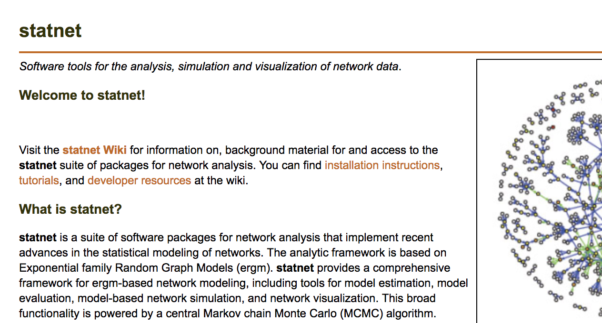
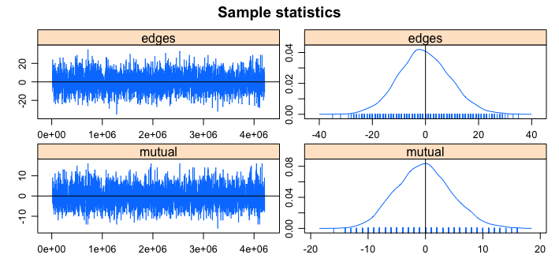
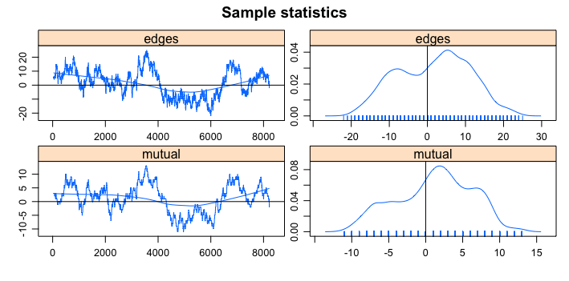

```{r setup, include=FALSE}
knitr::opts_chunk$set(echo = TRUE, fig.align = 'center', message = FALSE, warning = FALSE)
```


## Reading
- Skyler J. Cranmer and Bruce A. Desmarais. Inferential network analysis with
exponential random graph models. *Political Analysis*, 19(1):66--86, 2011.

---

## Why ERGMs?
- So far, we have mostly focused on descriptive rather than inferential tools.
- May want to test hypotheses about processes that give rise to particular network structures.

- ERGMs provide a way to:
	+ estimate and evaluate the effect of exogenous covariates
	+ and also the effect of endogeneous network structures, such as triangles, reciprocity, etc.

---
class: inverse, middle, center
# So how does ERGM work?
---
## Basic logic

- Conceptualize the observed network data as just one realization of a set of possible networks with similar important characteristics produced by some unknown stochastic process
- A statistical model for a network on a given set of actors assigns a probability to all possible networks on those actors
- The range of possible networks and their probability of occurrence under the model is represented by a probability distribution on the set of all possible graphs
- Estimate model parameters using observed network as guide
---
## Example
- Consider a friendship network, e.g. Coleman data from last week.
- There are many possible networks that could have been observed among those particular set of individuals.
- We examine the obseved (actual) network in the context of all possible networks for that number of individuals.
- Some structures (e.g., closed triangles, reciprocal ties) are more likely to happen than others (e.g., open triangles). The set of all possible structures with some assumption about their associated probabilities is a probability distribution of graphs.
- We are placing the observed network within this distribution.
---
## ERGM Framework

- Let $\mathcal{Y}$ be the sample space of $Y$, e.g. $\{0,1\}^{N}$
- Any model-class for the multivariate distribution of $Y$ can be parameterized in the form:

$$\begin{eqnarray}
\Pr(Y = y) = \frac{ \exp( \theta^{T} g(y)  )  }{ \mathcal{k}(\theta,\mathcal{Y})  } \text{ ,  } y \in \mathcal{Y}
\end{eqnarray}$$

- The above gives us the probability of a single graph
- $g(y)$: vector of network statistics
- $\theta$: vector of model parameters
- $\mathcal{k}(\theta,\mathcal{Y})$: normalizing constant which is summed over all possible graphs. The denominator represents the
quantity from the numerator summed over all possible networks with $n$ nodes, constraining
the probabilities to sum to 1.

\begin{align}
\mathcal{k}(\theta,\mathcal{Y}) = \sum_{y \in \mathcal{Y}} \exp( \theta^{T} g(y)  )
\end{align}
---
## Vector of network statistics

- The $g(y)$ term includes parameters to estimate the effect of "network statistics"
- These are counts of network configurations: 
	+ Density: \# ties
	+ Reciprocity: \# of reciprocal ties
	+ Triangles: \# of triangles
	+ and many more such terms
- We can also model the effect of exogenous dyadic and nodal covariates in this framework


- Many ERGM terms have been developed ([Morris et al. 2008](https://www.ncbi.nlm.nih.gov/pmc/articles/PMC2481518/) provide a comprehensive review)


---
## Lets calculate it!

We would usually begin by maximizing the log-likelihood in order to calculate $(\hat\theta)$:

\begin{align}
	log \Pr(Y = y) = \theta^{T} g(y) + log( \mathcal{k(\theta)})
\end{align}

To solve this type of problem we often use gradient descent, this requires taking the derivatives of $l(\theta | y)$:

\begin{align}
	\nabla l(\theta | y) = g(y) + \nabla log( \mathcal{k(\theta)})
\end{align}


\begin{align}
	\nabla log( \mathcal{k(\theta)}) = \frac{ - \sum_{y \in \mathcal{Y}} \theta^{T} \exp( \theta^{T} g(y))  } { \sum_{y \in \mathcal{Y}} \exp( \theta^{T} g(y)  )  }
\end{align}

For each step of the gradient descent we need to calculate $\nabla log( \mathcal{k(\theta)})$ ... this requires summing over all possible graphs ...
---

$\mathcal{k}(\theta,\mathcal{Y})$ makes estimation very problematic, the number of possible graphs for an undirected network with 30 actors is $2^{n(n-1)/2} = 2^{435}$

- What to do? 
- Strauss and Ikeda (1990) borrowed an idea that Besag (1975) developed for the spatial literature
- To avoid calculating the normalizing coefficient, Strauss & Ikeda argued that it is useful to work at the link level, specifically, to think about the probability that a given link $ij$ takes on a certain value conditional on the rest of the network

---

- To introduce this approach, lets bring in some notation to re-express the probability of the graph in terms of the probabilities of a tie:
	+ $Y_{ij}^{+} = \{Y \text{ with } Y_{ij} = 1 \}$ the graph w/ the (i,j)th dyad set to 1
	+ $Y_{ij}^{-} = \{Y \text{ with } Y_{ij} = 0 \}$ the graph w/ the (i,j)th dyad set to 0
	+ $Y_{ij}^{c} = \{Y_{kl} \text{ with } (k,l) \neq (i,j) \}$ all dyads except (i,j)

---
## Pseudo-likelihood ERGM

This enables us to reformulate the problem as:

$$\begin{align}
Pr(Y_{ij} = 1 | Y_{ij}^{c}) &= \frac{ Pr(Y = y_{ij}^{+}) }{ Pr(Y = y_{ij}^{+}) + Pr(Y = y_{ij}^{-}) } \\
	&= \frac{ exp\{ \theta^{T} g(y_{ij}^{+}) \} }{ exp\{ \theta^{T} g(y_{ij}^{+}) \} + exp\{ \theta^{T} g(y_{ij}^{-}) \} }
\end{align}$$

No normalizing parameter to deal with.

---

## Pseudo-likelihood ERGM

We can now express the log odds ratio as: 

- Given, $Pr(Y_{ij} = 1 | Y_{ij}^{c}) = \frac{ exp\{ \theta^{T} g(y_{ij}^{+}) \} }{ exp\{ \theta^{T} g(y_{ij}^{+}) \} + exp\{ \theta^{T} g(y_{ij}^{-}) \} }$
- Then

$$\begin{align}
log( \frac{ Pr(Y_{ij} = 1 | Y_{ij}^{c}) }{ Pr(Y_{ij} = 0 | Y_{ij}^{c}) } ) &= \theta^{T}[ g(y_{ij}^{+}) - g(y_{ij}^{-}) ] \\
&= \theta^{T} \delta (y_{ij})
\end{align}$$

$\delta(y_{ij})$ is known as the change statistic. This represents the change in $g(y)$ when $Y_{ij}$ is toggled between 0 and 1.

Benefit here is that finding $\hat\theta$ now can proceed using standard MLE techniques.


---
## But ... 

- The framework in the previous slide is an example of "autologistic regression," and the resulting estimator is known as the pseudolikelihood estimator (MPLE)
- Problem: the probability here is only conditional - can use for any one $ij$, but the joint likelihood of $y$ is not generally the product of $Pr(Y_{ij} = y_{ij} | Y_{ij}^{c})$ (see [van Duijn et al. 2009](https://www.ncbi.nlm.nih.gov/pmc/articles/PMC3500576/) for more details)
	+ $y$ appears on both sides - can't regress without accounting for the dependence among edges
	+ This works if and only if edges are conditionally independent of $g(y)$
- The properties of the estimator are not well understood and it is known that for many data sets pseudo-likelihood estimates are not accurate, specifically, the standard errors are too small ([Lubbers & Snijders 2007](http://www.stats.ox.ac.uk/~snijders/LubbersSnijders2007.pdf); [Robbins et al. 2007](http://www2.ece.rochester.edu/~gmateosb/ECE442/Readings/ergm.pdf))

---

## What to do? 

- Lets restate the problem once more ... likelihood function for the general ERGM is: 

$$\begin{align}
\Pr(Y = y | \theta) = \frac{ \exp( \theta^{T} g(y,X)  )  }{ \mathcal{k}(\theta)  } 
\end{align}$$

- We want to find the value of $\theta$ that maximizes the probability of our data $(Y,X)$
- But the function depends on $\mathcal{k}(\theta)$, which makes direct calculation (and thus maximization) difficult for any reasonably sized network
---
## Estimation: MCMC-MLE

- ERGM computations are too difficult to perform directly, lets use an iterative method for simulating draws from a given distribution (e.g., see [Snijders 2002](http://www.stats.ox.ac.uk/~snijders/siena/Mcpstar.pdf) and [Handcock 2003](https://www.csss.washington.edu/Papers/2003/wp39.pdf))
- ERGMs have no "closed form" or analytical solution to estimate the parameters, $\theta$
- Basically, this procedure works by: 
	+ Starting with some initial values for $\theta$
	+ Simulate networks from those values
	+ Compare the mean statistics to the observed
	+ Repeat until difference is lower than some stopping condition
---

## MCMC-MLE  ... more details

- Generate distributions of different $g$s that emerges for any given specification of $\beta$s
- Search over set of $\beta$s to find one that leads to the highest likelihood of getting a network that looks similar to the observed $g$
- How to generate a distribution of different $g$'s for any given specification of $\beta$?
    - Fix starting network at $g^{0}$
    - Randomly pick a link, $ij$, to change
    - Then, based on MPLE, randomly put the link $ij$ in or out with the appropriate probability given the profile of parameters $\beta$ and given $g^{0}_{-ij}$
    - This leads to a new network $g^{1}$
   - Iterate through different links in the network, which results in a Markov chain over the resulting networks, and over time the probability that we visit any given network approaches that of its steady state distribution.
---

## Still some problems ...

Basic problem with MCMC-MLE is that even with an MCMC method, we are still only sampling relatively few networks relative to the huge number possible ...

- [Bhamidi et al. (2011)](http://www.unc.edu/~bhamidi/ERG_AAP.pdf): The time an MCMC has a chance to sample enough networks to gain a representative sample is generally exponential in the number of links ... unless the edges are independent, which if they are should then make you wonder why you did an ERGM in the first place.
- [Chatterjee and Diaconis (2013)](https://arxiv.org/pdf/1102.2650.pdf): Provide further evidence that calculating the normalizing constant for moderately sized networks is prohibitively time-consuming.
- [Shalizi & Rinaldo (2013)](https://projecteuclid.org/download/pdfview_1/euclid.aos/1366980556): When running an ERGM inferences are only well calibrated, if you are able to view the whole network.
---
class: inverse, middle, center
# ERGMs in Practice

---
## Statnet package

`statnet` is a package in R that includes a range of "sub-packages" that we will be using. The `ergm` package is one such package and we will be using it to build our first inferential network model.

[Project website:](http://www.statnet.org/)

```{r, echo=FALSE, eval=TRUE}
suppressWarnings(suppressMessages(library(statnet)))
```

```{r, eval=FALSE}
library(statnet)
```

```{r, out.width= "500px",fig.align="center", echo=FALSE}

```


---
## Sampson Monastery Data

```{r, out.width= "500px",fig.align="center", echo=FALSE}

```

- Sampson (1969) recorded the interactions among a group of monks while he was a resident at their monastery.
- We'll be working with a cross-sectional directed dataset that flows from his work there.
- A directed edge from monk A to monk B exists if A indicated that he has positive relations with B.
---
## Sampson Monastery Data

```{r}
data('sampson')
samplike
```
---
## `network` objects

`network` objects enable you to provide greater structure to adjacency matrices. To go from an adjacency matrix to a `network` object one just needs to run: 

```{r}
adjMat = as.matrix.network(samplike)
```


And vice versa:

```{r, echo=TRUE, eval=TRUE}
as.network.matrix(adjMat, 
	matrix.type='adjacency',
	directed=TRUE
	)
```


----
## Attribution methods in `network`

To add information about vertices and edges in a network object we can use the following methods:

```{r, eval=TRUE}
# say we had their ages
samplike <- network::set.vertex.attribute(samplike, 'age', rpois(18, 20))

# check if it was added
network::list.vertex.attributes(samplike)

# na attribute seems useless lets delete
samplike <- network::delete.vertex.attribute(samplike, 'na')
```

To set or delete edge attributes we would just use: `set.edge.attribute` and `delete.edge.attribute`.

---

## Get information about attributes

To view the data stored in the attributes we can use get methods, lets see what's in the `group` attribute:

```{r, echo=TRUE, eval=FALSE}
network::get.vertex.attribute(samplike, 'group')
samplike %v% 'group' # returns the same result as above
```


```{r, echo=FALSE, eval=TRUE}
network::get.vertex.attribute(samplike, 'group')
```


Sampson made these groups based on his observations:

- Loyal Opposition consists of the novices who entered the monastery first.
- The Young Turks arrived later, in a period of change. They questioned practices in the monastery, which the members of the Loyal Opposition defended.
- Some novices did not take sides in this debate, so they are labeled 'interstitial'. 
- The Outcasts are novices who were not accepted in the group.

---

## Sampson data visualization

The `network` package comes with visualization functionality for networks as well. `igraph` is more flexible for visualization purposes, but most basic operations can still be accomplished with the `network` package.

```{r, echo=TRUE, eval=FALSE, out.width= "500px",fig.align="center"}
set.seed(6886)

vertexSize = degree(samplike, cmode = 'indegree')/2

p<-plot(samplike,
	displaylabels = TRUE,
	# size of nodes based on vector vertexSize
	vertex.cex = vertexSize,
	# color of nodes based on vertex attribute: group
	vertex.col = 'group'
)


```
---


## Sampson data visualization

```{r, out.width= '500px',fig.align="center", echo=FALSE}
set.seed(6886)
vertexSize = degree(samplike, cmode = 'indegree')/2

p<-plot(samplike,
	displaylabels = TRUE,
	# size of nodes based on vector vertexSize
	vertex.cex = vertexSize,
	# color of nodes based on vertex attribute: group
	vertex.col = 'group'
)
```

---

## Exploring the Sampson data

- Lets run a simple model with no exogenous or endogenous covariates -- this is just equivalent to a GLM with an intercept term
	+ (also referred to as an Erdos-Renyi model)
- The function to run an ERGM is simply `ergm`. The `statnet` package imports it from the `ergm` package. 

```{r, eval=FALSE, echo=TRUE}
m1 = ergm(samplike ~ edges)
```

```{r, eval=TRUE, echo=FALSE}
m1 = suppressMessages(ergm(samplike ~ edges))
```

---

## Summarizing the result from an `ergm` object

```{r}
summary(m1)
```

---
## Exploring the sampson data

- Interpretation here is straightforward, baseline probability of a tie in the network is: 

```{r}
plogis(coef(m1)[['edges']])
```

---

## Lets add an exogenous covariate

- The network visualization showed significant clustering by `group`, so adding in a covariate based on that variable seems reasonable
- In this case, we do so through the `nodematch` function
	+ `nodematch` creates an edge level covariate that is one between i and j when they are in the same group and zero otherwise
- This is an example of a homophilous effect

```{r, echo=TRUE, eval=FALSE}
m2 = ergm(samplike ~ edges + nodematch('group'))
```


---
## Lets add an exogenous covariate

```{r, echo=FALSE}
m2 = suppressMessages(ergm(samplike ~ edges + nodematch('group')))
```

```{r, echo=TRUE}
summary(m2)
```


---
## Many other ways to add exogenous covariates

[Morris et al. (2008)](https://www.ncbi.nlm.nih.gov/pmc/articles/PMC2481518/) detail a variety of ways to create terms for use in `ergm`. Here are some prominent ones: 

- `nodecov()`: main effect of a covariate
- `nodeocov()`: main effect of a nodal, sender covariate
- `nodeicov()`: main effect of a nodal, receiver covariate
- `absdiff()`: absolute difference between covariate value for i and j
- `edgecov()`: main effect of a dyadic covariate

---
## Add reciprocity term

- Now lets add an endogenous parameter, specifically, reciprocity
- This can be done by using the `mutual` term, which:
	+ "adds one network statistic to the model, equaling the number of pairs of actors $i$ and $j$ for which $(i \rightarrow j)$ and $(j \rightarrow i)$ both exist" ([Morris et al. (2008)](https://www.ncbi.nlm.nih.gov/pmc/articles/PMC2481518/))
- Estimating the effect of network statistics such as these is only possible via MCMC-MLE


```{r, eval=FALSE, echo=TRUE}
m3 = ergm(samplike ~ edges + nodematch('group') +
	mutual
	)
```


```{r, eval=TRUE, echo=FALSE}
load("data/ergms.Rdata")

```
---
## Add reciprocity term

```{r, eval=TRUE, echo=TRUE}
summary(m3)
	
```

---
## Interpretation

The baseline probability of a tie now is:

```{r}
plogis(coef(m3)[['edges']]) #plogis is equivalent to exp(xb)/(1+exp(xb))


```


But if the reciprocal tie is present even if the two actors are not in the same group, then the log odds of the tie is 3.23x greater:

```{r}
plogis(coef(m3)[['edges']] + coef(m3)[['mutual']])
```
---
## Your Turn:

1. Open Coleman data from the `sna` package.
2. Save the data as a `network.matrix` class.
3. Estimate an ergm with just the intercept term `edges`.
4. Interpret the coefficient on edges. What is the baseline probability of a tie in the friendship network?
5. Estimate an ergm with edges and reciprocity (`mutual`). 
6. What is the probability of a reciprocated tie?


---
## Checking convergence

Given these models are estimated via MCMC, we should always check convergence:

```{r, eval=TRUE, echo=TRUE}
mcmc.diagnostics(m3)
```
---
## Checking convergence
```{r, out.width= "1000px",fig.align="center", echo=FALSE}

```

---

## Example of bad chain

```{r, out.width= "1000px",fig.align="center", echo=FALSE}

```


---
## What to do?

First try increasing the number of iterations.

```{r, eval=FALSE, echo=TRUE}
?control.ergm

m = ergm(formula, data=data, 
	control=control.ergm(
		seed=6886,
		MCMC.samplesize=10000
		)
	)
```


---
## Using simulation to gauge fit

- Since ERGMs are generative, given a set of coefficient values, we can simulate networks that are near the maximum likelihood realization of sufficient statistic
- This can be useful for examining fit, among other things, and is easy using `simulate`
- In addition to checking model fit, you can change parameter values, constrain the network in various ways, etc. See `?simulate.ergm` for details.


---
## Simulation and fit

Ideally, the results closely approximate the visualization of the Sampson network that we presented at the beginning of the application section.

```{r, eval=FALSE}
set.seed(6886)
simNets = simulate(m3, nsim = 5)


# Define a plotting function:
plotSimNet = function(net, label){
	set.seed(6886)
	plot(net, displaylabels = FALSE,
		vertex.cex = degree(net, cmode = 'indegree')/2, edge.col = "black",
		vertex.col = 'group', coord=p )
	title(label) }

par(mfrow = c(2, 3))

# add actual network to list of sim nets
# for comparison
simNets[[6]] = samplike
labels = c(paste0("sim",1:5), 'actual')
lapply(1:length(simNets), function(i){
	plotSimNet(simNets[[i]], labels[i]) })
```


---
## Simulation and fit

```{r, eval=TRUE, echo=FALSE, fig.width=10, fig.height=6}
set.seed(6886)
simNets = simulate(m3, nsim = 5)

# Define a plotting function:
plotSimNet = function(net, label){
	set.seed(6886)
	plot(net, displaylabels = FALSE,
		vertex.cex = degree(net, cmode = 'indegree')/2, edge.col = "black",
		vertex.col = 'group', coord=p )
	title(label) }

par(mfrow = c(2, 3))

# add actual network to list of sim nets
# for comparison
simNets[[6]] = samplike
labels = c(paste0("sim",1:5), 'actual')
invisible( lapply(1:length(simNets), function(i){
	plotSimNet(simNets[[i]], labels[i]) }) )
```

---

## Running a bunch of simulations

- Running a few simulations and looking at pictures is somewhat useful, but as we generate more and more we can get a more accurate sense of how well our model fits the observed network
- To do this, we can use the `gof` (goodness-of-fit) function
- `gof` simulates networks from the ERGM estimates and, for some set of network statistics, compares the distribution in the simulated networks to the observed values

---
## Examining model fit

- After running a bunch (exact number can be controlled by the `control.gof.ergm` function) of simulations, we want to use some criteria to compare our simulated models with the observed network
- A standard set of statistics network scholars use to compare how well their model is capturing network dependencies are: 
	+ `in degree`: Proportion of nodes with the same value of the attribute as the receiving node
	+ `out degree`: Proportion of nodes with the same value of the attribute as the sending node
	+ `edge-wise shared partners`: Similar to above except this counts the number of dyads with the same number of edges
	+ `minimum geodesic distance`: The proportion of pairs of nodes whose shortest connecting path is of length k, for $k=1,2, \ldots$ -- also, pairs of nodes that are not connected are classified as $k = \infty$


---
## Examining model fit

We can generate a comparison along those dimension using the following code:

```{r, echo=TRUE, eval=FALSE}
set.seed(6886)
gofM3 = gof(
	m3, 
	# specify stats to compare against (- indicates remove)
	GOF=~idegree + odegree + espartners + distance-model
	)

# we'll compare against four plots, so set up plotting window
par(mfrow = c(2, 2))
plot(gofM3)
```

---

## Examining model fit

```{r, echo=FALSE, eval=TRUE, fig.width=9, fig.height=4.5}
set.seed(6886)
gofM3 = gof(
	m3, 
	# specify stats to compare against (- indicates remove)
	GOF=~idegree + odegree + espartners + distance-model
	)

# we'll compare against four plots, so set up plotting window
par(mfrow = c(2, 2))
plot(gofM3)
```


---
## Accounting for the popular monks

- Often in social networks, we find that there can be nodes that play "central" in networks
- To do this we include the `idegree1.5` network statistics
	+ this "equals the sum over the actors of each actor's indegree taken to the 3/2 power (or, equivalently, multiplied by its square root)" ([`ergm-terms`](https://rdrr.io/cran/ergm/man/ergm-terms.html))

```{r, eval=FALSE, echo=TRUE}
m4 = ergm(samplike ~ 
	edges + nodematch('group') + 
	mutual + idegree1.5
	)
```
---
## Accounting for the popular kids

```{r}
summary(m4)
```
---
## Is fit getting better?

```{r, eval=FALSE, echo=TRUE}
simNets = simulate(m4, nsim = 5)
par(mfrow = c(2, 3))

simNets[[6]] = samplike
labels = c(paste0("sim",1:5), 'actual')
lapply(1:length(simNets), function(i){
	plotSimNet(simNets[[i]], labels[i]) })
```


---
## Is fit getting better?

```{r, eval=TRUE, echo=FALSE, fig.width=9, fig.height=4.5}
simNets = simulate(m4, nsim = 5)
par(mfrow = c(2, 3))

simNets[[6]] = samplike
labels = c(paste0("sim",1:5), 'actual')
invisible(lapply(1:length(simNets), function(i){
	plotSimNet(simNets[[i]], labels[i]) }))
```


---
## GOF for Model 4

```{r, eval=FALSE, echo=TRUE, fig.width=9, fig.height=4.5}
set.seed(6886)
gofM4 = gof( m4, 
	GOF=~idegree+odegree+espartners+distance-model )

# we'll compare against four plots, so set up plotting window
par(mfrow = c(2, 2))
plot(gofM4)
```
---

## GOF for Model 4

```{r, eval=TRUE, echo=FALSE, fig.width=9, fig.height=4.5}
set.seed(6886)
gofM4 = gof( m4, 
	GOF=~idegree+odegree+espartners+distance-model )

# we'll compare against four plots, so set up plotting window
par(mfrow = c(2, 2))
invisible(plot(gofM4))
```


---
## Did we improve in degree fit?

```{r, eval=FALSE, echo=TRUE}
gofM3_indegree = gof(m3, GOF=~idegree-model)
gofM4_indegree = gof(m4, GOF=~idegree-model)

# plot
par(mfrow=c(1,2))
plot(gofM3_indegree)
plot(gofM4_indegree)
```

---

## Did we improve in degree fit?

```{r, eval=TRUE, echo=FALSE, fig.width=10, fig.height=3}
gofM3_indegree = gof(m3, GOF=~idegree-model)
gofM4_indegree = gof(m4, GOF=~idegree-model)

# plot
par(mfrow=c(1,2))
invisible(plot(gofM3_indegree))
invisible(plot(gofM4_indegree))
```


---
## Other model selection methods

We can also use Akaike and Bayesian Information Criterions (AIC and BIC) as criterions for model selection. Accessing these statistics from `ergm` objects is simple:

```{r}
round(sapply(list(m1, m2, m3, m4), AIC), 0)
round(sapply(list(m1, m2, m3, m4), BIC), 0)
```

---

## Triangles

- Triangle terms are a strong motivation for why ERGMs are utilized in social networks
- They are used to answer the question: 
	+ How does the likelihood of an interaction change if two actors already have an interaction in common?
- Modeling triangles within `ergm` can be done using the `triangles` term. This "adds one statistic to the model equal to the number of triangles in the network" ([Morris et al. (2008)](https://www.ncbi.nlm.nih.gov/pmc/articles/PMC2481518/)):
	+ For an undirected network, a triangle is defined to be any set \{(i,j), (j,k), (k,i)\} of three edges
	+ For a directed network, a triangle is defined as any set of three edges (i,j) and (j,k) and either (k,i) or (i,k)
---
## Triangles

```{r, echo=TRUE, eval=FALSE}
m5 = ergm(samplike ~ 
	edges + nodematch('group') + 
	mutual + idegree1.5 + 
	triangles
	)
```


---
## Triangles

```{r}
summary(m5)
```


---
## Triangles can be  dangerous

- Model degeneracy can often occur with ERGMs, much of the ERGM literature notes that degeneracy is a sign of model misspecification 
- Degeneracy here means that the model places a large amount of probability on a small subset of networks that fall in the set of obtainable networks but share little resemblance with the observed network
- Terms like `triangles` can at times produce degenerate graphs
- [Hunter & Handcock 2006](https://amstat.tandfonline.com/doi/abs/10.1198/106186006X133069) introduces a set of geometrically weighted terms to help deal with this issue

---

## Geometrically Weighted Terms

- The implication of a triangles term is that the likelihood of tie changes proportionately to the number of shared friends two people have

	+ Specifically, if having one shared friend makes a tie 25% more likely, having six shared friends makes a tie 150% more likely
- Idea behind geometric terms is to discount each additional tie 
- To capture the same effect as `triangles`, we can do this via the geometrically-weighted edgewise shared partners (`gwesp`) term
	+ `gwesp` takes a parameter, `decay` that controls how much to discount 2nd, 3rd, etc. shared partners
	+ `ergm` will estimate a value for `decay` by default, but most applied scholars fix the `decay` parameter
  + The closer `decay` is to zero, the more dramatic the discounting applied to subsequent shared partners
---

## Geometrically Weighted Terms

```{r, echo=TRUE, eval=FALSE}
m6 = ergm(samplike ~ 
	edges + nodematch('group') + 
	mutual + idegree1.5 + 
	gwesp(decay = .5,fixed = TRUE)
	)
	
```
---
## Geometrically Weighted Terms

```{r}
summary(m6)
```
---
## Geometrically Weighted Terms
For an in-depth discussion on how to interpret `gwesp`, see
https://eehh-stanford.github.io/SNA-workshop/ergm-predictions.html

