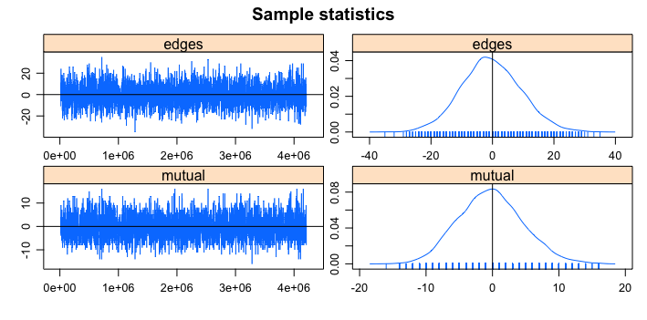
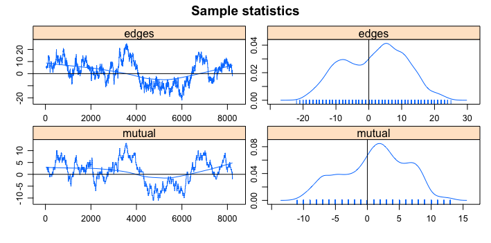

```{r setup, include=FALSE}
knitr::opts_chunk$set(
  echo = TRUE,
  message = FALSE,
  warning = FALSE,
  fig.align = "center",
  fig.width = 7,
  fig.height = 5
)
```

<style>
.large { font-size: 140%; }
.medium { font-size: 115%; }
.small { font-size: 80%; }
.tiny { font-size: 65%; }
.red { color: #b2182b; }
.blue { color: #2166ac; }
.green { color: #1b7837; }
.gray { color: #666666; }
.box { border: 2px solid #444; border-radius: 8px; padding: 12px; margin-top: 12px; }
.lightbox { background-color: #f6f6f6; border-left: 6px solid #2166ac; padding: 12px; margin-top: 12px; }
.warnbox { background-color: #fff7ec; border-left: 6px solid #d6604d; padding: 12px; margin-top: 12px; }
.pull-left-narrow { float: left; width: 42%; }
.pull-right-wide { float: right; width: 55%; }
.inverse .remark-slide-number { display: none; }
table { font-size: 90%; }
</style>


## Learning Goals

By the end of today, you should be able to:

1. Explain why a dyadic logistic regression may be inappropriate for network data.
2. Describe an ERGM as a probability distribution over possible networks.
3. Calculate and interpret basic change statistics.
4. Fit simple ERGMs in `statnet`.
5. Interpret `edges`, `nodematch`, and `mutual` terms.
6. Distinguish **convergence** from **goodness of fit**.
7. Recognize degeneracy and explain why geometrically weighted terms are useful.

---

## Reading

- Skyler J. Cranmer and Bruce A. Desmarais. 2011. “Inferential Network Analysis with Exponential Random Graph Models.” *Political Analysis* 19(1): 66–86.

Optional references for later:

- Morris, Handcock, and Hunter. 2008. “Specification of Exponential-Family Random Graph Models.”
- Hunter and Handcock. 2006. “Inference in Curved Exponential Family Models for Networks.”

---

class: inverse, middle, center

# Why Do We Need ERGMs?

---

## From Last Class: The Random-Graph Baseline

An Erdős–Rényi graph asks:

> What would the network look like if every possible edge formed independently with the same probability?

For a directed network without self-ties:

$$Y_{ij}\sim \text{Bernoulli}(p), \qquad i\neq j.$$

Two assumptions:

1. **Equal probability:** every possible tie has the same probability $p$.
2. **Independence:** one tie tells us nothing about any other tie.

---

## The Question ERGMs Answer

.large[
Is the observed network structured in ways that are unlikely under dyadic independence?
]

Examples of network processes:

| Process | Network pattern |
|---|---|
| Reciprocity | If $j\rightarrow i$, then $i\rightarrow j$ is more likely |
| Homophily | Similar actors are more likely to tie |
| Popularity | Some actors attract many ties |
| Closure | Friends of friends become friends |

.lightbox[
An ERGM allows to directly model such patterns.
]

---

## Why Not Just Run Dyadic Logit?

A standard dyadic logit treats each potential edge as one row:

$$\operatorname{logit}(P(Y_{ij}=1\mid X_{ij}))=\mathbf{x}_{ij}^{T}\boldsymbol\beta.$$

This is useful when dyads are conditionally independent.

But many network theories say:

- $Y_{ji}$ affects $Y_{ij}$.
- $Y_{ik}$ and $Y_{kj}$ affect $Y_{ij}$.
- Existing popularity affects future nominations.

.warnbox[
Network dependence is not a nuisance. It is often the theory.
]

---

## ERGM as the Network Version of Logit

For one dyad, logistic regression models:

$$\operatorname{logit}(P(Y_{ij}=1))=\text{linear predictor}.$$

In an ERGM, the linear predictor includes how the network would change if we toggled the tie between actors (i) and (j):

$$\operatorname{logit}P(Y_{ij}=1\mid Y^c_{ij},X) = \boldsymbol\theta^T \Delta g_{ij}(y,X).$$

.pull-left[
- $Y_{ij}$: indicator for the tie $i\rightarrow j$
- $Y^c_{ij}$: all other ties in the network
- $X$: nodal or dyadic covariates
- $y$: the observed network
- $g(y,X)$: vector of network statistics
]

.pull-right[
- $\Delta g_{ij}(y,X)$: changes in those statistics when $Y_{ij}$ is toggled
- $\boldsymbol{\theta}$: vector of model coefficients ($T$: transposes to produce a weighted sum)
]

.lightbox[
The change statistic tells us what changes in the network when one potential tie is switched from absent to present.
]

---

## Example: Sampson Monastery Data

- Sampson observed social relations among monks in a monastery.
- We use a directed network of positive nominations.
- A tie $i\rightarrow j$ means monk $i$ nominated monk $j$.
- Monks belong to observed groups: Loyal, Turks, Outcasts, and Interstitial.

Substantive questions:

- Do monks nominate members of their own group?
- Are nominations reciprocated?
- Are some monks especially popular?
- Does closure explain the structure of nominations?

---

## Visualize Sampson Data

```{r sampson-load,  eval=TRUE,  echo=FALSE,  fig.width=12,  fig.height=8,  out.width="100%",  fig.align="center",  dpi=150}

library(statnet)
data("sampson")

set.seed(6886)

par(mar = c(0, 0, 0, 0))

p <- plot(
  samplike,
  displaylabels = TRUE,
  label.cex = 0.75,
  vertex.col = "group",
  vertex.cex = degree(samplike, cmode = "indegree") / 3,
  mode = "fruchtermanreingold"
)
```

---

## What Do You See?

1. Are ties concentrated within groups?
2. Are ties reciprocated?
3. Are some nodes receiving many nominations?
4. Does the network contain locally clustered structure?

.lightbox[
Each visual feature can become a model term.
]

---

## From Theory to Terms

| Theory | Configuration | ERGM term |
|---|---|---|
| Baseline tie propensity | Any tie | `edges` |
| Group homophily | Same-group tie | `nodematch("group")` |
| Reciprocity | Mutual dyad | `mutual` |
| Popularity | High indegree nodes | degree terms |
| Closure | Shared partners / triangles | `gwesp`, `triangles` |


.large[
The goal is to represent a theory of network formation.
]

---

class: inverse, middle, center

# Change Statistics

---

## A Change Statistic Answers One Question

Suppose we are considering adding the tie $i\rightarrow j$.

$$\Delta g_{ij}(y)=g(y_{ij}^{+})-g(y_{ij}^{-}).$$

Where:

- $y_{ij}^{+}$: the network with $Y_{ij}=1$;
- $y_{ij}^{-}$: the network with $Y_{ij}=0$;
- $g(y)$: a statistic calculated from the whole network.

.lightbox[
A change statistic is the amount by which a network statistic changes when one tie is toggled.
]

---

## Change Statistic: `edges`

The `edges` statistic counts the number of ties in the network.

If we toggle $Y_{ij}$ from 0 to 1:

$$\Delta edges_{ij}=1.$$

| Candidate tie | Change in `edges` |
|---|---:|
| Add $i\rightarrow j$ | +1 |
| Remove $i\rightarrow j$ | -1 |

Interpretation:

- `edges` is the baseline tendency for ties to exist.
- It is analogous to the intercept in logistic regression.

---

## Change Statistic: `nodematch("group")`

The `nodematch("group")` statistic counts ties between actors in the same group.


$$nodematch_{ij}= 
\begin{cases}
1 & \text{if } group_i=group_j,\\
0 & \text{if } group_i\neq group_j.
\end{cases}$$
If we toggle $i\rightarrow j$:

Change statistic, $\Delta nodematch_{ij}$, depends on whether $i$ and $j$ are in the same group.

| Candidate tie | Same group? | Change statistic |
|---|---:|---:|
| $i\rightarrow j$ | Yes | 1 |
| $i\rightarrow j$ | No | 0 |
---

## Change Statistic: `mutual`

The `mutual` statistic counts reciprocated dyads.


$$mutual_{ij}= 
\begin{cases}
1 & \text{if } Y_{ij}=1 \;\&\; Y_{ji}=1,\\
0 & \text{if } Y_{ij}=1 \;\&\; Y_{ji}=0.
\end{cases}$$

Toggle $i\rightarrow j$:

Change statistic, $\Delta mutual_{ij}$, depends on whether the reverse tie is present.

| Reverse tie $j\rightarrow i$? | Change in `mutual` |
|---|---:|
| Absent | 0 |
| Present | 1 |

---
## Change Statistic: Closure

Closure terms ask whether $i$ and $j$ share partners.

For an undirected triangle term:

$$
triangles_{ij}=
\text{number of triangles a tie between }i\text{ and }j \text{ would close}.
$$
If we toggle $i\rightarrow j$, the change statistic $\Delta triangles$ depends on the number of shared partners between $i$ and $j$.

| Shared partners | Change in triangle count |
|---:|---:|
| 0 | 0 |
| 1 | 3 |
| 2 | 6 |

.warnbox[
Raw triangle terms can create runaway reinforcement. We will return to this when discussing degeneracy and `gwesp`.
]

---

## Conditional Interpretation

For a simple model:

$$\operatorname{logit}P(Y_{ij}=1\mid Y^c_{ij})=
\theta_e\Delta edges_{ij}+
\theta_m\Delta mutual_{ij}.$$

Since $\Delta edges_{ij}=1$ (i.e. toggling $i\rightarrow j$ always changes $\Delta edges$ by 1):

$$\operatorname{logit}P(Y_{ij}=1\mid Y^c_{ij})=
\theta_e+
\theta_m\Delta mutual_{ij}.$$


---

## Your Turn: Toggle a Tie

Consider adding $A\rightarrow B$.

Assume:

- $B\rightarrow A$ already exists.
- A and B are in the same group.
- A and B have three shared partners.

Fill in the table:

| Term | Change statistic |
|---|---:|
| `edges` | |
| `nodematch("group")` | |
| `mutual` | |
| `triangles` or shared partners | |

???

Answers: $\Delta edges=1$, $\Delta nodepatch=1$, $\Delta mutual=1$, $\Delta triangles=9$

---
class: inverse, middle, center

# ERGMs as Distributions over Graphs

---

## The Basic Logic

An observed network is one realization from a set of possible networks.

Given a set of parameters $\theta$, an ERGM assigns a probability to each possible network:

$$
P_\theta(Y=y).
$$

Networks are more probable when they contain configurations favored by the parameters.

.lightbox[
ERGM estimation asks: what parameter values make networks like the observed network relatively likely?
]

---

## Step 1: Score a Network

Let $g(y)$ be a vector of statistics.

Example:

$$g(y)=
\begin{bmatrix}
\text{edges}(y)\\
\text{mutual}(y)\\
\text{same-group ties}(y)
\end{bmatrix}$$

Let $\theta$ be a vector of weights:

$$\theta=
\begin{bmatrix}
\theta_{edges}\\
\theta_{mutual}\\
\theta_{homophily}
\end{bmatrix}$$

The network score is:

$$
\theta^Tg(y).
$$

---

## Step 2: Convert Scores to Positive Weights

The score can be negative or positive.

We exponentiate it:

$$
\exp\{\theta^Tg(y)\}.
$$

This produces a positive weight for every possible network.

.large[
Higher score $\Rightarrow$ higher weight $\Rightarrow$ higher probability.
]

---

## Step 3: Normalize Across Possible Networks

$$
P_\theta(Y=y)=
\frac{
\exp\{\theta^Tg(y)\}
}{
\kappa(\theta)
}.
$$

where

$$
\kappa(\theta)=
\sum_{y'\in \mathcal{Y}}
\exp\{\theta^Tg(y')\}.
$$

| Symbol | Meaning |
|---|---|
| $y$ | One complete network |
| $\mathcal{Y}$ | All possible networks on the actors |
| $g(y)$ | Network statistics |
| $\theta$ | Parameters |
| $\kappa(\theta)$ | Normalizing constant |

---

## Why the Normalizing Constant Is Hard

For an undirected network with $n$ actors and no self-ties:

$$
|\mathcal{Y}|=2^{n(n-1)/2}.
$$

For 30 actors:

$$
2^{30(29)/2}=2^{435}.
$$

.warnbox[
Directly summing over all possible graphs is unfeasible for any reasonably sized network.
]

---

## Tiny Example: Three Undirected Nodes

With 3 nodes, there are only 3 possible undirected edges:

$$
AB, AC, BC.
$$

Therefore:

$$
|\mathcal{Y}|=2^3=8.
$$

For 3 nodes, we *could* enumerate all graphs.

For 30 nodes, we cannot.

.lightbox[
MCMC is the computational solution: sample from the distribution instead of enumerating every possible network.
]

---

## The Estimation Target

The log-likelihood is:

$$\ell(\theta\mid y_{obs})=
\theta^Tg(y_{obs})-
\log\kappa(\theta).$$

The gradient has an intuitive form:

$$\nabla \ell(\theta)=
g(y_{obs})-E_\theta[g(Y)].$$

Meaning:

| Quantity | Interpretation |
|---|---|
| $g(y_{obs})$ | Statistics in the observed network |
| $E_\theta[g(Y)]$ | Average statistics in networks generated by current $\theta$ |

---

## MCMC-MLE in One Picture

.large[
Guess $\theta$  
$\rightarrow$ simulate networks  
$\rightarrow$ compare simulated statistics to observed statistics  
$\rightarrow$ update $\theta$  
$\rightarrow$ repeat
]

.lightbox[
The fitted model should generate networks whose statistics resemble the observed network.
]

---

## MCMC-MLE: More Detail

1. Start with initial parameter values.
2. Use those values to simulate networks.
3. Calculate statistics for simulated networks.
4. Compare simulated statistics to observed statistics.
5. Adjust parameters.
6. Repeat until simulated and observed statistics are close enough.


---

## Pseudolikelihood: Useful but Limited

The conditional tie probability is:

$$P(Y_{ij}=1\mid Y_{ij}^{c})
=
\frac{
\exp\{\theta^Tg(y^+_{ij})\}
}{
\exp\{\theta^Tg(y^+_{ij})\}+\exp\{\theta^Tg(y^-_{ij})\}
}.$$

This implies:

$$\operatorname{logit}P(Y_{ij}=1\mid Y_{ij}^{c})
=\theta^T[g(y^+_{ij})-g(y^-_{ij})].$$

.lightbox[
This looks like logistic regression with change statistics as predictors.
]

---

## Why Not Stop at Pseudolikelihood?

Pseudolikelihood treats the joint likelihood as if it were the product of conditional tie probabilities.

That can be inaccurate when edges are strongly dependent.

Common use:

- as an approximation;
- as a starting point for MCMC-MLE;
- as a computationally cheap diagnostic.

.warnbox[
For serious inference with endogenous dependence, use MCMC-based ERGM estimation and simulation diagnostics.
]

---

class: inverse, middle, center

# ERGMs in Practice with `statnet`


---

## Model-Building Scaffold

For every model, ask:

| Question | Example |
|---|---|
| What process do we want to model? | Reciprocity |
| What ERGM term represents it? | `mutual` |
| When does its change statistic equal 1? | Reverse tie exists |
| What does a positive coefficient mean? | Reciprocated ties are more likely |
| Did fit improve? | Simulations and GOF |

.lightbox[
Theory $\rightarrow$ configuration $\rightarrow$ term $\rightarrow$ interpretation $\rightarrow$ diagnostics.
]

---

## Model Sequence

| Model | Formula | Process added |
|---|---|---|
| $M_1$ | `edges` | Baseline density |
| $M_2$ | `edges + nodematch("group")` | Group homophily |
| $M_3$ | `... + mutual` | Reciprocity |
| $M_4$ | `... + idegree1.5` | Popularity / indegree concentration |
| $M_5$ | `... + gwesp(.5, fixed=TRUE)` | Closure with discounting |

---

## Model 1: Edges Only

```{r m1, eval=TRUE}
m1 <- ergm(samplike ~ edges)
summary(m1)
```
---
## Model 1: Edges Only
Interpretation:

$$\operatorname{logit}P(Y_{ij}=1)=\theta_{edges}.$$

Convert log-odds to probability:

```{r m1-prob, eval=FALSE}
plogis(coef(m1)[["edges"]])
```

.lightbox[
The `edges` model is the ERGM equivalent of an Erdős–Rényi baseline.
]

---

## Model 2: Add Group Homophily

Model:

$$\operatorname{logit}P(Y_{ij}=1\mid Y^c_{ij})=
\theta_e+	\theta_h\Delta nodematch_{ij}.$$

```{r m2, eval=TRUE}
m2 <- ergm(
  samplike ~ edges + nodematch("group")
)
summary(m2)
```
---

## Model 2: Interpretation


- Holding the rest of the network fixed, positive $\theta_h$ implies homophily.

Convert log-odds to probability:

```{r m1-prob1, eval=FALSE}
# Probability of an edge between two monks in the same group:
plogis(coef(m2)[["edges"]]+coef(m2)[["nodematch.group"]])

# Probability of an edge between two monks in different groups:
plogis(coef(m2)[["edges"]])
```
---

## Model 3: Add Reciprocity
Model:

$$\operatorname{logit}P(Y_{ij}=1\mid Y^c_{ij})=
\theta_e+	heta_h\Delta nodematch_{ij}+\theta_m\Delta mutual_{ij}.$$


```{r m3, eval=T}
m3 <- ergm(
  samplike ~ edges + nodematch("group") + mutual
)
summary(m3)
```


---

## Interpreting Model 3

```{r m3-interpret, eval=FALSE}
b <- coef(m3)

# Baseline: different group, no reverse tie
plogis(b[["edges"]])

# Same group, no reverse tie
plogis(b[["edges"]] + b[["nodematch.group"]])

# Different group, reverse tie present
plogis(b[["edges"]] + b[["mutual"]])

# Same group and reverse tie present
plogis(b[["edges"]] + b[["nodematch.group"]] + b[["mutual"]])


```

.warnbox[
Do not say “the log-odds are X times greater.” Coefficients add to log-odds; exponentiated coefficients multiply odds. Even better: convert to probabilities.
]

---

## Your Turn

Fill in using `coef(m3)`:

| Same group? | Reverse tie? | Linear predictor | Probability |
|---|---:|---:|---:|
| No | No | $\theta_e$ | |
| Yes | No | $\theta_e+\theta_h$ | |
| No | Yes | $\theta_e+\theta_m$ | |
| Yes | Yes | $\theta_e+\theta_h+\theta_m$ | |

.lightbox[
This is the easiest way to make ERGM coefficients interpretable to readers.
]

---

## Your Turn: Coleman Mini-Lab

1. Open the Coleman data from the `sna` package.
2. Convert the first wave to a `network` object.
3. Estimate an ERGM with `edges` only.
4. Interpret the `edges` coefficient as a probability.
5. Estimate an ERGM with `edges + mutual`.
6. Interpret the `mutual` coefficient in terms of tie probabilities.

```{r coleman-lab, eval=FALSE}
library(sna)
data(coleman)

coleman_net <- as.network.matrix(
  coleman[1, , ],
  matrix.type = "adjacency",
  directed = TRUE
)
```

---

class: inverse, middle, center

# Diagnostics, Fit, and Model Building

---

## Convergence vs. Goodness of Fit

These are different questions.

| Diagnostic | Question |
|---|---|
| Convergence | Did the estimation algorithm behave well? |
| Goodness of fit | Does the fitted model generate networks like the observed one? |

Convergence is about the **algorithm**.

Goodness of fit is about the **model**.

---

## Checking Convergence

```{r convergence, eval=FALSE}
mcmc.diagnostics(m3)
```

Look for:

- trace plots without strong trends;
- manageable autocorrelation;
- simulated model statistics centered near observed statistics;
- no obvious degeneracy or stuck chains.


---

## Checking convergence
```{r, out.width= "1000px",fig.align="center", echo=FALSE}

```

---

## Example of bad chain

```{r, out.width= "1000px",fig.align="center", echo=FALSE}

```

---
## What a Bad Chain Looks Like

Symptoms:

- trace plot drifts upward or downward;
- chain gets stuck in one region;
- simulated networks are nearly empty or nearly complete;
- high autocorrelation;
- model statistics far from observed statistics.

What to try first:

```{r more-mcmc, eval=FALSE}
m <- ergm(
  formula,
  control = control.ergm(
    seed = 6886,
    MCMC.samplesize = 10000,
    MCMC.interval = 1000
  )
)
```

---

## Simulation-Based Fit

ERGMs are generative models.

Given fitted parameters, we can simulate networks:

```{r simulate-m3, eval=TRUE, echo=TRUE}
set.seed(6886)
simNets <- simulate(m3, nsim = 5)
```

Question:

.large[
Do networks generated by the fitted model resemble the observed network?
]

---

## Plot Observed and Simulated Networks

```{r plot-sims,eval=TRUE,  echo=FALSE,  fig.width=12,  fig.height=8,  out.width="100%",  fig.align="center",  dpi=150, message=FALSE}
plotSimNet <- function(net, label) {
  plot(
    net,
    displaylabels = FALSE,
    vertex.cex = degree(net, cmode = "indegree") / 2,
    edge.col = "black",
    vertex.col = "group",
    coord = p
  )

  title(
    main = label,
    cex.main = 1.6,  # larger title
    line = 0.5       # lower/closer to the graph
  )
}

par(
  mfrow = c(2, 3),
  mar = c(0, 0, 2, 0)  # bottom, left, top, right
)

simNets[[6]] <- samplike
labels <- c(paste0("sim", 1:5), "actual")

invisible(
  lapply(
    seq_along(simNets),
    function(i) plotSimNet(simNets[[i]], labels[i])
  )
)
```

---

## Goodness of Fit with `gof()`

```{r gof-m3, eval=TRUE, echo=FALSE}
set.seed(6886)

gofM3 <- gof(
  m3,
  GOF = ~ idegree + odegree + espartners + distance - model
)

par(mfrow = c(2, 2))
plot(gofM3)
```

What `gof()` does:

1. Simulates networks from the fitted model.
2. Calculates statistics on simulated networks.
3. Compares simulated distributions to the observed network.

---

## How to Read GOF Plots

| Statistic | What it captures |
|---|---|
| Indegree distribution | How many nominations actors receive |
| Outdegree distribution | How many nominations actors send |
| Edgewise shared partners | Closure around existing edges |
| Geodesic distance | Shortest-path distances between pairs |

Good fit:

- observed line lies within the simulated envelope for most values;
- no systematic mismatch in theoretically important regions.

---
class: inverse, center, middle
# Modeling Popularity: `idegree1.5`

---
## Popularity: `idegree1.5`

In a directed network, an actor's **indegree** is the number of incoming ties they receive.

The `idegree1.5` statistic is:

$$g_{\text{idegree1.5}}(y)=\sum_{i=1}^{n} d_i^{3/2},$$

where:

* $d_i$ is the indegree of actor $i$
* $n$ is the number of actors
* $g(y)$ is the network-level statistic

.lightbox[
`idegree1.5` measures how concentrated incoming ties are among already-popular actors.
]

---

## Why Raise Indegree to the $3/2$ Power?

Suppose three actors have indegrees $1$, $2$, and $4$.

Then:

$$g_{\text{idegree1.5}}(y)=1^{3/2}+2^{3/2}+4^{3/2}=1+2.83+8=11.83.$$

Because the transformation is nonlinear, actors with high indegree contribute disproportionately more to the statistic.

| Actor indegree | Contribution to `idegree1.5` |
| -------------: | ---------------------------: |
|              1 |                       $1.00$ |
|              2 |                       $2.83$ |
|              4 |                       $8.00$ |

.lightbox[
The statistic is larger when incoming ties are concentrated among a few popular actors.
]

---

## The Change Statistic

Suppose we consider adding a tie to actor $j$, whose current indegree is $d_j$.

The change in `idegree1.5` is:

$$\Delta g_{\text{idegree1.5}}=(d_j+1)^{3/2}-d_j^{3/2}.$$

| Current indegree $d_j$ | Change from one new incoming tie |
| ---------------------: | -------------------------------: |
|                      0 |                           $1.00$ |
|                      1 |                           $1.83$ |
|                      4 |                           $3.18$ |
|                      9 |                           $4.62$ |

The same new tie produces a larger change when it goes to an actor who is already popular.

---

## Interpreting the Coefficient

For a potential tie $i\rightarrow j$, the contribution to the conditional log odds is:

$$\theta_{\text{idegree1.5}}\left[(d_j+1)^{3/2}-d_j^{3/2}\right].$$

* A **positive** coefficient means that popular actors disproportionately attract additional incoming ties.
* A **negative** coefficient means that incoming ties are distributed more evenly.
* The effect is not constant: it depends on actor $j$'s current indegree.

.lightbox[
A positive `idegree1.5` coefficient represents a popularity or rich-get-richer process.
]


---

## Model 4: Add Popularity / Indegree Concentration

Some monks may receive many nominations.

```{r m4, eval=TRUE}
m4 <- ergm(
  samplike ~ edges + nodematch("group") + mutual + idegree1.5
)
summary(m4)
```

---
## Interpretation

```{r}
theta_edges <- coef(m4)["edges"]
theta_mutual<-coef(m4)["mutual"]
theta_nodematch<-coef(m4)["nodematch.group"]
theta_idegree <- coef(m4)["idegree1.5"]


tie_probability <- function(d, change_mutual=0,change_nodematch=0) {
  change_idegree <- (d + 1)^(3/2) - d^(3/2)
  plogis(
    theta_edges +
    theta_mutual*change_mutual+
    theta_nodematch*change_nodematch+
    theta_idegree * change_idegree
  )
}

#Argument d is the degree of a node for which you are calculating the effect of idegree1.5
tie_probability(0)
tie_probability(1)
tie_probability(4)
tie_probability(9)
```


---

## Did Indegree Fit Improve?

```{r indegree-gof, eval=TRUE, echo=FALSE}
gofM3_indegree <- gof(m3, GOF = ~ idegree - model)
gofM4_indegree <- gof(m4, GOF = ~ idegree - model)

par(mfrow = c(1, 2))
plot(gofM3_indegree)
plot(gofM4_indegree)
```

Ask:

1. Which model better reproduces the observed indegree distribution?
2. Did improvement in one dimension create problems elsewhere?

---

## Model Selection: Use a Checklist

Do not choose ERGMs using AIC/BIC alone.

| Criterion | Question |
|---|---|
| Theory | Does the term represent a defensible process? |
| Convergence | Did estimation behave well? |
| Degeneracy | Does the model generate plausible networks? |
| GOF | Does it reproduce relevant network features? |
| AIC/BIC | Is relative fit improved among reasonable alternatives? |

```{r aic-bic, eval=TRUE, echo=TRUE}
round(sapply(list(m1, m2, m3, m4), AIC), 0)
round(sapply(list(m1, m2, m3, m4), BIC), 0)
```

---

class: inverse, middle, center

# Closure, Degeneracy, and GWESP

---

## Why Triangles Are Tempting

Social theory often predicts closure:

> Friends of friends become friends.

A triangle term asks whether ties are more likely when they complete triangles.

For an undirected network:

$$
\Delta triangle_{ij}=\text{number of triangles that a tie between } i \text{ and } j \text{ closes}.
$$

---

## Raw Triangles Can Be Dangerous

With a raw triangle term, each additional shared partner adds the same amount to the log-odds.

If one shared partner increases tie odds, then many shared partners can increase tie odds dramatically.

.warnbox[
This can produce degeneracy: the model places too much probability on nearly empty or nearly complete networks, rather than networks like the observed one.
]

---

## Model 5: Raw Triangle Term

```{r m5-triangle, eval=FALSE}
m5 <- ergm(
  samplike ~ edges + nodematch("group") + mutual +
    idegree1.5 + triangles
)
summary(m5)
```

Interpret carefully:

- A triangle coefficient is conditional on all other terms.
- A negative triangle coefficient does not necessarily mean “no closure” in the raw data.
- It means that, after accounting for other terms, additional triangle closure is associated with lower conditional tie odds.

---

## Geometrically Weighted Shared Partners

`gwesp` models closure with discounting.

Idea:

- the first shared partner may matter a lot;
- the second may matter less;
- the third may matter even less.

.lightbox[
`gwesp` is usually safer and more flexible than a raw `triangles` term.
]

---

## GWESP


| Shared partners | Raw triangle term | GWESP intuition |
|---:|---:|---:|
| 0 | no closure contribution | no closure contribution |
| 1 | full contribution | large contribution |
| 2 | twice as much | somewhat more |
| 5 | five times as much | only modestly more |

.large[
GWESP discounts the marginal effect of additional shared partners.
]

---

## Model 6: GWESP

```{r m6-gwesp, eval=FALSE}
m6 <- ergm(
  samplike ~ edges + nodematch("group") + mutual +
    idegree1.5 + gwesp(decay = 0.5, fixed = TRUE)
)
summary(m6)
```

Notes:

- `decay` controls how quickly additional shared partners are discounted.
- Many applied papers fix the decay parameter.
- Interpret `gwesp` conditionally on all other included terms.

---
## Your Turn

- Model 6 doesn't converge, likely because of a high correlation between `idegree1.5` and `gwesp`. Remove `idegree1.5` and re-run.

- Use `gof` and AIC/BIC to select the best model out m1-m6.

---

## Your Turn: From Hypothesis to ERGM Specification

Fill in the table.

| Hypothesis | Term | Expected sign | Change statistic |
|---|---|---:|---|
| Monks nominate same-group monks | | | |
| Nominations are reciprocated | | | |
| Popular monks receive more nominations | | | |
| Friends of friends nominate each other | | | |

???

| Hypothesis | Term | Expected sign | Change statistic |
|---|---|---:|---|
| Same-group nominations | `nodematch("group")` | + | 1 if same group |
| Reciprocity | `mutual` | + | 1 if reverse tie exists |
| Popularity | degree term | + | receiver's existing indegree pattern |
| Closure | `gwesp` | + | shared partners, discounted |

---

## Practical ERGM Workflow

1. Start with a theory of tie formation.
2. Translate each theory into a network configuration.
3. Choose ERGM terms corresponding to those configurations.
4. Fit a simple model first.
5. Add complexity incrementally.
6. Check convergence.
7. Simulate from the fitted model.
8. Evaluate goodness of fit.
9. Report conditional interpretations and simulation diagnostics.

---

## Reporting ERGM Results

A good empirical write-up should include:

- define each term and explain why it is included;
- coefficient table;
- odds-ratio or predicted-probability interpretation;
- convergence diagnostics;
- goodness-of-fit plots;
- discussion of degeneracy or estimation problems;
- substantive implications.

.warnbox[
Do not report a coefficient table alone.
]

---

## Review

1. How is an ERGM different from a dyadic logistic regression?
2. What does a change statistic measure?
3. What does a positive `mutual` coefficient mean?
4. Why can raw triangle terms be dangerous?
5. What is the difference between convergence and goodness of fit?

---

## Key Takeaways

.large[
An ERGM is a model of the probability of an entire network.
]

- ERGM terms represent hypothesized network-generating processes.
- Change statistics connect theory to conditional tie probabilities.
- MCMC-MLE handles the intractable normalizing constant by simulation.
- Coefficients are conditional log-odds effects; exponentiated coefficients are odds multipliers.
- Diagnostics and GOF are part of the model, not an afterthought.

---

## Appendix: Common Terms

| Term | Meaning |
|---|---|
| `edges` | Number of ties |
| `mutual` | Number of reciprocated dyads |
| `nodematch("x")` | Same-category ties on nodal attribute `x` |
| `nodeocov("x")` | Sender effect of nodal covariate `x` |
| `nodeicov("x")` | Receiver effect of nodal covariate `x` |
| `edgecov(X)` | Dyadic covariate effect |
| `gwesp(decay, fixed=TRUE)` | Geometrically weighted edgewise shared partners |
| `gwidegree` / `gwodegree` | Geometrically weighted degree terms |

---

## Appendix: Minimal Reproducible Code

```{r minimal-code, eval=FALSE}
library(statnet)
data("sampson")

m1 <- ergm(samplike ~ edges)
m2 <- ergm(samplike ~ edges + nodematch("group"))
m3 <- ergm(samplike ~ edges + nodematch("group") + mutual)

summary(m3)
exp(coef(m3))

mcmc.diagnostics(m3)

gofM3 <- gof(m3, GOF = ~ idegree + odegree + espartners + distance - model)
plot(gofM3)
```

---

## Appendix: Increased MCMC Controls

```{r mcmc-control, eval=FALSE}
m3_more <- ergm(
  samplike ~ edges + nodematch("group") + mutual,
  control = control.ergm(
    seed = 6886,
    MCMC.samplesize = 10000,
    MCMC.interval = 1000,
    MCMLE.maxit = 40
  )
)
```

Use stronger controls when:

- trace plots mix poorly;
- Monte Carlo standard errors are large;
- the model is near degeneracy;
- GOF simulations are unstable.

