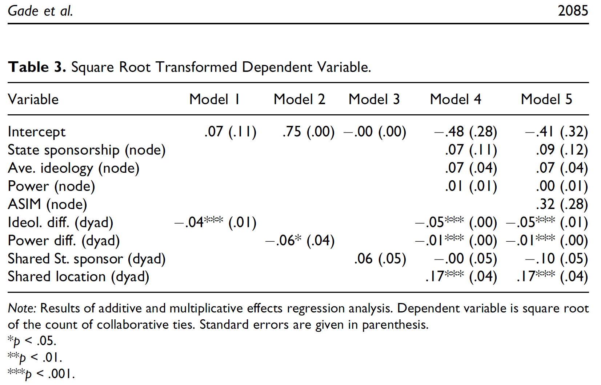

```{r setup, include=FALSE}
knitr::opts_chunk$set(echo = TRUE, fig.align = 'center', message = FALSE, warning = FALSE)
library(statnet)
library(devtools)
install_github("ochyzh/networkdata")
library(networkdata)

```


## Readings 
David R. Hunter, Mark S. Handcock, Carter T. Butts, Steven M. Goodreau, and Martina Morris. Ergm: A package to fit, simulate and diagnose exponential-family models for networks. *Journal of Statistical Software*, 24(3):1--29, 2008.

Emily Kalah Gade, Michael Gabbay, Mohammed M. Hafez, and Zane Kelly. Networks of cooperation: Rebel alliances in fragmented civil wars. *Journal of Conflict Resolution*, 63(9):2071--2097, 2019.
---
## ERGM Specification: Ground Rules

We will be working with a network that consists of the ten 10 most ideological senators from the 109th Congress. An edge $ij$ in this network is defined as equal to 1 if i cosponsored j at least two times. Suppose you think that senators are more likely to co-sponsor legisation if they:
a. Come from nearby states,
b. Have similar ideology.


---

## ERGM Specification: Ground Rules
[1] Your dependent variable must be a network object with binary edges. The `network` command creates network objects from edgelists or adjacency matrices. Pay attention to whether you are working with a directed or an undirected network.

```{r rule1, echo=TRUE, eval=FALSE, message=FALSE}
library(statnet)
library(devtools)
#install_github("ochyzh/networkdata")
library(networkdata)
```

```{r}
data(legnet)
mynet<-network(el, matrix.type="edgelist", 
                directed=TRUE, loops=FALSE)
```

---
## ERGM Specification: Ground Rules

[2] All edge-level/dyadic covariates must be stored as matrix objects and defined as *network attributes* using `set.network.attribute` command. Make sure your vertices are named/sorted the same way in all datasets.

```{r rule2, eval=TRUE, echo=TRUE, message=FALSE}
# Convert the object "edist" which contains euclidean distance (units in lat/long), to a matrix:
edist <- as.matrix(edist)
# Define network attribute
set.network.attribute(mynet,"dist",edist)
```
---
## ERGM Specification: Ground Rules

[3] All node-level covariates must be defined as *vertex attributes* using `set.vertex.attribute` command. Again, pay attention to names/order in which your nodes are sorted in the data.

```{r rule3, echo=TRUE, eval=TRUE, message=FALSE}
# Define object "dwnom" (ideology) as a vertex attribute
#detach("package:igraph", unload=TRUE) the below command seems to clash with igraph
set.vertex.attribute(mynet,"ideol",dwnom$dwnom)
```
---
## Your Turn

1. Plot the Cosponsorship Network. What network features (e.g., triangles, 2-stars) seem prevalent?
2. Estimate an `ergm` with edges, ideological, and geographic homophily;
3. Check goodness of fit. Plot observed values against boxplots of simulated networks.
4. Now add a control for popularity (`istar(2)`).
5. Check MCMC performance.  Does the trace plot look good?
6. Add a control for transitivity (`triangle`). If that does not work, try using `gwesp` instead.
7. Increase MCMC sample size to 10000. Make a trace plot.  Does it look good?

---
## Gade et al. 2019
- Why Do Rebel Groups Cooperate?
  + power
  + ideology
  + state sponsorship
  
- Ideological similarity is the primary driver for rebel cooperation.
---
## Gade et al. 2019 Hypothesis


Ideology:

- Ideological proximity in rebel networks should yield greater militant cooperation than ideological distance.

Power:

- An overriding concern for capability aggregation in rebel movements will tend to
produce *symmetric* alliances.
- The desire of strong groups to form alliances that maximize decision-making
autonomy vis-a-vis rivals will generate *asymmetric* alliances.

State sponsorship:

- Rebel groups that share the same state sponsor will cooperate more frequently.
---
## Data
```{r data, echo=TRUE, eval=TRUE}
# load data
data(gadeData)


gadeData #to look at the data

```
---
## Results

```{r res, out.width= "600px",fig.align="center", echo=FALSE}

```

---
## Replicate Gade et al's Analysis Using an ERGM

- Note that the command `ergm` requires the data to be saved as a `network` object.
- A `network` object may be constructed from a matrix or edgelist.
- Gade et al's dependent variable is `coopActions`.
```{r dv, echo=TRUE, eval=FALSE}
table(gadeData$coopActions) #the dv takes the following values.
hist(gadeData$coopActions)
```

---
## The Dependent Variable

- `coopActions` is coded as the square root of the total number of cooperative acts between rebel groups.
- For our purposes, we will recode this variable as binary, so that it equals to 1 if two groups cooperated at least once and 0 otherwise.

```{r dv1, echo=TRUE, eval=TRUE}
gadeData$coopBin<-as.numeric(gadeData$coopActions>0)
table(gadeData$coopBin)
```

---
## Dyadic Covariates

- Note that Gade et al' hypothesis are tested using four dyadic covariates: ideol_diff.dyad, powerdiff.dyad. These covariates are constructed as a function of nodal covariates.
- Also note that there are two edge-level covariates: loc.dyad (location), and spons.dyad (same sponsor). These need to be specified as separate networks.

---
## Prepare the Data

```{r prep, echo=TRUE, eval=TRUE}
# data characs
actors = sort(unique(c(gadeData$Var1, gadeData$Var2)))
gadeData<-sort(gadeData)
#These are the dyadic variables. They
#must be in matrix form.
dyadVars = names(gadeData)[c(12,5:8)]
n = length(actors) ; p = length(dyadVars)

# create empty arr object for all dyad vars
dyadArray = array(0, 
	dim=c(n,n,p),
	dimnames=list(actors,actors,dyadVars)
	)
```
---

```{r prep1, echo=TRUE, eval=TRUE}
# loop through and fill in
for(param in dyadVars){
	for(i in 1:nrow(gadeData)){
		a1 = gadeData$Var1[i]
		a2 = gadeData$Var2[i]
		val = gadeData[i,param]
		dyadArray[a1,a2,param] = val
	}
}
```
---
```{r prep2, echo=TRUE, eval=TRUE}
# These are node-level variables.
nodeVars = names(gadeData)[9:11]
nodeData = unique(gadeData[,c('Var1',nodeVars)])
rownames(nodeData) = nodeData$Var1
nodeData = nodeData[actors,c(-1)]

```
---
```{r prep3, echo=TRUE, eval=TRUE}
# The DV must be a network object
net = as.network(
	dyadArray[,,'coopBin'], 
	directed=FALSE, loops=FALSE, 
	matrix.type='adjacency'
	)

```


```{r prep4, echo=TRUE, eval=TRUE}
# Set node attributes
for(param in nodeVars){
	network::set.vertex.attribute(net, param, nodeData[,param])
}

# Set network attributes:
set.network.attribute(net,'loc.dyad',dyadArray[,,'loc.dyad'])
set.network.attribute(net,'spons.dyad',dyadArray[,,'spons.dyad'])
```

---
## Make a Network Graph:
```{r graph, echo=TRUE, eval=TRUE, message=FALSE, fig.width=10, fig.height=5.8}
plot(net, label = network.vertex.names(net))
```
---

## Estimate a Logit
```{r logit, echo=TRUE, message=FALSE, eval=TRUE}


m0 = ergm(
	net ~ 
    edges + 
    nodecov('averageId.node') +
    nodecov('size.node') + 
    nodecov('spons_actor.node') + 
    absdiff('averageId.node') +
    absdiff('size.node') +
    edgecov('loc.dyad') +
    edgecov('spons.dyad')
	)

```
---
## Estimate a Logit
```{r table, echo=TRUE, message=FALSE, eval=TRUE}
summary(m0)
```

---
## Add Triangles
```{r triangles, echo=TRUE, eval=TRUE}
m1 = ergm(
	net ~ 
    edges + 
    nodecov('averageId.node') +
    nodecov('size.node') + 
    nodecov('spons_actor.node') + 
    absdiff('averageId.node') +
    absdiff('size.node') +
    edgecov('loc.dyad') +
    edgecov('spons.dyad')+
		gwesp(decay = .5,fixed = TRUE)
		)

```
---
## Add Triangles

```{r triangles1, echo=TRUE, eval=TRUE}
summary(m1)
```

---
## Assess Model Fit
```{r fit, echo=TRUE, eval=TRUE, message=FALSE}
AIC(m1)
BIC(m1)

set.seed(6886)
gofM1 = gof( m1, 
    GOF=~degree+espartners+distance-model )


```
---
## Assess Model Fit
```{r fit1, echo=TRUE, eval=TRUE, message=FALSE, fig.width=10, fig.height=4}
# we'll compare against four plots, so set up plotting window
par(mfrow = c(2, 2))
plot(gofM1)
```

