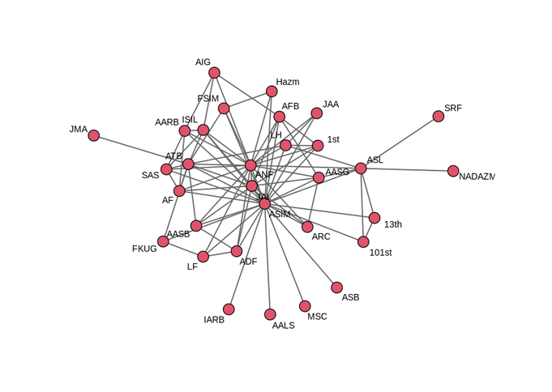

```{r setup, include=FALSE}
# Set run_code <- TRUE when you want the deck to execute the examples locally.
run_code <- FALSE

knitr::opts_chunk$set(
  echo = TRUE,
  eval = run_code,
  message = FALSE,
  warning = FALSE,
  fig.align = "center",
  fig.width = 8,
  fig.height = 5.5,
  out.width = "95%"
)
```


## Learning Goals

By the end of today, you should be able to:

1. Translate a substantive network hypothesis into an ERGM term.
2. Distinguish **nodal**, **dyadic**, and **endogenous network** predictors.
3. Prepare `network` objects, vertex attributes, and dyadic covariate matrices.
4. Build ERGM specifications incrementally.
5. Interpret `edgecov`, `nodecov`, `absdiff`, `mutual`, `degree/star`, and `gwesp` terms.
6. Diagnose convergence, degeneracy, and goodness of fit.
7. Explain why model selection is not just choosing the smallest AIC.

---

## Readings

- Hunter, Handcock, Butts, Goodreau, and Morris. 2008. “ergm: A Package to Fit, Simulate and Diagnose Exponential-Family Models for Networks.” *Journal of Statistical Software* 24(3): 1–29.

- Gade, Gabbay, Hafez, and Kelly. 2019. “Networks of Cooperation: Rebel Alliances in Fragmented Civil Wars.” *Journal of Conflict Resolution* 63(9): 2071–2097.

.lightbox[
Today is about **specification**: how to move from theory to model terms, and from model terms to diagnosis.
]

---

class: inverse, middle, center

# Specification Is a Theory-to-Term Translation Problem

---

## The Core Specification Question

ERGM specification starts with one question:

.questionbox[
What network features should be unusually common or uncommon if the theory is right?
]

Examples:

| Theory says... | Network configuration | ERGM term |
|---|---|---|
| Similar actors tie | Homophily | `nodematch()`, `absdiff()` |
| Ties are reciprocated | Mutual dyads | `mutual` |
| Popular actors attract ties | Degree concentration | `istar()`, `ostar()`, `gwidegree()` |
| Friends of friends connect | Closure / shared partners | `triangle`, `gwesp()` |
| Geography matters | Dyadic covariate | `edgecov()` |

---

## The Basic Conditional Interpretation

For a possible tie $i \rightarrow j$, an ERGM estimates:

$$\operatorname{logit}P(Y_{ij}=1\mid Y^c_{ij},X)
=
\boldsymbol{\theta}^T\Delta g_{ij}(y,X).$$

Where:

| Symbol | Meaning |
|---|---|
| $Y_{ij}$ | tie from actor $i$ to actor $j$ |
| $Y^c_{ij}$ | all other ties in the network |
| $X$ | nodal or dyadic covariates |
| $g(y,X)$ | network statistics and covariate statistics |
| $\Delta g_{ij}$ | change in those statistics if $Y_{ij}$ is toggled |
| $\theta$ | coefficients weighting those changes |

.lightbox[
A coefficient is easiest to interpret as the effect of a **tie toggle**, holding the rest of the network fixed.
]

---

## What Is a Change Statistic?

For any ERGM statistic $g(y)$:

$$\Delta g_{ij}(y) = g(y_{ij}^{+}) - g(y_{ij}^{-}).$$

Where:

- $y_{ij}^{+}$: the network with tie $i \rightarrow j$ set to 1.
- $y_{ij}^{-}$: the network with tie $i \rightarrow j$ set to 0.

Examples:

| Term | Change statistic when $i\rightarrow j$ is added |
|---|---|
| `edges` | always $+1$ |
| `mutual` | $+1$ if $j\rightarrow i$ already exists |
| `nodematch("party")` | $+1$ if $i$ and $j$ share party |
| `gwesp()` | discounted function of shared partners |

---

## Specification Should Be Incremental

Do **not** start with every term that sounds plausible.

A better workflow:

1. Fit a baseline density model.
2. Add exogenous covariates tied to the hypotheses.
3. Diagnose missing network structure.
4. Add dependence terms one at a time.
5. Check convergence and fit after each addition.
6. Stop when the model is theoretically defensible and diagnostically acceptable.

.warnbox[
A complicated ERGM that does not converge or generates degenerate networks is not an improvement over a simpler model.
]

---

## A Practical Specification Checklist

Before fitting an ERGM, answer these questions:

| Question | Why it matters |
|---|---|
| Is the network directed or undirected? | Determines sample space and valid terms |
| Are edges binary? | Standard `ergm()` requires binary edges unless using valued extensions |
| What is a node? | Defines the unit of analysis |
| What is an edge? | Defines the dependent variable |
| Are dyadic covariates aligned with the adjacency matrix? | Misalignment silently produces wrong estimates |
| Are nodal covariates attached as vertex attributes? | Required for `nodecov`, `absdiff`, `nodematch` |
| What network dependencies are theoretically expected? | Determines endogenous terms |

---

class: inverse, middle, center

# Ground Rules for ERGM Data

---

## Ground Rule 1: The DV Must Be a Network Object

Your dependent variable is an adjacency matrix or edgelist converted to a `network` object.

```{r packages, eval=FALSE}
library(tidyverse)
library(statnet)
# install.packages("devtools")
# devtools::install_github("ochyzh/networkdata")
library(networkdata)
```

```{r legnet-network, eval=FALSE}
data(legnet)

mynet <- network(
  net,
  matrix.type = "adjacency",
  directed = TRUE,
  loops = FALSE
)
```

.lightbox[
Always verify whether ties are directed, whether loops are allowed, and whether the matrix rows and columns name the same actors in the same order.
]

---

## Ground Rule 2: Dyadic Covariates Are Matrices

A dyadic covariate has one value for every possible pair $i,j$.

Examples:

- geographic distance between two senators;
- trade volume between two countries;
- shared sponsor between two rebel groups;
- same location indicator.

```{r dyadic-covariate, eval=FALSE}
# edist contains geographic distance among senators.
edist <- as.data.frame(edist)
edist <- as.matrix(edist)

# Attach the matrix as a network attribute.
set.network.attribute(mynet, "dist", edist)
```

.warnbox[
The matrix must be ordered exactly like the network object. Check names before estimating.
]

---

## Ground Rule 3: Nodal Covariates Are Vertex Attributes

A nodal covariate has one value for each actor.

Examples:

- senator ideology;
- rebel group size;
- whether a group has state sponsorship;
- regime type of a country.

```{r nodal-covariate, eval=FALSE}
# dwnom contains ideology scores and senator labels.
dwnom <- dwnom |> arrange(labs)

set.vertex.attribute(
  mynet,
  "ideol",
  dwnom$dwnom
)
```

A safer version uses actor names:

```{r nodal-covariate-safe, eval=FALSE}
set.vertex.attribute(
  mynet,
  "ideol",
  dwnom$dwnom,
  v = match(mynet %v% "vertex.names", dwnom$labs)
)
```

---

## Ground Rule 4: Check Alignment Explicitly

```{r check-alignment, eval=FALSE}
# Network vertex names
network.vertex.names(mynet)

# Dyadic covariate row and column names
rownames(edist)
colnames(edist)

# Nodal covariate names
head(dwnom$labs)
```

A quick diagnostic:

```{r alignment-diagnostic, eval=FALSE}
all(network.vertex.names(mynet) == rownames(edist))
all(network.vertex.names(mynet) == colnames(edist))
all(network.vertex.names(mynet) %in% dwnom$labs)
```

.goodbox[
If these return `FALSE`, fix the ordering before estimating the model.
]

---

## Term Types: What Kind of Variable Is It?

| Covariate type | Data structure | ERGM term | Example interpretation |
|---|---|---|---|
| Network density | network itself | `edges` | baseline tendency to form ties |
| Dyadic covariate | matrix | `edgecov()` | nearby states cosponsor more |
| Nodal continuous covariate | vertex attribute | `nodecov()` | larger groups cooperate more |
| Nodal similarity | vertex attribute | `absdiff()` | ideological distance reduces cooperation |
| Nodal match | vertex attribute | `nodematch()` | same party increases tie probability |
| Endogenous dependence | network itself | `mutual`, `gwesp()` | reciprocity, closure, popularity |

---

class: inverse, middle, center

# Senator Cosponsorship

---

## Example: Ideological Senators

We have a network of the 9 most ideological senators from the 109th Congress.

An edge $i\rightarrow j$ equals 1 if senator $i$ cosponsored senator $j$ at least two times.

Suppose the theory says senators are more likely to cosponsor if they:

1. come from nearby states;
2. have similar ideology.

.questionbox[
Which terms would you include? What signs do you expect?
]

---

## A First Cosponsorship Specification

```{r senator-specification, eval=FALSE}
m_senate <- ergm(
  mynet ~
    edges +
    edgecov("dist") +
    absdiff("ideol")
)
```

Expected signs:

| Term | Meaning | Expected sign |
|---|---|---:|
| `edges` | baseline tie propensity | with no covariates, usually negative in sparse networks (for $p<1-p$: $\log(\frac{p}{1-p})<0$) |
| `edgecov("dist")` | geographic distance | negative if nearby states cosponsor more |
| `absdiff("ideol")` | ideological distance | negative if similar ideology increases cosponsorship |

---

## What This Model Does **Not** Yet Include

The covariate model assumes that, conditional on distance and ideology, ties are otherwise independent.

But cosponsorship networks may also show:

- popularity: some senators attract many cosponsors;
- activity: some senators cosponsor many others;
- reciprocity: senators return support;
- closure: allies of allies cosponsor together.

.lightbox[
Add endogenous terms only when they represent a theoretical process or diagnose a clear fit problem.
]

---

## Your Turn: Specify a Senator ERGM


| Hypothesis | ERGM term | Expected sign | Why? |
|---|---|---:|---|
| Nearby states cosponsor | | | |
| Similar ideology cosponsors | | | |
| Popular senators attract cosponsors | | | |
| Senators return cosponsorship | | | |
| Cosponsorship closes triangles | | | |

.questionbox[
Specify one defensible model formula and justify each term. Estimate and interpret.
]

---

class: inverse, middle, center

# Main Case: Rebel Cooperation Networks

---

## Gade et al. 2019: Why Do Rebel Groups Cooperate?

Gade et al. examine cooperation among rebel groups in fragmented civil wars.

They focus on three mechanisms:

1. **Ideology:** ideologically similar groups cooperate.
2. **Power:** groups cooperate to aggregate capabilities or manage asymmetry.
3. **State sponsorship:** groups sharing a state sponsor cooperate more.

.lightbox[
Today we use their data as a specification exercise: how do we move from these hypotheses to an ERGM?
]

---

## Translate Theory Into Terms

| Mechanism | Observable implication | ERGM term |
|---|---|---|
| Ideological proximity | smaller ideology difference increases cooperation | `absdiff("averageId.node")` or `edgecov("ideol_diff")` |
| Capability aggregation | larger groups may cooperate more | `nodecov("size.node")` |
| Power symmetry | similar-sized groups cooperate | `absdiff("size.node")` |
| State sponsorship | state-sponsored actors may cooperate more | `nodecov("spons_actor.node")` |
| Shared sponsor | same sponsor increases cooperation | `edgecov("spons.dyad")` |
| Geography | same location increases cooperation | `edgecov("loc.dyad")` |
| Transitivity | partners of partners cooperate | `gwesp()` |

---

## Load the Data

```{r gade-load, eval=FALSE}
load("./data/gadeData.rda")

glimpse(gadeData)
```

Key columns:

| Variable | Meaning |
|---|---|
| `Var1`, `Var2` | rebel group pair |
| `coopActions` | square root of cooperative actions |
| `ideol_diff.dyad` | dyadic ideology difference |
| `powerdiff.dyad` | dyadic power difference |
| `loc.dyad` | dyadic location covariate |
| `spons.dyad` | shared sponsor covariate |
| `averageId.node`, `size.node`, `spons_actor.node` | node-level covariates |

---

## Recode the Dependent Variable

`ergm()` for binary networks needs a binary edge variable.

The original outcome is valued:

```{r gade-recode, eval=FALSE}
table(gadeData$coopActions)
hist(gadeData$coopActions)
```

For this lecture, recode cooperation as:

$$
Y_{ij}=1 \quad \text{if groups } i \text{ and } j \text{ cooperated at least once.}
$$

```{r gade-binary, eval=FALSE}
gadeData <- gadeData |>
  mutate(coopBin = as.numeric(coopActions > 0))

table(gadeData$coopBin)
```

---

## Why Recode?

This recoding changes the question.

| Original valued outcome | Binary ERGM outcome |
|---|---|
| How much did groups cooperate? | Did groups cooperate at all? |
| Weighted edge | Binary edge |
| Requires valued network model | Standard binary ERGM |

---
class: inverse, middle, center
# Setting Up the Data
---
## From Dyadic Data to ERGM Objects

Each row of `gadeData` describes one pair of actors.

To estimate an ERGM, we need to reorganize the data into three kinds of objects:

| Information                  | ERGM representation       |
| ---------------------------- | ------------------------- |
| Whether two actors cooperate | Adjacency matrix          |
| Characteristics of a pair    | Dyadic covariate matrices |
| Characteristics of one actor | Vertex attributes         |

.lightbox[
The central rule: every object must use the same actors in the same order.
]

---

## Step 1: Create a Master Actor List

```{r create-actors, eval=FALSE}
actors <- sort(
  unique(c(gadeData$Var1, gadeData$Var2))
)

n <- length(actors)
```

What this does:

* combines actors appearing in either dyad position;
* removes duplicate names;
* sorts the names alphabetically;
* stores the number of actors in `n`.

.lightbox[
The vector `actors` becomes the master ordering for all matrices and node-level data.
]

---

## Why Actor Order Matters

Suppose the first three actors are:

```{r actor-example, eval=FALSE}
actors[1:3]
```

Every network object must use this same order:

```text
             Actor A   Actor B   Actor C
Actor A          0         1         0
Actor B          1         0         1
Actor C          0         1         0
```

The row and column names identify which actors each matrix cell refers to.

.lightbox[
Matching dimensions is not enough. The actor names must also be aligned.
]

---

## Step 2: Identify the Dyadic Variables

```{r dyad-variable-names, eval=FALSE}
dyad_vars <- c(
  "coopBin",
  "loc.dyad",
  "spons.dyad"
)
```

These variables describe pairs of actors:

* `coopBin`: whether the pair cooperates;
* `loc.dyad`: whether the pair shares a location;
* `spons.dyad`: whether the pair shares a sponsor.

The first becomes the dependent-network adjacency matrix.

The others become dyadic covariate matrices.

---

## Step 3: Create a Stack of Matrices

```{r create-dyad-array, eval=FALSE}
dyadArray <- array(
  0,
  dim = c(n, n, length(dyad_vars)),
  dimnames = list(
    actors,
    actors,
    dyad_vars
  )
)
```

Think of `dyadArray` as a stack of square matrices:

```r
dyadArray[, , "coopBin"]
dyadArray[, , "loc.dyad"]
dyadArray[, , "spons.dyad"]
```

Each matrix has:

* actors in the rows;
* actors in the columns;
* one dyadic variable in its cells.

---

## Understanding the Three Dimensions

The dimensions are:

```r
dim(dyadArray)
```

Conceptually:

| Dimension | Meaning         |
| --------: | --------------- |
|         1 | Row actor       |
|         2 | Column actor    |
|         3 | Dyadic variable |

For example:

```{r array-index-example, eval=FALSE}
dyadArray["Actor A", "Actor B", "coopBin"]
```

asks:

> What is the cooperation value for Actor A and Actor B?

---

## The Array Starts with Zeros

```{r array-zero-initialization, eval=FALSE}
dyadArray <- array(
  0,
  dim = c(n, n, length(dyad_vars)),
  dimnames = list(actors, actors, dyad_vars)
)
```

Initially, every matrix cell equals zero.

The loop will replace those zeros with observed values from `gadeData`.

The diagonal remains zero because self-ties are not allowed:

$$
Y_{ii}=0.
$$

---

## Step 4: Fill the Dyadic Matrices

```{r fill-dyad-array, eval=FALSE}
for (v in dyad_vars) {

  for (r in seq_len(nrow(gadeData))) {

    a1 <- gadeData$Var1[r]
    a2 <- gadeData$Var2[r]
    val <- gadeData[[v]][r]

    dyadArray[a1, a2, v] <- val
    dyadArray[a2, a1, v] <- val
  }
}
```

The outer loop selects one dyadic variable.

The inner loop reads the dyads one row at a time.

---

## Reading One Row of the Dyadic Data

Within each iteration:

```{r read-one-dyad, eval=FALSE}
a1 <- gadeData$Var1[r]
a2 <- gadeData$Var2[r]
val <- gadeData[[v]][r]
```

This asks:

1. Who is the first actor?
2. Who is the second actor?
3. What value should be stored for this variable?

For example:

```text
Var1 = A
Var2 = B
coopBin = 1
```

means that actors A and B have a cooperation tie.

---

## Place the Value in the Matrix

```{r place-dyad-value, eval=FALSE}
dyadArray[a1, a2, v] <- val
```

This places the value in:

* the row corresponding to `a1`;
* the column corresponding to `a2`;
* the matrix corresponding to variable `v`.

For example:

```r
dyadArray["A", "B", "coopBin"] <- 1
```

records a cooperation tie between A and B.

---

## Why Fill Both Directions?

```{r symmetric-assignment, eval=FALSE}
dyadArray[a1, a2, v] <- val
dyadArray[a2, a1, v] <- val
```

The network is undirected, so:

$$Y_{ij}=Y_{ji}.$$

If A cooperates with B, then B also cooperates with A.

Therefore, each value must be copied across the diagonal.

.lightbox[
For a directed network, we would not automatically copy the value to the reverse dyad.
]

---

## Check That the Matrices Are Symmetric

```{r check-symmetry, eval=FALSE}
isSymmetric(dyadArray[, , "coopBin"])
isSymmetric(dyadArray[, , "loc.dyad"])
isSymmetric(dyadArray[, , "spons.dyad"])
```

Each result should be:

```text
TRUE
```

You can also inspect one matrix directly:

```{r inspect-dyad-matrix, eval=FALSE}
dyadArray[, , "coopBin"]
```

---

## Step 5: Separate the Node-Level Variables

```{r identify-node-covariates, eval=FALSE}
node_vars <- c(
  "averageId.node",
  "size.node",
  "spons_actor.node"
)
```

These variables describe individual actors rather than pairs:

* `averageId.node`: actor-level ideology;
* `size.node`: actor size or capability;
* `spons_actor.node`: actor-level sponsorship characteristic.

.lightbox[
Dyadic variables describe pairs. Node variables describe one actor at a time.
]

---

## Create One Row per Actor

```{r create-node-data, eval=FALSE}
nodeData <- gadeData |>
  select(
    Var1,
    all_of(node_vars)
  ) |>
  distinct() |>
  rename(actor = Var1)
```

The original dyadic data contain repeated observations of each actor.

`distinct()` removes those repetitions and keeps one row per actor.

---

## Align the Node Data with the Network

```{r align-node-data, eval=FALSE}
rownames(nodeData) <- nodeData$actor

nodeData <- nodeData[
  actors,
  node_vars
]
```

This step:

* labels each row with the actor name;
* reorders the rows using the master actor list;
* keeps only the node-level covariates.

.lightbox[
The rows of `nodeData` now correspond exactly to the vertices in the network.
]

---

## Verify the Alignment

```{r verify-node-alignment, eval=FALSE}
identical(
  rownames(nodeData),
  actors
)
```

This should return:

```text
TRUE
```

You can also inspect the first few actors:

```{r inspect-node-alignment, eval=FALSE}
head(
  data.frame(
    actor = actors,
    nodeData
  )
)
```

---

## Final Objects

After these steps, we have:

```r
dyadArray[, , "coopBin"]
```

The adjacency matrix for the dependent network.

```r
dyadArray[, , "loc.dyad"]
dyadArray[, , "spons.dyad"]
```

The dyadic covariate matrices.

```r
nodeData
```

The actor-level covariates.

.lightbox[
Dyadic data become matrices. Actor data become vertex attributes.
]

---

## Create the Network Object

```{r create-network, eval=FALSE}
gadeNet <- network(
  dyadArray[, , "coopBin"],
  matrix.type = "adjacency",
  directed = FALSE,
  loops = FALSE
)
```

The `coopBin` slice becomes the observed network.

Because the network is undirected:

```r
is.directed(gadeNet)
```

should return:

```text
FALSE
```

---

## Attach the Dyadic Covariates

```{r attach-dyadic-covariates, eval=FALSE}
set.network.attribute(
  gadeNet,
  "loc.dyad",
  dyadArray[, , "loc.dyad"]
)

set.network.attribute(
  gadeNet,
  "spons.dyad",
  dyadArray[, , "spons.dyad"]
)
```

These matrices can later be included in an ERGM using terms such as:

```r
edgecov("loc.dyad")
edgecov("spons.dyad")
```

---

## Attach the Node-Level Covariates

```{r attach-node-covariates, eval=FALSE}
for (v in node_vars) {
  set.vertex.attribute(
    gadeNet,
    v,
    nodeData[[v]]
  )
}
```

Each column of `nodeData` becomes a vertex attribute.

Check the result:

```r
list.vertex.attributes(gadeNet)
```

---

## The Complete Data Transformation

```text
Dyad-level data frame
          |
          |-- cooperation variable
          |        |
          |        --> adjacency matrix
          |
          |-- pair-level variables
          |        |
          |        --> dyadic covariate matrices
          |
          |-- actor-level variables
                   |
                   --> vertex attributes
```

.lightbox[
The purpose of the code is not merely to reshape data. It is to ensure that every network object refers to the same actors in the same order.
]


---

## Visualize the Rebel Cooperation Network

```{r gade-plot, eval=FALSE, fig.width=9, fig.height=7}
set.seed(6886)

plot(
  net,
  label = network.vertex.names(net),
  label.cex = 0.7,
  vertex.cex = 1.5,
  edge.col = "gray40"
)
```

- Is the network sparse or dense?
- Are there isolates?
- Are there clusters?
- Does cooperation appear locally closed?
- Are some groups especially central?

---

## Visualize the Rebel Cooperation Network

<div style="text-align:center;">
  
</div>

---

class: inverse, middle, center

# Building the ERGM Specification

---

## Model 0: Exogenous Covariate Model

Start with terms tied directly to the hypotheses.

```{r model0, eval=FALSE}
m0 <- ergm(
  net ~
    edges +
    nodecov("averageId.node") +
    nodecov("size.node") +
    nodecov("spons_actor.node") +
    absdiff("averageId.node") +
    absdiff("size.node") +
    edgecov("loc.dyad") +
    edgecov("spons.dyad")
)
```

.lightbox[
This is still close to a dyadic logit: it includes covariates, but no endogenous dependence terms.
]

---

## What Each Term Means

| Term | Change statistic | Interpretation of positive coefficient |
|---|---|---|
| `edges` | adds one tie | higher baseline tie propensity |
| `nodecov("averageId.node")` | sum of endpoint ideology values | groups with higher ideology scores have more ties |
| `nodecov("size.node")` | sum of endpoint sizes | larger groups have more ties |
| `nodecov("spons_actor.node")` | sum of endpoint sponsorship indicators | sponsored groups have more ties |
| `absdiff("averageId.node")` | absolute ideology difference | more ideological distance increases ties |
| `absdiff("size.node")` | absolute size difference | greater size difference increases ties |
| `edgecov("loc.dyad")` | dyadic location value | location covariate increases ties |
| `edgecov("spons.dyad")` | shared sponsor value | shared sponsor increases ties |

.warnbox[
For `absdiff()`, a negative coefficient is the usual homophily result: smaller differences imply higher tie probability.
]

---

## Interpreting Model 0 Results

Approximate results from the covariate-only model:

| Term | Estimate | Interpretation |
|---|---:|---|
| `edges` | -7.31 | sparse baseline network |
| `nodecov.averageId.node` | 0.43 | higher ideology score associated with more cooperation |
| `nodecov.size.node` | 0.11 | larger groups cooperate more |
| `nodecov.spons_actor.node` | 0.54 | sponsored actors may cooperate more |
| `absdiff.averageId.node` | -0.22 | ideological similarity increases cooperation |
| `absdiff.size.node` | -0.10 | similar-sized groups cooperate more |
| `edgecov.loc.dyad` | 3.01 | location covariate strongly increases cooperation |
| `edgecov.spons.dyad` | 0.04 | little evidence of shared-sponsor effect |


---

## Convert to Conditional Probability

For a candidate tie:

$$P(Y_{ij}=1\mid Y^c_{ij},X)
=
\operatorname{logit}^{-1}
\left(\boldsymbol{\theta}^T\Delta g_{ij}\right).$$


For a simplified example using only `edges` and one covariate:

```{r simple-probability, eval=FALSE}
p0 <- plogis(coef(m0)["edges"])
p_same_location <- plogis(
  coef(m0)["edges"] + coef(m0)["edgecov.loc.dyad"]
)
```

.warnbox[
Only calculate probabilities after stating which change statistics are being held at zero or set to one.
]

---

## Why the Covariate Model May Be Incomplete

The model may fit covariate hypotheses but still miss network structure.

Potential omitted dependencies:

| Missing structure | What it looks like | Candidate term |
|---|---|---|
| Transitivity | partners of partners cooperate | `gwesp()` |
| Popularity | some groups attract many ties | `istar()`, `gwidegree()` |
| Activity | some groups send many ties | directed: `ostar()`, `gwodegree()` |
| Reciprocity | $i\rightarrow j$ and $j\rightarrow i$ | directed: `mutual` |

.lightbox[
The next step is not “add everything.” It is “diagnose what the covariate model fails to reproduce.”
]

---
class: inverse, middle, center

# Modeling outgoing actors who send out many ties

---

## Sender Activity in Directed Networks

In a directed network, actors can vary in how many ties they **send**.

Examples:

* rebel groups that cooperate with many partners;
* senators who cosponsor many others;
* states that initiate many alliances;
* students who nominate many friends.

The number of outgoing ties sent by actor $i$ is its **outdegree**:

$$d_i^{out}=\sum_j Y_{ij}.$$

.lightbox[
Outdegree terms model sender activity: who sends many ties?
]

---

## What Is an Out-Star?

An **out-star** is a configuration where one actor sends ties to multiple others.

A 2-out-star looks like this:

```text
      j

      ↑

      i  →  k
```

Actor $i$ sends ties to both $j$ and $k$.

.lightbox[
Out-stars capture whether outgoing ties are concentrated among active senders.
]

---

## The ERGM Term `ostar(k)`

The ERGM term `ostar(k)` counts the number of $k$-outstars in a directed network.

For example:

```r
ostar(2)
```

counts all 2-outstars.

If actor $i$ has outdegree $d_i^{out}$, then the number of 2-outstars centered on $i$ is:

$$
{d_i^{out} \choose 2}=\frac{d_i^{out}!}{2!(d_i^{out}-2)!}.
$$

Across the whole network:

$$
g_{\text{ostar(2)}}(y)=\sum_i {d_i^{out} \choose 2}=\sum_i \frac{d_i^{out}!}{2!(d_i^{out}-2)!}
$$

---

## Example: Counting 2-Out-Stars

Suppose actor A sends ties to B, C, and D.

```text
      B

      ↑

C  ←  A  →  D
```

Actor A has outdegree:

$$
d_A^{out}=3.
$$

The number of 2-outstars centered on A is:

$$
{3 \choose 2}=3.
$$

Those outstars are:

* A sends to B and C;
* A sends to B and D;
* A sends to C and D.

---

## Change Statistic for `ostar(2)`

Suppose actor $i$ currently has outdegree $d_i^{out}$.

If we add one outgoing tie from $i$ to another actor, the change in `ostar(2)` is:

$$\Delta g_{\text{ostar(2)}}= {d_i^{out}+1 \choose 2}-{d_i^{out} \choose 2}=d_i^{out}.$$

| Current sender outdegree | Change in `ostar(2)` |
| -----------------------: | -------------------: |
|                        0 |                    0 |
|                        1 |                    1 |
|                        2 |                    2 |
|                        5 |                    5 |

.lightbox[
The same new tie has a larger effect when it is sent by an actor who already sends many ties.
]

---

## Interpreting `ostar(2)`

In conditional logit form:

$$\operatorname{logit}P(Y_{ij}=1\mid Y_{ij}^c)=\cdots+\theta_{\text{ostar(2)}}\Delta g_{\text{ostar(2)}}.$$

A positive `ostar(2)` coefficient means:

> actors who already send many ties are more likely to send additional ties.

A negative coefficient means:

> outgoing ties are more evenly distributed across actors.

.lightbox[
`ostar(2)` models sender expansiveness or activity concentration.
]

---

## From Log Odds to Probability

For a simple model with only `edges` and `ostar(2)`:

$$P(Y_{ij}=1\mid Y_{ij}^c)=\operatorname{logit}^{-1}
\left[
\theta_{\text{edges}}
+
\theta_{\text{ostar(2)}}d_i^{out}
\right].$$

In R:

```r
plogis(
  theta_edges +
  theta_ostar2 * sender_outdegree
)
```

The probability effect depends on the sender's current outdegree.

---

## Why Not Add Many Out-Star Terms?

We could include several terms:

```r
ostar(2) + ostar(3) + ostar(4)
```

But this can be hard to use well.

Problems:

* the terms are closely related;
* high-outdegree actors can dominate the statistic;
* models can become unstable;
* interpretation becomes difficult.

.lightbox[
`ostar(k)` is useful for understanding the logic, but applied models often use smoother degree terms.
]

---

## Geometrically Weighted Outdegree: `gwodegree`

`gwodegree()` summarizes the **entire outdegree distribution** using geometrically declining weights.

Example:

```r
gwodegree(decay = 0.5, fixed = TRUE)
```

It asks:

> Does the model need to account for the way outgoing ties are distributed across actors?

.lightbox[
`gwodegree` is a compact way to model sender activity across the whole network.
]

---

## What Does “Geometrically Weighted” Mean?

“Geometrically weighted” means that degree counts are combined using weights that follow a geometric pattern.

The practical intuition is:

> the first few outgoing ties matter most; additional outgoing ties receive progressively less marginal weight.

| Sender outdegree | Intuition                          |
| ---------------: | ---------------------------------- |
|           0 to 1 | Large change                       |
|           1 to 2 | Still important                    |
|           5 to 6 | Smaller marginal contribution      |
|         20 to 21 | Much smaller marginal contribution |

.lightbox[
Geometrically weighted terms smooth the degree distribution instead of counting each star size separately.
]

---

## `ostar` vs. `gwodegree`

| Term          | What it captures                            | Best use                               |
| ------------- | ------------------------------------------- | -------------------------------------- |
| `ostar(2)`    | Pairs of outgoing ties from the same sender | Teaching sender concentration          |
| `ostar(k)`    | A specific size of out-star                 | Testing a specific star configuration  |
| `gwodegree()` | Weighted outdegree distribution             | Modeling sender activity more smoothly |

`ostar(k)` focuses on one specific star size.

`gwodegree()` summarizes many outdegree patterns with one term.

---

## Interpreting `gwodegree`

A positive `gwodegree` coefficient usually means:

> outgoing ties are more concentrated among active senders than the rest of the model would predict.

A negative coefficient usually means:

> outgoing ties are more evenly distributed across senders.

But interpretation depends on:

* the decay parameter;
* other terms in the model;
* whether the term improves fit to the outdegree distribution.

.lightbox[
Use `gwodegree` when your model underfits sender activity in the GOF plots.
]

---

## When Would We Add `gwodegree`?

Add `gwodegree` when:

* a few actors send many more ties than others;
* the GOF plot shows poor fit to the outdegree distribution;
* theory suggests some actors are especially active initiators;
* `ostar(k)` terms are too unstable.

Example specification:

```r
m_sender <- ergm(
  gadeNet ~
    edges +
    edgecov("loc.dyad") +
    edgecov("spons.dyad") +
    gwodegree(decay = 0.5, fixed = TRUE)
)
```

---
class: inverse, middle, center

# Back to Gade et al example

---

## Add Transitivity: Why `gwesp()`?

A raw `triangle` term can cause degeneracy because each additional shared partner increases log-odds linearly.

`gwesp()` models closure with diminishing returns:

- the first shared partner matters most;
- additional shared partners are discounted;
- the decay parameter controls the discounting.

```{r model1, eval=FALSE}
m1 <- ergm(
  net ~
    edges +
    nodecov("averageId.node") +
    nodecov("size.node") +
    nodecov("spons_actor.node") +
    absdiff("averageId.node") +
    absdiff("size.node") +
    edgecov("loc.dyad") +
    edgecov("spons.dyad") +
    gwesp(decay = 0.5, fixed = TRUE)
)
```

---

## Interpreting `gwesp()`

`gwesp()` captures **edgewise shared partners**.

For an existing or potential edge $i-j$, shared partners are actors connected to both $i$ and $j$.

A positive `gwesp` coefficient means:

> Conditional on the other terms, ties are more likely when they close locally connected configurations.

Approximate result:

| Term | Estimate | Interpretation |
|---|---:|---|
| `gwesp.fixed.0.5` | 1.28 | strong evidence of local closure / transitivity |

.warnbox[
The exact `gwesp()` change statistic is curved and discounted. Interpret the sign and model fit, not as a simple “one triangle” coefficient.
]

---

## Model 1 Results: What Changed?

Adding `gwesp()` changes the interpretation of the covariate terms because dependence is now modeled.

| Term | Model 0 | Model 1 | Main change |
|---|---:|---:|---|
| `edges` | -7.31 | -7.62 | baseline remains sparse |
| `averageId.node` | 0.43 | 0.25 | smaller once closure is included |
| `size.node` | 0.11 | 0.06 | smaller once closure is included |
| `absdiff.averageId.node` | -0.22 | -0.21 | ideology similarity remains |
| `absdiff.size.node` | -0.10 | -0.07 | power similarity remains |
| `loc.dyad` | 3.01 | 2.65 | location still matters |
| `spons.dyad` | 0.04 | 0.13 | still weak |
| `gwesp` | — | 1.28 | closure is important |

.lightbox[
Adding dependence terms can change covariate estimates because some apparent covariate effects may reflect network structure.
]

---

## Model Comparison Is Not Just AIC

```{r compare-aic, eval=FALSE}
AIC(m0, m1)
BIC(m0, m1)
```

Use a hierarchy:

1. **Theory:** Does each term represent a defensible mechanism?
2. **Convergence:** Did the model estimate reliably?
3. **Degeneracy:** Does it generate plausible networks?
4. **Goodness of fit:** Does it reproduce important features?
5. **Information criteria:** Do AIC/BIC improve among reasonable models?

.goodbox[
AIC/BIC are useful only after the model is theoretically and diagnostically plausible.
]

---

class: inverse, middle, center

# Diagnostics and Fit

---

## Check MCMC Performance

After fitting a model with dependence terms:

```{r mcmc-diagnostics, eval=FALSE}
mcmc.diagnostics(m1)
```

Look for:

| Diagnostic | Good sign | Bad sign |
|---|---|---|
| Trace plot | noisy mixing around stable center | trend, drift, stuck chain |
| Autocorrelation | declines quickly | remains high |
| Sample statistics | centered near observed values | far from observed |
| MCMC percentage | small | large / unstable |

.warnbox[
A coefficient table is not enough. If the chain looks bad, do not interpret the model.
]

---

## Check Goodness of Fit

`gof()` simulates networks from the fitted ERGM and compares them to the observed network.

```{r gof-model1, eval=FALSE}
set.seed(6886)

gof_m1 <- gof(
  m1,
  GOF = ~ degree + espartners + distance - model
)

plot(gof_m1)
```

Interpretation:

- The observed statistic should fall within the simulated distribution.
- A model can converge but still fit important features poorly.
- Included terms often fit better than omitted terms.

---

## What GOF Statistics Mean

| GOF statistic | What it checks |
|---|---|
| `degree` | distribution of number of ties per node |
| `idegree` | distribution of incoming ties in a directed network |
| `odegree` | distribution of outgoing ties in a directed network |
| `espartners` | edgewise shared partners; local closure among tied dyads |
| `distance` | shortest-path distances and connectivity structure |
| `model` | statistics included in the model |

.lightbox[
GOF asks whether simulated networks from the fitted model look like the observed network on features we care about.
]

---

## If Fit Is Poor, What Next?

| Problem | Possible response |
|---|---|
| Degree distribution poorly fit | add degree/star/geometrically weighted degree term |
| Shared partners poorly fit | add or revise closure term such as `gwesp()` |
| Distance distribution poorly fit | consider components, isolates, or structural constraints |
| Model degenerates | simplify terms; replace raw triangles with GW terms |
| Chain does not mix | increase MCMC settings; simplify specification |
| Covariate effect changes sharply | check whether covariate proxies for network structure |

---

## Increasing MCMC Sample Size

If the model is substantively reasonable but MCMC performance is weak, try more samples.

```{r bigger-mcmc, eval=FALSE}
m1_big <- ergm(
  formula(m1),
  control = control.ergm(
    seed = 6886,
    MCMC.samplesize = 10000,
    MCMC.interval = 1000,
    MCMLE.maxit = 20
  )
)

mcmc.diagnostics(m1_big)
```

.warnbox[
More iterations do not fix a misspecified or degenerate model. They only help if the chain needs more time to explore a reasonable target distribution.
]

---

## Degeneracy: The Failure Mode to Watch For

An ERGM is degenerate when it places most probability on unrealistic networks, often:

- nearly empty networks;
- nearly complete networks;
- networks that are structurally unlike the observed network.

Symptoms:

- simulation produces extreme networks;
- trace plots jump or drift between modes;
- estimation fails or produces huge standard errors;
- adding raw `triangle` terms causes instability.

.goodbox[
Degeneracy is usually a specification problem, not just a computational problem.
]

---

## Common Specification Fixes

| Instead of... | Try... | Why |
|---|---|---|
| raw `triangle` | `gwesp(decay=.5, fixed=TRUE)` | discounted closure |
| many `istar(k)` terms | `gwidegree()` or simpler degree term | smoother degree structure |
| many weak covariates | theory-driven subset | less overfitting |
| one huge model | incremental models | easier diagnosis |
| interpreting failed estimates | simplify and refit | avoid false precision |

---

class: inverse, middle, center

# Lab: Build, Diagnose, Revise

---

## Your Turn

Use the rebel cooperation data.

- Choose **one** dependence term to add.

Options:

| If you expect... | Try... |
|---|---|
| popular nodes | `degree()` / `kstar(k)` / `gwdegree()` |
| isolates or components | consider structural constraints or degree terms |


- Estimate the model with the new term

- Use diagnostics to check convergence and fit

    - Did the model converge?
    - Does the MCMC chain mix?
    - Does GOF improve on theoretically relevant features?
    - Which term would you add, remove, or replace next?

---


## Review Questions

Answer in two or three sentences:

1. What is the difference between a dyadic covariate and an endogenous network term?
2. Why is `absdiff("averageId.node")` a homophily term?
3. What would a positive `gwesp` coefficient mean in the rebel cooperation network?
4. Name one diagnostic you should check before interpreting an ERGM.

---

## Key Takeaways

1. ERGM specification is the translation of theory into network configurations.
2. Covariates and endogenous terms answer different questions.
3. Data alignment is not a clerical issue; it determines whether the model is meaningful.
4. Build models incrementally and diagnose each step.
5. Interpret coefficients conditionally, as tie-toggle effects.
6. A useful ERGM must be theoretically motivated, computationally stable, and able to simulate plausible networks.

---

## Appendix: Quick Reference for Terms

| Term | Use when... |
|---|---|
| `edges` | every model; baseline density |
| `edgecov()` | dyadic matrix covariate |
| `nodecov()` | nodal covariate affects general tie propensity |
| `nodeicov()` | receiver effect in directed network |
| `nodeocov()` | sender effect in directed network |
| `absdiff()` | similarity on continuous nodal variable |
| `nodematch()` | same category / homophily |
| `mutual` | reciprocity in directed network |
| `istar()`, `ostar()` | popularity/activity stars |
| `gwesp()` | transitive closure with discounting |
| `gwidegree()`, `gwodegree()` | degree heterogeneity with discounting |


