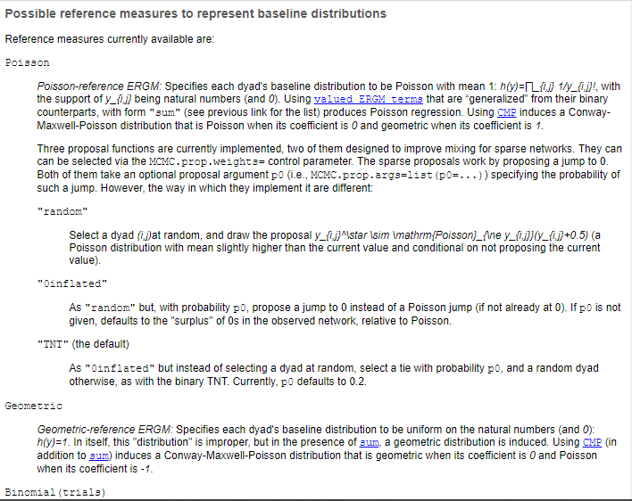
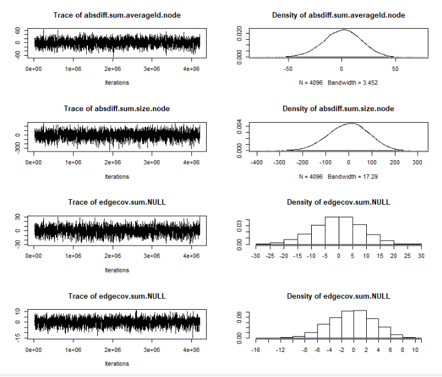
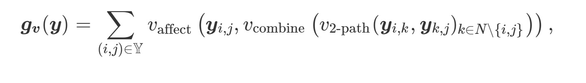
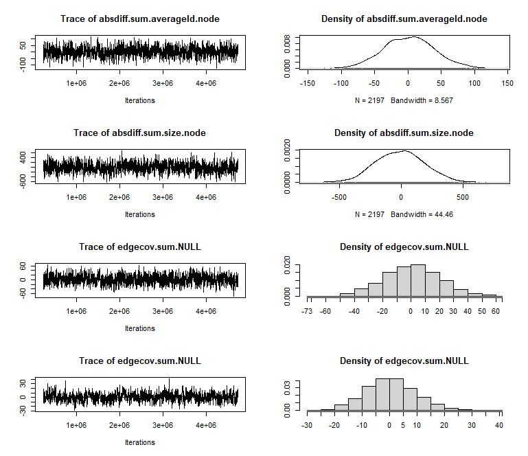
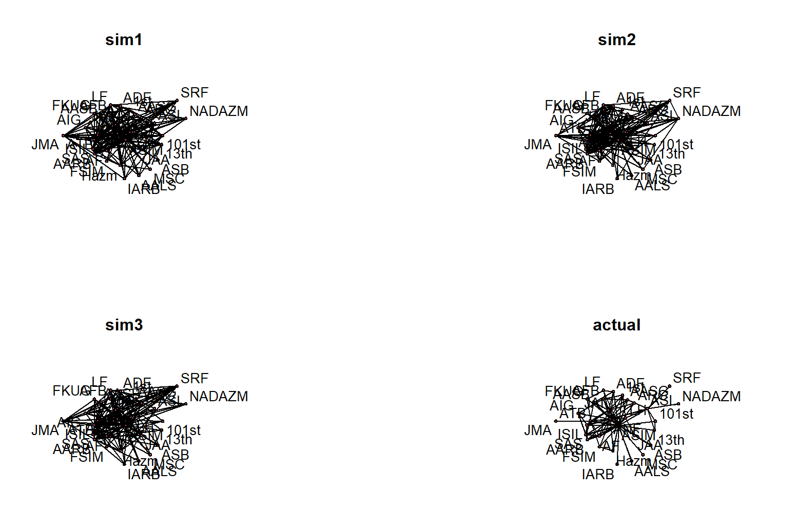
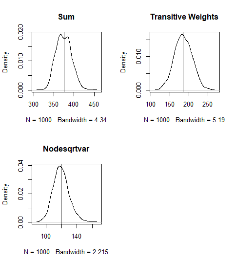

```{r setup, include=FALSE}
knitr::opts_chunk$set(echo = TRUE, fig.align = 'center', message = FALSE, warning = FALSE)
```


## Readings 
- Pavel N Krivitsky. Exponential-family random graph models for valued networks.
*Electronic Journal of Statistics*, 6: 1110--1128, 2012.

- Bruce A. Desmarais and Skyler J. Cranmer. Statistical inference for valued-edge
networks: The generalized exponential random graph model. *PloS One*, 7(1), 2012.
---
## Overview

- Many networks of interest have valued rather than binary edges, e.g. trade network, friendships, romantic relationships.
- Can generalize ERGMs to modeling networks with count or rank-ordered valued edges.
- Similar properties and estimation approach.
---

## The Sample Space

- For binary ERGMs, the sample space (or support) $\mathcal{Y}$ — the set of possible networks that can occur — is usually some subset of $2^N$, the set of all possible ways in which relationships among the actors may occur.

- For the sample space of valued ERGMs, we need to define $\mathcal{S}$, the set of possible values each relationship may take. For example, for count data, that’s $\mathcal{S}=\{0,1,…,s\}$ if the maximum count is $s$ and $\{0,1,…\}$ if there is no a priori upper bound. Having specified that, $\mathcal{Y}$ is defined as some subset of $\mathcal{S}^{N}$: the set of possible ways to assign to each relationship a value.
---
class: inverse, middle, center
# Estimation 
---
## Valued ERGMs

- The package `ergm.count` extends the `ergm` package to allow for modeling networks with valued edges. This is done by specifying the `response` argument with the name of the edge attribute to use as the response variable.

- New concept: a reference distribution
  + Need to think about how the values for connections we measure are distributed. The reference distribution specifies the model for the data before we add any ERGM terms.  

```{r, echo=TRUE, eval=FALSE}
help("ergm-references")

```
---
## The Reference Distribution

```{r, out.width= "600px",fig.align="center", echo=FALSE}

```

---
## Install Packages:

```{r lib, echo=TRUE, eval=TRUE, message=FALSE}
library(devtools)
install_github("ochyzh/networkdata")
#install.packages("ergm.count")
library(statnet)
library(ergm.count)
library(networkdata)

```

---
## Load the Data

We are going to use Gade et al's data.  Our dependent variable--- the valued network--- records the number of collaborations between rebel groups.

```{r data, echo=TRUE, eval=TRUE, message=FALSE}

data(gadeData)
# data characs
actors = sort(unique(c(gadeData$Var1, gadeData$Var2)))
gadeData<-sort(gadeData)
gadeData$coopActions<-round(gadeData$coopActions^2)
#These are the dyadic variables. They
#must be in matrix form.
dyadVars = names(gadeData)[c(3,5:8)]
n = length(actors) ; p = length(dyadVars)


```

---
```{r}
# create empty arr object for all dyad vars
dyadArray = array(0, 
	dim=c(n,n,p),
	dimnames=list(actors,actors,dyadVars)
	)
# loop through and fill in
for(param in dyadVars){
	for(i in 1:nrow(gadeData)){
		a1 = gadeData$Var1[i]
		a2 = gadeData$Var2[i]
		val =gadeData[i,param]
		dyadArray[a1,a2,param] = val
	}
}
```

---

```{r}
# These are node-level variables.
nodeVars = names(gadeData)[9:11]
nodeData = unique(gadeData[,c('Var1',nodeVars)])
rownames(nodeData) = nodeData$Var1
nodeData = nodeData[actors,c(-1)]
# The DV must be a network object
net = as.network(
	dyadArray[,,'coopActions'], 
	directed=FALSE, loops=FALSE, 
	matrix.type='adjacency',
	ignore.eval = FALSE, 
  names.eval = "coopActions"
	)

```
---
## Look at the first 10 rows and cols:
```{r}
 as.matrix(net[1:10,1:10])

```

---
```{r prep4, echo=TRUE, eval=TRUE}
# Set node attributes
for(param in nodeVars){
	network::set.vertex.attribute(net, param, nodeData[,param])
}

# Set network attributes:
set.network.attribute(net,'loc.dyad',dyadArray[,,'loc.dyad'])
set.network.attribute(net,'spons.dyad',dyadArray[,,'spons.dyad'])
# We can view the attribute as a sociomatrix.
as.matrix(net, attrname = "coopActions")[1:10, 1:10]
```
---
## Make a Network Graph with Valued Edges:

```{r graph, echo=TRUE, eval=FALSE, message=FALSE, fig.width=10, fig.height=3}
plot(net, edge.col = "black", usecurve = TRUE, 
     edge.curve = 0, edge.lwd=.25*dyadArray[,,"coopActions"], 
     displaylabels = TRUE)
```
---
## Make a Network Graph with Valued Edges:

```{r graph1, echo=FALSE, eval=TRUE, message=FALSE, fig.width=10, fig.height=6.5,fig.align="center"}
plot(net, edge.col = "black", usecurve = TRUE, 
     edge.curve = 0, edge.lwd=.25*dyadArray[,,"coopActions"], 
     displaylabels = TRUE)

```


---

## Estimate a Valued ERGM

```{r, echo=TRUE, eval=FALSE, message=FALSE}
m0 <- ergm(net ~ sum + 
    nodecov('averageId.node') +
    nodecov('size.node') + 
    nodecov('spons_actor.node') + 
    absdiff('averageId.node') +
    absdiff('size.node') +
    edgecov('loc.dyad') +
    edgecov('spons.dyad'), 
    response = "coopActions", reference = ~Poisson)
mcmc.diagnostics(m0)
```
---
## Diagnostics
```{r, out.width= "550px",fig.align="center", echo=FALSE}

```
---
## Table of Results

```{r, echo=FALSE, eval=TRUE, message=FALSE}
load("data/val_ergms.Rdata")
```

```{r, echo=TRUE, eval=TRUE, message=FALSE}
summary(m0)
```

---
## Interpretation

Let's calculate the expected number of links between two average rebel groups:
 
 - Set all $x$s to their mean values
 - Calculate the expected number as $e^{X^{T}\beta}$
 
```{r,echo=TRUE, eval=FALSE, message=FALSE}
#to get the mean values (in same order as in our model)
x_mean<-apply(data[,c(9,10,11,5,6,7,8)],2,mean)
exp(c(1,x_mean)%*%m0$coef) #expected number of collaborations
```
---
## Your Turn
Calculate the expected number of links between two average rebel groups with no ideological differences: 

---
class: inverse, middle, center
# Accounting for Network Dependencies
---
## Network Dependencies with Valued Edges

- Goal: model endogenous network dependencies

- Complication: valued edges obviate intuitive network measures, such as triangles and k-stars.

- Need to re-conceptualize existing measures to adapt to the context of valued edges.

---
## Individual Heterogeneity.

- A count equivalent to $k$-stars:

Actors may have different overall propensities to interact. This has been modeled using using degeneracy-prone terms like $k$-star counts. With valued ERGMs, a more robust measure is:

$\pmb{g_{actor\ cov.}}(\pmb{y})=\sum\limits_{i\in N}{\frac{1}{n-2}}\sum\limits_{j,k\in\mathbb{Y_i}\land j<k}{(\sqrt{\pmb{y}_{i,j}-\overline{{\sqrt{\pmb{y}}}}})(\sqrt{\pmb{y}_{i,k}-\overline{{\sqrt{\pmb{y}}}}})}$

This is essentially a measure of covariance between the squared values of edges incident (originating) from the same actor. Implemented with the term `nodecovar(transform="sqrt")`.
---
## Triadic Closure

```{r, out.width= "550px",fig.align="center", echo=FALSE}

```


---
## Triadic Closure
`transitiveweights(twopath, combine, affect)`
 
- `twopath`---given $\pmb{y}_{i,j}$ and $\pmb{y}_{k,j}$, how to compute the value for the two-path?
  + `"min"`---the minimum of their values
  + `"geomean`---geometric mean
  
- `combine`---given the strength of the two-paths $\pmb{y}_{i->k->j}$ for all $k\neq i,j$, how to combine the values?
  + `"max"`--- the strength of the strongest path
  + `"sum"`---the sum of path strength
  
- `affect` ---given the combined strength of the two-paths between $i$ and $j$, how should they affect $\pmb{Y}_{i,j}$?
  + `"min"`
  + `"geomean"`
---

## Transitiveweights, Two-Path

```{r, echo=FALSE, eval=TRUE, results='hide',message=FALSE}
set.seed(11112)
library(igraph)
dev.off()
el <- matrix( c("1", "2","2", "3","3","1"), nc = 2, byrow = TRUE)
g<-graph_from_edgelist(el, directed=FALSE)
E(g)$lty <- 1
E(g)[2]$lty<-2
E(g)$val<- c("2"," ","5")
```

```{r, echo=FALSE, eval=TRUE, message=FALSE,out.width='300px', fig.align='center'}
plot(g, size=30,edge.lty= E(g)$lty , edge.color="black" , edge.label = E(g)$val, edge.label.size=5, vertex.size=25, vertex.color="turquoise", vertex.label.cex=1, edge.label.cex=2,  edge.curved=0)
```

- $\text{Two-Path}_{min}(2,5)=2$
- $\text{Two-Path}_{geomean}(2,5)=\sqrt{(2*5)}=\sqrt{10}$
   
---

## Transitiveweights, Combine

```{r, echo=FALSE, eval=TRUE, results='hide',message=FALSE}
set.seed(11112)
library(igraph)
dev.off()
el <- matrix( c("1", "2","2", "3","3","1","2","4","3","4"), nc = 2, byrow = TRUE)
g<-graph_from_edgelist(el, directed=FALSE)
E(g)$lty <- 1
E(g)[2]$lty<-2
E(g)$val<- c("2"," ","5","3","1")
```

```{r, echo=FALSE, eval=TRUE, message=FALSE,out.width='300px', fig.align='center'}
plot(g, size=30,edge.lty= E(g)$lty , edge.color="black" , edge.label = E(g)$val, vertex.size=25, vertex.color="turquoise", vertex.label.cex=1,edge.label.cex=2,edge.curved=0)
```

- $\text{Combine}_{max}=max(\text{Two-path}_{23})$
- $\text{Combine}_{sum}=sum(\text{Two-path}_{23})$
---
## Transitiveweights, Affect

For all pairs connected by two-paths:

- $\text{Affect}_{min}=min(\text{Combine}_{ij})$
- $\text{Affect}_{geomean}=geomean(\text{Combine}_{ij})$

---


## Example

```{r, echo=TRUE, eval=FALSE, message=FALSE}
m1 <- ergm(net ~ sum + 
    nodecov('averageId.node') +
    nodecov('size.node') + 
    nodecov('spons_actor.node') + 
    absdiff('averageId.node') +
    absdiff('size.node') +
    edgecov('loc.dyad') +
    edgecov('spons.dyad')+ 
    transitiveweights("min","max","min"), 
    response = "coopActions", reference = ~Poisson)
par(mfrow = c(3,2))
mcmc.diagnostics(m1)
```
---
## Diagnostics
```{r, out.width= "650px",fig.align="center", echo=FALSE}

```
---
## Table of Results
```{r table, echo=TRUE, eval=TRUE, message=FALSE}
summary(m1)
```

---
class: inverse, middle, center
# Simulating Networks
---
## Simulating Networks

We can use the estimates from our model to simulate a network (just like with ERGMs). If the simulated networks look similar to the observed network, then our model has a good fit.

```{r sim, echo=TRUE, eval=TRUE, message=FALSE, out.width= "550px",fig.align="center"}
# Simulate from model fit:
simNets <- simulate(m1, nsim = 3)

# Define a plotting function:
plotSimNet = function(net, label){
	set.seed(6886)
	plot(net, edge.col = "black", usecurve = TRUE, 
     edge.curve = 0, edge.lwd=.1*dyadArray[,,"coopActions"], 
     displaylabels = TRUE)
	title(label) }
```
---
```{r plotsim, echo=TRUE, eval=FALSE, message=FALSE}
par(mfrow = c(2, 2))
# add actual network to list of sim nets
# for comparison
simNets[[4]] = net
labels = c(paste0("sim",1:3), 'actual')
lapply(1:length(simNets), function(i){
	plotSimNet(simNets[[i]], labels[i]) })
```
---
## Observed vs. Simulated Networks
```{r plotsim1, echo=FALSE, eval=TRUE, message=FALSE, fig.width=10, fig.height=6.5,fig.align="center"}
par(mfrow = c(2, 2))
# add actual network to list of sim nets
# for comparison
simNets[[4]] = net
labels = c(paste0("sim",1:3), 'actual')
lapply(1:length(simNets), function(i){
	plotSimNet(simNets[[i]], labels[i]) })
```
---
## With Fixed Coordinates:

```{r,fig.width=4, fig.height=3}
#Plot the original network to get the layout:
set.seed(6886)
p<-plot(net, edge.col = "black", usecurve = TRUE, 
     edge.curve = 0, edge.lwd=.25*dyadArray[,,"coopActions"], 
     displaylabels = TRUE)

```

---
```{r}
# Define a plotting function:
plotSimNet = function(net, label){
	set.seed(6886)
	plot(net, edge.col = "black", usecurve = TRUE, 
     edge.curve = 0, edge.lwd=.1*dyadArray[,,"coopActions"], 
     displaylabels = TRUE, coord=p)
	title(label) }
```


---
## Observed vs. Simulated Networks (Fixed Coord.)
```{r plotsim2, echo=FALSE, eval=TRUE, message=FALSE, fig.width=10, fig.height=7,fig.align="center"}
par(mfrow = c(2, 2))
# add actual network to list of sim nets
# for comparison
simNets[[4]] = net
labels = c(paste0("sim",1:3), 'actual')
lapply(1:length(simNets), function(i){
	plotSimNet(simNets[[i]], labels[i]) })
```

---
## Assessing Model Fit

In the above exercise, we compared our network to only 3 simulated networks. Ideally, we would like to compare it to more than 3. Since it's difficult to look at thousands of simulated networks on a graph, a way to compare our network to thousands of such simulated networks is by summarizing the characteristics of these simulated networks, such as the sum of edges or various other measures.

Notice that in the code below that, in addition to network statistics included in model `m1`, we can also summarize statistics that were not explicitly included in `m1`, such as `nodecovar(transform="sqrt")`. This is because our simulated networks may still exhibit vertex heterogeneity as a function of the modeled network properties (e.g. triangles), i.e. more triangles may also lead to more k-stars.

Also notice that I specified `output="stats"`. Since I only care about network summaries, I am telling the function to NOT save the actual simulated networks, but only their summary statistics. This saves memory space.

---

```{r sim1000, echo=TRUE, eval=TRUE, message=FALSE}
# Simulate from model fit:
simNets1000 <- simulate(m1, monitor = ~ nodecovar(transform="sqrt"), 
    nsim = 1000, output = "stats")

```
---
## Results of the Simulation
```{r}
colnames(simNets1000)
```

---
## Plot the Summary of the Simulations

```{r plotsim1000, echo=TRUE, eval=FALSE, message=FALSE}
#How prevalent are k-stars in the observed network?
obsNet<-summary(net~sum+transitiveweights("min","max","min")+nodecovar(transform="sqrt"), 
                response = "coopActions")
par(mfrow = c(2, 2))
#1st col.=sum
plot(density(simNets1000[,1]), main="")
abline(v = obsNet[1])
title("Sum")

# 9th col. = transitiveweights
plot(density(simNets1000[,9]), main="")
abline(v = obsNet[2])
title("Transitive Weights")

# 10th col. = nodesqrtcovar
plot(density(simNets1000[,10]), main="")
abline(v = obsNet)
title("Nodesqrtvar")

```
---
## Plot the Summary of the Simulations
```{r plotsim10001, echo=FALSE, eval=TRUE, message=FALSE, fig.width=10, fig.height=5.5,fig.align="center"}
#How prevalent are k-stars in the observed network?
obsNet<-summary(net~sum+transitiveweights("min","max","min")+nodecovar(transform="sqrt"), response = "coopActions")

par(mfrow = c(2, 2))
#1st col.=sum
plot(density(simNets1000[,1]), main="")
abline(v = obsNet[1])
title("Sum")

# 9th col. = transitiveweights
plot(density(simNets1000[,9]), main="")
abline(v = obsNet[2])
title("Transitive Weights")

# 10th col. = nodesqrtcovar
plot(density(simNets1000[,10]), main="")
abline(v = obsNet[])
title("Nodesqrtvar")

```
---
## Improve Model Specofication

```{r, echo=TRUE, eval=FALSE, message=FALSE}
m2 <- ergm(net ~ sum + 
    nodecov('averageId.node') +
    nodecov('size.node') + 
    nodecov('spons_actor.node') + 
    absdiff('averageId.node') +
    absdiff('size.node') +
    edgecov('loc.dyad') +
    edgecov('spons.dyad')+ 
    transitiveweights("min","max","min")+
    nodecovar(transform="sqrt"), 
    response = "coopActions", reference = ~Poisson)
```
---
## Improve Model Specification

```{r, echo=FALSE, eval=TRUE}
summary(m2)
```
---
## Your Turn
Follow the steps we did for `m1` to evaluate the fit of model `m2`.  Start by simulating a small number of networks, plot them and compare them to the observed network.  Then simulate 1000 networks and compare them to the observed network on the key network statistics. Does `m2` have a better fit?

---

```{r, eval=T, echo=F,out.width= "500px",fig.align="center"}

```


---

```{r,eval=T, echo=F, out.width= "500px",fig.align="center"}

```

