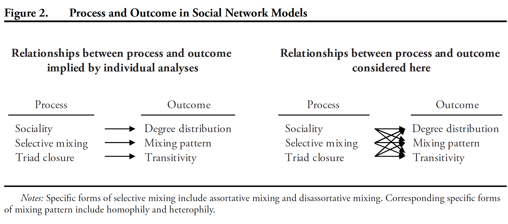
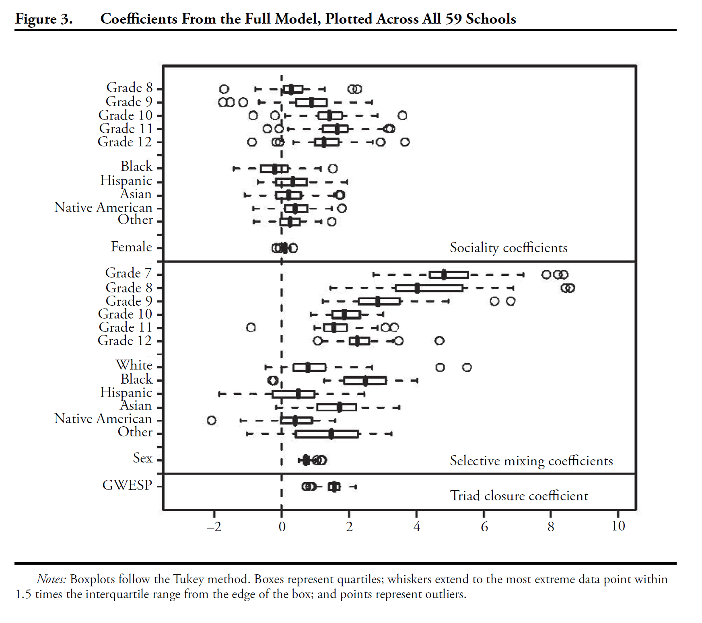
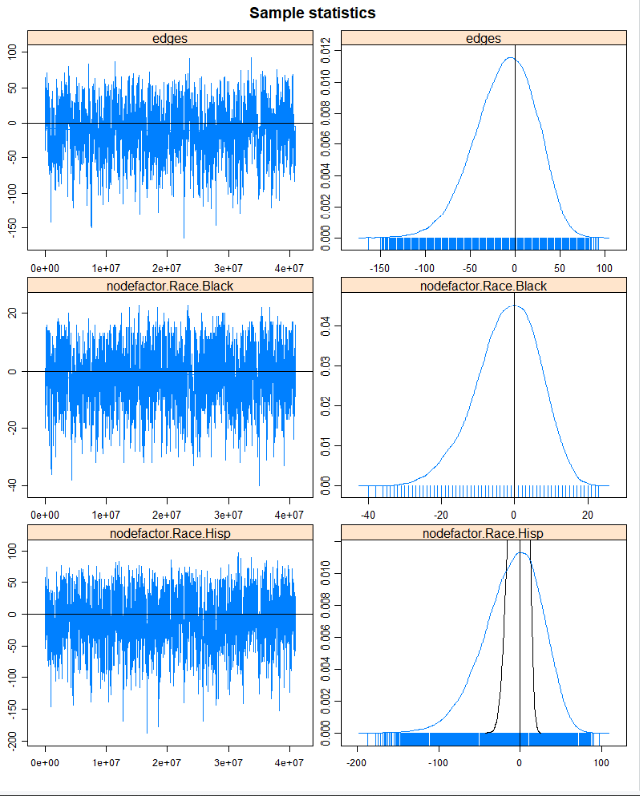
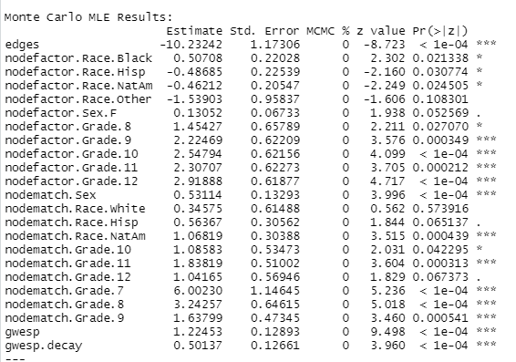

```{r setup, include=FALSE}
knitr::opts_chunk$set(echo = TRUE, fig.align = 'center', message = FALSE, warning = FALSE)
```


## Readings 

- Steven M. Goodreau, James A. Kitts, and Martina Morris. Birds of a feather, or
friend of a friend? using exponential random graph models to investigate adolescent social networks. *Demography*, 46(1):103--125, 2009.
---
## Goodreau et al, 2009

Goal: to identify the determinants of friendship formation that lead to pervasive regularities in friendship structure among adolescent students

Three mechanisms:

- *Sociality*---heterogeneity among individuals in their propensity to establish friendship ties. Individuals with greater sociality have higher degree, although degree may be also influenced by other factors.

- *Selective mixing* is a dyad-level process by which pairs form (or break) relationships based on their combination of individual attributes. *Assortative
mixing* is the greater propensity to partner with others having attributes similar to one's own. The resulting pattern---homophily--- is the predominance of within-group ties.

- *Triad Closure* leads to the outcome of transitivity. Possible mechanisms include increased chance for interaction and tendency for structural balance (i.e. a friend of my friend is my friend).
---
## Goodreau et al, 2009

Additional mechanisms:

- Homophily may also be amplified by triad closure if there is already a tendency toward assortative mixing.
- Transitivity may also result from assortative mixing since increasing the likelihood of within category
ties enhances the opportunity for completed triangles within categories, especially when groups are small.  
- Population composition---the opportunity for partner selection is constrained by the available pool of partners.

---

```{r, echo=FALSE, eval=TRUE, message=FALSE, out.width= "1000px",fig.align="center"}

```
---
## Data

- Friendship data from the first wave of Add Health, a sample of more than 90,000
U.S. students in grades 7 through 12, obtained in 1994–1995 through a stratifed sample of
schools.
- The questionnaire provided a school roster and asked students to identify their five best male and five best female friends,
in order of closeness. 
- Students were allowed to nominate friends outside school or missing from the roster, or to stop before nominating five friends of either sex. 
- Most students listed fewer friends than the maximum, but for the remainder, there may be some truncation. *When would this be a problem?*
---
## Open Data

```{r data, echo=TRUE, eval=TRUE, message=FALSE }
rm(list=ls())
library(statnet)
data(faux.mesa.high) 
mesa <- faux.mesa.high
mesa


```
---
## Plot Data

```{r, echo=TRUE, eval=FALSE, message=FALSE }
par(mfrow=c(1,1)) # Back to 1-panel plots
plot(mesa, vertex.col='Grade')
legend('bottomleft',fill=7:12,
       legend=paste('Grade',7:12),cex=0.75)
```
---
## Plot Data
```{r, echo=FALSE, eval=TRUE, message=FALSE, out.width= "500px",fig.align="center" }
par(mfrow=c(1,1)) # Back to 1-panel plots
plot(mesa, vertex.col='Grade')
legend('bottomleft',fill=7:12,
       legend=paste('Grade',7:12),cex=0.75)
```
---
class: inverse, middle, center
# Model Specification
---
## Sociality
Goodreau et al (2009, 111) "infer sociality based on counts of ties observed: $s$ represents the total
number of ties, and $k_i$ is the total number of ties for all persons with attribute value $i$. The $s$
term acts as an intercept [`edges`], and the coefficient for $s$ represents the conditional log-odds of a
tie for the reference category (in these models, reference categories are grade 7, white, and
male). The $k_i$ terms assume homogeneity within attribute class, allowing each race, sex, and
grade to have different mean sociality."

---
## Sociality
Can also use the search function to find the relevant terms.
```{r, echo=TRUE, eval=TRUE}
search.ergmTerms(keyword='sociality')
```
---
## Sociality

- None of these match the authors' description, which sounds like they are using the term `nodefactor`. 
- Term `nodefactor` adds multiple network statistics to the model, one for each of the unique values of the attribute. Each of these statistics gives the number of times a node with that attribute or those attributes appears in an edge in the network.
- Note: `nodefactor` assumes non-numeric (e.g., character, factor) class, so recode "Grade" as a character.

---
## Sociality

Based on this description, the model so far is specified as:

```{r, echo=TRUE, eval=FALSE, message=FALSE}
table(mesa %v% 'Race') # Frequencies of race
table(mesa %v% 'Sex') # Frequencies of sex
table(mesa %v% 'Grade') # Frequencies of Grade
mesa %v% "Grade" <-as.character(mesa %v% "Grade")

m1<- ergm(mesa~edges+nodefactor("Race",levels=c("Black","Hisp","Other"))+
            nodefactor("Sex", levels="F")+
            nodefactor("Grade", levels=c("8","9","10","11","12")))
```
---
## Sociality

- Note that we specified levels for each `nodefactor` as to make sure that the reference categories match those of Goodreau et al.
- The description of `nodefactor` in `?ergm.terms` says that including each level is not a good idea (need a reference category, just like with categorical variables in OLS).
- If we get a positive coefficient on any categories within *Race*, *Sex*, and/or *Grade*, we will infer that students with that characteristic are, on average, more social.
---
## Selective Mixing
Two selective mixing dynamics:

1. A homogeneous propensity for assortative mixing across attribute categories (“uniform homophily”). 
2. A propensity that is specific to individual categories (“differential homophily”).

"Statistics are as follows: first, $h$ is the total number of ties between persons in the same
attribute category, regardless of category. This uniform homophily is used for sex since
there are only three tie types (MM, MF, FF); with main effects included, only one degree
of freedom remains. Second, $h_i$ is the total number of ties between persons both in attribute
category $i$. There is one such statistic for each category of the attribute. This differential
homophily is used for race and grade 4."
---
## Selective Mixing
Can also use the search function to find the relevant terms.
```{r, echo=TRUE, eval=TRUE}
search.ergmTerms(keyword='homophily')
```

- Term `nodematch` sounds like a good candidate.
---
## Selective Mixing

Based on this description, we can further specify the model  as:

```{r, echo=TRUE, eval=FALSE, message=FALSE}

m1<- ergm(mesa~edges+nodefactor("Race",levels=c("Black","Hisp","NatAm"))+
            nodefactor("Sex", levels="F")+
            nodefactor("Grade",  levels=c("8","9","10","11","12"))+
            nodematch("Sex")+nodematch("Race",diff=TRUE)+nodematch("Grade",diff=TRUE)
            )
```

Note: option `diff` specifies whether there can be differences in probability of friendships between groups.

- Use `absdiff` instead of `nodematch` for continuous variables (e.g. wealth).
---
## Selective Mixing: Interpretation

- To calculate the probability of a tie between two women, set `nodefactor("Sex", levels="F")=1` and `nodematch("Sex")=1`, and all other variables to the values of interest. 

- To calculate the probability of a tie between two men, set `nodefactor("Sex", levels="F")=0` and `nodematch("Sex")=1`, and all other variables to the values of interest. 

- To calculate the probability of a tie between a woman and a man, set `nodefactor("Sex", levels="F")=1` and `nodematch("Sex")=0`, and all other variables to the values of interest.  

---
## Triad Closure

"For the reasons described above, we investigate triad closure using the
GWESP statistic. We adopt a value of $0.25$ for decay, although results are robust to this choice."

Based on this description, we can further specify the model  as:

```{r, echo=TRUE, eval=FALSE, message=FALSE}
mesa %v% "Grade" <-as.character(mesa %v% "Grade")
m1<- ergm(mesa~edges+nodefactor("Race",levels=c("Black","Hisp","NatAm","Other"))+
            nodefactor("Sex", levels="F")+
            nodefactor("Grade", levels=c("8","9","10","11","12"))+
            nodematch("Sex")+nodematch("Race",diff=TRUE)+nodematch("Grade",diff=TRUE)+
            gwesp(decay=0.25)
            )
par(mfrow = c(3, 2))
mcmc.diagnostics(m1)
```
---
## Results
```{r, echo=FALSE, eval=TRUE, message=FALSE, out.width= "600px",fig.align="center"}

```
---
## Our Replication: M1 Diagnostics

```{r, echo=FALSE, eval=TRUE, message=FALSE, out.width= "750px",fig.align="center"}
load("data/Day8.RData")
knitr::include_graphics("images/M1_diagnostics.png")
```

---
## Increase the Number of Simulations.

```{r, echo=TRUE, eval=FALSE, message=FALSE}
m2<- ergm(mesa~edges+nodefactor("Race",levels=c("Black","Hisp","NatAm","Other"))+
            nodefactor("Sex", levels="F")+
            nodefactor("Grade", levels=c("8","9","10","11","12"))+
            nodematch("Sex")+nodematch("Race",diff=TRUE)+
            nodematch("Grade",diff=TRUE)+gwesp(decay=0.25),
            control=control.ergm(seed=6886,		MCMC.samplesize=10000, MCMLE.maxit=50)
            )
par(mfrow = c(3, 2))
mcmc.diagnostics(m2)

```
---
## Results

```{r, echo=FALSE, eval=TRUE, message=FALSE, out.width= "350px",fig.align="center"}

```

---
## Results
```{r, echo=FALSE, eval=TRUE, message=FALSE}
summary(m2)
```

---
## Results

- Another problem is that several of our parameters are estimated as $-Inf$.

- Check Our Summary Statistics

```{r, echo=TRUE, eval=FALSE, message=FALSE}
summary(mesa~edges+nodefactor("Race")+
            nodefactor("Sex", levels="F")+
            nodefactor("Grade", levels=c("8","9","10","11","12"))+
            nodematch("Sex")+
            nodematch("Race",diff=TRUE)+
            nodematch("Grade",diff=TRUE)+
            gwesp(decay=0.25)
        )
#Also can:
mixingmatrix(mesa, "Race")
```
---
## Check Our Summary Statistics

```{r, echo=FALSE, eval=TRUE, message=FALSE}

summary(mesa~edges+nodefactor("Race")+
            nodefactor("Sex", levels="F")+
            nodefactor("Grade", levels=c("8","9","10","11","12"))+
            nodematch("Sex")+
            nodematch("Race",diff=TRUE)+
            nodematch("Grade",diff=TRUE)+
            gwesp(decay=0.25)
        )

```
---
## Remove the Categories with Empty Cells:
```{r, echo=TRUE, eval=FALSE, message=FALSE}
m3<- ergm(mesa~edges+nodefactor("Race",levels=c("Black","Hisp","NatAm","Other"))+
            nodefactor("Sex", levels="F")+
            nodefactor("Grade", levels=c("8","9","10","11","12"))+
            nodematch("Sex")+
            nodematch("Race",levels=c("White","Hisp","NatAm"),diff=TRUE)+
            nodematch("Grade",diff=TRUE)+
            gwesp(decay=0.25),
            control=control.ergm(seed=6886,		MCMC.samplesize=10000, MCMLE.maxit=50	)
            )
summary(m3)
```
---

## Results

```{r, echo=FALSE, eval=TRUE, message=FALSE, out.width= "650px",fig.align="center"}

```

---
## Summary of Results

- Sociality increases by grade.
- Grade-based selective mixing is consistently assortative (i.e., the selective
mixing coefficient is positive), but is strongest among 7th graders and declines with seniority.
- The triad closure (GWESP) coefficient is  positive. 


---
## Interpreting GWESP coefficient
- Two nodes $i$ and $j$ have an edgewise shared partner when they are (1) connected to each other and (2) both $i$ and j are also connected to a third individual $k$. 
- If $i$ and $j$ were also connected to node $l$, then $i$ and $j$ would have two edgewise shared partners. 
- When nodes have edgewise shared partnerships, they form triangles.
- The GWESP term models the tendency for ties that close triangles to be more likely than ties that do not close triangles.
- The GWESP term gradually decreases as pairs of individuals have more existing shared partners.
---
## Interpreting GWESP coefficient

$$\begin{eqnarray}
\omega=e^\alpha\sum\limits_{i=1}^{n-2}(1-(1-e^{-\alpha})^i)p_i,
\end{eqnarray}$$

where $\alpha$ is the decay parameter, $p_i$ is the number of actor pairs who have exactly $i$ shared edgewise partners, and $n$ is the numebr of nodes in the network. 

- The maximum number of edgewise-shared partners for any pair of nodes is $n-2$.
---
## Interpreting GWESP coefficient

Goal: calculate the change in GWESP statistic that will result from adding a particular tie.

Depends on (1) the number of triangles that the tie closes and (2) the existing number of edgewise shared partnerships that the nodes involved in the triangles already belong to.

- Adding a tie that closes no triangles has no effect on GWESP.

---

- Adding a tie that closes one triangle and no nodes in the group have any existing ESPs will 
add *three* ties with one edgewise shared partnership (1 and $2$ share partner $3$, $1$ and $3$ share partner $2$, and $2$ and $3$ share partner $1$:


```{r, echo=FALSE, eval=TRUE, results='hide',message=FALSE}
set.seed(11112)
library(igraph)
dev.off()
el <- matrix( c("1", "2","2", "3","3","1"), nc = 2, byrow = TRUE)
g<-graph_from_edgelist(el, directed=FALSE)
E(g)$lty <- 1
E(g)[2]$lty<-2

```

```{r, echo=FALSE, eval=TRUE, message=FALSE,out.width='700px', fig.align='center'}
plot(g, size=30,edge.lty= E(g)$lty , edge.color="black" , vertex.size=25, vertex.color="turquoise", vertex.label.cex=1,edge.curved=0)
```

---
## Interpreting GWESP coefficient

- Consider a GWESP coefficient of $1.8$. 
- If a tie will close one triangle, and all actor pairs in that triangle currently
have no shared partners, the log-odds of the tie are increased by $5.4$ (1.8*3), because it would add an edgewise shared partner to three different pairs) relative to an otherwise similar tie that would not close a triangle. 
- Can calculate other scenarios, but not very intuitive.


