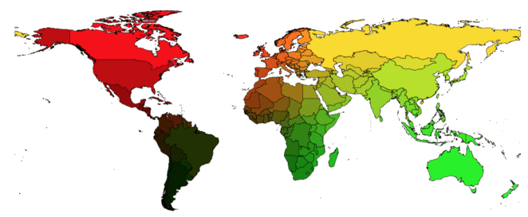
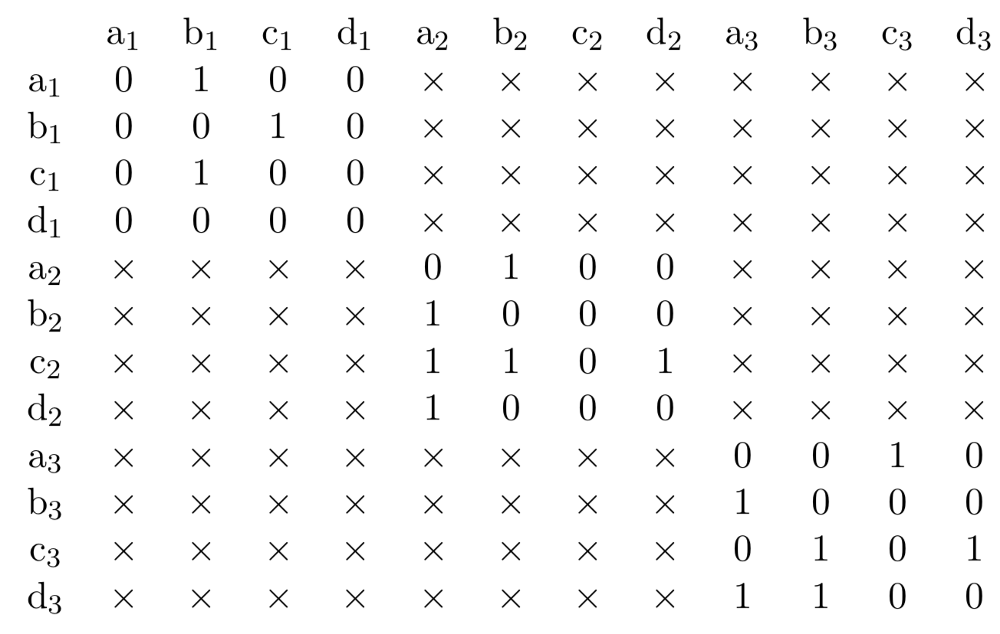
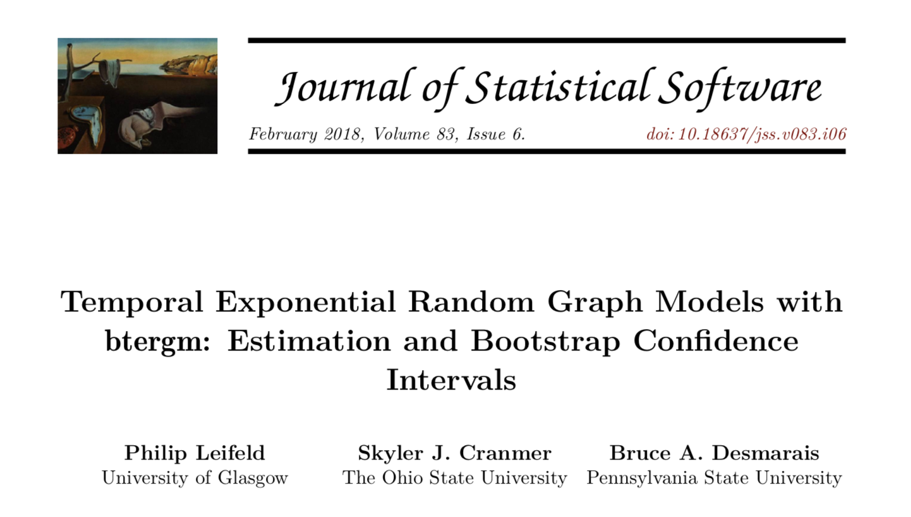
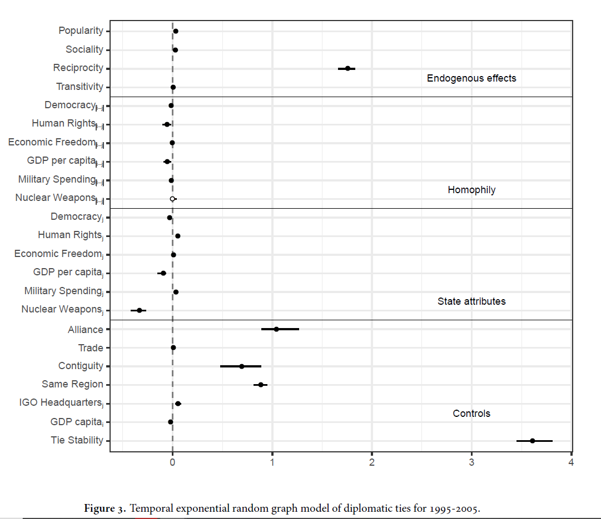
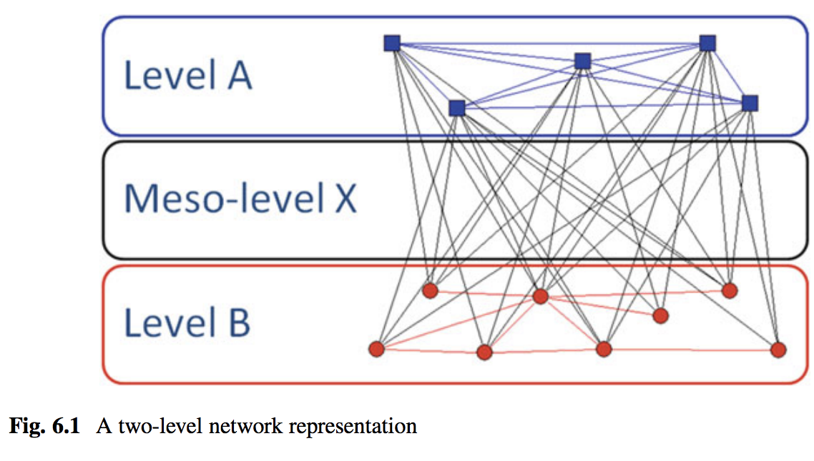

exclude: true

```{r  setup, message=FALSE, warning=FALSE, include=FALSE}
options(
  htmltools.dir.version = FALSE, # for blogdown
  width = 80,
  tibble.width = 80
)

knitr::opts_chunk$set(
  fig.align = "center",  warning=FALSE, message=FALSE
)

library(stringr)
library(magrittr)
library(rvest)
library(statnet)
```

## Readings 

- Garry Robins and Philippa Pattison. Random Graph Models for Temporal Processes in Social Networks. *Journal of Mathematical Sociology*, 25(1):5--41, 2001.

- Bruce A. Desmarais and Skyler J. Cranmer. Statistical mechanics of networks:
Estimation and uncertainty. *Physica A: Statistical Mechanics and its Applications*,
391(4):1865--1876, 2012.

---
## Longitudinal networks

```{r, out.width= "180px",fig.align="left", echo=FALSE}

```

---
## Longitudinal networks

- Networks that change over time.

- Examples: networks of friends, conflict networks, trade networks.

- Want to model network dynamics within and across time periods.
---

## Outline

- Setting up longitudinal network data

- Visualizing longitudinal data

- Descriptive statistics

- Inferential analysis

---
## Getting the data ready

We are used to data in this format: 

```{r}
#install_github("ochyzh/networkdata")
library(networkdata)
data(allyData)
head(dyadData)[,1:8]
```
---


## Getting the data ready

We need to convert this information such that: 

- the dependent variable must be a `list` of `network` objects

- nodal covariates are vertex attributes in the `list` of `network` objects

- dyadic covariates are included separately in a `list` of `matrices`
---


## Start with setting up war

Output should look like this: 

.pull-left[
```{r}
class(war)
length(war)
class(war[[1]])
dim(war[[1]])
```
]

.pull-right[
```{r}
war[[1]][1:3,1:3]
```
]

---

## contiguity should be easier

Output should look like this: 

```{r}
class(contiguity)
dim(contiguity)
contiguity[1:3,1:3]
```

---
## Now set up DV with vertex attributes

Output should look like this: 

```{r}
class(ally)
length(ally)
class(ally[[1]])
list.vertex.attributes(ally[[1]])
```

---

## Exploring temporal network data

The `statnet` package includes a range of "sub-packages" that enable you to understand the characteristics of dynamic networks:

- `networkDynamic`: storage and management of temporal network data
- `tsna`: descriptive statistics and graphics for exploratory network analysis
- `ndtv`: utilities for plotting temporal networks (including network movies)

---

## Prepping data

First step is going to be formatting our list of `network` objects into a format that these packages can recognize:

```{r} 
allyDyn = networkDynamic(network.list=ally)
```

---

## Quick snapshots

`networkDynamic` makes it easy to generate some snapshots of a longitudinal network:

```{r, echo=TRUE, eval=FALSE}
par(mfrow = c(1,2))
p<-plot(
	network.extract(allyDyn, at = 0), 
	main = "1991", displaylabels = T)
plot(
	network.extract(allyDyn, at = 9), 
	main = "2000", displaylabels = T,coord=p)
```
---

## Quick snapshots

```{r, echo=FALSE, eval=TRUE, fig.width=12, fig.height=6}
par(mfrow = c(1,2))
p<-plot(
	network.extract(allyDyn, at = 0), 
	main = "1991", displaylabels = T)
plot(
	network.extract(allyDyn, at = 9), 
	main = "2000", displaylabels = T,coord=p)
```


---

## Quick movie

`ndtv` makes it pretty easy to render a simple D3 movie for a longitudinal network:

```{r, echo=TRUE, eval=FALSE}
library(ndtv)
render.d3movie(allyDyn, 
	plot.par=list(displaylabels=T),filename="AlliesNetwork.html", launchBrowser=FALSE )
```

---
## Descriptive analyses

`tsna` enables us to quickly calculate some basic descriptive statistics such as the density of a graph:

```{r, echo=TRUE, eval=TRUE, message=FALSE}
library(tsna)
tSnaStats(allyDyn, "gden") # Changes in graph density
```

---

## Descriptive analyses

Can also examine changes in transitivity over time:

```{r, echo=TRUE, eval=TRUE, message=FALSE}
tSnaStats(allyDyn, "gtrans") # Changes in graph transitivity
```

---

## Descriptive analyses

The `tErgmStats` enables us to calculate changes in `ergm` terms over time:

```{r}
tErgmStats(allyDyn, "~ edges+triangle")
```

---
## Your Turn

1. For this exercise, you will work with the friendship data from `library(RSiena)`. Run the following code to load the data.

```{r}
library(RSiena)
friend.data.w1 <- s501
friend.data.w2 <- s502
friend.data.w3 <- s503
drink <- s50a
smoke <- s50s
```

2. Format the friendship data from as a `networkDynamic` object. 

3. Summarize changes in friendships (edges), triangles, and number of nodes with indegrees 1 nd 2, over time.

4. Plot the first and the third waves of the friends network side-by-side using the `network.extract` function.

5. Make a quick movie of the friends network over time using the `render.d3movie` function.


---

## TERGM: Discrete time model

- Developed by [Robins & Pattison (2001)](https://www.tandfonline.com/doi/abs/10.1080/0022250X.2001.9990243?casa_token=6IzkEyfRhVAAAAAA:f5jksd3D1DV9G9lEHcDO1ZoZGaeE5pQc2zdVidN4SlhIelQpLgqV5idhEcEJCOrema_0XuTEow5G7Q) and further developed by [Hanneke et al. (2010)](https://projecteuclid.org/euclid.ejs/1276694116)

- Scholars in political science most notably [Cranmer and Desmarais (2011)](https://people.cs.umass.edu/~wallach/courses/s11/cmpsci791ss/readings/cranmer11inferential.pdf) have eased the use and highlighted the utility of these types of models for political science

- Extension of ERGM to the temporal setting is based on the idea of panel regression

- In a sequence of observations, lagged earlier observations or derived information thereof can be used as predictors for later observations.
	+ In other words, some of the statistics  are direct functions of an earlier realization of the network
	+ In its most basic form, the TERGM is a conditional ERGM with an earlier observation of the network occurring among the predictors.

---

## TERGM: Discrete time model

- To extend ERGM to a longitudinal context, [Hanneke et al. (2010)](https://projecteuclid.org/euclid.ejs/1276694116) make a Markov assumption on the network from one time step to the next


- Specifically, given an observed network $Y^{t}$, make the assumption that $Y^{t}$ is independent of $Y^{1}, \ldots, Y^{t-2}$


- Thus a sequence of network observations has the property that: 

\begin{align}
	Pr(Y^{2}, Y^{3}, \ldots, Y^{t} | Y^{1}) = Pr(Y^{t} | Y^{t-1}) Pr(Y^{t-1} | Y^{t-2}) \ldots Pr(Y^{2} | Y^{1})
\end{align}

---

## TERGM: Discrete time model

- With this assumption in mind we just need to choose a form for the conditional PDF of $P(Y^{t} | Y^{t-1})$


- $Y^{t} | Y^{t-1}$ can be expressed through an ERGM distribution, which then gives us what is referred to as a TERGM:

\begin{align}
\Pr(Y^{t} | \theta, Y^{t-1}) &= \frac{ \exp( \theta^{T} g(Y^{t}, Y^{t-1})  )  }{ \mathcal{k}  } 
\end{align}

---

## TERGM: Block-diag visualization

- TERGM is essentially estimated through an ERGM with the dependent variable modeled as a block-diagonal matrix (such as below)


- Constraints are put on the model such that cross-network edges in the off-diagonal blocks are prohibited

```{r matrixpic, out.width= "500px",fig.align="center", echo=FALSE}

```

---

## btergm Package

- The `btergm` package has been developed by [Leifeld, Cranmer, & Desmarais (2018)](https://www.jstatsoft.org/article/view/v083i06) to estimate longitudinal networks using TERGM

```{r btergm, out.width= "500px",fig.align="center", echo=FALSE}

```

- Package provides two functions to estimate a TERGM, one using a pseudolikelihood (`btergm`) and the other using MCMC-MLE (`mtergm`)

---

## Running a TERGM

- We are going to run a TERGM on the longitudinal alliance network, and will employ the following specification: 
	+ `edges`: density term
	+ `edgecov(war)`: list of matrices where cross-sections denote war
	+ `edgecov(contiguity)`: matrix of distances between countries
	+ `absdiff(polity)`: Absolute difference between polity of $i$ and $j$
	+ `absdiff(cinc)`: Absolute difference between cinc of $i$ and $j$
	+ `gwesp(.5, fixed = TRUE)`: Geometric weighted triangle term

---

## Running a TERGM

```{r tergmload, echo=FALSE, eval=TRUE}
suppressWarnings(suppressMessages(library(btergm)))
#load('data/tergmFit_pseudo.rda')
```

```{r tergmfit, echo=TRUE, eval=TRUE}
library(btergm)

tergmFit <- btergm(
	ally ~ edges + 
	edgecov(war) + edgecov(contiguity) + 
	nodecov('polity') + absdiff("polity") + 
	nodecov('cinc') + absdiff("cinc") +
	gwesp(.5, fixed = TRUE)
	)

#check model fit:
#GOF1<-gof(tergmFit)
```

---
## Results

```{r tergmfit1, echo=TRUE, eval=TRUE}
summary(tergmFit)
```

---

## Duque (2018)

The DV is diplomatic ties, `dipl_ties`:
```{r duquedv, echo=TRUE, eval=TRUE, warning=FALSE, message=FALSE}
#Clear your memory and unload `btergm` as it clashes with `network`:

detach("package:btergm", unload=TRUE)
data("duqueData")

class(dipl_ties)
length(dipl_ties)
class(dipl_ties[[1]])


```


---
## The Dependent Variable

we can see that `dipl_ties` is currently a list of `data.frames`. Let's convert it into a list of networks.

```{r duquedv1}
library(statnet)
for (i in 1:8) {
dipl_ties[[i]]<-as.network(as.matrix(dipl_ties[[i]]))
}
class(dipl_ties[[1]])

```

---
## Use `networkDynamic` for Visualizing the Netwokrk
```{r dipldyn, eval=F}
diplDyn = networkDynamic(network.list=dipl_ties, vertex.pid='vertex.names')
```

Get an error that need vertex.pid (persistent identifiers), as our networks are not of equal size.

---

## Try Again
```{r tryagain, echo=TRUE, eval=FALSE}
#Define network pids:
for (i in 1:8) {
set.network.attribute(dipl_ties[[i]], 'vertex.pid','vertex.names')
}
#Takes 5 min to run:
diplDyn = networkDynamic(network.list=dipl_ties, vertex.pid='vertex.names')
diplDyn
```

```{r tryagain1, echo=FALSE, eval=TRUE}
diplDyn<-readRDS("data/diplDyn.Rds")
diplDyn
```

---
## Quick snapshots

```{r, echo=TRUE, eval=FALSE}
par(mfrow = c(1,2))
plot(
	network.extract(diplDyn, at = 1), 
	main = "1970", displaylabels = T)
plot(
	network.extract(diplDyn, at = 6), 
	main = "2005", displaylabels = T)
```

Note: cannot use coordinates, because networks are not of equal size, include different actors.

---

## Quick snapshots

```{r, echo=FALSE, eval=TRUE, fig.width=12, fig.height=6}
par(mfrow = c(1,2))
plot(
	network.extract(diplDyn, at = 0), 
	main = "1970", displaylabels = T)
plot(
	network.extract(diplDyn, at = 7), 
	main = "2005", displaylabels = T)
```


---

## What Have We Learned?

- Networks of embassies are dense.

- Some states host very few embassies.

- Note: network graphs of dense networks are not very esthetically pleasing or informative.

---
## Descriptive analyses

`tsna` enables us to quickly calculate some basic descriptive statistics such as the density of a graph:

```{r, echo=TRUE, eval=TRUE, message=FALSE}
library(tsna)
tSnaStats(diplDyn, "gden") # Changes in graph density
```

---

## Descriptive analyses

Can also examine transitivity over time:

```{r, echo=TRUE, eval=TRUE, message=FALSE}
tSnaStats(diplDyn, "gtrans") # Changes in graph transitivity
```

---

## Descriptive analyses

The `tErgmStats` enables us to calculate changes in `ergm` terms over time:

```{r}
tErgmStats(diplDyn, "~ edges+triangle")
```

---
## Duque (2018)

Popularity hypothesis: High-status states should receive more recognition simply because of their position in the
social structure, rather than because of the possession of status attributes (`2-instars`).

Reciprocity and transitivity: A state’s existing relations should influence the state’s ability to achieve status (`mutual` and `triangle`).

Homophily: States should recognize states that have similar values and resources as them (`absdiff`).

---
## Dyadic Covariates 

Contiguity (`contig`) and alliances (`allies`) are time-varying edge-level covariates.  We must make sure that they are stored as lists of matrices.

.pull-left[
```{r contig}
#Contiguity:
class(contig)
length(contig)
class(contig[[1]])
dim(contig[[1]])
```
]

.pull-right[
```{r contig1}
contig[[1]][1:3,1:3]
```
]
---

## Allies
.pull-left[
```{r allies}
#Allies:
class(allies)
length(allies)
class(allies[[1]])
dim(allies[[1]])
```
]

.pull-right[
```{r allies1}
allies[[1]][1:3,1:3]
```
]
---
## Dyadic Covariates 

It looks like `allies` and `contig` are currently stored as lists of `data.frames`. We must convert them to lists of matrices.  

```{r edgecov}
for (i in 1:8) {
contig[[i]]<-as.matrix(contig[[i]])
allies[[i]]<-as.matrix(allies[[i]])
}
```

---
## Now set up DV with vertex and dyadic attributes

Our node-level covariate, `polity$dem_dum` must be defined as a vertex attribute in each of the `dipl_ties` networks.

```{r vertexcov}
#Define Dem as a vertex attribute for each year of dipl_ties (didn't work as a loop):
  set.vertex.attribute(dipl_ties[[1]],"dem",polity$dem_dum[polity$year==1970])
  set.vertex.attribute(dipl_ties[[2]],"dem",polity$dem_dum[polity$year==1975])
  set.vertex.attribute(dipl_ties[[3]],"dem",polity$dem_dum[polity$year==1980])
  set.vertex.attribute(dipl_ties[[4]],"dem",polity$dem_dum[polity$year==1985])
  set.vertex.attribute(dipl_ties[[5]],"dem",polity$dem_dum[polity$year==1990])
  set.vertex.attribute(dipl_ties[[6]],"dem",polity$dem_dum[polity$year==1995])
  set.vertex.attribute(dipl_ties[[7]],"dem",polity$dem_dum[polity$year==2000])
  set.vertex.attribute(dipl_ties[[8]],"dem",polity$dem_dum[polity$year==2005])

dipl_ties[[1]] %v% "dem"
dipl_ties[[2]] %v% "dem"


```

---
## Specify the Model:
```{r tergmfit2, echo=TRUE, eval=FALSE}
library(btergm)
#This runs for 5 min:
tergm_Duque<-btergm(dipl_ties ~ edges + istar(2) + ostar(2) + mutual + triangles+
                  absdiff("dem")+
                  +nodeicov("dem")+
                  +edgecov(allies)
                  +edgecov(contig),
                  R=1000)

summary(tergm_Duque)

```

---
## Run the Model
```{r tergmfit2load, echo=FALSE, eval=TRUE, message=FALSE}
tergm_Duque<-readRDS("data/tergm_Duque.rds")
library(btergm)
summary(tergm_Duque)
```

---
## Results

```{r, out.width= "400px",fig.align="center", echo=FALSE}

```

---
## Temporal Terms

- `delrecip(mutuality = FALSE, lag = 1)`:  checks for delayed reciprocity. For
example, if node $j$ is tied to node $i$ at $t = 1$, does this lead to a reciprocation of that tie back
from $i$ to $j$ at $t = 2$? If mutuality = TRUE is set, this extends not only to ties, but also non-ties. The lag argument controls the size of the temporal lag: with $lag = 1$, reciprocity over one consecutive time period is checked. Note that as lag increases, the number of time steps on the dependent variable decreases.

- `memory(type = "stability", lag = 1)`: controls for the impact of a previous network on the current network. Four different types of memory terms are available: positive autoregression (type = "autoregression") checks whether previous ties are carried over to the current network; dyadic stability (type = "stability") checks whether both edges and
non-edges are stable between the previous and the current network; edge loss (type = "loss")
checks whether ties in the previous network have been dissolved and no longer exist in the
current network; and edge innovation (type = "innovation") checks whether previously unconnected nodes have the tendency to become tied in the current network. 

---
## Temporal Terms Cont'd

- `timecov(x = NULL, minimum = 1, maximum = NULL, transform = function(t) t)`: checks for linear or non-linear time trends with regard to edge formation. Optionally, this can be combined with a covariate to create an interaction effect between a dyadic covariate and time in order to test whether the importance of a covariate increases or decreases over time. In
the default case, edges modeled as being linearly increasingly important over time. By tweaking the transform function, arbitrary functional forms of time can be tested. For example, transform = sqrt (for a geometrically decreasing time effect), transform = function(x) x^2 (for a geometrically increasing time effect), transform = function(t) t (for a linear
time trend) or polynomial functional forms (e.g., 0 + (1 * t) + (1 * t^2)) can be used.

---
#Example with Time Vars
```{r tergmfit3, echo=TRUE, eval=FALSE}

#This runs for 5 min:
tergm_Duque1<-btergm(dipl_ties ~ edges + istar(2) + ostar(2) + mutual + triangles+
                  absdiff("dem")+
                  +nodeicov("dem")+
                  +edgecov(allies)+
                  +edgecov(contig)+
                  timecov(),
                  R=1000)

summary(tergm_Duque1)

```

---
## Example with Time Vars
```{r, echo=F}
tergm_Duque1<-readRDS("data/tergm_Duque1.rds")
summary(tergm_Duque1)
```
---
## Your Turn

Re-specify the model to account for delayed reciprocity and stability. Estimate your new model.

---
## Your Turn 1

1. Set up `smoke` and `drink` as vertex attributes to the friendship network.

2. Estimate a temporal `ergm` that models friendships as a function of 
    - drinking and smoking behaviors, 
    - homophily (people make friends with those with similar drinking and smoking habits), 
    - reciprocity (why?)
    - triad closure (why?)
    - popularity

3. Add temporal terms to model stability and delayed reciprocity.


---

## Bayesing ERGM (BERGM)

- [Paper: Caimo & Friel (2011)](https://arxiv.org/pdf/1007.5192.pdf)
- [`Bergm` on CRAN](https://cran.r-project.org/web/packages/Bergm/index.html)
- [Vignette](https://www.jstatsoft.org/article/view/v061i02)

---

## ego-ERGM

- [Paper: Salter-Townshend & Murphy (2016)](https://www.tandfonline.com/doi/full/10.1080/10618600.2014.923777?casa_token=OW--9OnTYVQAAAAA:rZoEcB6rP28SRir4MK3xK8l-URnKY18PyRsXy09nxPgemy3Oh_-vm9A8ynAchlWdXy5Z9ERt1sYs)

---

## Separable temporal ERGM (STERGM)

- [Paper: Krivitsky & Handcock (2012)](https://arxiv.org/pdf/1011.1937.pdf)
- [`tergm` on CRAN](https://cran.r-project.org/web/packages/tergm/)
- [Vignette](https://cran.r-project.org/web/packages/tergm/vignettes/STERGM.pdf)

```{r, out.width= "500px",fig.align="center", echo=FALSE}
knitr::include_graphics("images/stergm_pic.png")
```

---

## Hierarchical Exponential-Family Graph Model (HERGM)

- [Paper: Schweinberger & Handcock (2015)](https://rss.onlinelibrary.wiley.com/doi/abs/10.1111/rssb.12081)
- [`hergm` on CRAN](https://cran.r-project.org/web/packages/hergm/index.html)
- [Vignette](https://www.jstatsoft.org/article/view/v085i01)


---

## Multilevel ERGM

- [Paper: Wang et al. (2016)](https://www.researchgate.net/profile/Emmanuel_Lazega2/publication/301266001_General_Conclusion/links/5a88026ca6fdcc6b1a3b606d/General-Conclusion.pdf#page=130)

```{r, out.width= "500px",fig.align="center", echo=FALSE}

```


