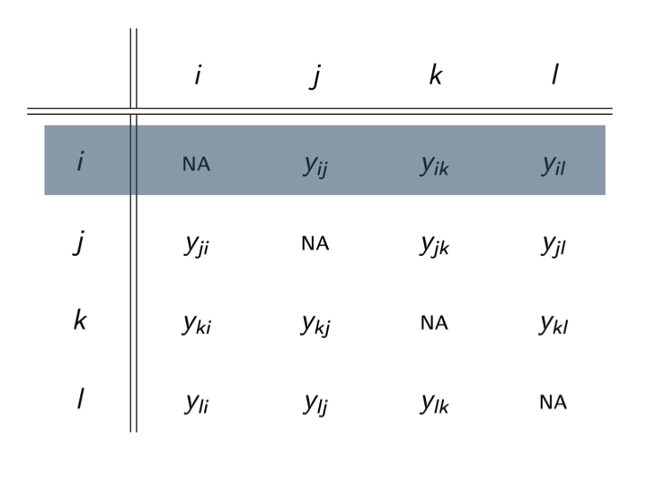
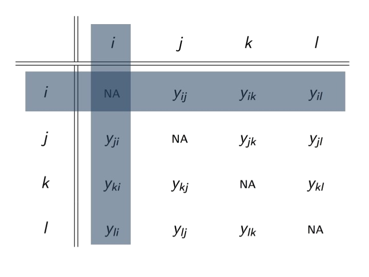
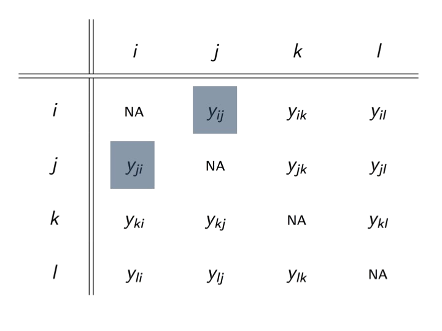
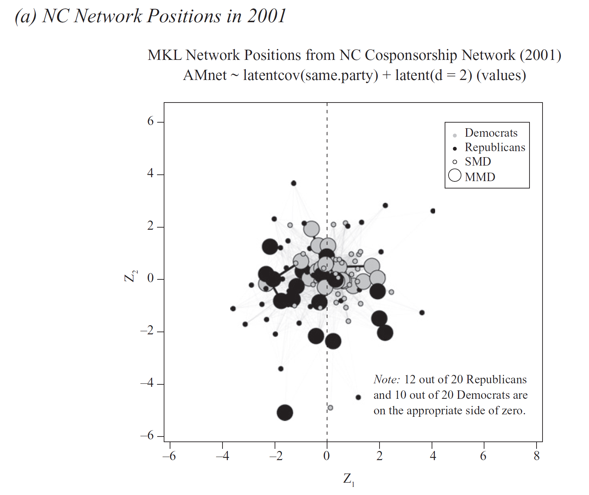
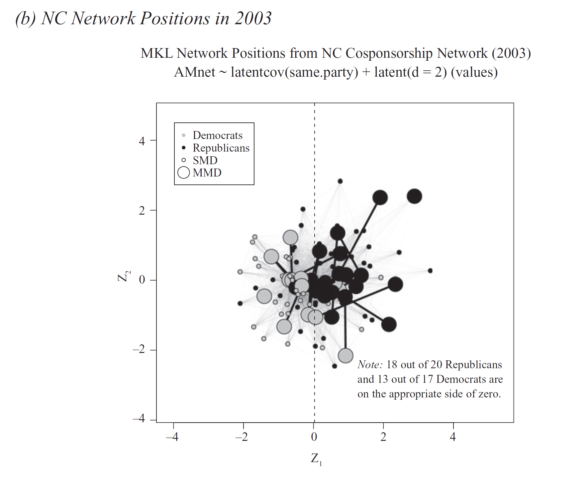
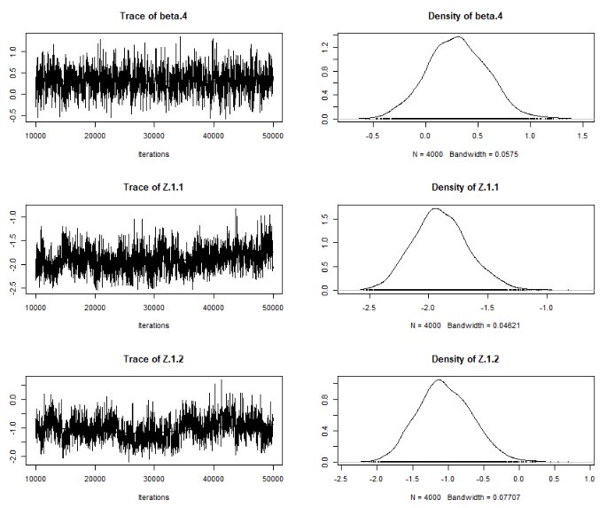
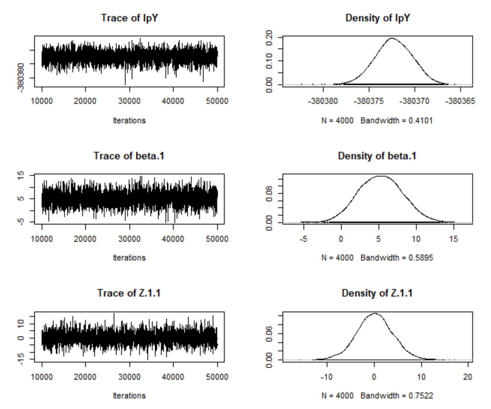
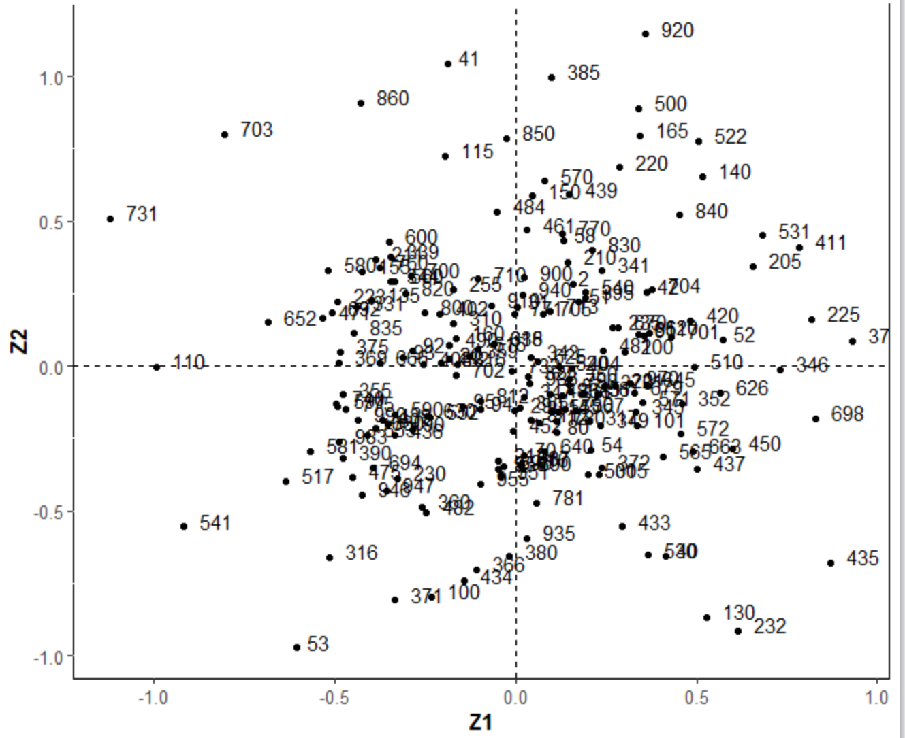
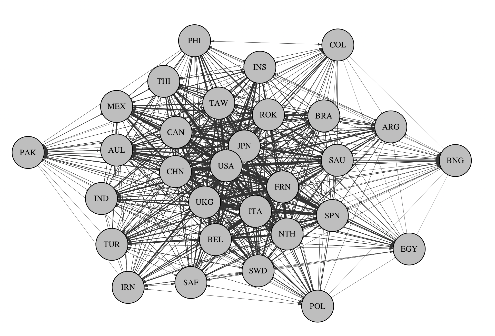

exclude: true

```{r  setup, message=FALSE, warning=FALSE, include=FALSE}
options(
  htmltools.dir.version = FALSE, # for blogdown
  width = 80,
  tibble.width = 80
)

knitr::opts_chunk$set(
  fig.align = "center",  warning=FALSE, message=FALSE
)

library(devtools)
#install_github("ochyzh/networkdata")
library(networkdata)
library(network)
library(reshape2)
library(dplyr)
library(gridExtra)
library(tidyr)
library(amen)
```

## Readings 

- Mark S. Handcock and Pavel N. Krivitsky. Fitting latent cluster models for
networks with `latentnet`. *Journal of Statistical Software*, 24(05), 2008.

- Shahryar Minhas, Peter D. Hoff, and Michael D. Ward. A new approach to analyzing coevolving longitudinal networks in international relations. *Journal of Peace Research*, 53(3):491--505, 2016.

- Justin H Kirkland. Multimember districts' effect on collaboration between us
state legislators. Legislative Studies Quarterly, 37(3):329{353, 2012.

---
## Latent Space Models

- An alternative to ERGMs

- Allow to account for unobserved network dependencies (without measuring them)

- A highly parameterized, lightly supervised approach to fit out the dependencies

- Do not exhibit degeneracy issues


---

## Trade Data
```{r, echo=FALSE, eval=TRUE}
# library(devtools) ; devtools::install_github('s7minhas/amen')
library(amen) # Load additive and multiplicative effects pkg
data(IR90s) # Load trade data
gdp = IR90s$nodevars[,2]
topgdp = which(gdp>=sort(gdp,decreasing=TRUE)[30] )
Y<-log( IR90s$dyadvars[topgdp,topgdp,2] + 1 )
Y[1:20,1:5] # Data organized in an adjacency matrix
```

---
## Sender heterogeneity 
An actor can induce dependence across its "recievers." Thus values across a row, say $\{y_{ij},y_{ik},y_{il}\}$, may be more similar to each other than other values in the adjacency matrix because each of these values has a common sender $i$.

```{r, out.width= "500px",fig.align="center", echo=FALSE}

```

---

## Receiver heterogeneity 
Additionally, values across a column, say $\{y_{ji},y_{ki},y_{li}\}$, may be more similar to each other than other values in the adjacency matrix because each of these values has a common receiver $i$. 

```{r, out.width= "500px",fig.align="center", echo=FALSE}
knitr::include_graphics("images/adjColDep.png")
```

---

## Sender-Receiver Covariance

Actors who are more likely to send ties in a network may also be more likely to receive them. 

```{r, out.width= "500px",fig.align="center", echo=FALSE}

```

---

## Reciprocity

Values of $y_{ij}$ and $y_{ji}$ may be statistically dependent. Dyads might exhibit high reciprocity because there is a tendency for actors to treat each other similarity, i.e., "respond in kind" to these behaviors. 

```{r, out.width= "500px",fig.align="center", echo=FALSE}

```

---


## Latent distance model

(Hoff, Raftery, and Handcock 2002; Krivitsky et al. 2009; Sewell & Chen 2015)

Each node $i$ has an unknown latent position

\begin{align}
\textbf{u}_{i} \in \mathbb{R}^{k}
\end{align}

The probability of a tie from $i$ to $j$ depends on the distance between them

\begin{align}
Pr(Y_{ij}=1 | \textbf{u}_{i}, \textbf{u}_{j},\theta) = \theta - |\textbf{u}_{i} - \textbf{u}_{j}|,
\end{align}

where $\theta=\alpha+\beta^\prime x_{i,j}$, and $\alpha$, $\beta$, $\textbf{u}_{i}$ and $\textbf{u}_{j}$ are estimated parameters.

* Nodes nearby one another are more likely to have a tie, and will likely have similar ties to others

**Software packages**:

- CRAN: `latentnet` [(Krivitsky et al. 2015)](https://cran.r-project.org/web/packages/latentnet/index.html)
- CRAN: `VBLPCM` [(Salter-Townshend 2015)](https://cran.r-project.org/web/packages/VBLPCM/index.html)

---

## Example: Kirkland (2012)

Argument: Legislators from multimember districts collaborate more than those from single-member districts.

- Legislative policy preferences are multidimensional and are driven by a desire to satisfy constituents’ preferences.

- Some issues (abortion) have clear partisan definitions, while other issues are less easy to define
along a partisan continuum.

- Legislators from multimember districts or similar geographic regions may have very similar preferences over distributive legislation even if they are of different parties.

- So long as the legislature faces some real constraint on the amount of legislation it can pass, legislators from multimember
districts will always have greater incentive to coordinate their efforts than those from single-member districts.
---
## Kirkland (2012)

- Measures collaboration as co-sponsorships (network ties).

- During the 2000–2002 redistricting cycle, North Carolina’s lower legislative chamber switched from a system that had 17 multimember districts electing 30 of the 120 legislators to a system that exclusively used single-member districts.

- The latent social space represents unmodeled similarities between actors that are implied by their relationships with one another.

- The latent space model allows for the assessment of distance between two unconnected
actors based on the patterns of connections between other actors in the network.

- Because the model places actors in a multidimensional social space based on their connections with one another
across many bills, it allows us to observe whether multimember legislators are closer on nonpartisan dimensions
of behavior than single-member legislators.

---
## Results: Pre-Redistricting

```{r, out.width= "600px",fig.align="center", echo=FALSE}

```

---
## Results: Post-Redistricting

```{r, out.width= "600px",fig.align="center", echo=FALSE}

```

---
## Let's Replicate Kirkland (2012)

```{r}
library(statnet)
library(latentnet)
library(networkdata)
data("Kirkland2012")

```

---
## Data

- The DV is the cosponsorship network in each year, `AMnet01` and `AMnet03`

.pull-left[
```{r}
AMnet01

```
]
.pull-right[
```{r}
as.matrix(AMnet01)[1:5,1:5]
```
]

---
## Data

- Three IVs: same district, same party, and their interaction
.pull-left[
```{r}
class(same.dist01)
same.dist01[is.na(same.dist01)]<-0 #Make sure no missing data
same.dist01[1:5,1:5]
set.network.attribute(AMnet01,"samedist",same.dist01)
```
]
.pull-right[
```{r}
class(same.party01)
same.party01[1:5,1:5]
set.network.attribute(AMnet01,"sameparty",same.party01)

```
]
---

## Data
```{r}
class(interact01)
interact01[1:5,1:5]
interact01[is.na(interact01)]<-0 #Make sure no missing data
set.network.attribute(AMnet01,"interact01",interact01)

```

---

## Specify the model:

```{r, eval=FALSE, echo=TRUE}
mod01<-ergmm(AMnet01~edgecov("sameparty")+edgecov("samedist")+edgecov("interact01")+euclidean(d=2), family="Poisson", response="values",verbose=T)
mcmc.diagnostics(mod01)
```

```{r, out.width= "400px",fig.align="center", echo=FALSE}

```

---

```{r, eval=FALSE, echo=TRUE}
summary(mod01)
```

```{r, echo=FALSE, eval=TRUE}
mod01<-readRDS("data/Kirk_mod1.RDS")
summary(mod01)
```

---
## Pulling out Nodal Positions
Can pull out the positions of actor in a euclidean latent space!

```{r}
zPos = summary(mod01)$'pmean'$Z
head(zPos)
```

---
## Plot Nodal Positions

```{r, out.width= "400px",fig.align="center", echo=FALSE}
library(ggplot2)
#Set theme options:
theme_set(theme_grey() + theme(panel.background = element_rect(fill = NA, color = 'black'))+ theme(axis.text=element_text(size=10),
					axis.title=element_text(size=12,face="bold")))

ggplot()+geom_point(aes(x=zPos[,1],y=zPos[,2]))+
  geom_hline(aes(yintercept=0), linetype=2)+
  geom_vline(aes(xintercept=0), linetype=2)+
  labs(x="Z1", y="Z2")


```

---
## Show Party and District Type:
```{r, out.width= "400px",fig.align="center", echo=FALSE}
#(need to get party and district data)

distype<-NC01 %>% group_by(dist) %>% summarize(distype=length(dist)) %>% ungroup() %>% mutate(distype=ifelse(distype==1,0,1)) 
NC01<-left_join(NC01, distype, by="dist")

ggplot()+
  geom_point(aes(x=zPos[,1],y=zPos[,2], size=as.numeric(NC01$distype), colour=factor(NC01$party)))+
  geom_hline(aes(yintercept=0), linetype=2)+
  geom_vline(aes(xintercept=0), linetype=2)+
  theme(legend.position="bottom") +
  labs(x="Z1", y="Z2", colour="Party", size="District Type")+
  scale_colour_manual(labels = c("Dem", "Rep"), values = c("blue", "red"))+
  scale_size_continuous(breaks=c(0,.5),labels = c("Single", "Multi"))
```
---
## Your Turn:

1. Estimate legislators' latent positions for 2003.
2. Check the model's diagnostics.
3. Make a graph showing positions by party and district type.
4. Does your graph look the same as Figure 4b of  Kirkland (2012)?


---


## Apply LDM to International Trade

```{r, eval=FALSE, echo=FALSE}
data("Dyadic_COW_4.0")
trade<-trade %>% filter(year==2014) %>% select(ccode1,ccode2,flow1,flow2) %>%
   mutate(flow1=recode(flow1, `-9`=0,.missing =0),flow2=recode(flow2,  `-9`=0,.missing =0)) %>%
     data.frame() 

actors<-unique(c(trade$ccode1,trade$ccode2))
TRADE<-as.data.frame(matrix(NA,195,195))
names(TRADE)<-actors
row.names(TRADE) <-actors
for (i in 1:nrow(trade)) {
    n1<-trade$ccode1[i]
    n2<-trade$ccode2[i]
         # if (!is.na(trade$flow1[trade$ccode1==i & trade$ccode2==j])){
            cat(n1,n2,fill=TRUE)
           TRADE[row.names(TRADE)==n1,names(TRADE)==n2]<-trade$flow1[trade$ccode1==n1 & trade$ccode2==n2]
           TRADE[row.names(TRADE)==n2,names(TRADE)==n1]<-trade$flow2[trade$ccode1==n1 & trade$ccode2==n2]
         # }
    } 


TRADE[1:10,1:10]
summary(TRADE)


```


```{r}
data("Dyadic_COW_4.0")
class(TRADE)
TRADE[1:5,1:5]

```

---

## Set Up Trade as A Valued Network

```{r}
tradenet<-network(as.matrix(TRADE),directed=TRUE,matrix.type='adjacency',loops=FALSE,
	ignore.eval = FALSE, 
  names.eval = "volumes")
as.matrix(tradenet[1:10,1:10])
network::list.edge.attributes(tradenet)


```


---

```{r}
as.matrix(tradenet, attrname = "volumes")[1:10,1:10]
```


---

##Estimate the Model
```{r, eval=FALSE, echo=TRUE}
y.var<-4*sd(as.matrix(TRADE), na.rm=TRUE) #Need to give a variance prior for a normal distribution.
m1<-ergmm(tradenet~euclidean(d=2), 
          family="normal", 
          response="volumes", 
          verbose=1, 
          fam.par=list(
          prior.var=y.var,
          prior.var.df=1 # certainty of the prior, higher more certain
          ))
mcmc.diagnostics(m1)

```

---

## Trace Plots

```{r, out.width= "600px",fig.align="center", echo=FALSE}

```


```{r, echo=FALSE, eval=TRUE}
m1<-readRDS("data/trade_m1.RDS")

```

---

## Your Turn

1. Pull out nodal coordinates that place each country in a latent space.
2. Plot countries in latent space.
3. Do you see any patterns?  What variables should we control for, in order for the latent space to represent policy similarity among countries.


---

## Plot Countries in Latent Space

```{r, out.width= "600px",fig.align="center", echo=FALSE}

```


---
 
## Latent factor model

(Hoff 2003; Hoff 2007; Minhas et al. 2018; Hoff 2018)

Each node $i$ has an unknown latent factor

$$
\textbf{u}_{i} \in \mathbb{R}^{k}
$$

The probability of a tie from $i$ to $j$ depends on their latent factors

$$
\begin{aligned}
  Pr(Y_{ij}=1 | \textbf{u}_{i}, \textbf{u}_{j}) =& \theta + \textbf{u}_{i}^{T} \Lambda \textbf{u}_{j} \, \text{, where} \\
  &\Lambda \text{ is a  } K \times K \text{ diagonal matrix}
\end{aligned}
$$
* Each node $i$ has a vector of unobserved characteristics $u_i=\{u_{i1},\ldots,u_{iK}\}$
* Similar values of $u_{ik}$ and $u_{jk}$ will contribute positively or negatively to the relationship between $i$ and $j$, i.e. positive or negative homophily between $i$ and $j$.
* This is a generalization of the latent distance model


---
* Can account for both stochastic equivalence and homophily
* Comes at the cost of harder to interpret multiplicative factors ... let's see what I mean

**Software packages**:

- CRAN: `amen` (Hoff et al. 2015)

---


## Running LFM through AME

To run a latent factor model, we can use the `amen` package:

```{r, echo=TRUE, eval=FALSE}
library(amen) # Load additive and multiplicative effects pkg
data(IR90s) # Load trade data
gdp = IR90s$nodevars[,2]
topgdp = which(gdp>=sort(gdp,decreasing=TRUE)[30] )
Y<-log( IR90s$dyadvars[topgdp,topgdp,2] + 1 )
#Our DV is logged exports, our sample is 
#the top 30 countries in terms of gdp
 
```

---

```{r, echo=TRUE, eval=FALSE}
lfmFit = ame(Y, 
  family='nrm', symmetric=FALSE,
  seed=6886,
  # restrict SRM parameters
  cvar=FALSE, rvar=FALSE, dcor=FALSE,
  R=2, 
  plot=FALSE, print=FALSE
  ) 
```


```{r, echo=FALSE, eval=TRUE}
lfmFit<-readRDS('data/lfmFit.rds')
```

---

## How well do we capture network effects? 

```{r, echo=TRUE, eval=TRUE, fig.width=12, fig.height=7, fig.align="center", warning=FALSE, message=FALSE}
plot(lfmFit)

```

---

## When to increase R

If our model is not adequately accounting for network effects, we can adjust the dimension of the multiplicative effects, R, in the LFM framework:

```{r, echo=TRUE, eval=FALSE}
lfmFitk3 = ame(Y, 
  family='nrm', symmetric=FALSE,
  seed=6886,
  cvar=FALSE, rvar=FALSE, dcor=FALSE,
  R=3, 
  plot=FALSE, print=FALSE
  ) 
```

```{r, echo=FALSE, eval=TRUE}
lfmFitk3<- readRDS('data/lfmFitk3.rds')
```

---

## Check GOF again

```{r, echo=TRUE, eval=TRUE, fig.width=12, fig.height=7, fig.align="center", warning=FALSE, message=FALSE}
plot(lfmFitk3)
```

---

## Interpreting the UV term

So what is this UV term?

.pull-left[
```{r, echo=TRUE, eval=FALSE}
lfmFitk3$U[1:3,]
```
```{r, echo=FALSE, eval=TRUE}
round(lfmFitk3$U[1:3,],3)
```
]

.pull-right[
```{r, echo=TRUE, eval=FALSE}
lfmFitk3$V[1:3,]
```

```{r, echo=FALSE, eval=TRUE}
round(lfmFitk3$V[1:3,],3)
```
]


```{r, echo=TRUE, eval=FALSE}
lfmFitk3$UVPM[1:3,1:3]
```

```{r, echo=FALSE, eval=TRUE, fig.align='center'}
round(lfmFitk3$UVPM[1:3,1:3],3)
```

---

## How can we use it? 

We can interpret the cross-sections of the UV term as a measure of how likely a pair of actors are to form an edge with one another:

```{r, echo=TRUE, eval=FALSE}
uv = lfmFit$UVPM ; diag(uv) = NA
uvNet = igraph::graph.adjacency(uv,
  mode='directed',
  weighted=TRUE,
  diag=FALSE)

# create graph object
diag(Y) = NA
yGraph = igraph::graph.adjacency(Y, 
  mode='directed', 
  weighted=TRUE, 
  diag=FALSE
  )


```

---

```{r, echo=TRUE, eval=FALSE}
# add node attributes
library(scales)
V(yGraph)$size = rescale(
  apply(Y, 2, sum, na.rm=TRUE), c(10, 16) )

set.seed(6886)
plot(uvNet,
  vertex.color='grey', 
  vertex.label.color='black',
  vertex.size=V(yGraph)$size,
  vertex.label.cex =.75,
  edge.color='grey20',
  edge.width=E(uvNet)$weight,
  edge.arrow.size=.2,
  asp=FALSE 
  )
```


---

## Visualizing UV

```{r, eval=TRUE, echo=FALSE, fig.width=10, fig.height=6, fig.align='center'}

```

---

## Putting it all together: AME

$$
\begin{aligned}
      y_{ij} &= g(\theta_{ij}) \\ 
      &\theta_{ij} = \beta^{T} \mathbf{X}_{ij} + e_{ij} \\
      &e_{ij} = a_{i} + b_{j}  + \epsilon_{ij} + \textbf{u}_{i}^{T} \textbf{D} \textbf{v}_{j} \\
\end{aligned}
$$

* $a_{i} + b_{j}  + \epsilon_{ij}$, are additive random effects and account for sender, receiver, and within-dyad dependence
* multiplicative effects, $\textbf{u}_{i}^{T} \textbf{D} \textbf{v}_{j}$, capture higher-order dependence patterns that are left over in $\theta$ after accounting for any known covariate information

---

## AME Gibbs Sampler

- Probit regression framework: $y_{ij,t} = g(\theta_{ij,t})$, where $\theta_{ij,t} = \beta^{\top}\mathbf{X}_{ij,t} + a_{i} + b_{j} + \textbf{u}_{i}^{\top} \textbf{D} \textbf{v}_{j} + \epsilon_{ij}$
- Prior distributions for the parameters are specified as follows: 
  + $\beta$ drawn from multivariate normals with mean zero and a (0,10) covariance matrix
  + $\Sigma_{a,b} \sim \text{ inverse Wishart}(I_{2\times 2}, 4)$
  + $\sigma_u^2$, and $\sigma_v^2$ are each drawn from an i.i.d. inverse gamma(1,1)

---

## AME Gibbs Sampler

- Given initial values of $\{\beta, \textbf{a}, \textbf{b}, \textbf{U}, \textbf{V}, \Sigma_{ab}, \rho, \text{ and } \sigma_{\epsilon}^{2}\}$, the algorithm proceeds as follows:
  + sample $\theta \; | \;  \beta, \textbf{X}, \theta, \textbf{a}, \textbf{b}, \textbf{U}, \textbf{V}, \Sigma_{ab}, \rho, \text{ and } \sigma_{\epsilon}^{2}$ (Normal)
  + sample $\beta \; | \;  \textbf{X}, \theta, \textbf{a}, \textbf{b}, \textbf{U}, \textbf{V}, \Sigma_{ab}, \rho, \text{ and } \sigma_{\epsilon}^{2}$ (Normal)
  + sample $\textbf{a}, \textbf{b} \; | \; \beta, \textbf{X}, \theta, \textbf{U}, \textbf{V}, \Sigma_{ab}, \rho, \text{ and } \sigma_{\epsilon}^{2}$ (Normal)
  + sample $\Sigma_{ab} \; | \; \beta, \textbf{X}, \theta, \textbf{a}, \textbf{b}, \textbf{U}, \textbf{V}, \rho, \text{ and } \sigma_{\epsilon}^{2}$ (Inverse-Wishart)
  + update $\rho$ using a Metropolis-Hastings step with proposal $p^{*} | p  \sim$ truncated normal$_{[-1,1]}(\rho, \sigma_{\epsilon}^{2})$
  + sample $\sigma_{\epsilon}^{2} \; | \; \beta, \textbf{X}, \theta, \textbf{a}, \textbf{b}, \textbf{U}, \textbf{V}, \Sigma_{ab}, \text{ and } \rho$ (Inverse-Gamma)
  + For each $k \in K$:
    * Sample $\textbf{U}_{[,k]} \; | \; \beta, \textbf{X}, \theta, \textbf{a}, \textbf{b}, \textbf{U}_{[,-k]}, \textbf{V}, \Sigma_{ab}, \rho, \text{ and } \sigma_{\epsilon}^{2}$ (Normal)
    * Sample $\textbf{V}_{[,k]} \; | \; \beta, \textbf{X}, \theta, \textbf{a}, \textbf{b}, \textbf{U}, \textbf{V}_{[,-k]}, \Sigma_{ab}, \rho, \text{ and } \sigma_{\epsilon}^{2}$ (Normal)
    * Sample $\textbf{D}_{[k,k]}  \; | \; \beta, \textbf{X}, \theta, \textbf{a}, \textbf{b}, \textbf{U}, \textbf{V}, \Sigma_{ab}, \rho, \text{ and } \sigma_{\epsilon}^{2}$ (Normal)

---

## Set up Trade Data

```{r}
#### ---- nodal covariates
dimnames(IR90s$nodevars)[[2]]
Xn<-IR90s$nodevars[topgdp,]
Xn[,1:2]<-log(Xn[,1:2])
#### ---- dyadic covariates
dimnames(IR90s$dyadvars)[[3]]
Xd<-IR90s$dyadvars[topgdp,topgdp,c(1,3,4,5)]
Xd[,,3]<-log(Xd[,,3])
```

---

## Estimating with multiplicative effects

Multiplicative effects can be added by toggling the `R` input parameter

```{r, echo=TRUE, eval=FALSE}
fitAME = ame(Y=Y,
  Xdyad=Xd, # incorp dyadic covariates
  Xrow=Xn, # incorp sender covariates
  Xcol=Xn, # incorp receiver covariates
  symmetric=FALSE, # tell AME trade is directed
  intercept=TRUE, # add an intercept             
  family='nrm', # model type
  rvar=TRUE, # sender random effects (a)
  cvar=TRUE, # receiver random effects (b)
  dcor=TRUE, # dyadic correlation
  R=2, # 2 dimensional multiplicative effects
  nscan=10000, burn=25, odens=25,
  plot=FALSE, print=FALSE, gof=TRUE
  )
```

```{r, echo=FALSE}
fitAME<-readRDS('data/fitAME.RDS')
```

---

## Capturing network features part 2

```{r, echo=TRUE, eval=TRUE, fig.width=12, fig.height=7, fig.align="center", warning=FALSE, message=FALSE, }
plot(fitAME)
```

---

## Summary method

```{r}
summary(fitAME)
```

---

## Visualizing the multiplicative effects

```{r, echo=TRUE, eval=FALSE}
x=circplot(
  Y=Y, U=fitAME$U, V=fitAME$V,
  vscale=.6
  )
```

---


## Visualizing the multiplicative effects

```{r, echo=FALSE, eval=TRUE}
x=circplot(
  Y=Y, U=fitAME$U, V=fitAME$V,
  vscale=.6
  )
```

---

## Benefits of this approach

* At its core, AME is just a GLM with random effects used to ensure that we can treat dyadic observations as conditionally independent
* AME can be used: 
      - on both undirected and directed data, 
      - on longitudinal and static networks,
      - and on a variety of distribution types we commonly encounter in political science (binomial, gaussian, and ordinal).

---

## Real world comparison

Cranmer et al. (2017)

  - Compares a few inferential network approaches
  - Utilized Swiss climate change policy collaboration  network as application (Ingold, 2008)

```{r, out.width= "600",fig.align="center", echo=FALSE}
knitr::include_graphics('images/ingoldApplication.png')
```

---

## $\beta$ Estimates

```{r, out.width= "1000",fig.align="center", echo=FALSE}
knitr::include_graphics('images/ingoldApplicationCoef.png')
```

---

## Which approach fits $Y$ best?

**Out-of-sample Network Cross-Validation**

```{r, out.width= "900",fig.align="center", echo=FALSE}
knitr::include_graphics('images/ingoldApplicationPredY.png')
```

---

## Which approach fits network dependencies best?

```{r, out.width= "900",fig.align="center", echo=FALSE}
knitr::include_graphics('images/ingoldApplicationNetY.png')
```

---

## Summary

- LFM is a powerful framework that has proven useful

- A lot of other things going on:
    - Community structure in longitudinal, multidimensional arrays (Mucha et al. 2010)
    - Multilinear tensor regression (Hoff 2015, Schein et al. 2015, Minhas et al. 2016)
    - Intersection of network based methods to text analysis (Henry et al. 2016, Huang et al. 2015)

- Takeaway here is that these methods are useful when we study systems in which interactions are interdependent
- These interdependent relations may at times be of interest themselves or in other cases may just help us to better predict
