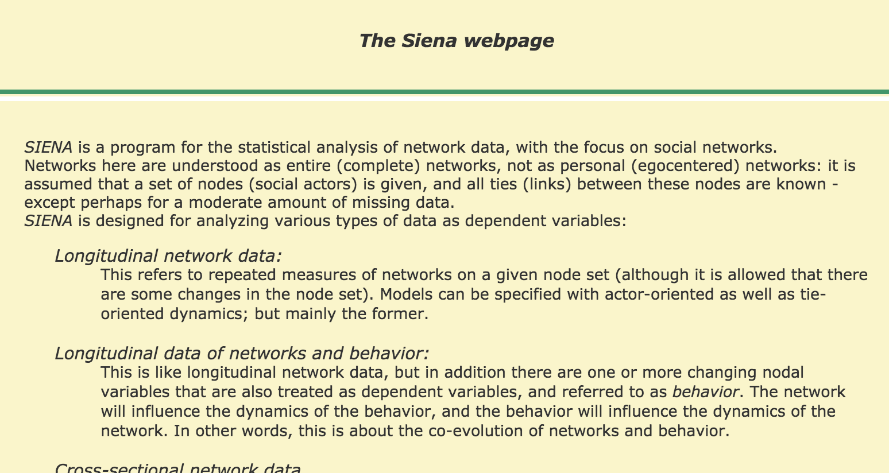
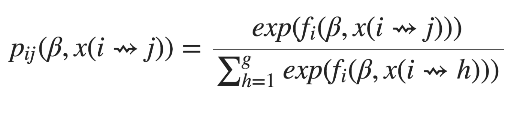
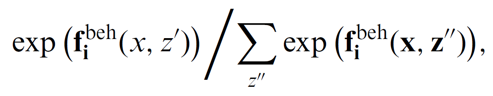
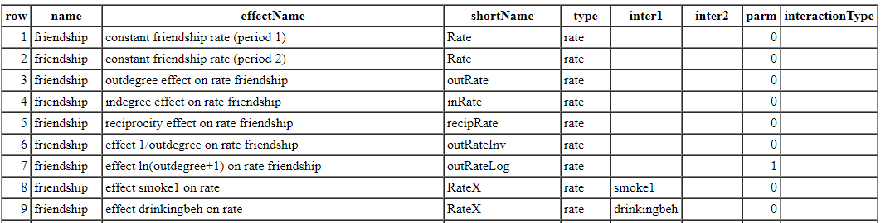

exclude: true

```{r  setup, message=FALSE, warning=FALSE, include=FALSE}
options(
  htmltools.dir.version = FALSE, # for blogdown
  width = 80,
  tibble.width = 80
)

knitr::opts_chunk$set(
  fig.align = "center",  warning=FALSE, message=FALSE
)


```

## Readings 

- Christian Steglich, Tom AB Snijders, and Michael Pearson. Dynamic networks and behavior: Separating selection from in
uence. Sociological Methodology, 40(1):329--393, 2010.

---

# SAOM

Stochastic actor oriented model developed primarily by [Snijders](https://www.stats.ox.ac.uk/~snijders/) is implemented in the RSiena package on CRAN: 
- [https://www.stats.ox.ac.uk/~snijders/siena/](https://www.stats.ox.ac.uk/~snijders/siena/)
- [Recent overview piece by Snijders](https://www.annualreviews.org/doi/10.1146/annurev-statistics-060116-054035)

```{r, out.width= "500px",fig.align="center", echo=FALSE}

```

---

## SAOM Assumptions

- Actors control their outgoing ties and have full knowledge of the broader network

- Changes in network ties and actor behavior happen in continuous time

- Continuous time is modeled as a series of microsteps

- During a microstep, a randomly chosen actor can change only one of its ties or the value of its behavior variable

- Tie change only depends on the present network

---

## SAOM Broadstrokes

- The simulation starts out at the network observed at the first time point $t_{0}$

    - Examples: students in the same school

- An actor is chosen randomly using a <span style="background-color: #d0d1e6">rate function</span>

- The identified actor gets the opportunity to set a micro step. The actor's choice is determined by their <span style="background-color: #d0d1e6">objective function</span>

- Model time is updated and simulation proceeds at step 2

- The simulation terminates once modified network resembles network at $t_{1}$


---
```{r, out.width= "700px",fig.align="center", echo=FALSE}
knitr::include_graphics("images/steglitchetal_table1.png")
```

---

## Rate Functions

- *Micro steps* are opportunities for a randomly chosen actor to change one of his/her  outgoing ties or behavior.

- The frequency of these opportunities for change is modeled using *rate functions,* one for each type of change (network, behavior).

- Waiting time between steps follows an exponential distribution with parameter $\lambda_{t} N$ ( $N$ refers to number of actors in the network)

	+ Values of $\lambda_{t}$ are estimated by calculating the number of edge differences between networks: 

	+ The higher $\lambda_{t}$ is the greater the number of changes between observation moments 

- Probability that an actor $i$ has the opportunity to make a change is equal to $1/N$

---

## Actor's Objective Function

- Micro steps can be of two kinds: those that involve network changes or behavior changes

- For network changes, the micro step consists of the change of one tie by a given actor.

- Suppose **x** is the current network, and actor **i** has an opportunity to make a network change.

- The next network $\textbf{x}^\prime$ then must either equal to **x** or deviate from **x** by just one row element.

- Hence, there are **N** possible outcomes, and **i** chooses the one that maximizes his/her utility function, called *objective function,* $$f_i^{net}(\textbf{x},\textbf{x}\prime,\textbf{z})+\epsilon_i^{net}(\textbf{x},\textbf{x}\prime,\textbf{z}),$$

    - where **z** is the current vector of behavior scores, $f^{net}$ is a measure of actor's satisfaction with the result of the network decision, and $\epsilon^{net}$ is the random component. 

---

## Multinomial Choice Model

- The choice probabilities can be expressed in multinomial logit shape:

```{r, out.width= "500px",fig.align="center", echo=FALSE}

```

- where the sum in the denominator extends over all possible next network states $\textbf{x}^{\prime\prime}$ 
---
## Behavior Micro Steps

- A given actor increments or decrements his score on the behavioral variable by one unit, provided that this change does not step outside the range of this variable. The score can also stay the same.

- Let **z** denote the current vector of behavior scores for all actors, and $\textbf{z}^\prime$ is the vector resulting from the actor's action in the micro step.

- Actor **i** makes the choice by maximizing their *behavior objective function*, $$f_i^{beh}(\textbf{x},\textbf{z},\textbf{z}^\prime)+\epsilon_i^{beh}(\textbf{x},\textbf{z},\textbf{z}^\prime),$$

    - where $f_i^{beh}$ models the actor's satisfaction with the result of the behavior decision, and $\epsilon^{beh}$ is the random error.
    
- The behavior choice probability can be expressed as:

```{r, out.width= "500px",fig.align="center", echo=FALSE}

```

---

## Parameterization

For network changes, the objective function has the general shape $$f_i^{net}(\textbf{x},\textbf{x}^\prime,\textbf{z})=\sum_h{\beta_h^{net}\textbf{s}_h^{net}(i,\textbf{x},\textbf{x}^\prime,z)},$$

  - where statistics $s_h^{net}$ are the effects, weighted by parameters $\beta_h^{net}$.

For behavior changes:

$$f_i^{beh}(\textbf{x},\textbf{z},\textbf{z}^\prime)=\sum_h\beta_h^{beh}s_h^{beh}(\textbf{i},\textbf{x},\textbf{z},\textbf{z}^\prime),$$

- Can specify exogenous and endogenous (network) effects.

---

## Estimation

- A stochastic simulation algorithm that generates network and behavioral data according to the postulated dynamic process.

- Start with some network--behavior configuration, **x**(t), **z**(t).

- Draw a waiting time and increment the parameter **t** by this waiting time.

- Determine whether the next event is a network or a behavior change and select an actor who is making this change.

- Determine the action of the selected actor.

- Iterate until the end of the period is reached and evaluate the resulting simulated network--behavior configuration.

---

## Example: Friendship Networks

```{r}
library(RSiena)
	friend.data.w1 <- s501
	friend.data.w2 <- s502
	friend.data.w3 <- s503
	drink <- s50a
	smoke <- s50s
```

---

## Specify the Network DV:

```{r}
friendship <- sienaDependent(
                     array( c( friend.data.w1, friend.data.w2, friend.data.w3 ),
                     dim = c( 50, 50, 3 ) ) )


```

.pull-left[
```{r}
friendship
class(friendship)
dim( friendship)
```
]

.pull-right[
```{r}

attributes(friendship)
```
]

---

## Specify the Behavior DV:

```{r}
drinkingbeh <- sienaDependent( drink, type = "behavior" )
drinkingbeh

```

---

## Specify IVs:

```{r}
smoke1 <- coCovar( smoke[ , 1 ] )

# Put the variables together in the data set for analysis
NBdata <- sienaDataCreate( friendship, smoke1, drinkingbeh)
NBdata                          
```


---
## Possible Types of IVs

- `coCovar`--constant node-level covariate (does not change between time periods)

- `varCovar`--time-variable node-level covariate

- `coDyadCovar`--constant edge-level covariate

- `varDyadCovar`--time-varying edge-level covariate

- `sienaCompositionChange`--over time changes in node set (e.g., some actors leave the network)

```{r, eval=FALSE}

?coCovar

```


---

## Specify Endogenous Effects
```{r}
NBeff <- getEffects( NBdata )
NBeff


```

---

## Effects Description
```{r, echo=TRUE, eval=FALSE}
effectsDocumentation(NBeff)
```


```{r, out.width= "500px",fig.align="center", echo=FALSE}

```

---

## Specify Effects

```{r}
NBeff <- includeEffects( NBeff, transTrip, transRecTrip )
NBeff <- includeEffects( NBeff, egoX,  altX, altSqX, diffSqX,
                         interaction1 = "smoke1"  )
NBeff
```

---

## Define the Model:
```{r, echo=TRUE, eval=FALSE}
myalgorithm1 <- sienaAlgorithmCreate( projname = 's50_NB' )

# Estimate using the second algorithm right from the start.
NBans <- siena07(myalgorithm1, data = NBdata, effects = NBeff)
NBans <- siena07(myalgorithm1, data = NBdata, effects = NBeff, batch=TRUE) #without Siena screen
```

```{r, eval=TRUE, echo=FALSE}

NBans<-readRDS("data/NBans.rds")
```

---

## Look at results

```{r}
NBans
```


---
## Interpretation of Parameters

- The parameters on the rate functions are interpreted as related to the speed of the evolution process. These parameters reflect the frequencies of the opportunities for change. 

- The parameters on the objective functions may be interpreted in terms of their direction and statistical significance or by calculating predicted probabilities of ties in hypothetical scenarios (i.e., use the reverse logistic transformation).

- The linear and the quadratic shape parameters of the behavior objective function model the shape of the long-term distribution of the behavior variable.

- Can also use the reverse logit transformation to interpret the parameters on the behavior effects. 
---
## Example

Suppose we estimated the following model:

$$f_i^{net}=-2\sum_j\textbf{x}_{ij}^\prime+2.5\sum_j{\textbf{x}_{ij}^\prime\textbf{x}_{ji}+1\sum_j\textbf{x}_{ij}^\prime\text{sim}_ij}$$

and
$$f_i^{beh}(\textbf{x},\textbf{z},\textbf{z}^\prime)=-1(\textbf{z}_i^\prime-\textbf{z})-.5(\textbf{z}_i^\prime-\textbf{z})^2+2.5(\sum_j\textbf{x}_{ij}\text{sim}^\prime_{ij})/(\sum_jx_{ij})$$

The primes indicate the elements in the formulae that are under control of actor **i** and may be changed in a micro step.

- Note that the network objective function contains outdegree, reciprocity, and the similarity effect, and the behavior function includes the linear and quadratic shape of the distribution of the behavior variable and an effect of average similarity to neighbors. 
---
## Interpretation of Parameters: Network Function 

- The parameter estimate of -2 on the outdegree tells us that, if we ignore all other variables, the baseline probability of a tie in this network is $\exp{(-2)}/(1+\exp{(-2)})=0.12$.

- The parameter estimate of 2.5 on the reciprocity tells us that the probability of a reciprocated tie is $\exp{(-2+2.5)}/(1+\exp{(-2+2.5)})=0.62$.

- The positive similarity effect indicates that actors tend to form ties with similar others rather than to dissimilar ones. The probability of a tie to a maximally similar actor is $\exp{(-2+1)}/(1+\exp{(-2+1)})=0.26$ vs that of the baseline probability of $0.12$.

---
## Interpretation of Parameters: Behavior Function 

- Suppose our behavior variable ranges from 1 to 5 and has an average of 3. When mean centered, this variable then ranges from -2 to 2. 

- The first two parameters define a parabolic shape. We can calculate the inflection point of this parabola by solving $-1-0.5*2x=0$ for x. The result is x=-1, which corresponds to the value of 2 on the original scale of this variable. This means that in the long run, the distribution of the behavior variable is unimodal with a maximum at score value 2.

- Can also calculate the probability of moving from one score to the other. For example, the probability of moving from 3 to 2 is $$\begin{align}\exp&(-1(2-3)-0.5(2-3)^2)/(1+\exp(-1(2-3)-0.5(2-3)^2))\\&=0.62\end{align}$$ The probability of staying at 3 rather than moving to 2 is 1-0.62=0.38.


---
## Interpretation of Parameters: Behavior Function Cont'd
- The third parameter of 2.5 on the average similarity indicates that actors tend to act in the same manner as their friends. 

- Consider an actor with a 3 on their behavior and assume he has five friends, four of whom score 3 and 1 scoring 2 or lower. 

- If this actor moves to 2, his average similarity to four of his friends will decrease by -1*4 and his similarity to his fifth friend will increase by 1. 

- The average similarity will decrease from 1/5 to 4/5 for a change of -0.6. Then, accounting for the similarity effect, the probability of moving from 3 to 2 for this actor is $$\begin{align}&\exp(-1(2-3)-0.5(2-3)^2\\&+2.5(-0.6))/(1+\exp(-1(2-3)-0.5(2-3)^2\\&+2.5(-0.6))=0.26\end{align}$$ 

---
## Your Turn

Use the example above to answer the following questions.

- What is the probability of reciprocating an incoming tie to a similar actor? 

- What is the probability of moving from 3 to 4, ignoring the similarity to friends?

- Suppose an actor has 5 friends, 3 of whom score 4 and 2 of whom score 3. What is the probability of moving from 3 to 4, if we account for homophily?


---

## Back to Our Estimated Model

```{r}
NBans
```

---

## Let's Specify a Model That...

1. accounts for homophily effect for smoking


```{r}
NBeff <- getEffects( NBdata )

NBeff <- includeEffects(NBeff, simX,
          interaction1 = "smoke1" )
```

---

## Let's Specify a Model That...

2. Parses out whether there is a selection or influence (or both) effect for drinking behavior--- include sender, receiver and homophily effects of drinking for friendship formation, and vice versa.

```{r}
NBeff <- includeEffects(NBeff, egoX, altX, simX,
           interaction1 = "drinkingbeh" )

NBeff <- includeEffects(NBeff, name = "drinkingbeh",
      avAlt,indeg,outdeg,
      interaction1 = "friendship" )
```

---
## Your Turn

1. Run the new model

2. What is the probability of a reciprocated tie?

3. What is the probability of a reciprocated tie for two actors with the same drinking habits?

4. What is the range of the drinking variable? What is it's mean?  What is the inflection point in the parabola that is fitted to the trend in drinking behavior? 

5. What is the probability of someone moving from drinking=3 to drinking=2, without accounting for homophily?

6. Suppose an individual has 2 friends, one with a drink score of 5 and another with a drink score of 2. What is the probability that this individual will move from drinking=3 to drinking=2, accounting for homophily?


---
## Results
```{r, echo=FALSE}
m2<-readRDS("data/m2.rds")
summary(m2)


```


---
## Convergence Ratios

- Note that the "convergence t-ratio" is the t-ratio for convergence checking, not the t statistic for testing the significance of this effect (See Section 6.3 of the RSiena manual).

- For good convergence, the t-ratios for convergence all should be less than .1 in absolute value, and the overall maximum convergence ratio should be less than 0.25.

- If this is not yet the case, you should try again, starting from the last estimate as the previous answer (`prevAns` argument), e.g.:

```{r, eval=F}
m3 <- siena07(myalgorithm2, data = NBdata,
      effects = NBeff, prevAns = m2 )
```
---
## Goodness of Fit: Indegree

- Can plot distributions of network statistics from simulated networks

- Note: must specify `returnDeps=TRUE` in the `siena07` function to save these networks.

```{r, eval=F}
myalgorithm2 <- sienaAlgorithmCreate(projname = 's50CoEv_2' )
m2 <- siena07(myalgorithm2, data = NBdata,
      effects = NBeff, batch=TRUE, returnDeps=TRUE) 
gofI <- sienaGOF(m2, IndegreeDistribution, verbose=TRUE, join=TRUE,
     varName="friendship")
plot(gofI)
saveRDS(gofI,"data/gofI")
```

---
## Goodness of Fit: Indegree
```{r, echo=FALSE}
gofI<-readRDS("data/gofI")
plot(gofI)
```


---
## Goodness of Fit: Outdegree
```{r, eval=FALSE}
gofO <- sienaGOF(m2, OutdegreeDistribution, verbose=TRUE, join=TRUE,
     varName="friendship")
plot(gofO)
saveRDS(gofO,"data/gofO")
```


```{r, echo=FALSE, out.width= "400px",fig.align="center"}
gofO<-readRDS("data/gofO")
plot(gofO)
```

---
## Goodness of Fit: Triad Census
```{r, eval=FALSE}
gofTC <- sienaGOF(m2, TriadCensus, verbose=TRUE, join=TRUE,
     varName="friendship")
plot(gofTC)
saveRDS(gofTC,"data/gofTC")
```

```{r, echo=FALSE, out.width= "400px",fig.align="center"}
gofTC<-readRDS("data/gofTC")
plot(gofTC)
```


---

## Actors Entering and Exiting the Network

- Treatment by structural zero coding

- Treatment by composition change directives

- What to use?

- Loosely related to structural zeros: structural ones

---

## Treatment by structural zero coding
- When actors are not part of the group at a given measurement point, code their outgoing and incoming ties as “10”,
meaning “absent, and could not possibly have been present”.

- When running simulations, this is handled as follows:

  - A tie value “10” at the beginning of a period implies that the tie will remain structurally absent throughout the period, no matter what the tie’s value at the end of the period is.
   - A tie value “10” at the end of a period implies that no matter what the tie’s simulated value at the end of the period is, it is overwritten by “10” before any statistics are evaluated.

- See RSiena manual section 4.1.2.

---
## Treatment by structural zero coding

- When information is known about the exact time when actors left or entered the group in continuous time between observation moments, this information can be made use of.

- In simulations, joiners enter at the indicated time point and then are simultaneously connected to the rest of the actors
according to the data provided for the period begin (so, they do not necessarily have to ‘start from scratch’ but can inherit ties!)

- Leavers just exit and cannot change their ties any more from this time point on; their last connection data can be provided for the period end.

- Joiner and leaver data need to be provided in an additional
file; see RSiena manual sections 2.1.2 and 4.7.

---
## What to Use

- Composition change directives allow to make use of more information. If information is scarce, this may be
the better option.

-  Structural zero treatment is quite crude, if results can be obtained this way, they will likely be robust. But under
scarce information conditions, it can happen that no results can be obtained.


---

## Structural Ones

- Sometimes, ties can be “present, and could not possibly have been absent”.
    - Studying a communication network among employees, where Loosely related to structural zeros:

    - Studying a communication network among employees, where some people are forced to communicate anyway (by their job
contract).

- Studying a growing network where ties once formed cannot be dissolved again.

- In such situations, tie variables can be coded as “11”.

- See RSiena manual section 4.1.2.
---
## Example: Duque Data

```{r}
library(devtools)
#install_github("ochyzh/networkdata")
data("duqueData")
dim(dipl_ties[[1]])
dim(dipl_ties[[2]])
```

- Remember that in these data, time periods have varying numbers of observations, as states enter and leave the system.

- In order to use RSiena, we must have the same number of actors in each time period. If an actor is missing, their tie values are coded using the structural zero code `10`. Alternatively, you can provide an additional file that details when actors enter and leave the data.

 

---

## Example: Duque Data

```{r,echo=TRUE, eval=FALSE}
library(tidyverse)
#get the full list of actors:
myactors<-sort(as.numeric(unique(do.call("c",lapply(dipl_ties[1:3],names)))))
n<-length(myactors)

dipl<-array(10, dim = c(n,n, 3 ),
	dimnames=list(myactors,myactors,seq(from=1970,to=1980,by=5)))
dipl[1:10,1:10,1]

for(t in 1:3){
    d<-dipl_ties[[t]]
	for(i in 1:nrow(d)){
	  for (j in 1:ncol(d)){
		a1 = names(d)[i]
		a2 = colnames(d)[j]
		val = as.numeric(as.character(d[i,j]))
		dipl[i,j,t] <- val
		dipl[j,i,t] <- val
	  }}
	}

dipl <- sienaDependent(dipl)
```


---

## Your Turn

1. Set up `allies` and `contig` as edge-level covariates (use the first two time periods).

2. Set up `polity` as a time-varying node-level covariate (use the first two time periods).

3. Estimate a model that includes the following covariates: degree, transTies, polity similarity, contiguity, and allies.


---
## Results
```{r, echo=FALSE}
ans<- readRDS("data/ans.rds")
summary(ans)
```
---

## Goodness of Fit: Indegree
```{r, echo=FALSE, eval=FALSE}
gofI_dipl <- sienaGOF(ans, IndegreeDistribution, verbose=TRUE, join=TRUE,
     varName="dipl")
plot(gofI_dipl)
```

```{r, echo=FALSE, out.width= "400px",fig.align="center"}
gofI_dipl<-readRDS("data/gofI_dipl")
plot(gofI_dipl)
```


---
## Goodness of Fit: Triad Census
```{r, eval=FALSE, out.width= "400px",fig.align="center"}
gofTC_dipl <- sienaGOF(ans, TriadCensus, verbose=TRUE, join=TRUE,
     varName="dipl")
plot(gofTC_dipl)
```

```{r, echo=FALSE, out.width= "400px",fig.align="center"}
gofTC<-readRDS("data/gofTC_dipl")
plot(gofTC)
```


---

# TERGM vs. SAOM

- [Block et al. 2017](http://journals.sagepub.com/doi/abs/10.1177/0049124116672680)
- [Block et al. 2018](https://www.sciencedirect.com/science/article/pii/S0378873317300035)
- [Leifeld & Cranmer 2018](https://arxiv.org/pdf/1506.06696.pdf)


