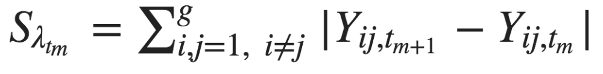
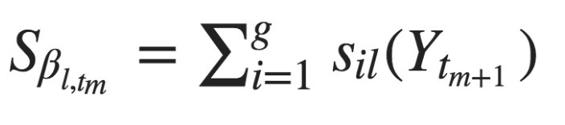

exclude: true

```{r  setup, message=FALSE, warning=FALSE, include=FALSE}
options(
  htmltools.dir.version = FALSE, # for blogdown
  width = 80,
  tibble.width = 80
)

knitr::opts_chunk$set(
  fig.align = "center",  warning=FALSE, message=FALSE
)


```

## Readings 

- Christian Steglich, Tom AB Snijders, and Michael Pearson. Dynamic networks and behavior: Separating selection from in
uence. Sociological Methodology, 40(1):329--393, 2010.

---

# SAOM

Stochastic actor oriented model developed primarily by [Snijders](https://www.stats.ox.ac.uk/~snijders/) is implemented in the RSiena package on CRAN: 
- [https://www.stats.ox.ac.uk/~snijders/siena/](https://www.stats.ox.ac.uk/~snijders/siena/)
- [Recent overview piece by Snijders](https://www.annualreviews.org/doi/10.1146/annurev-statistics-060116-054035)

```{r, out.width= "500px",fig.align="center", echo=FALSE}
knitr::include_graphics("images/siena.png")
```

---

## SAOM Assumptions

- Actors control their outgoing ties and have full knowledge of broader network

--

- Evolution of network process occurs in microsteps

--

- Only one tie can change at a microstep

--

- Tie change only depends on the present network

---

## SAOM Broadstrokes

- The simulation starts out at the network observed at the first time point $t_{0}$

--

- An actor is chosen randomly using a <span style="background-color: #d0d1e6">rate function</span>

--

- The identified actor gets the opportunity to set a micro step. The actor's choice is determined by their <span style="background-color: #d0d1e6">objective function</span>

--

- Model time is updated and simulation proceeds at step 2

--

- The simulation terminates once modified network resembles network at $t_{1}$

---

## Rate Function

- Waiting time until change can be made by any actor follows an exponential distribution with parameter $\lambda_{t} g$ ( $g$ refers to number of actors in the network)

--

	+ Values of $\lambda_{t}$ are estimated by calculating the number of edge differences between networks: 

--

	+ The higher $\lambda_{t}$ is the greater the number of changes between observation moments 

--

- Probability that an actor $i$ has the opportunity to make a change is equal to $1/g$

---

## Actor's Objective Function

$f_{i}(\beta, x(i \leadsto j)) = \sum_{l=1}^{k} \beta_{l} s_{il} (x(i \leadsto j)) + U_{i}(t,x,j)$, where

--

- $s_{il} (x(i \leadsto j))$ represents $k$ structural and exogenous effects 

--

-  $\beta_{l}$ are statistical parameters 

--

- and $U_{i}(t,x,j)$ is a random utility term

---

## Multinomial Choice Model

<!-- $ p_{ij}(\beta, x(i \leadsto j)) = \dfrac{ exp(f_{i}(\beta, x(i \leadsto j))) }{ \sum_{h=1}^{g} exp(f_{i}(\beta, x(i \leadsto h)))  }  $ -->

```{r, out.width= "500px",fig.align="center", echo=FALSE}
knitr::include_graphics("images/saom_choice.png")
```

--

- Represents the probability with which actor $i$ changes his outgoing ties  

--

- When $i=j$ this probability refers to the probability of not changing anything  

---

## Parameter Estimation

Solving the model requires the estimation of $\boldsymbol\theta = (\boldsymbol\lambda, \boldsymbol\beta)$ using a Method of Moments approach (MoM)

--

- Suitable statistic for $\boldsymbol\lambda$: 

```{r, out.width= "300px",fig.align="center", echo=FALSE}

```

--

- Suitable statistic for $\boldsymbol\beta$:

```{r, out.width= "230px",fig.align="center", echo=FALSE}

```

---

## Stochastic Approximation Process

Combining the suitable statistics, we next determine the value $\hat{\boldsymbol\theta}$ for $\boldsymbol\theta$ as the solution of the system of equations:

\begin{align}
	g_{n}(\boldsymbol\theta | z_{n}) = \sum_{t_{a} \in T} (E_{\boldsymbol\theta} \{ u(Y^{(a+1)} | Y^{(a)} = y^{(a)})  \} - u(y^{(a+1)}) ), 
\end{align}

--

- $z_{n}$ simply means all available data

--

- $u(x)$ corresponds to the statistic being estimated

--

- The estimation for the MoM relies on MCMC simulations of the network change process (Robbins & Monro, 1951)

---

## Example: Friendship Networks

```{r}
library(RSiena)
	friend.data.w1 <- s501
	friend.data.w2 <- s502
	friend.data.w3 <- s503
	drink <- s50a
	smoke <- s50s
```

---

## Specify the Network DV:

```{r}
friendship <- sienaDependent(
                     array( c( friend.data.w1, friend.data.w2, friend.data.w3 ),
                     dim = c( 50, 50, 3 ) ) )


```

.pull-left[
```{r}
friendship
class(friendship)
dim( friendship)
```
]

.pull-right[
```{r}

attributes(friendship)
```
]

---

## Specify the Behavior DV:

```{r}
drinkingbeh <- sienaDependent( drink, type = "behavior" )
drinkingbeh

```

---

## Specify IVs:

```{r}
smoke1 <- coCovar( smoke[ , 1 ] )

# Put the variables together in the data set for analysis
NBdata <- sienaDataCreate( friendship, smoke1, drinkingbeh)
NBdata                          
```


---
## Possible Types of IVs

- `coCovar`--constant node-level covariate (does not change between time periods)

- `varCovar`--time-variable node-level covariate

- `coDyadCovar`--constant edge-level covariate

- `varDyadCovar`--time-varying edge-level covariate

- `sienaCompositionChange`--over time changes in node set (e.g., some actors leave the network)

```{r, eval=FALSE}

?coCovar

```


---

## Specify Endogenous Effects
```{r}
NBeff <- getEffects( NBdata )
NBeff


```

---

## Effects Description
```{r, echo=TRUE, eval=FALSE}
effectsDocumentation(NBeff)
```


```{r, out.width= "500px",fig.align="center", echo=FALSE}
knitr::include_graphics("images/effects.png")
```

---

## Specify Effects

```{r}
NBeff <- includeEffects( NBeff, transTrip, transRecTrip )
NBeff <- includeEffects( NBeff, egoX, egoSqX, altX, altSqX, diffSqX,
                         interaction1 = "smoke1"  )
NBeff
```

---

## Define the Model:
```{r, echo=TRUE, eval=FALSE}
myalgorithm1 <- sienaAlgorithmCreate( projname = 's50_NB' )

# Estimate using the second algorithm right from the start.
NBans <- siena07(myalgorithm1, data = NBdata, effects = NBeff)
NBans <- siena07(myalgorithm1, data = NBdata, effects = NBeff, batch=TRUE) #without Siena screen
```

```{r, eval=TRUE, echo=FALSE}

NBans<-readRDS("data/NBans.rds")
```

---

## Look at results

```{r}
NBans
```

---

## Actors Entering and Exiting the Network


```{r}
library(devtools)
#install_github("ochyzh/networkdata")
data("duqueData")
dim(dipl_ties[[1]])
dim(dipl_ties[[2]])
```

- Remember that in these data, time periods have varying numbers of observations, as states enter and leave the system.

- In order to use RSiena, we must have the same number of actors in each time period. If an actor is missing, their tie values are coded as either `NA` or some other code we will passed to `sienaCompositionChange` option (see the manual for the second option).

- Note: if you plan to use network analysis, you have to become very comfortable with these types of data issues.  

---

## Setting Up the DV

```{r,echo=TRUE, eval=FALSE}
library(tidyverse)
#get the full list of actors:
myactors<-unique(do.call("c",lapply(dipl_ties,names)))
dyads<-expand.grid(myactors,myactors)

dipl<-array(NA, dim = c( 194, 194, 8 ),
	dimnames=list(myactors,myactors,seq(from=1970,to=2005,by=5)))

for(t in 1:8){
    d<-dipl_ties[[t]]
	for(i in 1:nrow(d)){
	  for (j in 1:ncol(d)){
		a1 = names(d)[i]
		a2 = colnames(d)[j]
		val = as.numeric(as.character(d[i,j]))
		
		dipl[i,j,t] <- val
		dipl[j,i,t] <- val
	  }}
	}

dipl <- sienaDependent(dipl)
```


---

## Your Turn

3. Set up `allies` and `contig` as edge-level covariates.

4. Set up `polity` as a time-varying node-level covariate.

5. Estimate a model that includes the following covariates: outdegree, reciprocity, transitive triplets, polity alter, polity ego, polity diff., contiguity, and allies.


```{r, eval=F, echo=F}
myalgorithm <- sienaAlgorithmCreate(projname = 'Dties')
ans <- siena07(myalgorithm, data = mydata, effects = myeff1)
saveRDS(ans,"ans.rds")
```

---


```{r,echo=T}
ans<-readRDS("data/ans.rds")
summary(ans)
```


---

# TERGM vs. SAOM

- [Block et al. 2017](http://journals.sagepub.com/doi/abs/10.1177/0049124116672680)
- [Block et al. 2018](https://www.sciencedirect.com/science/article/pii/S0378873317300035)
- [Leifeld & Cranmer 2018](https://arxiv.org/pdf/1506.06696.pdf)


