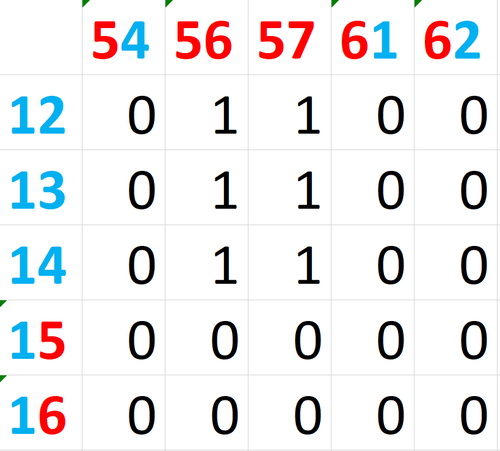
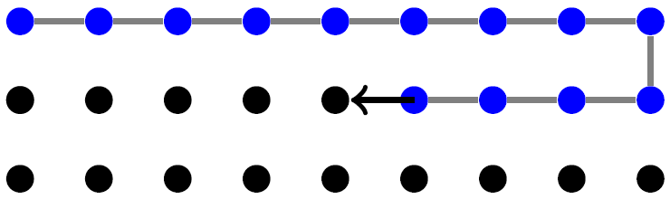

exclude: true

```{r  setup, message=FALSE, warning=FALSE, include=FALSE}
options(
  htmltools.dir.version = FALSE, # for blogdown
  width = 80,
  tibble.width = 80
)

knitr::opts_chunk$set(
  fig.align = "center",  warning=FALSE, message=FALSE
)

```

---

## Readings 

- Emily Casleton, Daniel Nordman, and Mark S. Kaiser. A local structure model
for network analysis. *Statistics and Its Interface*, 2(10), 2017.

- Olga V. Chyzh and Mark S. Kaiser. Network analysis using a local structure
graph model. *Political Analysis*, 27(4):397--414, 2019.

- Nieman, Mark David, Carla Martinez Machain, Olga V. Chyzh, and Sam Bell. 2021. “An International Game of Risk: Troop Placement and Major Power Competition.” *The Journal of Politics*, 83 (4): 1307–1321.

---

## Motivation

- Do network edges form in reaction to (anticipation) of one another?

    - Did your ex start dating so soon because she didn't want you to start dating before her?
    
    - Do countries form alliances in response to their rivals or allies doing the same?
    
    - Do political parties form coalitions to balance against other (potential) coalitions?

---

## Formal Motivation

- Do edges among red nodes affect the formation of edges among turquoise nodes?

- If nodes $6$ and $7$ formed and edge, would that make it more likely that nodes $3$ and $4$ form an edge?


```{r, echo=FALSE, eval=TRUE, message=FALSE, out.width='450px', fig.align='center'}
set.seed(1712)
library(igraph)
el <- matrix( c("1", "2", 
                "1", "3",
                "2","3",
                "4","1",
                "4","3",
                "5","6",
                "5","7",
                "7","6"), nc = 2, byrow = TRUE)
g<-graph_from_edgelist(el, directed=F)
E(g)$lty<-c(1,1,1,1,2,1,1,2)
V(g)$color<-ifelse(V(g)$name %in% c("1","2","3","4"), "turquoise", "red")
plot(g, edge.curved=0, edge.arrow.size=1, edge.color="black")


```


---

## The Estimator

- Suppose $i$ is a potential edge in a network of potential edges (realized and unrealized);

- Then $s_i=(u_i,v_i)$ is $i$'s location in Cartesian space.

- Denote the binary random variable, $y(s_i)=y_i$, so that:

$$
y(s_i)=
\begin{cases}
1& \text{ if } \text{edge } s_i \text{ is present}\\
0& \text{ if } \text{edge } s_i \text{ is absent}.\\
\end{cases}
$$

- Define $i$'s neighbors as $N_i=\{s_j: s_j \text{ is a neighbor of } s_i\}$.
- Make a Markov assumption of conditional spatial independence:

$$\begin{align}
f(y(s_i)|{\textbf{y}(s_j):s_j \neq s_i})=f(y(s_i)|\textbf{y}(N_i))
\end{align}$$

- If connectivities between edges are continuous, then the Markov assumption is redundant.

---

## The DV


```{r, eval=T, echo=F}
# library(devtools)
# install_github("ochyzh/networkdata")
library(networkdata)
data(lsgm_data)

nodes<-as.numeric(as.character(V(g)$name))
node_net<-expand.grid(node1=nodes,node2=nodes)
node_net<-subset(node_net, subset=node1!=node2)
node_net$edge<-paste(node_net$node1,node_net$node2, sep="")
node_net$color1<-ifelse(node_net$node1 %in% c("1","2","3","4"), "turquoise", "red")
node_net$color2<-ifelse(node_net$node2 %in% c("1","2","3","4"), "turquoise", "red")
node_net$ecolor<-"different"
node_net$ecolor[node_net$color1=="red" & node_net$color2=="red"]<-"red"
node_net$ecolor[node_net$color1=="turquoise" & node_net$color2=="turquoise"]<-"turquoise"

W<-matrix(0,ncol=nrow(node_net),nrow=nrow(node_net))
rownames(W)<-sort(node_net$edge)
colnames(W)<-sort(node_net$edge)

for (i in rownames(W)){
  for (j in rownames(W)){
   val1<-node_net$ecolor[node_net$edge==i] 
   val2<-node_net$ecolor[node_net$edge==j]
     if (i!=j & val1=="red" & val2=="turquoise") {
    W[i,j]=1
   } else if (i!=j & val1=="turquoise" & val2=="red") {
     W[i,j]=1
   }
   }
}

edge_id<-sort(node_net$edge)
Y<-rep(0, length(edge_id))
Y<-as.numeric(edge_id %in% c("12", "13", "14","23", "56","57"))
cbind(edge_id,Y)[1:10,]

```


---

## Set Up the Connectivity Matrix, W

- Start with an adjacency matrix among all potential edge-pairs.

- Code two edges as connected if they connect opposite-colored pairs of same-colored nodes.

```{r, echo=FALSE, eval=TRUE, message=FALSE, out.width= "450px",fig.align="center"}

```


---

## Set Up the Connectivity Matrix, W

```{r}
W[1:10, 25:35]

```

---

## The Binary Conditional Distribution

$$\begin{align}
\tag{1}
\text{P}(Y_i=y_i|\pmb{y}(N_i))=\exp\left[A_i(\pmb{y}(N_i))y_i-B_i(\pmb{y}(N_i))\right],
\end{align}$$

where $A_i$ is a natural parameter function and $B_i=\log[1+\exp(A_i(y(N_i)))],$ and $\textbf{y}\left(N_i\right)$ is a vector of values of the binary random variables (edges) of $i$'s neighbors.

---
## The Binary Conditional Distribution

$$\begin{align}
\tag{1}
\text{P}(Y_i=y_i|\pmb{y}(N_i))=\exp\left[A_i(\pmb{y}(N_i))y_i-B_i(\pmb{y}(N_i))\right],
\end{align}$$

where $A_i$ is a natural parameter function and $B_i=\log[1+\exp(A_i(y(N_i)))],$ and $\textbf{y}\left(N_i\right)$ is a vector of values of the binary random variables (edges) of $i$'s neighbors.

Remember that the exponent of a difference is the ratio of exponents, $\exp(A-B)=\frac{\exp(A)}{\exp(B)}$:

$$\begin{align}
\tag{1}
\text{P}(Y_i=y_i|\pmb{y}(N_i))=&\frac{\exp[A_i(\pmb{y}(N_i))y_i]}{\exp[B_i(\pmb{y}(N_i))]}\\
=&\frac{\exp[A_i(\pmb{y}(N_i))y_i]}{\exp[\log[1+\exp(A_i(\pmb{y}(N_i))y_i]]}\\
=&\frac{\exp[A_i(\pmb{y}(N_i))y_i]}{1+\exp[A_i(\pmb{y}(N_i))y_i]},
\end{align}$$

---

## The Natural Parameter Function
\begin{align}
\tag{2}
A_i\left(\pmb{y}\left(N_i\right)\right)=\log\left(\frac{\kappa_{i}}{1-\kappa_{i}}\right)+\eta\sum_{j \in N_i}{w_{ij}\left(y_{j}-\kappa_{j}\right)},
\end{align}

where $\log\left(\frac{\kappa_i}{1-\kappa_i}\right)=\pmb{X}_i^{T}\pmb{\beta}$, $\pmb{X}_i$ is a column vector of $k$ exogenous covariates, $\pmb{\beta}$ is a $k$ by 1 vector of estimation parameters, $w_{ij}$ is the $ij^{th}$ element of a matrix of connectivities among edges **W**, and $\eta$ is its parameter.

- When $y_j>\kappa_j$, then the dependence term makes a positive contribution to $A_i(\textbf{y}(N_i))$---complementary processes;
- When $y_j<\kappa_j$, then the dependence term makes a negative contribution to $A_i(\textbf{y}(N_i))$---substitution-type processes;
- Key condition: $w_{ij}=w_{ji}$.
- Model does not require (prohibits) row-standardization of $\textbf{w}$.

---

## Estimation


$$\begin{align}
\tag{3}
\log PL=\sum\limits_i\{y_i\log(p_i)+(1-y_i)\log(1-p_i))\},
\end{align}$$


where:
$$\begin{align}
\tag{4}
p_i=\frac{\exp[A_i(y(N_i))]}{1+\exp[A_i(y(N_i))]}
\end{align}$$

---

## Let's Program This

.pull-left[

### Logit:
```{r}
loglik_logit<-function(par,Y){
  b0<-par[1] #starting value for constant
  X<-rep(1,length(Y)) #constant
  xbeta<-as.matrix(X)%*%b0 #natural parameter
  kappa<-exp(xbeta)/(1+exp(xbeta)) #p_i, natural parameter function
  L<-Y*log(kappa)+(1-Y)*(log(1-kappa)) #log-likelihood
  ell= -sum(L) #sum log-likelihoods
  cat("ell",ell, fill=TRUE) #print sum to screen
  return(ell)
}
```
]

.pull-right[
### LSGM:
```{r}
loglik_lsgm<-function(par,Y,W){
b0<-par[1] #starting value for constant
eta<-par[2] #starting value for spatial paramenter
X<-rep(1,length(Y)) #constant
xbeta<-as.matrix(X)%*%b0 #natural parameter
kappa<-exp(xbeta)/(1+exp(xbeta)) #logit of Xb
A_i=log(kappa/(1-kappa))+eta*W%*%(Y-kappa) #Eqn 2--natural parameter function
p_i<- exp(A_i)/(1+exp(A_i)) #Eqn 1, also Eqn 4
PL<-Y*log(p_i)+(1-Y)*log(1-p_i) #Eqn 3, log psedo-likelihood
ell <- -sum(PL) #sum log pseudolikelihoods
cat("ell",ell, fill=TRUE) #print sum to screen
return(ell)
}
```
]
---

## Estimate
```{r}
#library(devtools)
#install_github("ochyzh/networkdata")
library(networkdata)
data(lsgm_data)
m1<-optim(par=c(0,0),loglik_lsgm,W=Wmat,Y=Y)
m1

```

---
## Estimating Standard Errors

Need to simulate $Y$ based on our parameter estimates:

- Start from a vector of initial $y_0=\{y_{01}, y_{02},\ldots, y_{0n}\}$ drawn from a
binomial distribution;

- Moving row-wise, for i = 1, ..., n, individually simulate/update each observation as a function of previously simulated observations:

```{r, echo=FALSE, eval=TRUE, message=FALSE, out.width= "450px",fig.align="center"}

```

- n individual updates provide 1 full Gibbs iteration

- Use the result of the first Gibbs iteration as the new initial values and repeat to
obtain M Gibbs networks $y$ (can burn-in, thin, etc.).

---
## Simulate Networks Based on m1

1. Function *spatbin.genone* simulates/updates a value for $y$ for a single observation--step 2

2. Function *spatbin.onegibbs* applies *spatbin.genone* to update every observation of $y$--step 3

3. Function *spatbin.genfield* applies *spatbin.onegibbs* to generate $M$ networks --step 4 


```{r}
spatbin.genone<-function(coeffs,w,curys){
b0<-coeffs[1]
eta<-coeffs[2]
X<-rep(1,length(Y))
xbeta<-as.matrix(X)%*%b0
kappa<-exp(xbeta)/(1+exp(xbeta))
A_i=log(kappa/(1-kappa))+eta*w%*%(curys-kappa)
p_i<- exp(A_i)/(1+exp(A_i))
y<- rbinom(n=length(curys), size=1, prob=p_i)
return(y)
}


```

---

```{r}
spatbin.onegibbs<-function(coeffs,w,curys){
cnt<-0
n<-length(curys)
newys<-NULL
repeat{
	cnt<-cnt+1
	ny<-spatbin.genone(coeffs=coeffs,w=w,curys=curys)
	curys[cnt]<-ny[cnt]
	if(cnt==n) break
	}
newys<-curys
return(newys)
}
```

---

```{r}
spatbin.genfield<-function(coeffs,w,y0s,M){
curys<-y0s
cnt<-0
res<-as.data.frame(y0s)
repeat{
	cnt<-cnt+1
	newys<-spatbin.onegibbs(coeffs=coeffs,w=w,curys=curys)
	curys<-newys
	res<-cbind(res,curys)
	if(cnt==M) break
	}

return(res)
}
```


---

```{r}
n<-length(Y)
y0s=rbinom(n=n, size=1, prob=.5)
sims<-spatbin.genfield(coeffs=m1$par,w=Wmat,y0s=y0s,M=1000)
#Take every 10th simulated network, i.e. burnin=10, thinning=10
sims<-sims[,seq(from=10, to=ncol(sims),by=10)]
```

---

## Obtaining Standard Errors

1. Estimate the model on simulated networks (after burnin and thinning);

2. The standard errors are the standard deviations of the estimated coefficients.

---

## Obtaining Standard Errors

```{r}
sim_est<-function(Y){
 res<-optim(par=m1$par,loglik_lsgm,W=Wmat,Y=as.matrix(Y)) 
 return(c(res$par,res$convergence))
}

library(parallel)
sim_est<-do.call("rbind",mclapply(sims, sim_est))
#Drop results if didn't converge (models that converged have convergence=0)
sim_est<-sim_est[sim_est[,3]==0,]

#Get sds of the estimates:
boot_se<-apply(sim_est,2,sd)
mytable<-cbind("coeff"=m1$par,"se"=boot_se[-3],"z-value"=(m1$par/boot_se[-3]))
mytable

```

---

## Application: International Alliances

```{r}
#Open the data:
data("ally_data")
ally_data$tot_trade<-log(ally_data$tot_trade+1)
ally_data<-ally_data[ally_data$year==2007,]
ally_data[1:5,]

#Prepare W:
W2007 <- W
W2007[1:5,1:5]
#W2007[,1]<-NULL  #remove first column from similarity matrix
W2007[is.na(W2007)]<-0
W2007<-W2007/10
W2007<-as.matrix(W2007)

```

---

## Likelihood (1 X)

```{r}
#Likelihood
loglik<-function(par,X,W,Y){
b0<-par[1]
b1<-par[2]
eta<-par[3]
xbeta<-b0+b1*X
kappa<-exp(xbeta)/(1+exp(xbeta)) #logit of Xb
A_i=log(kappa/(1-kappa))+eta*W%*%(Y-kappa) #Eqn 2
p_i<- exp(A_i)/(1+exp(A_i)) #Eqn 1, also Eqn 4
PL<-Y*log(p_i)+(1-Y)*log(1-p_i) #Eqn 3
ell <- -sum(PL)
#cat("ell",ell, fill=TRUE)
return(ell)
}
```

---

## Let's Estimate
```{r}
X=ally_data$tot_trade
Y=ally_data$defense
m1<-optim(par=c(0,0,0),loglik,X=X,W=W2007,Y=Y)
m1

```


---
## Standard Errors

```{r}
spatbin.genone<-function(coeffs,X,w,curys){
b0<-coeffs[1]
b1<-coeffs[2]
eta<-coeffs[3]
xbeta<- b0+b1*X
kappa<-exp(xbeta)/(1+exp(xbeta))
A_i=log(kappa/(1-kappa))+eta*w%*%(curys-kappa)
p_i<- exp(A_i)/(1+exp(A_i))
y<- rbinom(n=length(curys), size=1, prob=p_i)
return(y)
}


```

---

```{r}
spatbin.onegibbs<-function(coeffs,X,w,curys){
cnt<-0
n<-length(curys)
newys<-NULL
repeat{
	cnt<-cnt+1
	ny<-spatbin.genone(coeffs=coeffs,X=X,w=w,curys=curys)
	curys[cnt]<-ny[cnt]
	if(cnt==n) break
	}
newys<-curys
return(newys)
}
```

---

```{r}
spatbin.genfield<-function(coeffs,X,w,y0s,M){
curys<-y0s
cnt<-0
res<-as.data.frame(y0s)
repeat{
	cnt<-cnt+1
	newys<-spatbin.onegibbs(coeffs=coeffs,X=X,w=w,curys=curys)
	curys<-newys
	res<-cbind(res,curys)
	if(cnt==M) break
	}

return(res)
}
```


---
#Simulate 1000 Random Networks

```{r, eval=F}
n<-length(Y)
y0s=rbinom(n=n, size=1, prob=.5)
sims<-spatbin.genfield(coeffs=m1$par,X=X,w=W2007,y0s=y0s,M=1000)
#Take every 10th simulated network, i.e. burnin=10, thinning=10
sims<-sims[,seq(from=10, to=ncol(sims),by=10)]
saveRDS(sims, "sims.rds")
```

---

#Estimate an LSGM on Each of the Simulated Networks
```{r, eval=F}
sims<-readRDS("data/sims.rds")
sim_est<-function(Y){
 res<-optim(par=m1$par,loglik,X=X,W=W2007,Y=as.matrix(Y)) 
 return(c(res$par,res$convergence))
}

library(parallel)
sim_est<-do.call("rbind",mclapply(sims, sim_est))
#Drop results if didn't converge (models that converged have convergence=0)
sim_est<-sim_est[sim_est[,4]==0,]
saveRDS(sim_est,"./data/sim_est.rds")

```

---

## Calculate SEs and Make a Table
```{r}
#Get sds of the estimates:
sim_est<-readRDS("data/sim_est.rds")
boot_se<-apply(sim_est,2,sd)
mytable<-cbind("coeff"=m1$par,"se"=boot_se[-4],"z-value"=(m1$par/boot_se[-4]))
mytable
```


---
## Package LSGM

Note: the package is in beta testing

```{r, eval=F}
library(devtools)
install_github("ochyzh/lsgm")
library(lsgm)
data(W)
data(toy_data)
lsgm(Y=as.matrix(toy_data$Y),W=W,X=as.data.frame(toy_data$X))

```
---
## Your Turn

1. The above code estimates an lsgm with 1 edge-level covariate $X$ using a pseudo-likelihood.  Edit the code so that the resulting pseudo-likelihood can include 2 edge-level covariates $X1$ and $X2$ (i.e., the goal is to run an lsgm with *tot_trade* and *mil_ratio* as exogenous covariates).

2. Estimate an lsgm with *defense* as the dependent variable, with *tot_trade* and *mil_ratio* as the exogenous edge-level covariates, and *W* as the matrix that measure connectivities among defense edges. 

3. Difficult: Change the code from the above slides to estimate the standard errors for your model.

---
## Challenge Yourself: Insurgent Attacks

1. Download the *chechen_attacks* data that contains daily insurgent attacks in Chechnya and the *vilMat* matrix of distances among Chechen villages.

2. Use the *leaflet* package to visualize attacks by village.

3. Your goal is to estimate *attacks* as a function of other contemporaneous attacks, as well as population and a 7-day rolling sum of previous attacks. Because your data has a temporal component, you need to edit the likelihood to accommodate it.

---

```{r, eval=F, echo=T}
library(leaflet)
library(lubridate)
library(tidyverse)
chechen_attacks<- read.csv("./data/chechen_attacks.csv") |> dplyr::select(village, date, attack, rollattk7, pop_2002, lat, lon) |>
  dplyr::mutate(date=ymd(date)) |>
  dplyr::filter(date>="2000-03-08")

chechen_attacks |>
  group_by(village) |>
  summarise(attacks=sum(attack), lon=first(lon), lat=first(lat)) |>
  leaflet() |> addTiles() |>
  addCircleMarkers(~lon, ~lat, radius = ~2*sqrt(attacks), popup = ~attacks, color="blue",fillColor="blue" ) 


```

---


```{r, echo=F, eval=T}
library(leaflet)
library(lubridate)
library(tidyverse)
chechen_attacks<- read.csv("./data/chechen_attacks.csv") |> dplyr::select(village, date, attack, rollattk7, pop_2002, lat, lon) |>
  dplyr::mutate(date=ymd(date)) |>
  dplyr::filter(date>="2000-03-08")

chechen_attacks |>
  group_by(village) |>
  summarise(attacks=sum(attack), lon=first(lon), lat=first(lat)) |>
  leaflet() |> addTiles() |>
  addCircleMarkers(~lon, ~lat, radius = ~2*sqrt(attacks), popup = ~attacks, color="blue",fillColor="blue" ) 


```
