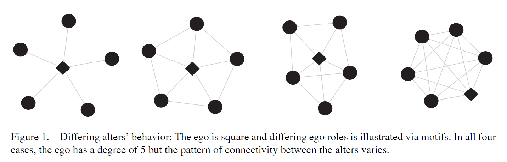
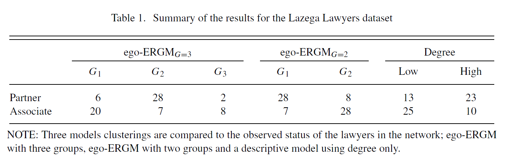

exclude: true

```{r  setup, message=FALSE, warning=FALSE, include=FALSE}
options(
  htmltools.dir.version = FALSE, # for blogdown
  width = 80,
  tibble.width = 80
)

knitr::opts_chunk$set(
  fig.align = "center",  warning=FALSE, message=FALSE
)


```

---

## Recommended Readings

- Salter-Townshend, Michael and Brendan Thomas Murphy. 2015. Role analysis in networks using mixtures of exponential random graph models." *Journal of Computational and Graphical Statistics* 24(2): 520--538.

- Box-Steffensmeier, Janet M., Benjamin W. Campbell, Dino P. Christenson, Zachary Navabi. (2018): Role analysis using the ego-ERGM: A Look at environmental interest group coalitions. *Social Networks* 52: 213--227. 

- Campbell, Benjamin W. (2018): Inferring Latent Roles in Longitudinal Networks.
*Political Analysis* 26(3): 292--311.

---

## The Core Idea

- Most current work on clustering nodes in a network focuses on community finding, based on the ratio of between to within linkage densities.

- An Ego-ERGM is a statistical model-based method of clustering nodes based on the role they play in the network.

- For example, identify the most central or high degree nodes, or nodes whose connections are distinct in some other way, i. e. discriminate on different patterns of connectivity.

- Model the set of all ego-networks using ERGMs, then perform a model-based clustering of these ego-networks and, thus nodes within them.

- Simultaneously estimate both the node clustering assignments and the ERGM parameters in the clusters.

---

## Ego-Networks

Define ego-networks for each node in the network:

1. Select a node; this is referred to as the ego.
2. Include the alters (nodes connected to the ego).
3. Include the connections between the alters.

Nodes performing differing local roles will have markedly different ego-networks and nodes performing similar roles will have similar ego-networks.

```{r, out.width= "700px",fig.align="center", echo=FALSE}

```

---

## Can You Identify Ego Networks?

```{r, out.width= "300px",fig.align="center", echo=FALSE}
knitr::include_graphics("images/communities.png")
```


---

## Example: Lazega Lawyers

```{r, out.width= "600px",fig.align="center", echo=FALSE}

```


---

##Replicate Example from the Article

```{r, message=F}
library(network)
library(sna)
library(ergm)
library(devtools)
install_github("ochyzh/networkdata")
library(networkdata)
data(lazega)
```


---


```{r, eval=F}
m1 <- ego_ergm(net = lazega,
                         form = c("edges", "mutual",
                                  'desp(.8, type="OSP")',
                                  'desp(.8, type="ISP")'),
                         core_size = 1,
                         min_size = 5,
                         roles = 3,
                         forking = FALSE,
                         ncpus = 1,
                         directed = TRUE,
                         edge_covariates = FALSE,
                         seed = 12345,
                         steps = 50,
                         tol = 1e-06)
saveRDS(m1,file="data/m1_ego.rds")
```


---
```{r}
m1<-readRDS("data/m1_ego.rds")
m1$group.theta
m1$role_assignments
nrow(m1$role_assignments)


```
---
## Replicate the Table
```{r}
Status<-lazega %v% "Status"
length(Status[-58]) #It kicks out node 58 (degree=0?)
length(m1$role_assignments[,2])
table(Status[-58],m1$role_assignments[,2])
table(m1$role_assignments[,2])

```
---
## Plot
```{r, eval=F}
plot(lazega,
        displaylabels = FALSE,
        # size of nodes based on vector vertexSize
        vertex.cex = m1$role_assignments[,2],
        # color of nodes based on vertex attribute: group
        vertex.col = 'Status',
        edge.col="gray"
)
```
---
## Plot
```{r, echo=FALSE}
plot(lazega,
        displaylabels = FALSE,
        # size of nodes based on vector vertexSize
        vertex.cex = m1$role_assignments[,2],
        # color of nodes based on vertex attribute: group
        vertex.col = 'Status',
        edge.col="gray"
)
```
---
## Your Turn

1. Load the `sampson` dataset from the `sna` library.

2. How many different roles do you think are in these data?

3. Estimate an ego ERGM on `samplike` data. 

4. Cross-tabulate the roles you identified with the `group` vertex attribute. Does it seem like the model is picking up differences based on groups?

5. Cross-tabulate the roles you identified with the `cloisterville` vertex attribute. Does it seem like the model is picking up differences based on whether monks attended Cloisterville?

6. Make a network graph, coloring nodes by role and using node size to show group belonging.


 
