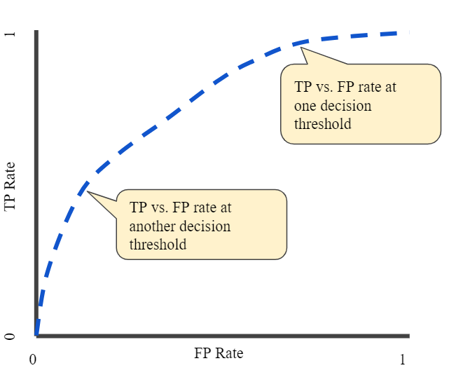

exclude: true

```{r  setup, message=FALSE, warning=FALSE, include=FALSE}
options(
  htmltools.dir.version = FALSE, # for blogdown
  width = 80,
  tibble.width = 80
)

knitr::opts_chunk$set(
  fig.align = "center",  warning=FALSE, message=FALSE
)


```

---
## ROC Curves

- An ROC curve (receiver operating characteristic curve) is a graph showing the performance of a classification model at all classification thresholds. This curve plots two parameters:

    - True Positive Rate (recall or sensitivity): $$TPR=\frac{TP}{TP+FN}=\frac{correct\ ones}{total\ ones}$$
    - False Positive Rate (specificity): $$FPR= \frac{FP}{FP+TN}=\frac{incorrect\ ones}{total\ zeroes}$$

---

```{r, out.width= "700px",fig.align="center", echo=FALSE}

```
    
---
## What We Need (Binary DV)

- Our DV (in vector form)

- The predicted probability for each observation based on our model


---
## Example: ERGM

```{r, echo=TRUE}
library(tidyverse)
library(magrittr)
library(sna)
library(ergm)
data(sampson)

m1 = ergm(samplike ~ edges + nodematch('group'))
#summary(m1)

pred_ergm<-predict(m1,
  conditional = TRUE,
  type = "response",
  nsim = 100,
  output = "matrix"
)
```
---
## Get Y and Predicted Probabilities
```{r}
myDV<-as.matrix(samplike) %>% data.frame() %>% mutate(name1=row.names(.)) %>% 
  pivot_longer(cols=-name1, names_to="name2", values_to="Y") 

pred_ergm %>% data.frame() %>% mutate(name1=row.names(.)) %>% 
  pivot_longer(cols=-name1, names_to="name2", values_to="p") %>% left_join(myDV, by=c("name1","name2")) ->mydat
```


---
## Make a Plot

```{r, message=FALSE, eval=FALSE}
#install.packages("ROCR")
library(ROCR)
pred <- prediction(mydat$p, mydat$Y)
perf <- performance(pred,"tpr","fpr")
ergmplot<-plot(perf,colorize=TRUE)
```
---
## Make a Plot

```{r, message=FALSE, eval=TRUE, echo=FALSE, out.width= "400px",fig.align="center"}
#install.packages("ROCR")
library(ROCR)
pred <- prediction(mydat$p, mydat$Y)
perf <- performance(pred,"tpr","fpr")
ergmplot<-plot(perf,colorize=TRUE)
```

Color represents cut-off.
---
## Your Turn

Change the model specification (add an endogenous variable), estimate the new model, and re-make the plot.

---

## Your Turn

1. Transform the data as necessary to estimate an AME model that matches `m1` in specification.

2. Estimate the AME model equivalent to m1. 


---

## Let's Make an ROC Plot
```{r, eval=F, echo=T}
lfmFit<-readRDS("data/lfmFit_sampson.rds")

#Get predicted probabilities from AME:
theta<-lfmFit$'EZ' #logged odds ratios for each obs
plogis(as.matrix(theta)) %>% as.data.frame() %>% #convert to probabilities
  mutate(name1=row.names(.)) %>%
  pivot_longer(cols=c(1:18),names_to="name2", values_to="p")->p

as.matrix(samplike) %>% as.data.frame() %>% mutate(name1=row.names(.)) %>% 
  pivot_longer(cols=-name1, names_to="name2", values_to="Y") %>% left_join(p, by=c("name1","name2"))->mydat1

pred1 <- prediction(mydat1$p, mydat1$Y)
perf1 <- performance(pred1,"tpr","fpr")
plot(perf1,colorize=TRUE, smooth=FALSE)
```

---
## Let's Make an ROC Plot
```{r, eval=T, echo=F}
lfmFit<-readRDS("data/lfmFit_sampson.rds")

#Get predicted probabilities from AME:
theta<-lfmFit$'EZ' #logged odds ratios for each obs
plogis(as.matrix(theta)) %>% as.data.frame() %>% #convert to probabilities
  mutate(name1=row.names(.)) %>%
  pivot_longer(cols=c(1:18),names_to="name2", values_to="p")->p

as.matrix(samplike) %>% as.data.frame() %>% mutate(name1=row.names(.)) %>% 
  pivot_longer(cols=-name1, names_to="name2", values_to="Y") %>% left_join(p, by=c("name1","name2"))->mydat1

pred1 <- prediction(mydat1$p, mydat1$Y)
perf1 <- performance(pred1,"tpr","fpr")
plot(perf1,colorize=TRUE)
 
```

---
## Put These Together

```{r, eval=FALSE, echo=TRUE}

library(ggplot2)

ggdata<-rbind.data.frame(cbind.data.frame(x=unlist(perf@x.values),y=unlist(perf@y.values), model="ERGM"),
                         cbind.data.frame(x=unlist(perf1@x.values),y=unlist(perf1@y.values), model="AME"))
ggplot(data=ggdata)+geom_step(aes(x=x, y=y, color=model)) + 
  ylab("True Positive Rate")+
  xlab("False Positive rate")+
  theme_bw() 

```
---
## Put These Together

```{r, eval=TRUE, echo=FALSE}

library(ggplot2)

ggdata<-rbind.data.frame(cbind.data.frame(x=unlist(perf@x.values),y=unlist(perf@y.values), model="ERGM"),
                         cbind.data.frame(x=unlist(perf1@x.values),y=unlist(perf1@y.values), model="AME"))
ggplot(data=ggdata)+geom_step(aes(x=x, y=y, color=model)) + 
  ylab("True Positive Rate")+
  xlab("False Positive rate")+
  theme_bw() 

```
---

## Your Turn

1. Re-specify the ERGM to increase the classification power. Plot the ROCs for the two models again.
