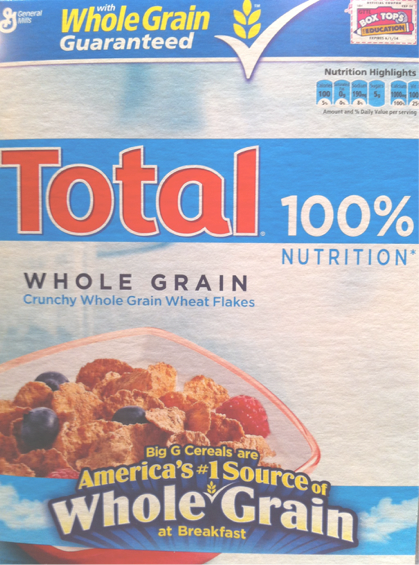
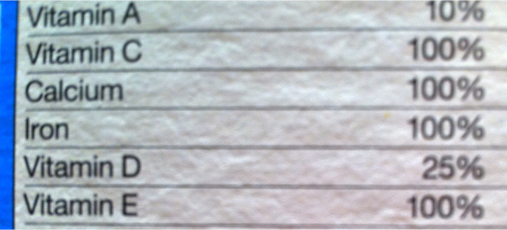
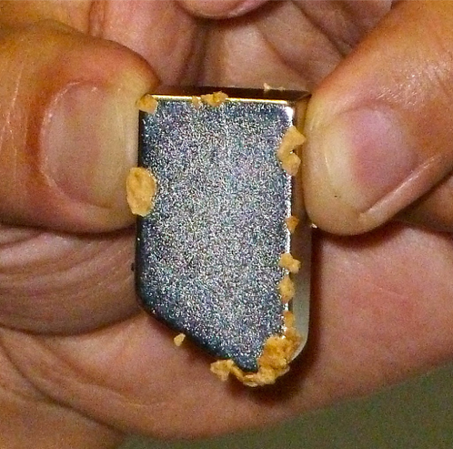
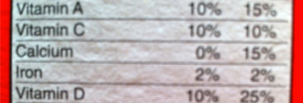
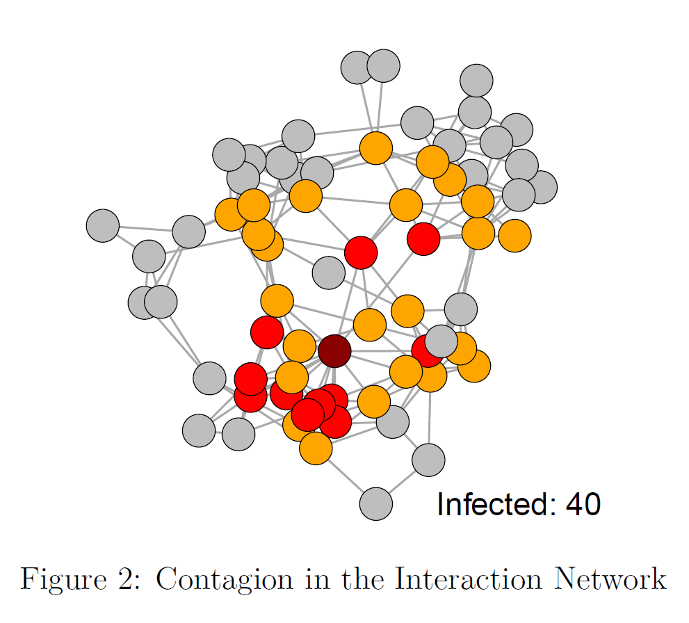
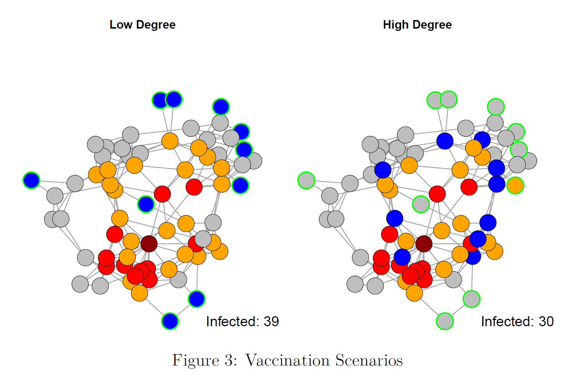
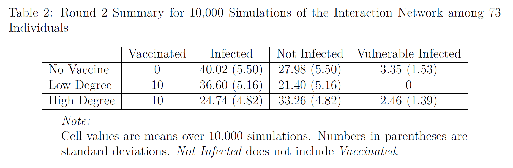
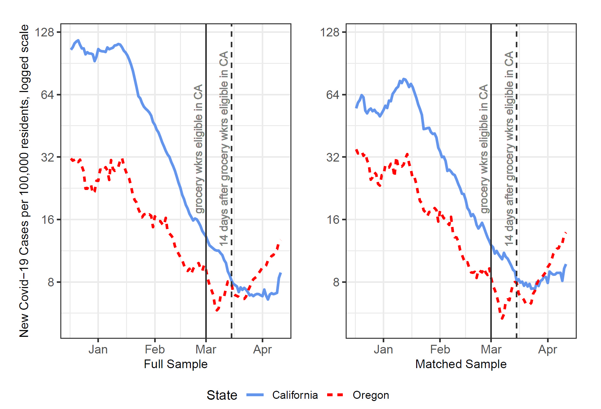

```{r setup, include=FALSE}
knitr::opts_chunk$set(echo = TRUE, fig.align = 'center', message = FALSE, warning = FALSE)
```

## Very Healthy Cereal

.pull-left[
```{r, echo=F, out.width= "1200px",fig.align="center"}

```
]

.pull-right[
```{r, echo=F, out.width= "1200px",fig.align="center"}

```
]

---
## Empirical Observation

- This cereal sticks to a magnet.
```{r, echo=F, out.width= "500px",fig.align="center"}

```

---
## Why Did it Stick?

- Propose a theoretical model (that includes a causal mechanism) to explain the observation.

--

- Suppose our causal mechanism is that this cereal sticks to a magnet because of its iron content.

- A testable hypothesis: cereals that are high in iron stick to a magnet.


---
## Test
.pull-left[
```{r, echo=F, out.width= "1200px",fig.align="center"}

```
]

.pull-right[
```{r, echo=F, out.width= "1200px",fig.align="center"}

```
]

---
## Does It Stick?
- This cereal does not stick to a magnet.
```{r, echo=F, out.width= "350px",fig.align="center"}

```


---
## Causal Effect

- Unit of analysis: cereal type

- Treatment variable (causal variable of interest) $T$: iron content (high/low)

- Treatment group (treated units): Total cereal

- Control group (untreated units): Honey Smacks cereal

- Outcome variable (response variable) $Y$: whether it sticks to a magnet (yes/no).

---
## Causality

- Counterfactual: Would Total cereal stick to a magnet if it did not have iron?

- Two potential outcomes: $Y(1)$ and $Y(0)$

- Causal effect: $Y(1)-Y(0)$

- Fundamental problem of causal inference: only one of the two potential outcomes is observable.

- Cannot calculate individual causal effect $Y(1)-Y(0)$!

- Can calculate the average treatment effect by comparing the means of a treatment and a control group.

- Importance of control group: must be identical to the treatment group on all factors but the treatment.

---


## The Problem

- Causal inference is predicated on comparing the observed to the counterfactual.

    - Example: To show that the Medici rose to power due to their high network centrality, we must compare the Florentine network to a counter-factual, in which the Medici did not hold a central position.
    
- Often cannot change one aspect of the network while holding all else constant

    - Cannot change an actor centrality without changing centrality of other actors.
    - Example 1: Cannot observe what a policy diffusion process across US states would look like in the absence of New York and California.
    - Example 2: What would the post-World War II international alliance network would look like without the United States?
    

---

## A Causal Approach

- Experiment
    
    - Randomly assign features to nodes/edges in networks 
    
    - Examples: LinkedIn experiment

- Natural experiment

    - Find a sample of social networks, such that some features (e.g.the central nodes' transmission potential) are disabled in some of the networks, but not the others.

    - Examples: Covid-19 vaccine prioritization policies in the US, censorship on Twitter
    
- Simulations to study different scenarios

---
## Assumptions

- Unconfoundedness

- SUTVA--stable unit treatment value assumption: treatment assignments for other units do not affect the outcome for unit *i* and
that each treatment defines a unique outcome for each unit 

- Parallel trends

---
class: inverse, middle, center

# Simulations: Covid-19 Transmission Under Different Vaccine Priority Scenarios

---
class: middle, center

```{r,eval=T, echo=F, out.width= "600px",fig.align="center"}

```
---
class: middle, center

```{r,eval=T, echo=F, out.width= "600px",fig.align="center"}

```
---
class: middle, center

```{r,eval=T, echo=F, out.width= "700px",fig.align="center"}

```

---
class: inverse, middle, center

# Natural Experiment: Covid-19 Transmission Under Different Vaccine Priority Scenarios

---
## Natural Experiment

- Most similar cases: California and Oregon counties

- Matching on demographic and economic variables

- Treatment: California opened vaccine eligibility to grocery workers (central nodes) about 1 month earlier than Oregon.


---
class: middle, center

```{r,eval=T, echo=F, out.width= "700px",fig.align="center"}

```

---
class: inverse, middle, center

# Field Experiment: LinkedIn

---

## Field Experiment 

- Randomly vary friend suggestions: weak vs. strong links

- Study the effect of the treatment on job applications and new jobs
