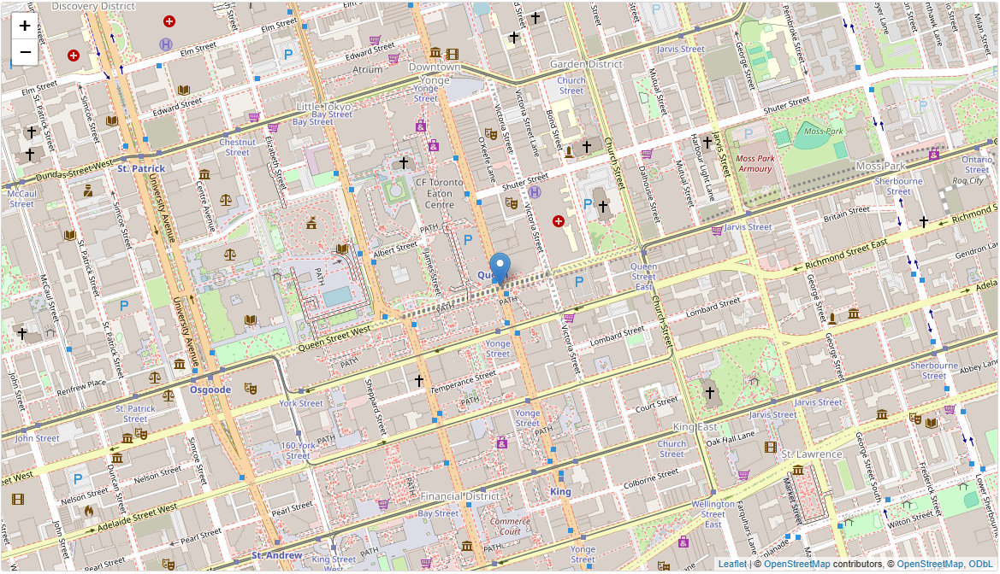
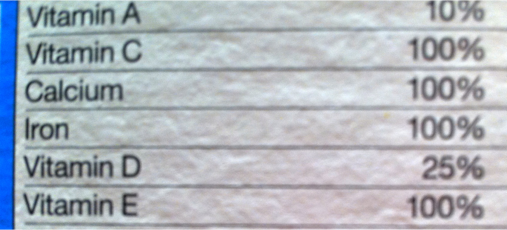
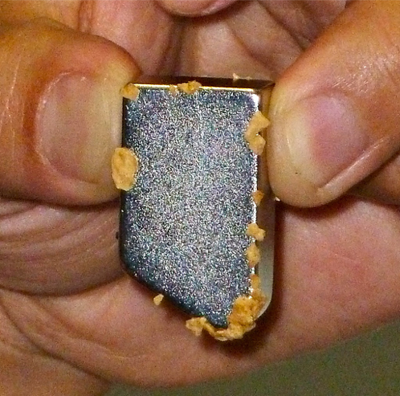
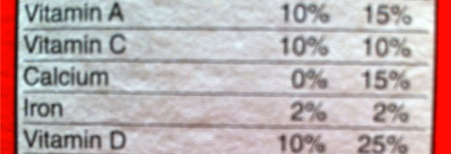
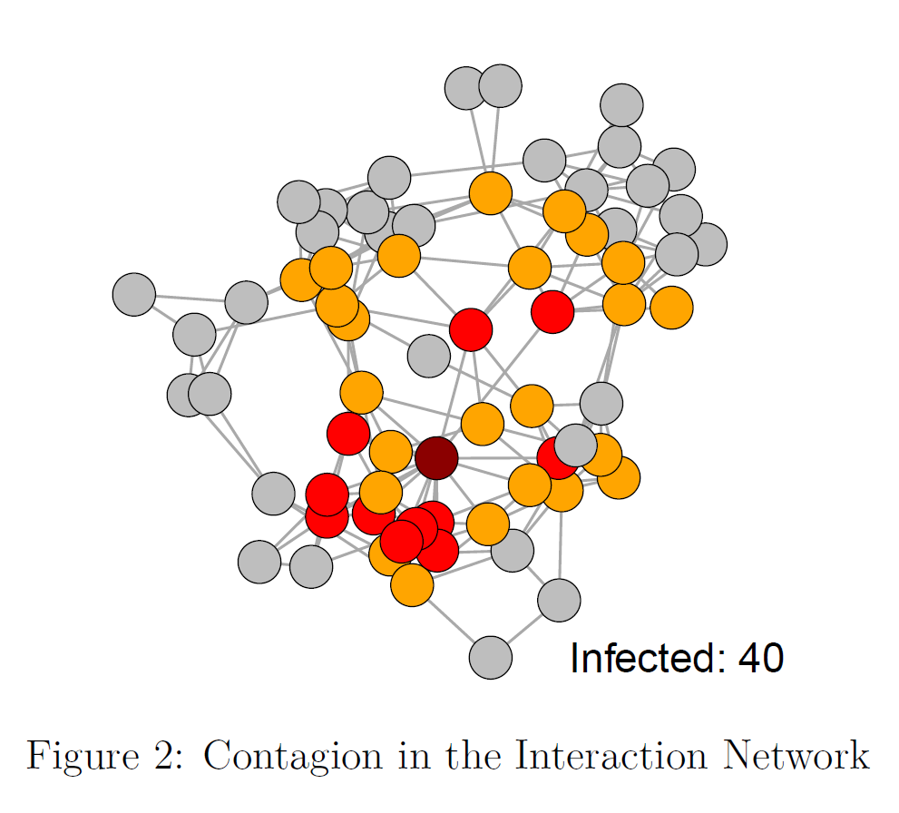
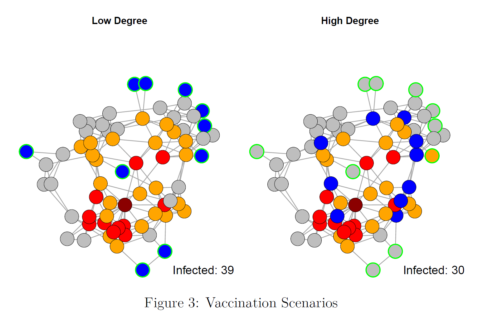
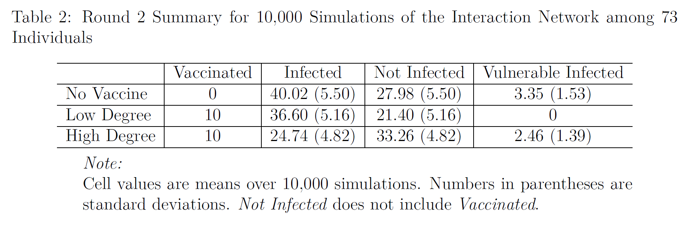
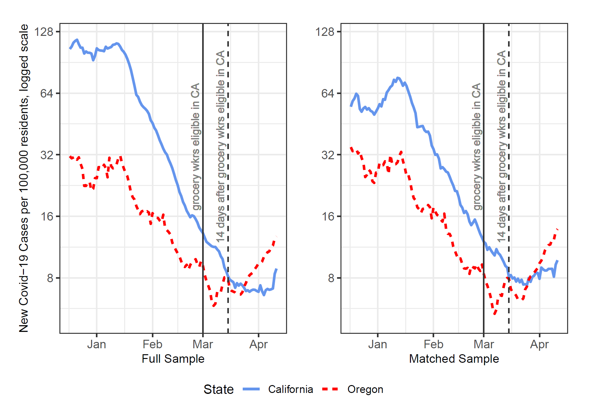

```{r setup, include=FALSE}
#install.packages("leaflet")
knitr::opts_chunk$set(echo = TRUE, fig.align = 'center', message = FALSE, warning = FALSE)
```

## Reading

-  Olga V. Chyzh. 2024. How to stop contagion: Applying network science to evaluate the effectiveness of covid-19 vaccine distribution plans. *Journal of Politics* 86 (1): 18-35. 

- Karthik Rajkumar, Guillaume Saint-Jacques, Iavor Bojinov, Erik Brynjolfsson, and Sinan Aral. A causal test of the strength of weak ties. Science, 377(6612):1304--1310, 202

---
## Causality and Networks

- Suppose I want to know what is the causal effect of a road closure on traffic congestion. Can I simply measure the amount of traffic that passed through the neighboring streets before and after the closure?

```{r, echo=F, out.width= "1200px",fig.align="center"}

```


```{r, eval=FALSE, echo=FALSE,fig.align="center"}
library(leaflet)

leaflet() |>
  addProviderTiles(providers$OpenStreetMap.Mapnik) |>
  addTiles() |>
  setView(
    lng = -79.379296,
    lat = 43.652446,
    zoom = 16
  ) |>
  addMarkers(
     lng = -79.379296,
    lat = 43.652446,
    popup = "Yonge & Queen"
  )
```
---
## Causality in Social Networks

Now suppose I want to study the effect of smoking on friendships. Suppose "L" took up smoking in period *t*. Can I estimate the effect of this by simply comparing the friendship network between Time 1 to that in Time 2?

```{r, echo=FALSE, eval=TRUE, message=FALSE, out.width='500px', fig.align='center'}
library(igraph)
library(sna)
el <- matrix(
  c(
    "A", "B",
    "A", "C",
    "B", "C",
    "C", "E",
    "B", "D",
    "B", "E",
    "C", "D",
    "D", "E",
    "D", "G",
    "F", "E",
    "E", "G",
    "F", "G",
    "F", "H",
    "H", "I",
    "I", "J",
    "H", "L",
    "K", "L",
    "L", "M",
    "L", "N",
    "L", "O",
    "L", "P"
  ),
  ncol = 2,
  byrow = TRUE)
g1<-graph_from_edgelist(el, directed=F)


el2 <- matrix(
  c(
    "A", "B",
    "A", "C",
    "A", "D",   # new

    "B", "C",
    "B", "D",

    "C", "D",
    "C", "E",
    "C", "F",   # new tie involving F

    "D", "E",
    "D", "F",   # new tie involving F

    "E", "G",

    "F", "G",   # retained
    "F", "I",   # new tie involving F
    "F", "L",   # new tie involving F

    "G", "H",   # new

    "H", "I",

    "I", "J",
    "I", "L",   # new

    "J", "K",   # new

    "K", "L",

    "L", "M",
    "L", "N",
    "L", "O",
    "L", "P"
  ),
  ncol = 2,
  byrow = TRUE
)

g2<-graph_from_edgelist(el2, directed=F)

set.seed(158)
V(g1)$color<- ifelse(V(g1)$name =="L", "red","white")
V(g2)$color<- ifelse(V(g2)$name =="L", "red","white")


LO <- layout_with_fr(g1)
LO <- LO * 5

par(mfrow = c(1,2), mar = c(.5,.5,.5,.5))

plot(
  g1,
  layout = LO,
  main = "Time 1",
  vertex.size = 15,
  edge.color = "grey60"
)

plot(
  g2,
  layout = LO,
  main = "Time 2",
  vertex.size = 15,
  edge.color = "grey60"
)

par(mfrow = c(1,1))

```
 
---
class: inverse, middle, center

# Causality: a refresher


---

## Very Healthy Cereal

.pull-left[
```{r, echo=F, out.width= "1200px",fig.align="center"}

```
]

.pull-right[
```{r, echo=F, out.width= "1200px",fig.align="center"}

```
]

---
## Empirical Observation

- This cereal sticks to a magnet.
```{r, echo=F, out.width= "500px",fig.align="center"}

```

---
## Why Did it Stick?

- Propose a theoretical model (that includes a causal mechanism) to explain the observation.

--

- Suppose our causal mechanism is that this cereal sticks to a magnet because of its iron content.

- A testable hypothesis: cereals that are high in iron stick to a magnet.


---
## Test
.pull-left[
```{r, echo=F, out.width= "1200px",fig.align="center"}

```
]

.pull-right[
```{r, echo=F, out.width= "1200px",fig.align="center"}

```
]

---
## Does It Stick?
- This cereal does not stick to a magnet.
```{r, echo=F, out.width= "350px",fig.align="center"}

```


---
## Causal Effect

- Unit of analysis: cereal type

- Treatment variable (causal variable of interest) $T$: iron content (high/low)

- Treatment group (treated units): Total cereal

- Control group (untreated units): Honey Smacks cereal

- Outcome variable (response variable) $Y$: whether it sticks to a magnet (yes/no).

---
## Causality

- Counterfactual: Would Total cereal stick to a magnet if it did not have iron?

- Two potential outcomes: $Y(1)$ and $Y(0)$

- Causal effect: $Y(1)-Y(0)$

- Fundamental problem of causal inference: only one of the two potential outcomes is observable.

- Cannot calculate individual causal effect $Y(1)-Y(0)$!

- Can calculate the average treatment effect by comparing the means of a treatment and a control group.

- Importance of control group: must be identical to the treatment group on all factors but the treatment.

---


## The Problem

- Causal inference is predicated on comparing the observed to the counterfactual.

    - Example: To show that the Medici rose to power due to their high network centrality, we must compare the Florentine network to a counter-factual, in which the Medici did not hold a central position.
    
- Often cannot change one aspect of the network while holding all else constant

    - Cannot change an actor centrality without changing centrality of other actors.
    - Example 1: Cannot observe what a policy diffusion process across US states would look like in the absence of New York and California.
    - Example 2: What would the post-World War II international alliance network would look like without the United States?

---
## Two Processes to Consider

- Selection

    - People choose their neighbors.

- Influence

    - Neighbors affect one another.

---
## Influence

- When we treat *A*, who receives treatment?


```{r, echo=F,  out.width="800px"}
el <- matrix(
  c(
    "A", "B",
    "B", "C"
  ),
  ncol = 2,
  byrow = TRUE)


g<-graph_from_edgelist(el, directed=F)
LO <- cbind(
  x = seq_len(vcount(g)),
  y = rep(0, vcount(g))
)

plot(
  g,
  layout = LO,
  ylim = c(-2.5, 1),
  vertex.size = 15,
  edge.color = "grey60",
  vertex.color = "lightblue"
)
```
---
## SUTVA

- Classical causal inference assumes one person's treatment does not affect another.

- Networks violate this assumption almost by definition.
---
class: inverse, middle, center

# So how can we study causality in networks?
---

## A Causal Approach

- Experiment
    
    - Randomly assign features to nodes/edges in networks 
    
    - Examples: LinkedIn experiment

- Natural experiment

    - Find a sample of social networks, such that some features (e.g.the central nodes' transmission potential) are disabled in some of the networks, but not the others.

    - Examples: Covid-19 vaccine prioritization policies in the US, censorship on Twitter
    
- Simulations to study different scenarios
---
## Trade-offs

| Approach           | Strength                 | Weakness               |
| ------------------ | ------------------------ | ---------------------- |
| Simulation         | Complete control         | Depends on assumptions |
| Natural experiment | Real world               | Limited control        |
| Field experiment   | Strongest identification | Expensive              |


---
class: inverse, middle, center

# Simulations: Covid-19 Transmission Under Different Vaccine Priority Scenarios
---
## What groups should be prioritized for vaccines if the goal is to reduce transmission?

- oldest?

- essential workers?

- highest degree?

- bridges?

---
class: middle, center

```{r,eval=T, echo=F, out.width= "600px",fig.align="center"}

```
---
class: middle, center

```{r,eval=T, echo=F, out.width= "600px",fig.align="center"}

```
---
class: middle, center

```{r,eval=T, echo=F, out.width= "700px",fig.align="center"}

```

---
class: inverse, middle, center

# Natural Experiment: Covid-19 Transmission Under Different Vaccine Priority Scenarios

---
## Natural Experiment

- Most similar cases: California and Oregon counties

- Matching on demographic and economic variables

- Treatment: California opened vaccine eligibility to grocery workers (central nodes) about 1 month earlier than Oregon.
---
## Assumptions

- Unconfoundedness

- SUTVA--stable unit treatment value assumption: treatment assignments for other units do not affect the outcome for unit *i* and
that each treatment defines a unique outcome for each unit 

- Parallel trends

---
class: middle, center

```{r,eval=T, echo=F, out.width= "700px",fig.align="center"}

```

---
class: inverse, middle, center

# Field Experiment: LinkedIn

---

## Field Experiment 

- Randomly vary friend suggestions: weak vs. strong links

- Study the effect of the treatment on job applications and new jobs

---
## Field Experiment

- Are weak ties or strong ties more valuable?

- What do you think of this study?

---
## Things to Consider

- Where does the network come from?

- Who receives treatment?

- Could treatment spill over?

- How is identification achieved?

- What causal effect is estimated?
